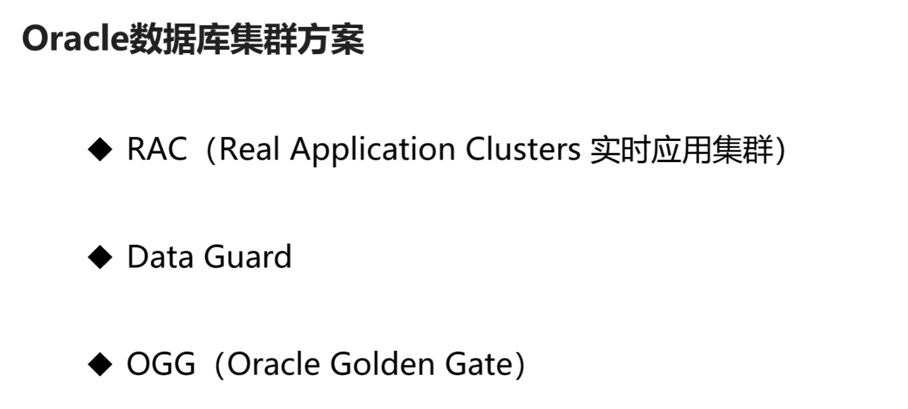

# Oracle数据库集群方案

## RAC

RAC是实时应用数据库集群。在硬件上，他们是由多个服务器加共享存储组成的。服务器可以有很多个，但是存储设备只有一个。在RAC中，每个服务器上都安装了操作系统和Oracle服务，启动了Oracle实例，但是多个Oracle实例用的是同一份数据。当某一个服务器发生了故障（硬件设备损坏或者其他），数据库集群可以继续工作，业务不会断开。如果存储设备发生了故障，那么这整个集群服务就瘫痪了。但是存储设备没那么容易发生故障，它自带容错机制，稳定性比服务器还要好很多。

我们的应用程序如果连接的是多实例（RAC）的Oracle数据库，当某个实例出现故障的时候，connection不会断开，其他的实例会把connection接管过去。这种切换对于应用程序来说是无感的。

RAC是高可用的解决方案，不是高性能解决方案。他的主要是保证Oracle数据服务永久在线，但是对性能没有提升，因为它的多个实例公用一个存储设备，存储设备的性能决定了数据库的性能。

- RAC写入数据的性能比单实例数据库略低，读数据性能略高。
  - 用更多的廉价服务器并不能提升RAC的性能
  - mysql也有类似的RAC集群方案，但是很脆弱

## Data Guard

data guard是Oracle自带的数据同步功能。他的原理就是将日志文件从源数据库传到目标数据库。然后再目标数据库上应用这些日志文件，从而使得目标数据库与源数据库保持同步。这是一种数据库级别的高可用方案。

Oracle的data guard和mysql的主从复制的原理是一样的。但是对数据库的称呼不一样，MySQL用的是master和slave，Oracle用的是primary和standby。

- Oracle的data guard主要用于灾难备份和故障恢复（异地）
- 读写分离不是data guard的主要目的。在mysql的高可用方案中，让多个从数据库给主数据库分担读的压力（读写分离），这种方案的效果有点被夸大了，Oracle的standby数据库可以读，多个standby数据库也可以分担primary数据库的压力，但是一般不会这么做，Oracle有更好的解决方案。为了解决读的问题，把主数据库复制多个备份，这是很笨的方法。

## OGG (Oracle Golden Gate)

golden gate软件是Oracle公司买过来的，用于数据库的同步或者数据复制。他的原理是捕捉源端数据库的日志，把发生变化的数据提取出来，生成文件，再把文件发送给目标端，目标端解析文件内容，然后应用到目标数据库中。

OGG有3个进程，源端的抽取进程，文件传输管理进程，目标端的数据复制进程。

### OGG的优点

1. 支持多种数据库（Oracle，MySQL，SQL Server，DB2），可以在多种数据库之间同步数据。
2. 数据同步效率高，延时低
3. OGG非常灵活，可以配置需要同步的表，这点非常重要，这样可以使得目标数据库不会像源数据库那样庞大。

- 参数表，数据量较小的表，有修改和删除操作的表，这种类型的表让OGG来同步比较合适
- 数据量大，没有修改和删除操作的表使用我们的数据同步子系统更合适

## 项目的集群设计思想

核心数据库用一个Oracle的RAC来做就可以了，RAC写入数据的性能大概在5000条/s左右。然后使用一个standby做容灾，下面的是应用数据库。

