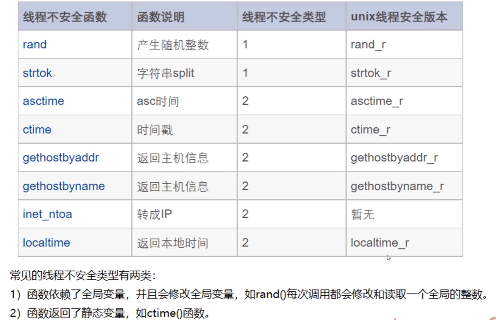
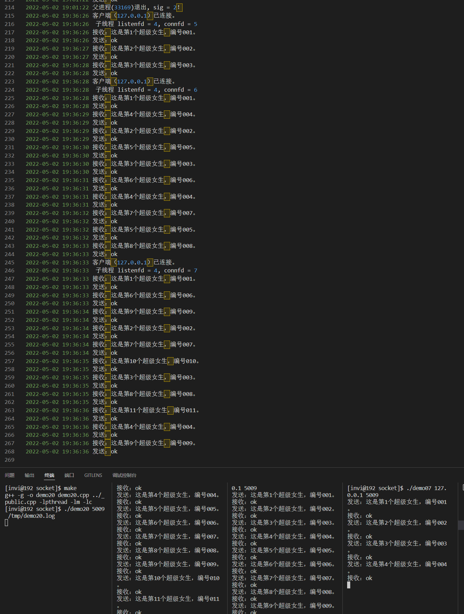

# 多线程的网络服务端

多线程程序的线程安全，主要考虑如下两个问题

- 全局对象的安全性
- 是否调用了不可重入的函数



```c++
/*
 * 程序名：demo20.cpp，此程序演示采用开发框架的CTcpServer类实现socket通讯多线程的服务端。

 * author：invi
*/
#include "../_public.h"

CLogFile logfile;   // 服务程序运行日志对象
CTcpServer TcpServer;   // tcp服务端类对象

void EXIT(int sig);   // 线程退出函数

void* thmain(void *arg);  // 线程入口函数

void thcleanup(void *arg);  // 线程清理函数

pthread_spinlock_t spin;  // 自旋锁（对线程id容器这个公共资源进行加锁）

// 存放线程id
vector<pthread_t> vpid;
 
int main(int argc,char *argv[])
{
 if (argc!=3)
 {
  printf("Using:./demo20 port logfile\nExample:./demo20 5005 /tmp/demo20.log\n\n"); return -1;
 }

 // 关闭全部的信号和输入输出。
 // 设置信号,在shell状态下可用 "kill + 进程号" 正常终止些进程
 // 但请不要用 "kill -9 +进程号" 强行终止
 CloseIOAndSignal();
 signal(SIGINT,EXIT);
 signal(SIGTERM,EXIT);

 if(logfile.Open(argv[2], "a+") == false)
 {
  printf("logfile.Open(%s, \"a+\") failed\n", argv[2]);
  return -1;
 }

 pthread_spin_init(&spin, 0);  // 初始化锁

 // 服务端初始化。
 if (TcpServer.InitServer(atoi(argv[1]))==false)
 {
  logfile.Write("TcpServer.InitServer(%s) failed.\n",argv[1]);
  return -1;
 }

 while (1)
 {
  // 等待客户端的连接请求。
  if (TcpServer.Accept()==false)
  {
   logfile.Write("TcpServer.Accept() failed.\n");
   EXIT(-1);
  }

  logfile.Write("客户端（%s）已连接。\n",TcpServer.GetIP());

  // 创建一个新的线程，让他和客户端进行通讯
  pthread_t thid = 0;
  if(pthread_create(&thid, NULL, thmain, (void*)(long)TcpServer.m_connfd) != 0)
  {
   logfile.Write("线程创建失败\n");
   TcpServer.CloseListen();
   continue;
  }
  pthread_spin_lock(&spin);  // 加锁
  vpid.push_back(thid);
  pthread_spin_unlock(&spin);  // 解锁
 }

 return 0;
  
}

void EXIT(int sig)   // 线程退出函数
{
 // 忽略信号,防止干扰
 signal(SIGINT, SIG_IGN);
 signal(SIGTERM, SIG_IGN);
 // 先关闭监听套接字
 TcpServer.CloseListen();

 // 取消全部的线程
 for(auto iter = vpid.begin(); iter != vpid.end(); ++iter)
 {
  pthread_cancel(*iter);
 }

 // 然后退出
 logfile.Write("父进程(%d)退出, sig = %d！\n", getpid(), sig);

 sleep(1);  // 休息1s。保证线程清理函数能够被调用

 // 释放锁
 pthread_spin_destroy(&spin);

 exit(0);
}

void* thmain(void *arg)  // 线程入口函数
{
 int connfd = (int)(long)arg;   // 客户端的socket

 pthread_cleanup_push(thcleanup, arg);  // 线程清理函数入栈

 pthread_setcanceltype(PTHREAD_CANCEL_ASYNCHRONOUS, NULL);  // 把线程取消方式设置为立即取消

 pthread_detach(pthread_self());  // 然后将线程分离出去

    logfile.Write(" 子线程 listenfd = %d, connfd = %d \n", TcpServer.m_listenfd, TcpServer.m_connfd);


    // 下面这些流程就是子进程的分支（子进程走下来处理业务）
    char buffer[102400];
 int buflen;

    // 与客户端通讯，接收客户端发过来的报文后，回复ok。
    while (1)
    {
  memset(buffer,0,sizeof(buffer));
  if(TcpRead(connfd, buffer, &buflen, 10) == false) break;   // 接收客户端的请求报文。
  logfile.Write("接收：%s\n",buffer);

  strcpy(buffer,"ok");
  if(TcpWrite(connfd, buffer)==false) break;  // 向客户端发送响应结果。
  logfile.Write("发送：%s\n",buffer);
    }

 close(connfd);
 pthread_spin_lock(&spin);
 // 把本线程的id从容器中删除
 for(auto iter = vpid.begin(); iter != vpid.end(); ++iter)
 {
  if(pthread_equal(*iter, pthread_self()) == 0)
  {
   vpid.erase(iter);
   break;
  }
 }
 pthread_spin_unlock(&spin);

 pthread_cleanup_pop(1);

 return NULL;
}

void thcleanup(void *arg)  // 线程清理函数
{
 int conndfd = (int)(long)arg;

 close(conndfd);

 logfile.Write("线程%lu退出\n", pthread_self());
}

```

编译运行，然后启动3个客户端。


