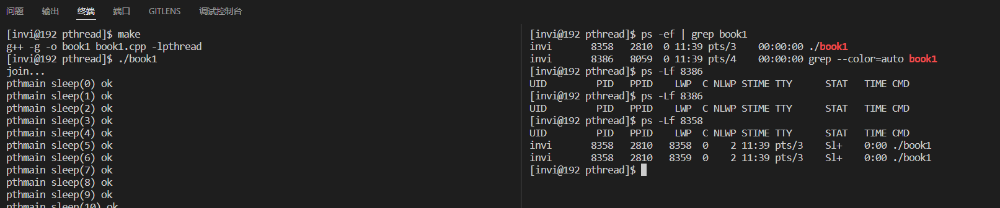
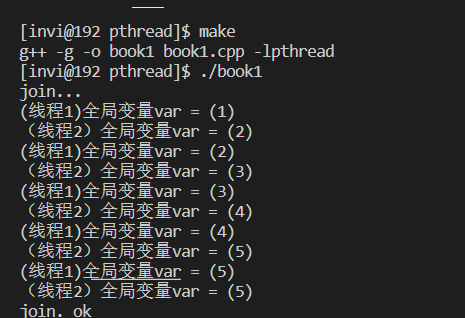
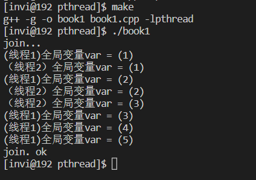
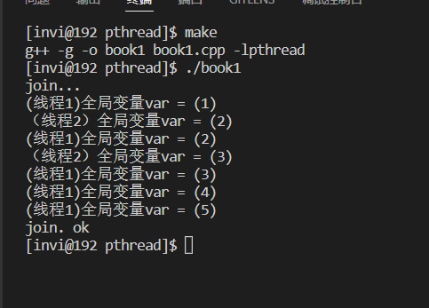

# 线程的创建和终止

**（在实际开发中，一般都是用linux的线程库pthread，c++11标准库中的线程没有价值，功能也没有linux线程库丰富）**

## 线程创建，等待线程退出，查看线程

```c++
// 线程创建
#include <stdio.h>
#include <stdlib.h>
#include <string.h>
#include <unistd.h>
#include <pthread.h>

void* thmain(void *arg);        // 线程主函数

int main(int argc, char* argv[])
{
    // 线程id，typedef unsigned long pthread_t
    pthread_t thid = 0;

    if(pthread_create(&thid, NULL, thmain, NULL) != 0)
    {
        printf("线程创建失败！\n");
        exit(-1);
    }

    // 线程创建成功之后，在主线程中等待子线程的退出
    printf("join...\n");
    pthread_join(thid, NULL);
    printf("join. ok\n");
}


// 线程主函数
void* thmain(void * arg)
{
    for(int i = 0; i < 500; i++)
    {
        sleep(1);
        printf("pthmain sleep(%d) ok\n", i);
    }

    return NULL;
}
```

注意：线程程序的编译指令，需要加上线程的链接库 `-lpthread` ，不然会编译报错

```makefile
all: book1

book1:book1.cpp
 g++ -g -o book1 book1.cpp -lpthread 

clean:
 rm book1

```

编译运行。

在线程运行过程中，我们可以使用系统命令来查看线程。查看指令

```shell
ps -Lf 进程编号
```

如下所示，我们先查出进程编号，然后使用 `ps -Lf`查看其线程。可以看到，有2个线程正在运行，其中 `LWP`等于进程编号的这个线程是主线程。



声明一个全局变量，然后创建两个线程，一个线程修改这个变量的值，另一个线程只显示不修改全局变量的值

```c++
// 线程创建
#include <stdio.h>
#include <stdlib.h>
#include <string.h>
#include <unistd.h>
#include <pthread.h>

// 声明一个全局变量
int var = 0;

void* thmain1(void *arg);        // 线程入口函数1
void* thmain2(void *arg);        // 线程入口函数2

int main(int argc, char* argv[])
{
    // 线程id，typedef unsigned long pthread_t
    pthread_t thid1 = 0;
    pthread_t thid2 = 0;

    if(pthread_create(&thid1, NULL, thmain1, NULL) != 0)
    {
        printf("线程创建失败！\n");
        exit(-1);
    }

    if(pthread_create(&thid2, NULL, thmain2, NULL) != 0)
    {
        printf("线程创建失败！\n");
        exit(-1);
    }

    // 线程创建成功之后，在主线程中等待子线程的退出
    printf("join...\n");
    pthread_join(thid1, NULL);
    pthread_join(thid2, NULL);
    printf("join. ok\n");
}

// 线程入口函数1
void* thmain1(void * arg)
{
    for(int i = 0; i < 5; i++)
    {
        var = i + 1;
        sleep(1);
        printf("(线程1)全局变量var = (%d) \n", var);
    }

    return NULL;
}

// 线程入口函数2
void* thmain2(void * arg)
{
    for(int i = 0; i < 5; i++)
    {
        sleep(1);
        printf("（线程2）全局变量var = (%d) \n", var);
    }

    return NULL;
}
```

编译运行，可以看到，线程1对var变量做加，线程2打印的var的值和线程1加的结果是一样的。也就是说，线程并没有独立的内存空间，他们之间是公用的同一块内存。**线程：拥有PCB，但是没有独立的地址空间**



## 线程非正常终止

线程非正常终止有3中情况

- 如果主线程退出，全部的线程将强行终止
- 在子线程调用exit()将终止整个进程
- 缺省行为是终止程序的信号将导致整个进程终止

在多进程程序中，子进程Core dump（内存溢出等行为导致程序挂掉）掉不影响其他进程

在多线程程序中，子线程Core dump（内存溢出等行为导致程序挂掉）掉，那么整个进程（程序）就会挂掉

## 终止线程的三种方法

- 线程可以简单的从线程函数中返回，返回值是线程的退出码
- 线程可以被同一进程中的其他线程调用`pthread_cancel`()取消
- 在线程函数中，调用`pthread_exit`()退出

### 线程可以简单的从线程函数中返回，返回值是线程的退出码

我将上面的线程2的函数改为运行3s后就终止。运行结果如下

```c++
// 线程入口函数2
void* thmain2(void * arg)
{
    for(int i = 0; i < 5; i++)
    {
        sleep(1);
        printf("（线程2）全局变量var = (%d) \n", var);
        
        if(i == 2)
        {
            return (void*)1;
        }
    }

    return NULL;
}
```



### 线程可以被同一进程中的其他线程调用`pthread_cancel`()取消

比如在主线程中，每过2s就终止一个线程

```c++
    sleep(2);
    pthread_cancel(thid1);
    sleep(2);
    pthread_cancel(thid2);
```

或者在其他子线程中终止另外一个线程（不过这样的的话，被终止的这个线程id就得设置为全局变量）

### 在线程函数中，调用`pthread_exit`()退出

比如我们让线程1，在运行3s后调用 `pthread_exit` 退出

```c++
// 线程入口函数1
void* thmain1(void * arg)
{
    for(int i = 0; i < 5; i++)
    {
        var = i + 1;
        sleep(1);
        printf("(线程1)全局变量var = (%d) \n", var);

        if(i == 2)
        {
            pthread_exit((void*)1);
        }
    }

    return NULL;
}
```

其实发现， `pthread_exit()`和 `return` 差不多。他们运行的效果是一样的，返回参数的写法也一样。

那么他们有什么区别呢？

在线程的主函数中都可以终止线程，但是如果是线程主函数调用了其他的函数，在其他的函数中用return只能回到线程主函数中，但是用 `pthread_exit`就可以直接退出线程。

其实就是和return和exit这两个是一样的。

````c++
void func1()
{
    return;
}


// 线程入口函数1
void* thmain1(void * arg)
{
    for(int i = 0; i < 5; i++)
    {
        var = i + 1;
        sleep(1);
        printf("(线程1)全局变量var = (%d) \n", var);

        if(i == 1)
        {
            // pthread_exit((void*)1);
            func1();
        }
    }

    return NULL;
}

void func2()
{
    pthread_exit(0);
}

// 线程入口函数2
void* thmain2(void * arg)
{
    for(int i = 0; i < 5; i++)
    {
        sleep(1);
        printf("（线程2）全局变量var = (%d) \n", var);
        
        if(i == 1)
        {
            // return (void*)1;
            func2();
        }
    }

    return NULL;
}
````

编译运行。可以看到线程2调用 `pthread_exit`的在2s后就终止运行了，但是线程1只是return回到线程入口函数继续执行完。这就是return和exit的区别。


