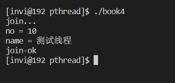

# 线程参数传递

创建的多个线程并不保证哪个线程先运行

不能用全部变量代替线程函数的参数

数据类型的强制转换

## 如何传递整形参数

```c++
// 线程参数传递
#include <stdio.h>
#include <stdlib.h>
#include <string.h>
#include <unistd.h>
#include <pthread.h>

void * thmain1(void * arg);
void * thmain2(void * arg);
void * thmain3(void * arg);
void * thmain4(void * arg);
void * thmain5(void * arg);

int var = 0;


int main(int argc, char* argv[])
{
    int ii = 10;            // 整形变量是4字节
    void* pv = nullptr;     // 指针占用的内存是8字节，用于存放变量的地址
    pv = &ii;               // 正常来说，指针变量存放的是变量的地址
    printf("pv=%p\n", pv); 

    // 下面这个代码用于演示用指针存放整形数字，然后再讲数据给恢复出来，以用于演示线程中整形变量的传递
    pv = (void*)(long)ii;       // 先把4字节整形变量ii转为8字节长整形，然后将其转为void*(地址类型)
    printf("pv=%p\n", pv);

    int jj = 0;
    jj = (int)(long)pv;        // 将pv这个指针保存的内容转为长整型，然后转为整形赋值给jj
    printf("jj = %d\n", jj);

    pthread_t thid1=0,thid2=0,thid3=0,thid4=0,thid5=0;

    // 创建线程
    var = 1;
    if(pthread_create(&thid1, NULL, thmain1, (void*)(long)var) != 0)
    {
        printf("线程创建失败\n");
        exit(-1);
    }
    var = 2;
    if(pthread_create(&thid2, NULL, thmain2, (void*)(long)var) != 0)
    {
        printf("线程创建失败\n");
        exit(-1);
    }
    var = 3;
    if(pthread_create(&thid3, NULL, thmain3, (void*)(long)var) != 0)
    {
        printf("线程创建失败\n");
        exit(-1);
    }
    var = 4;
    if(pthread_create(&thid4, NULL, thmain4, (void*)(long)var) != 0)
    {
        printf("线程创建失败\n");
        exit(-1);
    }
    var = 5;
    if(pthread_create(&thid5, NULL, thmain5, (void*)(long)var) != 0)
    {
        printf("线程创建失败\n");
        exit(-1);
    }

    // 等待子线程退出
    printf("join...\n");
    pthread_join(thid1, NULL);
    pthread_join(thid2, NULL);
    pthread_join(thid3, NULL);
    pthread_join(thid4, NULL);
    pthread_join(thid5, NULL);
    printf("join-ok\n");
}

void * thmain1(void * arg)
{
    printf("线程1-var=%d\n", (int)(long)arg);
    return NULL;
}
void * thmain2(void * arg)
{
    printf("线程2-var=%d\n", (int)(long)arg);
    return NULL;
}
void * thmain3(void * arg)
{
    printf("线程3-var=%d\n", (int)(long)arg);
    return NULL;
}
void * thmain4(void * arg)
{
    printf("线程4-var=%d\n", (int)(long)arg);
    return NULL;
}
void * thmain5(void * arg)
{
    printf("线程5-var=%d\n", (int)(long)arg);
    return NULL;
}
```

将上述代码进行编译运行，结果如下


## 如何传递地址参数

给线程函数传递地址参数，要保证给每个线程传递一个地址，全局变量是一个地址，如果给线程函数传递全局变量的地址，那么每个函数所使用的地址就都是同一个地址，会出现错误和混乱。

```c++
// 线程参数传递
#include <stdio.h>
#include <stdlib.h>
#include <string.h>
#include <unistd.h>
#include <pthread.h>

void * thmain1(void * arg);
void * thmain2(void * arg);
void * thmain3(void * arg);
void * thmain4(void * arg);
void * thmain5(void * arg);

int var = 0;


int main(int argc, char* argv[])
{

    pthread_t thid1=0,thid2=0,thid3=0,thid4=0,thid5=0;

    // 创建线程
    int *var1 = new int; *var1 = 1;
    if(pthread_create(&thid1, NULL, thmain1, var1) != 0)
    {
        printf("线程创建失败\n");
        exit(-1);
    }
    int *var2 = new int; *var2 = 2;
    if(pthread_create(&thid2, NULL, thmain2, var2) != 0)
    {
        printf("线程创建失败\n");
        exit(-1);
    }
    int *var3 = new int; *var3 = 3;
    if(pthread_create(&thid3, NULL, thmain3, var3) != 0)
    {
        printf("线程创建失败\n");
        exit(-1);
    }
    int *var4 = new int; *var4 = 4;
    if(pthread_create(&thid4, NULL, thmain4, var4) != 0)
    {
        printf("线程创建失败\n");
        exit(-1);
    }
    int *var5 = new int; *var5 = 5;
    if(pthread_create(&thid5, NULL, thmain5, var5) != 0)
    {
        printf("线程创建失败\n");
        exit(-1);
    }

    // 等待子线程退出
    printf("join...\n");
    pthread_join(thid1, NULL);
    pthread_join(thid2, NULL);
    pthread_join(thid3, NULL);
    pthread_join(thid4, NULL);
    pthread_join(thid5, NULL);
    printf("join-ok\n");
}

void * thmain1(void * arg)
{
    printf("线程1-var=%d\n", *(int*)arg);
    delete (int*)arg;
    return NULL;
}
void * thmain2(void * arg)
{
    printf("线程2-var=%d\n", *(int*)arg);
    delete (int*)arg;
    return NULL;
}
void * thmain3(void * arg)
{
    printf("线程3-var=%d\n", *(int*)arg);
    delete (int*)arg;
    return NULL;
}
void * thmain4(void * arg)
{
    printf("线程4-var=%d\n", *(int*)arg);
    delete (int*)arg;
    return NULL;
}
void * thmain5(void * arg)
{
    printf("线程5-var=%d\n", *(int*)arg);
    delete (int*)arg;
    return NULL;
}
```

编译运行


传递结构体的地址

```c++
// 线程参数传递
#include <stdio.h>
#include <stdlib.h>
#include <string.h>
#include <unistd.h>
#include <pthread.h>

void * thmain1(void * arg);

int var = 0;

struct st_args
{
    int no;     // 线程编号
    char name[51];  // 线程名
};


int main(int argc, char* argv[])
{

    pthread_t thid1=0;

    // 创建线程
    struct st_args *stargs = new st_args;
    stargs->no = 10;
    strcpy(stargs->name, "测试线程");
    if(pthread_create(&thid1, NULL, thmain1, stargs) != 0)
    {
        printf("线程创建失败\n");
        exit(-1);
    }

    // 等待子线程退出
    printf("join...\n");
    pthread_join(thid1, NULL);
    printf("join-ok\n");
}

void * thmain1(void * arg)
{
    struct st_args* pst = (struct st_args*)arg;

    printf("no = %d\nname = %s\n", pst->no, pst->name);
    
    delete pst;
    return NULL;
}

```

编译运行



## 线程退出状态
