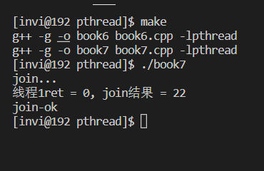
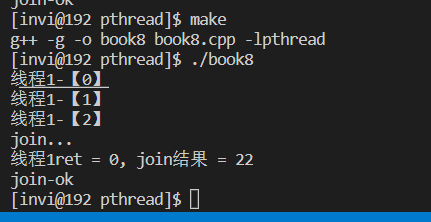

# 线程资源的回收

先回顾一下进程资源的回收

- 子进程退出时，向父进程发送SIGCHILD信号
- 父进程调用wait函数等待子进程的退出，忽略SIGCHILD信号
- 在信号处理函数中释放资源

## 线程的分离

- 线程有非分离（joinable）和分离（unjoinable）两种状态
- 线程缺省状态是非分离的，或者称为可连接的（joinable）
- 非分离状态的线程终止的时候，不会释放线程全部的资源

```c++
// 线程参数传递
#include <stdio.h>
#include <stdlib.h>
#include <string.h>
#include <unistd.h>
#include <pthread.h>

void * thmain1(void * arg);

void * thmain2(void * arg);

int var = 0;

struct st_ret
{
    int retcode;    // 返回代码
    char message[1024];     // 返回内容
};


int main(int argc, char* argv[])
{

    pthread_t thid1=0, thid2=0;

    // 创建线程
    if(pthread_create(&thid1, NULL, thmain1, NULL) != 0)
    {
        printf("线程创建失败\n");
        exit(-1);
    }

    if(pthread_create(&thid2, NULL, thmain2, NULL) != 0)
    {
        printf("线程创建失败\n");
        exit(-1);
    }

    sleep(10);

    // 等待子线程退出
    printf("join...\n");

    void *pv = nullptr;
    pthread_join(thid1, &pv);
    printf("线程1ret = %ld\n", (long)pv);

    pthread_join(thid2, &pv);
    printf("线程2ret = %ld\n", (long)pv);


    printf("join-ok\n");
}

void * thmain1(void * arg)
{
    for(int i = 0; i < 3; i++)
    {
        printf("线程1-【%d】\n", i);
    }
    return (void*)10;
}

void * thmain2(void * arg)
{
    for(int i = 0; i < 5; i++)
    {
        printf("线程2-【%d】\n", i);
    }
    return (void*)11;
}

```

例如，如上程序，我们有两个子线程，然后这两个子线程运行结束就立马退出，然后再主线程中是等到sleep 10秒之后才去join它，可以看到依旧能够拿到线程返回的值。这说明了，线程退出并没有完全释放资源，不然就不可能在退出10s之后，还能join到返回值

如果不关心线程的退出状态，可以把线程的属性设置为分离，线程结束后，由操作系统回收资源

分离线程有两种方法

- 调用`pthread_detach()`函数分离线程
- 在创建线程之前，调用 `pthread_attr_setdetachstate()`设置线程的属性

```c++
// 线程参数传递
#include <stdio.h>
#include <stdlib.h>
#include <string.h>
#include <unistd.h>
#include <pthread.h>

void * thmain1(void * arg);

int main(int argc, char* argv[])
{

    pthread_t thid1=0;

    // 创建线程
    if(pthread_create(&thid1, NULL, thmain1, NULL) != 0)
    {
        printf("线程创建失败\n");
        exit(-1);
    }

    // 设置线程分离
    pthread_detach(thid1);

    // 等待子线程退出
    printf("join...\n");

    void *pv = nullptr;
    int result = 0;
    result = pthread_join(thid1, &pv);
    printf("线程1ret = %ld, join结果 = %d\n", (long)pv, result);

    printf("join-ok\n");
}

void * thmain1(void * arg)
{
    for(int i = 0; i < 3; i++)
    {
        printf("线程1-【%d】\n", i);
    }
    return (void*)10;
}

void * thmain2(void * arg)
{
    for(int i = 0; i < 5; i++)
    {
        printf("线程2-【%d】\n", i);
    }
    return (void*)11;
}

```

如上，在创建线程之后，将线程 detach 出去，其实上面的代码是有问题的， **既然已经将线程detach出去了，就不要在调用join， 已经分离的线程，不管是运行中还是退出状态，都不能被join**

编译运行，结果如下，可以看到join失败。同时，因为join失败，主线程啥也没做，就直接退出了，那么此时子线程就也没有机会运行



`pthread_detach()`这个函数除了主线程中可以分离线程，还可以在子线程内部自己分离线程，这个时候只需要调用 `pthread_self()`函数获取自己的线程id就可以作为 detach 的参数，然后进行线程分离

```c++
// 线程参数传递
#include <stdio.h>
#include <stdlib.h>
#include <string.h>
#include <unistd.h>
#include <pthread.h>

void * thmain1(void * arg);

int main(int argc, char* argv[])
{

    pthread_t thid1=0;

    // 创建线程
    if(pthread_create(&thid1, NULL, thmain1, NULL) != 0)
    {
        printf("线程创建失败\n");
        exit(-1);
    }

    // 设置线程分离
    // pthread_detach(thid1);

    // 等待子线程退出
    printf("join...\n");

    void *pv = nullptr;
    int result = 0;
    result = pthread_join(thid1, &pv);
    printf("线程1ret = %ld, join结果 = %d\n", (long)pv, result);

    printf("join-ok\n");
}

void * thmain1(void * arg)
{
    pthread_detach(pthread_self());
    for(int i = 0; i < 3; i++)
    {
        sleep(1);
        printf("线程1-【%d】\n", i);
    }
    return (void*)10;
}

```

### 使用 `pthread_attr_setdetachstate()`设置线程分离属性实现线程分离

这种设置线程分离的写法很啰嗦，实际开发中用的不多

```c++
// 线程参数传递
#include <stdio.h>
#include <stdlib.h>
#include <string.h>
#include <unistd.h>
#include <pthread.h>

void * thmain1(void * arg);

int main(int argc, char* argv[])
{

    pthread_t thid1=0;

    pthread_attr_t attr;        // 声明线程属性的数据结构
    pthread_attr_init(&attr);   // 初始化
    pthread_attr_setdetachstate(&attr, PTHREAD_CREATE_DETACHED);        // 设置线程的分离属性

    // 创建线程（将线程属性作为参数传递给创建线程函数）
    if(pthread_create(&thid1, &attr, thmain1, NULL) != 0)
    {
        printf("线程创建失败\n");
        exit(-1);
    }

    sleep(10);
    // 等待子线程退出
    printf("join...\n");

    void *pv = nullptr;
    int result = 0;
    result = pthread_join(thid1, &pv);
    printf("线程1ret = %ld, join结果 = %d\n", (long)pv, result);

    printf("join-ok\n");
}

void * thmain1(void * arg)
{
    for(int i = 0; i < 3; i++)
    {
        sleep(1);
        printf("线程1-【%d】\n", i);
    }
    return (void*)10;
}

```

编译运行，可以看到运行结果和使用detach函数是一样的



线程的join还有两个函数

- 非阻塞：`pthread_tryjoin_np()`、tryjoin的参数和join是一样的，但是tryjoin不会阻塞，如果线程在tryjoin的时候还没有返回，那么tryjoin就不会等待，会直接返回
- 限时阻塞等待：`pthread_timedjoin_np()`，timedjoin多了一个超时时间的参数，意思是等待若干秒之后，如果子线程没有返回，那么他会停止等待，直接返回

## 用线程清理函数释放资源
