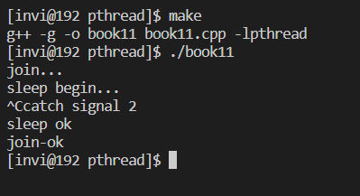
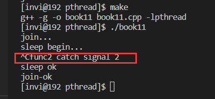
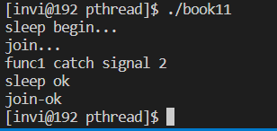

# 线程和信号

- 在多线程程序中，外部向进程发送信号不会中断系统调用
- 在多线程程序中，信号的处理是所有线程共享的
- 进程中的信号可以送达单个线程，会中断系统调用
- 如果某个线程因为信号而终止，整个进程将会终止

```c++
// 线程参数传递
#include <stdio.h>
#include <stdlib.h>
#include <string.h>
#include <unistd.h>
#include <pthread.h>
#include <signal.h>

// 线程入口函数
void * thmain1(void * arg);

// 信号处理函数
void func(int sig)
{
    printf("catch signal %d\n", sig);
}

int main(int argc, char* argv[])
{

    signal(2, func);

    pthread_t thid1=0;

    // 创建线程（将线程属性作为参数传递给创建线程函数）
    if(pthread_create(&thid1, NULL, thmain1, NULL) != 0)
    {
        printf("线程创建失败\n");
        exit(-1);
    }

    // 等待子线程退出
    printf("join...\n");
    pthread_join(thid1, NULL);
    printf("join-ok\n");
}

void * thmain1(void * arg)
{
    printf("sleep begin...\n");
    sleep(10);
    printf("sleep ok\n");

    return (void*)10;
}

```

在上面的程序中，我们设置信号2的处理程序（打印信号量），然后让子线程sleep 10秒，在这期间用信号发送信号2，看是否会中断线程调用。测试如下，发现，并不会中断线程的调用



```c++
// 线程参数传递
#include <stdio.h>
#include <stdlib.h>
#include <string.h>
#include <unistd.h>
#include <pthread.h>
#include <signal.h>

// 线程入口函数
void * thmain1(void * arg);

// 信号处理函数
void func1(int sig)
{
    printf("func1 catch signal %d\n", sig);
}

void func2(int sig)
{
    printf("func2 catch signal %d\n", sig);
}

int main(int argc, char* argv[])
{

    signal(2, func1);

    pthread_t thid1=0;

    // 创建线程（将线程属性作为参数传递给创建线程函数）
    if(pthread_create(&thid1, NULL, thmain1, NULL) != 0)
    {
        printf("线程创建失败\n");
        exit(-1);
    }

    // 等待子线程退出
    printf("join...\n");
    pthread_join(thid1, NULL);
    printf("join-ok\n");
}

void * thmain1(void * arg)
{
    signal(2, func2);

    printf("sleep begin...\n");
    sleep(10);
    printf("sleep ok\n");

    return (void*)10;
}

```

这里改造一下上面的代码，设置两个信号处理函数，然后让主线程设置信号2的处理函数为1，让子线程也设置信号处理函数，为函数2.编译运行，然后再运行期间发送信号2，看打印结果，发现执行的是子线程的信号处理函数



为什么会这样？原因很简单，在多线程程序中，信号处理是所有线程共享的，包括主线程。信号处理代码放在哪里都一样，以最后被执行的那行代码为准。所以，同一个信号的处理，如果多个线程都对其进行了处理，只会执行最后一个线程的信号处理函数。

在多线程程序中，某个线程可以调用 `pthread_kill()`向某个线程发送信号。

  该函数可以用于向指定的线程发送信号：

  ```c++
   int pthread_kill(pthread_t threadId,int signal); 
  ```

   如果线程内不对信号进行处理，则调用默认的处理程式，如SIGQUIT会退出终止线程，SIGKILL会杀死线程等等,可以调用signal(SIGQUIT, sig_process_routine); 来自定义信号的处理程序。

   传递的`pthread_kill`的signal参数一般都是大于0的，这时系统默认或者自定义的都是有相应的处理程序。signal为0时，是一个被保留的信号，一般用这个保留的信号测试线程是否存在。

   `pthread_kill` 返回值如下：

- 0:调用成功。

- ESRCH：线程不存在。

- EINVAL：信号不合法。

```c++
int kill_ret = pthread_kill(thread_id,0);
if(kill_ret == ESRCH)
printf("指定的线程不存在或者是已经终止\n");
else if(kill_ret == EINVAL)
printf("调用传递一个无用的信号\n");
else
printf("线程存在\n");
```

这个信号发送和多进程的 kill 类似，比如说，发送 信号 0 ，可以检测线程是否存在。

比如这个程序。我们在主线程中，阻塞5秒后，向子线程发送信号2，可以看到，5s后，子线程收到信号，然后中断了运行。

```c++
// 线程参数传递
#include <stdio.h>
#include <stdlib.h>
#include <string.h>
#include <unistd.h>
#include <pthread.h>
#include <signal.h>

// 线程入口函数
void * thmain1(void * arg);

// 信号处理函数
void func1(int sig)
{
    printf("func1 catch signal %d\n", sig);
}

int main(int argc, char* argv[])
{

    signal(2, func1);

    pthread_t thid1=0;

    // 创建线程（将线程属性作为参数传递给创建线程函数）
    if(pthread_create(&thid1, NULL, thmain1, NULL) != 0)
    {
        printf("线程创建失败\n");
        exit(-1);
    }

    sleep(5);
    pthread_kill(thid1, 2);

    // 等待子线程退出
    printf("join...\n");
    pthread_join(thid1, NULL);
    printf("join-ok\n");
}

void * thmain1(void * arg)
{
    printf("sleep begin...\n");
    sleep(10);
    printf("sleep ok\n");

    return (void*)10;
}

```

编译运行



然后看这个代码，让主线程发送15的信号，15的信号没有设置信号处理函数，默认是终止进程。

```c++
// 线程参数传递
#include <stdio.h>
#include <stdlib.h>
#include <string.h>
#include <unistd.h>
#include <pthread.h>
#include <signal.h>

// 线程入口函数
void * thmain1(void * arg);

// 信号处理函数
void func1(int sig)
{
    printf("func1 catch signal %d\n", sig);
}

int main(int argc, char* argv[])
{

    signal(2, func1);

    pthread_t thid1=0;

    // 创建线程（将线程属性作为参数传递给创建线程函数）
    if(pthread_create(&thid1, NULL, thmain1, NULL) != 0)
    {
        printf("线程创建失败\n");
        exit(-1);
    }

    sleep(5);
    pthread_kill(thid1, 15);

    // 等待子线程退出
    printf("join...\n");
    pthread_join(thid1, NULL);
    printf("join-ok\n");
}

void * thmain1(void * arg)
{
    printf("sleep begin...\n");
    sleep(10);
    printf("sleep ok\n");

    return (void*)10;
}

```

编译运行。可以看到，子线程在收到15的信号之后，整个程序就退出了


## 信号的更多知识

- 比`signal()`更强大的`sigaction()`函数
- 进程信号屏蔽 `sigprocmask()`，线程 `pthread_sigmask()`
- 其他信号处理函数 `sigwait()`，`sigwaitinfo()`，`sigtimedwait()`
