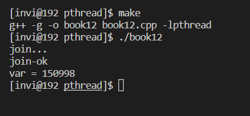
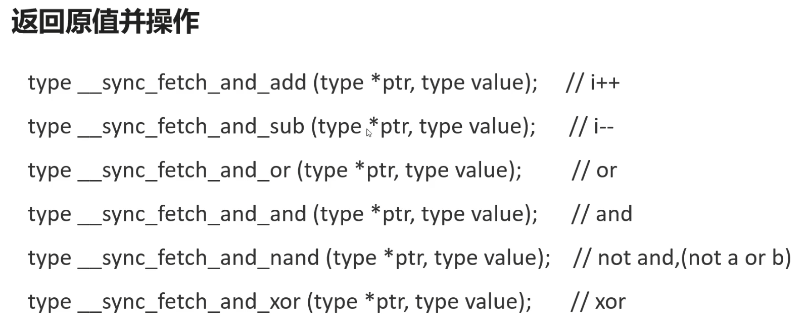
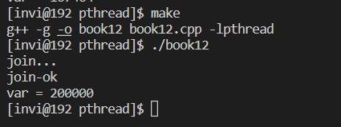
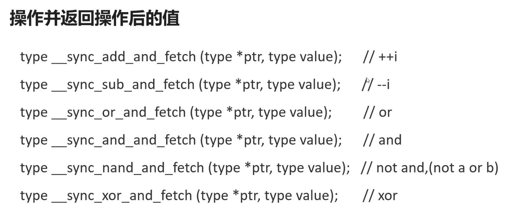
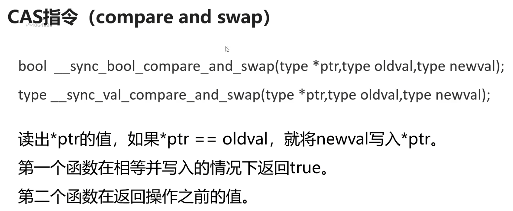
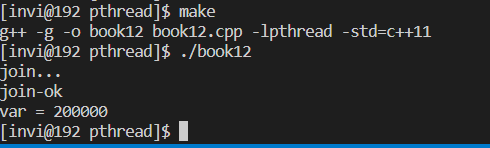

# 线程安全

当多个线程访问同一个类时，如果不用考虑这些线程在运行时环境下的调度和交替执行，并且不需要额外的同步及在调用方式代码不必作其他的协调，这个类的行为仍然是正确的，那么称这个类是**线程安全的**。

任何单线程化的程序同时也是合法的多线程化的程序，倘若在单线程化的环境尚且不正确，那么该程序必然不是线程安全的。对于一个正确的实现的对象，顺序性的操作——比如调用公共的方法，读写公共域——不会破坏任何一个不变的约束以及后验条件。**对于线程安全类的实例进行顺序或并发的一些列操作，都不会导致实例处于无效状态。**

在拥有共享数据的多条线程并行执行的程序中，线程安全的代码会通过同步机制保证各个线程都可以正常且正确的执行，不会出现数据污染等意外情况。

- 多个线程访问共享资源（全局和静态）的时候会冲突。在多线程程序中，地址空间是共享的，所以多个线程访问共享资源的时候，会产生冲突。
- 三个概念：原子性，可见性和顺序性

原子性，即操作要么全部执行成功，要么就都不执行。保持这种特性是线程安全的一个必要

可见性，指多个线程访问同一个变量时，假设一个线程修改了这个变量的值，其它线程可以立马看到修改后的值。cpu有高速缓存，每个线程读取共享变量的时候，会将该变量从内存中加载到cpu的缓存中，修改该变量之后，cpu会立即更新缓存，但是不一定会离家将它写回到内存。此时其他线程访问该变量，从内存中读取到的就是旧数据，而非第一个线程更新后的数据

顺序性，即程序执行的顺序按照代码的先后顺序。cpu为了提高整体的执行效率，可能会对代码进行优化，按照更高效的顺序执行代码，CPU虽然并不保证完全按照代码顺序执行，但是它会保证程序的最终执行结果和代码顺序执行的结果一致

```c++
// 线程参数传递
#include <stdio.h>
#include <stdlib.h>
#include <string.h>
#include <unistd.h>
#include <pthread.h>
#include <signal.h>

// 线程入口函数
void * thmain(void * arg);

int var = 0;

int main(int argc, char* argv[])
{

    pthread_t thid1=0, thid2 = 0;

    // 创建线程（将线程属性作为参数传递给创建线程函数）
    if(pthread_create(&thid1, NULL, thmain, NULL) != 0)
    {
        printf("线程创建失败\n");
        exit(-1);
    }

    if(pthread_create(&thid2, NULL, thmain, NULL) != 0)
    {
        printf("线程创建失败\n");
        exit(-1);
    }

    // 等待子线程退出
    printf("join...\n");
    pthread_join(thid1, NULL);
    pthread_join(thid2, NULL);
    printf("join-ok\n");
    printf("var = %d\n", var);
}

void * thmain(void * arg)
{
    for(int i = 0; i< 100000; i++)
    {
        var++;
    }

    return (void*)10;
}

```

比如这个程序，我们让两个线程，都对同一个变量进行++操作，按道理说，最后的结果应该是200000，但是我们查看运行结果，发现并不是，这就是多线程访问同一个变量导致的线程不安全的结果



## volatile关键字

- 保证了变量的内存可见性。它是变量的修饰符，有两个作用，一是让CPU每次都从内存中读取变量的值，不要放在缓存里，解决了可见性的问题。
- 禁止代码重排序。二就是告诉编译器，不要优化代码，不要重排序
- volatile 不是原子的

```c++
// 线程参数传递
#include <stdio.h>
#include <stdlib.h>
#include <string.h>
#include <unistd.h>
#include <pthread.h>
#include <signal.h>

// 线程入口函数
void * thmain(void * arg);

volatile int var = 0;

int main(int argc, char* argv[])
{

    pthread_t thid1=0, thid2 = 0;

    // 创建线程（将线程属性作为参数传递给创建线程函数）
    if(pthread_create(&thid1, NULL, thmain, NULL) != 0)
    {
        printf("线程创建失败\n");
        exit(-1);
    }

    if(pthread_create(&thid2, NULL, thmain, NULL) != 0)
    {
        printf("线程创建失败\n");
        exit(-1);
    }

    // 等待子线程退出
    printf("join...\n");
    pthread_join(thid1, NULL);
    pthread_join(thid2, NULL);
    printf("join-ok\n");
    printf("var = %d\n", var);
}

void * thmain(void * arg)
{
    for(int i = 0; i< 100000; i++)
    {
        var++;
    }

    return (void*)10;
}

```

我们将变量声明成 volatile 。再次编译运行。发现同样不是正确结果，可以看到， volatile 解决不了线程安全问题，因为它不是原子的

## 如何解决线程安全问题

- volatile关键字
- 原子操作（原子类型）
- 线程同步（锁）

### 原子操作

- 原子操作的本质是总线锁，CPU与内存通过总线进行数据交换，在操作之前锁住总线，然后执行下面这3条汇编指令，再放开锁。总线锁可以理解为硬件级别的锁，他的效率非常高，比线程库提供的锁要快10倍左右。
- 三条汇编指令：`xadd`, `cmpxchg` 或者 `xchg`
- 硬件级别的锁

C语音提供了如下这6个函数用于对整形变量提供原子操作



比如，我们将++操作用原子操作替代

```c++
void * thmain(void * arg)
{
    for(int i = 0; i< 100000; i++)
    {
        // var++;
        // 用原子操作中的加法函数
        __sync_fetch_and_add(&var, 1);
    }

    return (void*)10;
}
```

然后编译运行，可以看到得到我们想要的结果



除此之外，还有6个原子操作，他们的关系就是i++和++i的关系。



#### CAS（compare and swap）

原子操作还有两个函数，也叫CAS指令。比较并交换的意思。



### 原子类型

在c++11中，增加了原子类型。std::atomic模板类封装了原子类型，支持布尔，整数和字符

注意：在编译c++11的代码的时候，需要添加c++11的编译参数 `-std=c++11`

```makefile
book12:book12.cpp
 g++ -g -o book12 book12.cpp -lpthread -std=c++11
```

我们将上面的var变量改为整形原子类，然后再次编译测试,，可以看到结果和使用c的原子操作是一样的

```c++
// 线程参数传递
#include <stdio.h>
#include <stdlib.h>
#include <string.h>
#include <unistd.h>
#include <pthread.h>
#include <signal.h>
#include <atomic>
#include <iostream>

// 线程入口函数
void * thmain(void * arg);

// int var = 0;
std::atomic<int> var;

int main(int argc, char* argv[])
{

    pthread_t thid1=0, thid2 = 0;

    // 创建线程（将线程属性作为参数传递给创建线程函数）
    if(pthread_create(&thid1, NULL, thmain, NULL) != 0)
    {
        printf("线程创建失败\n");
        exit(-1);
    }

    if(pthread_create(&thid2, NULL, thmain, NULL) != 0)
    {
        printf("线程创建失败\n");
        exit(-1);
    }

    // 等待子线程退出
    printf("join...\n");
    pthread_join(thid1, NULL);
    pthread_join(thid2, NULL);
    printf("join-ok\n");
    // printf("var = %d\n", var);
    std::cout << "var = " << var << std::endl;
}

void * thmain(void * arg)
{
    for(int i = 0; i< 100000; i++)
    {
        // var++;
        // 用原子操作中的加法函数
        // __sync_fetch_and_add(&var, 1);
        var++;
    }

    return (void*)10;
}
```


