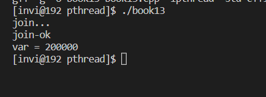

# 线程同步

## 互斥锁

- 互斥锁，只有加锁和解锁两种状态，确保同一时间只有一个线程可以访问共享资源
- 线程在访问共享资源之前申请加锁，加锁成功之后访问共享资源，访问玩之后释放锁
- 如果某线程持有锁，其他的线程会形成等待队列

线程同步-互斥锁

- `pthread_mutex_t mutex;`    // 声明锁
- `int pthread_mutex_init();`    // 初始化锁
- `int pthread_mutex_lock();`    // 等待并加锁
- `int pthread_mutex_trylock();`   // 尝试加锁，不等待
- `int pthread_mutex_timedlock();`  // 带超时机制的加锁
- `int pthread_mutex_unlock();`    // 解锁
- `int pthread_mutex_destroy();`    // 销毁锁

声明并初始化互斥锁有如下两种方式

```c++
pthread_mutex_t mutexvar = PTHREAD_MUTEX_INITIALIZER;           // 声明互斥锁
```

或者

```c++
pthread_mutex_t mutexvar;           // 声明互斥锁
...
pthread_mutex_init(&mutexvar, NULL);        // 初始化锁
```

这两种互斥锁声明方式是一样的。

### 互斥锁的属性

- `PTHREAD_MUTEX_TIMED_NP`，这是缺省值，也就是普通锁，当一个线程加锁之后，其余请求锁的线程将形成一个等待队列，并在解锁后按优先级获得锁。这种锁策略保证了资源分配的公平性
- `PTHREAD_MUTEX_RECURSIVE_NP`，嵌套锁（递归锁），允许同一个线程对同一个锁成功获得多次，并通过多次unlock解锁，如果是不同线程请求，则在加锁线程解锁时重新竞争
- `PTHREAD_MUTEX_ADAPTIVE_NP`，适应锁，解锁之后，请求锁的线程重新竞争

```c++
// 线程参数传递
#include <stdio.h>
#include <stdlib.h>
#include <string.h>
#include <unistd.h>
#include <pthread.h>
#include <signal.h>

// 线程入口函数
void * thmain(void * arg);

int var = 0;

pthread_mutex_t mutexvar = PTHREAD_MUTEX_INITIALIZER;           // 声明互斥锁

int main(int argc, char* argv[])
{
    // pthread_mutex_init(&mutexvar, NULL);        // 初始化锁

    pthread_t thid1=0, thid2 = 0;

    // 创建线程（将线程属性作为参数传递给创建线程函数）
    if(pthread_create(&thid1, NULL, thmain, NULL) != 0)
    {
        printf("线程创建失败\n");
        exit(-1);
    }

    if(pthread_create(&thid2, NULL, thmain, NULL) != 0)
    {
        printf("线程创建失败\n");
        exit(-1);
    }

    // 等待子线程退出
    printf("join...\n");
    pthread_join(thid1, NULL);
    pthread_join(thid2, NULL);
    printf("join-ok\n");
    printf("var = %d\n", var);

    pthread_mutex_destroy(&mutexvar);
}

void * thmain(void * arg)
{
    pthread_mutex_lock(&mutexvar);
    for(int i = 0; i< 100000; i++)
    {
        var++;
    }
    pthread_mutex_unlock(&mutexvar);

    return (void*)10;
}

```

编译运行



## 自旋锁

## 读写锁

## 条件变量

## 信号量

## 生产消费者模型
