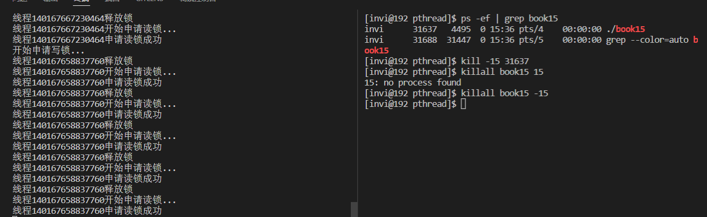

# 线程同步

## 互斥锁

- 互斥锁，只有加锁和解锁两种状态，确保同一时间只有一个线程可以访问共享资源
- 线程在访问共享资源之前申请加锁，加锁成功之后访问共享资源，访问玩之后释放锁
- 如果某线程持有锁，其他的线程会形成等待队列

### 互斥锁API

- `pthread_mutex_t mutex;`    // 声明锁
- `int pthread_mutex_init();`    // 初始化锁
- `int pthread_mutex_lock();`    // 等待并加锁
- `int pthread_mutex_trylock();`   // 尝试加锁，不等待
- `int pthread_mutex_timedlock();`  // 带超时机制的加锁
- `int pthread_mutex_unlock();`    // 解锁
- `int pthread_mutex_destroy();`    // 销毁锁

声明并初始化互斥锁有如下两种方式

```c++
pthread_mutex_t mutexvar = PTHREAD_MUTEX_INITIALIZER;           // 声明互斥锁
```

或者

```c++
pthread_mutex_t mutexvar;           // 声明互斥锁
...
pthread_mutex_init(&mutexvar, NULL);        // 初始化锁
```

这两种互斥锁声明方式是一样的。

### 互斥锁的属性

- `PTHREAD_MUTEX_TIMED_NP`，这是缺省值，也就是普通锁，当一个线程加锁之后，其余请求锁的线程将形成一个等待队列，并在解锁后按优先级获得锁。这种锁策略保证了资源分配的公平性
- `PTHREAD_MUTEX_RECURSIVE_NP`，嵌套锁（递归锁），允许同一个线程对同一个锁成功获得多次，并通过多次unlock解锁，如果是不同线程请求，则在加锁线程解锁时重新竞争
- `PTHREAD_MUTEX_ADAPTIVE_NP`，适应锁，解锁之后，请求锁的线程重新竞争

```c++
// 线程参数传递
#include <stdio.h>
#include <stdlib.h>
#include <string.h>
#include <unistd.h>
#include <pthread.h>
#include <signal.h>

// 线程入口函数
void * thmain(void * arg);

int var = 0;

pthread_mutex_t mutexvar = PTHREAD_MUTEX_INITIALIZER;           // 声明互斥锁

int main(int argc, char* argv[])
{
    // pthread_mutex_init(&mutexvar, NULL);        // 初始化锁

    pthread_t thid1=0, thid2 = 0;

    // 创建线程（将线程属性作为参数传递给创建线程函数）
    if(pthread_create(&thid1, NULL, thmain, NULL) != 0)
    {
        printf("线程创建失败\n");
        exit(-1);
    }

    if(pthread_create(&thid2, NULL, thmain, NULL) != 0)
    {
        printf("线程创建失败\n");
        exit(-1);
    }

    // 等待子线程退出
    printf("join...\n");
    pthread_join(thid1, NULL);
    pthread_join(thid2, NULL);
    printf("join-ok\n");
    printf("var = %d\n", var);

    pthread_mutex_destroy(&mutexvar);
}

void * thmain(void * arg)
{
    pthread_mutex_lock(&mutexvar);
    for(int i = 0; i< 100000; i++)
    {
        var++;
    }
    pthread_mutex_unlock(&mutexvar);

    return (void*)10;
}

```

编译运行


## 自旋锁

### 自旋锁API

- `pthread_spinlock_t mutex;`   // 声明锁
- `int pthread_spin_init();`    // 初始化锁
- `int pthread_spin_lock();`    // 等待加锁
- `int pthread_spin_trylock();`   // 尝试加锁，不等待
- `int pthread_spin_unlock();`    // 解锁
- `int pthread_spin_destroy();`   // 销毁锁

自旋锁的功能和互斥锁是一样的，不同的是，互斥锁在等待的时候线程会休眠，不消耗CPU资源，而自旋锁不一样，它用一个循环不断的检测锁是否可用，会消耗CPU。自旋锁适用于等待时间很短的场景，而互斥锁适用于等待时间可能会比较长的场景。

自旋锁没有带超时机制的锁函数，因为使用自旋锁有一个前提条件，就是假设你等待时间会很短，不应该等待很长时间。

自旋锁的初始化只能用函数，不能和互斥锁一样，在声明的是就进行属性初始化。此外，自旋锁的初始化函数和互斥锁还有点不同，就是，他的第二个参数，是一个共享标志。这个标志的意思其实就是标识在多进程程序中，如果创建了多线程，不同进程之间的线程是否可以共享自旋锁。这个参数一般填 `PTHREAD_PROCESS_PRIVATE`（私有的，多进程间不共享）

```c++
int pthread_spin_init(pthread_spinlock_t *lock, int pshared);
```

`PTHREAD_PROCESS_SHARED`：表示在多个进程的线程之间可以共享

`PTHREAD_PROCESS_PRIVATE`：表示只能在初始化本自旋锁的进程的线程间才能使用该线程锁。

```c++
// 线程参数传递
#include <stdio.h>
#include <stdlib.h>
#include <string.h>
#include <unistd.h>
#include <pthread.h>
#include <signal.h>

// 线程入口函数
void * thmain(void * arg);

int var = 0;

pthread_spinlock_t spin;           // 声明自旋锁

int main(int argc, char* argv[])
{
    pthread_spin_init(&spin, PTHREAD_PROCESS_PRIVATE);        // 初始化锁

    pthread_t thid1=0, thid2 = 0;

    // 创建线程（将线程属性作为参数传递给创建线程函数）
    if(pthread_create(&thid1, NULL, thmain, NULL) != 0)
    {
        printf("线程创建失败\n");
        exit(-1);
    }

    if(pthread_create(&thid2, NULL, thmain, NULL) != 0)
    {
        printf("线程创建失败\n");
        exit(-1);
    }

    // 等待子线程退出
    printf("join...\n");
    pthread_join(thid1, NULL);
    pthread_join(thid2, NULL);
    printf("join-ok\n");
    printf("var = %d\n", var);

    pthread_spin_destroy(&spin);
}

void * thmain(void * arg)
{
    for(int i = 0; i< 100000; i++)
    {
        pthread_spin_lock(&spin);
        var++;
        pthread_spin_unlock(&spin);
    }

    return (void*)10;
}

```

## 读写锁

- 读写锁和互斥锁类似，不过读写锁允更高的并发性。
- 互斥锁只有加锁和未加锁两种状态，而读写锁有：读模式加锁，写模式加锁 和 不加锁 这3中状态（读锁，写锁，不加锁）

### 读写锁的特点

- 只要没有线程持有**写锁**，任意线程都可以成功申请**读锁**。
- 只有在**不加锁**状态时，才能成功申请**写锁**

### 读写锁的注意事项

- 读写锁适合于对读的次数远大于写的情况（读大于写）
- Linux系统优先考虑读锁，这种实现方式有可能导致写入线程饿死的情况

### 读写锁API

- `pthread_rwlock_t mutex;`     // 声明锁
- `int pthread_rwlock_init();`    // 初始化锁
- `int pthread_rwlock_destroy();`   // 销毁锁
- `pthread_rwlock_t rwlock = PTHREAD_RWLOCK_INITIALIZER;` // 在声明的时候就进行初始化

#### 申请读锁的函数

- `int pthread_rwlock_rdlock();`     // 申请读锁
- `int pthread_rwlock_tryrdlock();`    // 测试申请读锁，不阻塞
- `int pthread_rwlock_timedrdlock();`   // 申请读锁，带超时机制

#### 申请写锁的函数

- `int pthread_rwlock_wrlock();`      // 申请写锁
- `int pthread_rwlock_trywrlock();`     //尝试申请写锁，不阻塞
- `int pthread_rwlock_timedwrlock();`    // 申请写锁，带超时机制

#### 解锁函数（不管是读锁还是写锁，都用这个）

- `int pthread_rwlock_unlock();`   // 解锁

#### 获取和设置读写锁的属性

- `int pthread_rwlockattr_getpshared();`  // 获取读写锁属性
- `int pthread_rwlockattr_setpshared();`     // 设置读写锁属性
- `PTHREAD_PROXESS_PRIVATE`，`PTHREAD_PROCESS_SHARED`     // 设置这两个属性，表示是否可以让多进程中的多线程共享这个读写锁

```c++
// 线程参数传递
#include <stdio.h>
#include <stdlib.h>
#include <string.h>
#include <unistd.h>
#include <pthread.h>
#include <signal.h>

// 线程入口函数
void * thmain(void * arg);

int var = 0;

void handle(int sig);

pthread_rwlock_t rwlock = PTHREAD_RWLOCK_INITIALIZER;       // 声明并初始化读写锁

int main(int argc, char* argv[])
{
    signal(15, handle);

    pthread_t thid1=0, thid2 = 0, thid3 = 0;

    // 创建线程（将线程属性作为参数传递给创建线程函数）
    if(pthread_create(&thid1, NULL, thmain, NULL) != 0)
    {
        printf("线程创建失败\n");
        exit(-1);
    }
    sleep(1);
    if(pthread_create(&thid2, NULL, thmain, NULL) != 0)
    {
        printf("线程创建失败\n");
        exit(-1);
    }
    sleep(1);
    if(pthread_create(&thid3, NULL, thmain, NULL) != 0)
    {
        printf("线程创建失败\n");
        exit(-1);
    }

    // 等待子线程退出
    printf("join...\n");
    pthread_join(thid1, NULL);
    pthread_join(thid2, NULL);
    printf("join-ok\n");
    printf("var = %d\n", var);

    pthread_rwlock_destroy(&rwlock);
}

void * thmain(void * arg)
{
    for(int i = 0; i< 100; i++)
    {
        printf("线程%lu开始申请读锁...\n", pthread_self());
        pthread_rwlock_rdlock(&rwlock);         // 加读锁
        printf("线程%lu申请读锁成功\n", pthread_self());
        sleep(5);
        pthread_rwlock_unlock(&rwlock);         // 解锁
        printf("线程%lu释放锁\n", pthread_self());
    }

    return (void*)10;
}

// 信号15的处理函数
void handle(int sig)
{
    printf("开始申请写锁...\n");
    pthread_rwlock_wrlock(&rwlock);         // 加写锁
    printf("写锁申请成功\n");
    sleep(10);
    pthread_rwlock_unlock(&rwlock);         // 解锁
    printf("写锁已经释放\n");
}

```

上述代码，创建3个线程，然后让每个线程都持有很长时间的读锁，然后再信号15的处理函数中申请写锁。编译运行。从运行结果中可以看到，在持有读锁的情况下，将不能成功申请到写锁。因为只有在不加锁的状态下才能成功申请写锁



我们将上面的代码中，线程入口函数，让他在第4次获得锁之后，休眠30s。以便于可以在这期间将所有的锁释放掉，这个时候我们再来看线程是否能够获得写锁

```c++
void * thmain(void * arg)
{
    for(int i = 0; i< 100; i++)
    {
        printf("线程%lu开始申请读锁...\n", pthread_self());
        pthread_rwlock_rdlock(&rwlock);         // 加读锁
        printf("线程%lu申请读锁成功\n", pthread_self());
        sleep(5);
        pthread_rwlock_unlock(&rwlock);         // 解锁
        printf("线程%lu释放锁\n", pthread_self());

        if(i == 3)
        {
            sleep(30);
        }
    }

    return (void*)10;
}
```

从运行结果上看到，当所有的锁释放之后，写锁被成功申请到了。


## 条件变量

- 条件变量给多线程提供了一个复活的机制，需要与互斥锁结合起来使用
- 可以实现生产消费者模型
- 可以实现简单的通知功能（与信号类似）

### 条件变量API

- `pthread_cond_t cond;`         // 声明条件变量
- `int pthread_cond_init();`  // 初始化条件变量
- `int pthread_cond_destory();`  // 销毁条件变量
- `pthread_cond_t cond = PTHREAD_COND_INITIALIZER`       // 条件变量的初始化也可以用这个宏
- `int pthread_cond_wait();`                // 等待被唤醒
- `int pthread_cond_timedwait();`        // 等待被唤醒，带超时机制
- `int pthread_cond_signal();`             // 唤醒一个等待中的线程
- `int pthread_cond_broadcast();`          // 广播唤醒全部等待中的线程
- `int pthread_condattr_getpshared();`           // 设置条件变量的共享属性（也就是在多进程的多线程之间，是否可以共享条件变量）
- `int pthread_condattr_setpshared();`            // 获取条件变量的共享属性
- `int pthread_condattr_getclock();`                // 获取时钟属性（很少使用）
- `int pthread_condattr_setlock();`                 // 设置时钟属性（很少使用）

```c++
// 线程参数传递
#include <stdio.h>
#include <stdlib.h>
#include <string.h>
#include <unistd.h>
#include <pthread.h>
#include <signal.h>

// 线程入口函数
void * thmain(void * arg);

void handle(int sig);

pthread_cond_t cond = PTHREAD_COND_INITIALIZER;         // 声明条件变量并初始化
pthread_mutex_t mutex = PTHREAD_MUTEX_INITIALIZER;      // 声明互斥锁并初始化

int main(int argc, char* argv[])
{
    signal(15, handle);

    pthread_t thid1=0, thid2 = 0, thid3 = 0;

    // 创建线程（将线程属性作为参数传递给创建线程函数）
    if(pthread_create(&thid1, NULL, thmain, NULL) != 0)
    {
        printf("线程创建失败\n");
        exit(-1);
    }
    sleep(1);
    if(pthread_create(&thid2, NULL, thmain, NULL) != 0)
    {
        printf("线程创建失败\n");
        exit(-1);
    }
    sleep(1);
    if(pthread_create(&thid3, NULL, thmain, NULL) != 0)
    {
        printf("线程创建失败\n");
        exit(-1);
    }

    // 等待子线程退出
    printf("join...\n");
    pthread_join(thid1, NULL);
    pthread_join(thid2, NULL);
    pthread_join(thid3, NULL);
    printf("join-ok\n");

    pthread_cond_destroy(&cond);
}

void * thmain(void * arg)
{
    while (true)
    {
        printf("线程%lu等待条件变量信号...\n", pthread_self());
        pthread_cond_wait(&cond, &mutex);
        printf("线程%lu成功接收到条件变量信号\n", pthread_self());
    }
    return (void*)10;
}

// 信号15的处理函数
void handle(int sig)
{
    printf("发送条件信号...\n");
    // pthread_cond_signal(&cond);         // 唤醒等待条件变量的第一个线程
    pthread_cond_broadcast(&cond);          // 唤醒等待条件变量的所有线程
}

```

编译运行，分别测试一次唤醒一个线程


一次唤醒多个线程


## 信号量

- 一个整数计数器，其数字用于表示空闲临界资源的数量
- 申请资源时，信号量减少。表示可用资源数减少
- 释放资源时，信号量增加，表示可用资源数增加

进程的信号量是全局的，有一个key，而线程的信号量是匿名的，没有key，只能在同一个程序中多线程之间使用。

### 信号量API

- `sem_t *sem;`  // 声明信号量
- `int sem_init();`    // 初始化信号量
- `int sem_destroy();`  // 销毁信号量
- `int sem_wait(sem_t *sem);`        // 信号量的p操作
- `int sem_trywait(sem_t *sem);`    // 信号量的P操作（不阻塞）
- `int sem_timedwait();`                 //  信号量的P操作，带超时机制
- `int sem_post(sem_t *sem);`         //  信号量的V操作
- `int sem_getvalue();`                   // 获取信号量的值

```c++
// 线程参数传递
#include <stdio.h>
#include <stdlib.h>
#include <string.h>
#include <unistd.h>
#include <pthread.h>
#include <signal.h>
#include <semaphore.h>

// 线程入口函数
void * thmain(void * arg);

int var = 0;

sem_t sem;      // 声明信号量

int main(int argc, char* argv[])
{

    sem_init(&sem, 0, 1);

    pthread_t thid1=0, thid2 = 0, thid3 = 0;

    // 创建线程（将线程属性作为参数传递给创建线程函数）
    if(pthread_create(&thid1, NULL, thmain, NULL) != 0)
    {
        printf("线程创建失败\n");
        exit(-1);
    }
    sleep(1);
    if(pthread_create(&thid2, NULL, thmain, NULL) != 0)
    {
        printf("线程创建失败\n");
        exit(-1);
    }
    sleep(1);
    if(pthread_create(&thid3, NULL, thmain, NULL) != 0)
    {
        printf("线程创建失败\n");
        exit(-1);
    }

    // 等待子线程退出
    printf("join...\n");
    pthread_join(thid1, NULL);
    pthread_join(thid2, NULL);
    pthread_join(thid3, NULL);
    printf("join-ok\n");

    printf("var = %d\n", var);

    sem_destroy(&sem);
}

void * thmain(void * arg)
{
   for(int i = 0; i < 100000; i++)
   {
       sem_wait(&sem);          // 信号量P操作（信号量值-1）
       var++;
       sem_post(&sem);          // 信号量V操作（信号量值+1）
   }
    return (void*)10;
}
```

编译运行，结果如下


## 生产消费者模型
