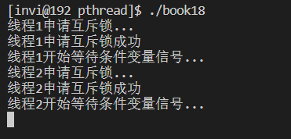
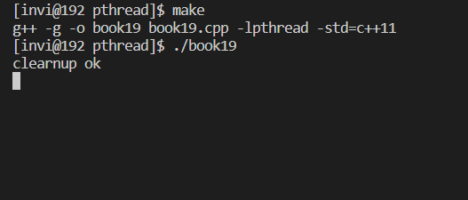

# 生产消费者模型

## 生产消费者模型的基本概念


如图所示，多个生产者生产数据，放在共享的缓存队列中，消费者从缓存队列中获取数据并进行数据处理。图中的生产者和消费者对应了进程或者线程。如果生产者和消费者是不同程序中的进程或者线程，可以用共享内存来做缓存。如果生产者和消费是同一个程序中的多个线程，直接动态的分配一块内存出来就行。

生产者和消费者都要操作共享的缓存队列，肯定会有竞争，所以要给缓存加锁。除此之外，生产者在生成了数据之后，要通知消费者去取走消费数据。

在多线程中，最常见的是用互斥锁+条件变量实现生产消费者模型。互斥锁用于给缓存加锁，条件变量用于通知消费者去取走数据。

也可以用两个信号量去实现生产消费者模型，一个用于共享内存加锁，另一个用于通知消费者

## 互斥锁+条件变量实现生产消费者模型

在讲生产消费者模型之前，先看条件变量的wait函数

```c++
       int pthread_cond_timedwait(pthread_cond_t *restrict cond,
                                  pthread_mutex_t *restrict mutex,
                                  const struct timespec *restrict abstime);
       int pthread_cond_wait(pthread_cond_t *restrict cond,
                             pthread_mutex_t *restrict mutex);

```

wait函数里面做了3件事情

- 把互斥锁进行解锁
- 阻塞，等待条件信号（被唤醒），如果条件信号一直不到达，就一直阻塞卡住等待。
- 如果条件信号出现了，就给互斥锁加锁（条件信号触发，给互斥锁加锁）

首先，我们看这个程序，这个程序创建两个线程，在线程函数首先先去获取锁，然后等待条件变量信号。

```c++
#include <stdio.h>
#include <stdlib.h>
#include <string.h>
#include <unistd.h>
#include <pthread.h>
#include <signal.h>
#include <semaphore.h>

pthread_mutex_t mutex = PTHREAD_MUTEX_INITIALIZER;      // 声明互斥锁并初始化
pthread_cond_t cond = PTHREAD_COND_INITIALIZER;         // 声明条件变量并初始化

void * thmain1(void * arg);         // 线程1入口函数
void * thmain2(void * arg);         // 线程2入口函数

int main(int argc, char* argv[])
{
    pthread_t thid1=0,thid2=0;

    // 创建线程
    if(pthread_create(&thid1, NULL, thmain1, NULL) != 0)
    {
        printf("线程创建失败\n");
    }

    sleep(1);

    if(pthread_create(&thid2, NULL, thmain2, NULL) != 0)
    {
        printf("线程创建失败\n");
    }

    // 等待子线程退出
    pthread_join(thid1, NULL);
    pthread_join(thid2, NULL);


    pthread_mutex_destroy(&mutex);      // 销毁互斥锁
    pthread_cond_destroy(&cond);        // 销毁条件变量

}

void *thmain1(void * arg)
{
    printf("线程1申请互斥锁...\n");
    pthread_mutex_lock(&mutex);
    printf("线程1申请互斥锁成功\n");

    printf("线程1开始等待条件变量信号...\n");
    pthread_cond_wait(&cond, &mutex);               // 等待条件变量信号
    printf("线程1等待条件变量信号成功\n");

    return NULL;
}

void *thmain2(void * arg)
{
    printf("线程2申请互斥锁...\n");
    pthread_mutex_lock(&mutex);
    printf("线程2申请互斥锁成功\n");

    printf("线程2开始等待条件变量信号...\n");
    pthread_cond_wait(&cond, &mutex);               // 等待条件变量信号
    printf("线程2等待条件变量信号成功\n");

    return NULL;
}

```

编译运行，看运行结果。可以看到两个线程都获取到了这个互斥锁，这就说明，首先线程1获取到锁，然后进入条件变量的wait函数，此时wait函数就会把上面获取到的锁给释放掉，这个线程就卡在这里等待，此时，另外一个线程因为上一个线程释放了锁，所以它立马也就获取到了锁，同样的，也进入wait，释放锁并等待



更改线程2的入口函数，让它在启动的时候，发送一个条件信号。

```c++
void *thmain2(void * arg)
{
    pthread_cond_signal(&cond);

    sleep(1);

    printf("线程2申请互斥锁...\n");
    pthread_mutex_lock(&mutex);
    printf("线程2申请互斥锁成功\n");

    printf("线程2开始等待条件变量信号...\n");
    pthread_cond_wait(&cond, &mutex);               // 等待条件变量信号
    printf("线程2等待条件变量信号成功\n");

    return NULL;
}

```

运行结果如下，可以看到，线程1收到了线程2发的条件信号。但是此时，线程2一直在申请=互斥锁，没有申请成功，就是因为线程1在wait接收到条件信号后，将互斥量进行了加锁操作，导致线程2一直获取不到锁。这也验证了wait函数会接收提条件变量信号 + 给互斥锁加锁


### 使用互斥锁+条件变量实现生产消费者模型

```c++
#include <stdio.h>
#include <stdlib.h>
#include <string.h>
#include <unistd.h>
#include <pthread.h>
#include <signal.h>
#include <semaphore.h>
#include <iostream>
#include <vector>

pthread_mutex_t mutex = PTHREAD_MUTEX_INITIALIZER;      // 声明互斥锁并初始化
pthread_cond_t cond = PTHREAD_COND_INITIALIZER;         // 声明条件变量并初始化

struct st_message
{
    int mesgid;         // 消息的ID
    char message[1024]; // 消息的内容
};

std::vector<struct st_message> vcache;      // 用vector容器做缓存

void incache(int sig);          // 生产者（数据入队列）
void *outcache(void* arg);      // 消费者（数据出队列线程主函数）

int main(int argc, char* argv[])
{

    signal(15, incache);        // 接收15信号，调用生产者函数

    // 创建3个消费者线程
    pthread_t thid1,thid2,thid3;
    pthread_create(&thid1, NULL, outcache, NULL);
    pthread_create(&thid2, NULL, outcache, NULL);
    pthread_create(&thid3, NULL, outcache, NULL);

    pthread_join(thid1, NULL);
    pthread_join(thid2, NULL);
    pthread_join(thid3, NULL);

    pthread_mutex_destroy(&mutex);      // 销毁互斥锁
    pthread_cond_destroy(&cond);        // 销毁条件变量

}

void incache(int sig)          // 生产者（数据入队列）
{
    static int mesgid = 1;      // 消息计数器
    struct st_message stmesg;       // 消息内容
    memset(&stmesg, 0, sizeof(struct st_message));

    pthread_mutex_lock(&mutex);         // 给缓存队列加锁

    // 生产数据，放入缓存队列
    stmesg.mesgid = mesgid++;
    vcache.push_back(stmesg);

    pthread_mutex_unlock(&mutex);       // 给缓存队列解锁
    pthread_cond_broadcast(&cond);         // 发送条件信号，激活全部线程
}

void *outcache(void* arg)      // 消费者（数据出队列线程主函数）
{
    struct st_message stmsg;

    while (true)
    {
        pthread_mutex_lock(&mutex);         // 给缓存队列加锁

        // 如果缓存队列为空，等待，用while防止条件变量被虚假唤醒
        while(vcache.size() == 0)
        {
            pthread_cond_wait(&cond, &mutex);
        }

        // 从缓存对垒中获取第一条激励，然后删除该记录
        memcpy(&stmsg, &vcache[0], sizeof(struct st_message));     // 内存拷贝

        vcache.erase(vcache.begin());

        pthread_mutex_unlock(&mutex);           // 给缓存队列解锁

        // 以下是处理业务的代码
        printf("phid = %ld, mesgid = %d\n", pthread_self(), stmsg.mesgid);
        usleep(100);
    }
    
}

```

上面这个程序，我们使用15信号处理函数作为生产者，启用3个线程来做消费者，生产者函数在向程序发送15的信号后，会向缓存队列中加入一个数据，同时通知消费者线程进行处理。运行结果如下


如果我们将生产者函数改为一次生产5条数据，测试如下

```c++
void incache(int sig)          // 生产者（数据入队列）
{
    static int mesgid = 1;      // 消息计数器
    struct st_message stmesg;       // 消息内容
    memset(&stmesg, 0, sizeof(struct st_message));

    pthread_mutex_lock(&mutex);         // 给缓存队列加锁

    // 生产数据，放入缓存队列
    stmesg.mesgid = mesgid++;vcache.push_back(stmesg);
    stmesg.mesgid = mesgid++;vcache.push_back(stmesg);
    stmesg.mesgid = mesgid++;vcache.push_back(stmesg);
    stmesg.mesgid = mesgid++;vcache.push_back(stmesg);
    stmesg.mesgid = mesgid++;vcache.push_back(stmesg);

    pthread_mutex_unlock(&mutex);       // 给缓存队列解锁
    pthread_cond_broadcast(&cond);         // 发送条件信号，激活全部线程
}
```


```c++
void incache(int sig)          // 生产者（数据入队列）
{
    static int mesgid = 1;      // 消息计数器
    struct st_message stmesg;       // 消息内容
    memset(&stmesg, 0, sizeof(struct st_message));

    pthread_mutex_lock(&mutex);         // 给缓存队列加锁

    // 生产数据，放入缓存队列
    stmesg.mesgid = mesgid++;vcache.push_back(stmesg);
    stmesg.mesgid = mesgid++;vcache.push_back(stmesg);
    // stmesg.mesgid = mesgid++;vcache.push_back(stmesg);
    // stmesg.mesgid = mesgid++;vcache.push_back(stmesg);
    // stmesg.mesgid = mesgid++;vcache.push_back(stmesg);

    pthread_mutex_unlock(&mutex);       // 给缓存队列解锁
    pthread_cond_broadcast(&cond);         // 发送条件信号，激活全部线程
}

void *outcache(void* arg)      // 消费者（数据出队列线程主函数）
{
    struct st_message stmsg;

    while (true)
    {
        pthread_mutex_lock(&mutex);         // 给缓存队列加锁

        // 如果缓存队列为空，等待，用while防止条件变量被虚假唤醒
        // while(vcache.size() == 0)
        if(vcache.size() == 0)
        {
            pthread_cond_wait(&cond, &mutex);
        }

        // 从缓存对垒中获取第一条激励，然后删除该记录
        memcpy(&stmsg, &vcache[0], sizeof(struct st_message));     // 内存拷贝

        vcache.erase(vcache.begin());

        pthread_mutex_unlock(&mutex);           // 给缓存队列解锁

        // 以下是处理业务的代码
        printf("phid = %ld, mesgid = %d\n", pthread_self(), stmsg.mesgid);
        usleep(100);
    }
    
}
```

如果我们将上面的消费函数里的while判断改为if判断，同时使用广播的方式唤醒全部线程去通知消费者，然后每次生产者生产的数据少于消费者数量的时候，运行程序。就会发现爆如下错误（段错误）


这是因为程序启动之后，3个消费者线程都阻塞在 if 语句这里，等待条件变量。等到生产者通知信号到达后，将这3个线程全部唤醒，此时，缓存中只有2条数据，那么第三个线程就取不到数据，执行 `memcpy(&stmsg, &vcache[0], sizeof(struct st_message));     // 内存拷贝`的时候就会出错，所以出现了非法操作内存的问题。

解决这个问题的方法很简单，将if改为while就可以。

所以，注意这里，条件变量被唤醒时，缓存中不一定有数据。这个while循环的逻辑是，如果条件变量被唤醒，唤醒后将持有锁，立即判断缓存中是否有数据，如果没有数据，继续wait，最终会释放锁，不影响其他消费者和生产者

```c++
// if(vcache.size() == 0)
        // 如果缓存队列为空，等待，用while防止条件变量被虚假唤醒
        while(vcache.size() == 0)
        {
            pthread_cond_wait(&cond, &mutex);
        }

```

关于多线程还有一个细节。我改造上面的代码，让线程在创建之后，主线程中sleep 5秒，然后将所有线程移除，也就是说所有的子线程在创建之后，会阻塞在wait这里，然后5s之后，主线程将所有线程取消掉，然后执行我们的线程清理函数。

```c++
#include <stdio.h>
#include <stdlib.h>
#include <string.h>
#include <unistd.h>
#include <pthread.h>
#include <signal.h>
#include <semaphore.h>
#include <iostream>
#include <vector>

pthread_mutex_t mutex = PTHREAD_MUTEX_INITIALIZER;      // 声明互斥锁并初始化
pthread_cond_t cond = PTHREAD_COND_INITIALIZER;         // 声明条件变量并初始化

struct st_message
{
    int mesgid;         // 消息的ID
    char message[1024]; // 消息的内容
};

std::vector<struct st_message> vcache;      // 用vector容器做缓存

void incache(int sig);          // 生产者（数据入队列）
void *outcache(void* arg);      // 消费者（数据出队列线程主函数）

// 线程清理函数
void thcleanup(void* arg);

int main(int argc, char* argv[])
{

    signal(15, incache);        // 接收15信号，调用生产者函数

    // 创建3个消费者线程
    pthread_t thid1,thid2,thid3;
    pthread_create(&thid1, NULL, outcache, NULL);
    pthread_create(&thid2, NULL, outcache, NULL);
    pthread_create(&thid3, NULL, outcache, NULL);

    sleep(5);
    pthread_cancel(thid1);
    pthread_cancel(thid2);
    pthread_cancel(thid3);

    pthread_join(thid1, NULL);
    pthread_join(thid2, NULL);
    pthread_join(thid3, NULL);

    pthread_mutex_destroy(&mutex);      // 销毁互斥锁
    pthread_cond_destroy(&cond);        // 销毁条件变量

}

void incache(int sig)          // 生产者（数据入队列）
{
    static int mesgid = 1;      // 消息计数器
    struct st_message stmesg;       // 消息内容
    memset(&stmesg, 0, sizeof(struct st_message));

    pthread_mutex_lock(&mutex);         // 给缓存队列加锁

    // 生产数据，放入缓存队列
    stmesg.mesgid = mesgid++;vcache.push_back(stmesg);
    stmesg.mesgid = mesgid++;vcache.push_back(stmesg);
    // stmesg.mesgid = mesgid++;vcache.push_back(stmesg);
    // stmesg.mesgid = mesgid++;vcache.push_back(stmesg);
    // stmesg.mesgid = mesgid++;vcache.push_back(stmesg);

    pthread_mutex_unlock(&mutex);       // 给缓存队列解锁
    pthread_cond_broadcast(&cond);         // 发送条件信号，激活全部线程
}

void *outcache(void* arg)      // 消费者（数据出队列线程主函数）
{
    // 将线程清理函数入栈
    pthread_cleanup_push(thcleanup, NULL);

    struct st_message stmsg;

    while (true)
    {
        pthread_mutex_lock(&mutex);         // 给缓存队列加锁

        // if(vcache.size() == 0)
        // 如果缓存队列为空，等待，用while防止条件变量被虚假唤醒
        while(vcache.size() == 0)
        {
            pthread_cond_wait(&cond, &mutex);
        }

        // 从缓存对垒中获取第一条激励，然后删除该记录
        memcpy(&stmsg, &vcache[0], sizeof(struct st_message));     // 内存拷贝

        vcache.erase(vcache.begin());

        pthread_mutex_unlock(&mutex);           // 给缓存队列解锁

        // 以下是处理业务的代码
        printf("phid = %ld, mesgid = %d\n", pthread_self(), stmsg.mesgid);
        usleep(100);
    }
    
    // 将线程清理函数出栈并执行
    pthread_cleanup_pop(1);
}

// 线程清理函数
void thcleanup(void* arg)
{
    // 在这里释放线程资源，关于文件，断开网络连接，回滚数据库事务，释放锁等
    printf("clearnup ok\n");

    return;
}

```

编译运行，看看取消的结果是这样的，线程清理函数只执行了一次，然后程序就被挂在这里不动。



查看这个进程的的线程的LWP，可以看到此时还有两个子线程没有被取消。


但是我们的程序一共创建了3个子线程，退出了一个，还剩下两个，这两个线程没有被 `pthread_cancel`取消。

如果希望全部的线程被取消，需要在线程清理函数中释放互斥锁。

```c++
// 线程清理函数
void thcleanup(void* arg)
{
    // 在这里释放线程资源，关于文件，断开网络连接，回滚数据库事务，释放锁等
    printf("clearnup ok\n");

    // 释放互斥锁
    pthread_mutex_unlock(&mutex);

    return;
}

```


**线程退出后，为什么要在清理函数中释放互斥锁？**

在我们这个生产消费者模型中，在 `pthread_cond_wait()`时执行 `pthread_cancel`后，需要在线程清理函数中要先解锁（释放）与相应条件变量绑定的互斥锁（mutex)，这样是为了保证 `pthread_cond_wait`可以返回到调用线程，否则线程将无法正常退出。

## 信号量实现生产消费者模型
