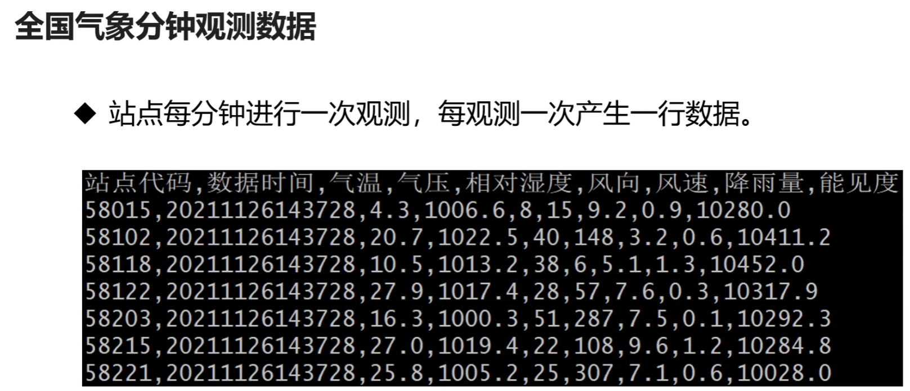

## 本项目主要使用两种数据

- 全国气象站点数据


- 全国气象站点分钟观测数据（程序模拟数据，真实的气象数据字段很多）



## 生成测试数据

- 根据全国气象站点参数，模拟生成观测数据
- 程序每运行一次，生成839行数据，存放在一个文本文件中

如图例所示，生成的文件名，这里定义的命名规则是【数据类型】+ 【文件生成时间戳】+ 【顺序号】


## 开发思路

1. 搭建程序框架（运行的参数，说明文档，运行日志）
2. 把全国气象站点参数文件加载到站点参数的容器中
3. 遍历站点参数容器，生成每个站点的观测数据，存放在观测长点测试数据容器中
4. 把站点观测数据容器中的记录写入到文件中


注意：普通用户在执行编译好的可执行程序的时候，因为没有日志文件的操作权限，所以需要事先给该普通用户赋予权限

```shell
root@inviubuntu:/# chown -R invi:invi /log
```

