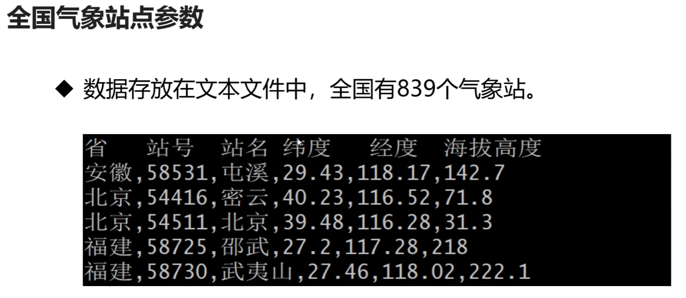
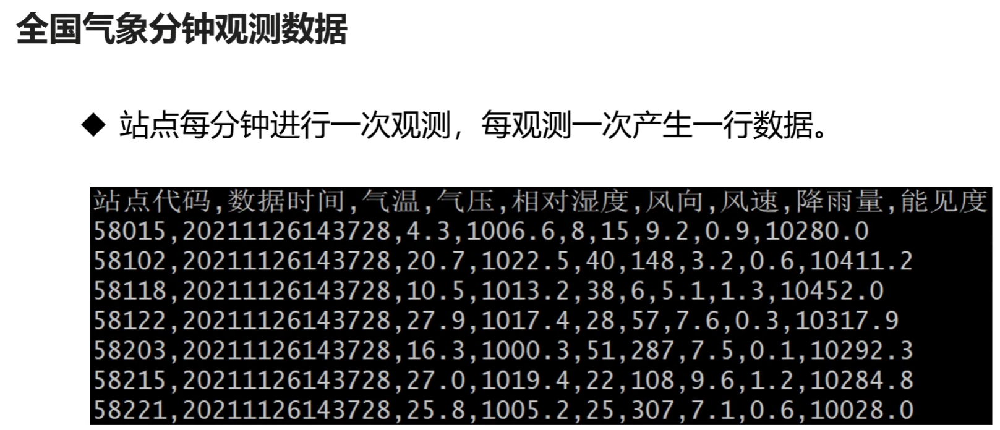
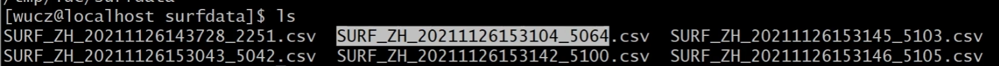
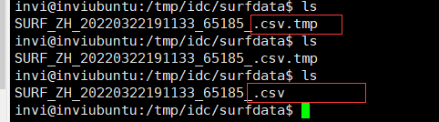
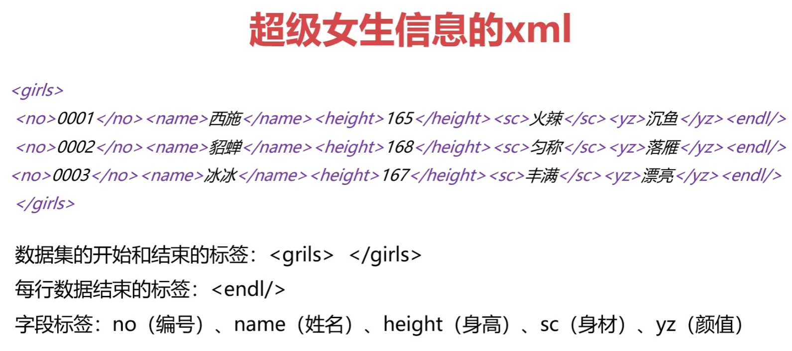

## 本项目主要使用两种数据

- 全国气象站点数据



- 全国气象站点分钟观测数据（程序模拟数据，真实的气象数据字段很多）



## 生成测试数据

- 根据全国气象站点参数，模拟生成观测数据
- 程序每运行一次，生成839行数据，存放在一个文本文件中

如图例所示，生成的文件名，这里定义的命名规则是【数据类型】+ 【文件生成时间戳】+ 【顺序号】



## 开发思路

1. 搭建程序框架（运行的参数，说明文档，运行日志）
2. 把全国气象站点参数文件加载到站点参数的容器中
3. 遍历站点参数容器，生成每个站点的观测数据，存放在观测长点测试数据容器中
4. 把站点观测数据容器中的记录写入到文件中


注意：普通用户在执行编译好的可执行程序的时候，因为没有日志文件的操作权限，所以需要事先给该普通用户赋予权限

```shell
root@inviubuntu:/# chown -R invi:invi /log
```


## 把全国气象站点的参数文件加载到站点参数的容器中

从站点参数文件中读取一行，如果已经读取完毕，跳出循环

把读取到的每一行进行拆分

把站点参数的每一个数据项保存到站点参数结构体中

把站点参数结构体放入站点参数容器中

## 遍历站点参数容器，生成每个站点的观测数据，存放在站点观测数据容器中

 生成随机数种子

获取当前时间，作为观测时间

 遍历站点参数容器vscode

用随机数填充分钟观测数据的结构体

把观测数据的结构体放入vsurfdata容器中

### gdb 调试查看程序代码运行情况

这里使用 `gdb 调试程序`，然后 `b 断点行数`设置断点停留在程序的哪一行

```shell
invi@inviubuntu:/project/idc1/c$ gdb crtsurfdata 
GNU gdb (Ubuntu 10.1-2ubuntu2) 10.1.90.20210411-git
Copyright (C) 2021 Free Software Foundation, Inc.
License GPLv3+: GNU GPL version 3 or later <http://gnu.org/licenses/gpl.html>
This is free software: you are free to change and redistribute it.
There is NO WARRANTY, to the extent permitted by law.
Type "show copying" and "show warranty" for details.
This GDB was configured as "x86_64-linux-gnu".
Type "show configuration" for configuration details.
For bug reporting instructions, please see:
<https://www.gnu.org/software/gdb/bugs/>.
Find the GDB manual and other documentation resources online at:
    <http://www.gnu.org/software/gdb/documentation/>.

For help, type "help".
Type "apropos word" to search for commands related to "word"...
Reading symbols from crtsurfdata...
(gdb) b 204
Breakpoint 1 at 0x4481: file crtsurfdata.cpp, line 204.
```

然后使用 `set args /project/idc1/ini/stcode.ini /tmp/surfata /log/idc/crtsurfdata.log`来设置程序的运行参数

```shell
(gdb) set args /project/idc1/ini/stcode.ini /tmp/surfata /log/idc/crtsurfdata.log
```

然后运行程序 `run`，发现程序运行到我们设置的断点行204就卡住

```shell
(gdb) run
Starting program: /project/idc1/c/crtsurfdata /project/idc1/ini/stcode.ini /tmp/surfata /log/idc/crtsurfdata.log

Breakpoint 1, CrtSurfData () at crtsurfdata.cpp:202
204       printf("gdb debug\n");
```

这个时候我们可以打印查看我们的气象数据 `p 变量名 或者 表达式` ，这样就通过gdb调试功能，验证查看了我们程序代码的正确性，查看变量 vsurfdata 的大小

```shel
(gdb) p vsurfdata.size()
$1 = 839
```

打印输出变量 vsurfdata 的值,可以看到，程序运行之后，模拟气象数据的值都成功生成了，说明我们的程序没问题。

```shell
(gdb) p vsurfdata
$2 = std::vector of length 839, capacity 1024 = {{obtid = "58015\000\000\000\000\000", ddatetime = "20220322173819\000\000\000\000\000\000", 
    t = 214, p = 10203, u = 75, wd = 340, wf = 93, r = 2, vis = 101735}, {obtid = "58102\000\000\000\000\000", 
    ddatetime = "20220322173819\000\000\000\000\000\000", t = 149, p = 10026, u = 76, wd = 96, wf = 116, r = 6, vis = 100887}, {
    obtid = "58118\000\000\000\000\000", ddatetime = "20220322173819\000\000\000\000\000\000", t = 240, p = 10098, u = 45, wd = 209, 
    wf = 98, r = 9, vis = 102091}, {obtid = "58122\000\000\000\000\000", ddatetime = "20220322173819\000\000\000\000\000\000", t = 115, 
    p = 10085, u = 89, wd = 284, wf = 121, r = 2, vis = 104398}, {obtid = "58203\000\000\000\000\000", 
    ddatetime = "20220322173819\000\000\000\000\000\000", t = 329, p = 10191, u = 60, wd = 244, wf = 94, r = 6, vis = 102952}, {
    obtid = "58215\000\000\000\000\000", ddatetime = "20220322173819\000\000\000\000\000\000", t = 55, p = 10203, u = 54, wd = 346, 
    wf = 141, r = 0, vis = 102076}, {obtid = "58221\000\000\000\000\000", ddatetime = "20220322173819\000\000\000\000\000\000", t = 83, 
    p = 10220, u = 75, wd = 278, wf = 78, r = 2, vis = 104263}, {obtid = "58225\000\000\000\000\000", 
    ddatetime = "20220322173819\000\000\000\000\000\000", t = 65, p = 10102, u = 50, wd = 187, wf = 73, r = 13, vis = 100916}, {
    obtid = "58236\000\000\000\000\000", ddatetime = "20220322173819\000\000\000\000\000\000", t = 101, p = 10071, u = 20, wd = 214, 
    wf = 43, r = 7, vis = 100887}, {obtid = "58311\000\000\000\000\000", ddatetime = "20220322173819\000\000\000\000\000\000", t = 252, 
    p = 10064, u = 16, wd = 189, wf = 47, r = 9, vis = 104213}, {obtid = "58314\000\000\000\000\000", 
    ddatetime = "20220322173819\000\000\000\000\000\000", t = 252, p = 10074, u = 43, wd = 228, wf = 74, r = 13, vis = 100168}, {
    obtid = "58319\000\000\000\000\000", ddatetime = "20220322173819\000\000\000\000\000\000", t = 192, p = 10002, u = 39, wd = 230, 
    wf = 37, r = 7, vis = 103607}, {obtid = "58321\000\000\000\000\000", ddatetime = "20220322173819\000\000\000\000\000\000", t = 314, 
    p = 10249, u = 53, wd = 206, wf = 140, r = 12, vis = 101393}, {obtid = "58326\000\000\000\000\000", 
    ddatetime = "20220322173819\000\000\000\000\000\000", t = 276, p = 10052, u = 43, wd = 313, wf = 76, r = 2, vis = 104946}, {
    obtid = "58336\000\000\000\000\000", ddatetime = "20220322173819\000\000\000\000\000\000", t = 148, p = 10229, u = 42, wd = 265, 
    wf = 80, r = 0, vis = 101294}, {obtid = "58338\000\000\000\000\000", ddatetime = "20220322173819\000\000\000\000\000\000", t = 48, 
    p = 10095, u = 25, wd = 141, wf = 44, r = 2, vis = 104810}, {obtid = "58414\000\000\000\000\000", 
    ddatetime = "20220322173819\000\000\000\000\000\000", t = 60, p = 10199, u = 74, wd = 311, wf = 133, r = 6, vis = 102051}, {
    obtid = "58419\000\000\000\000\000", ddatetime = "20220322173819\000\000\000\000\000\000", t = 93, p = 10120, u = 22, wd = 179, wf = 9, 
    r = 8, vis = 104921}, {obtid = "58424\000\000\000\000\000", ddatetime = "20220322173819\000\000\000\000\000\000", t = 271, p = 10132, 
    u = 39, wd = 50, wf = 51, r = 7, vis = 100265}, {obtid = "58429\000\000\000\000\000", 
    ddatetime = "20220322173819\000\000\000\000\000\000", t = 186, p = 10110, u = 42, wd = 270, wf = 120, r = 1, vis = 102797}, {
    obtid = "58436\000\000\000\000\000", ddatetime = "20220322173819\000\000\000\000\000\000", t = 244, p = 10199, u = 97, wd = 88, 
    wf = 135, r = 5, vis = 100959}, {obtid = "58437\000\000\000\000\000", ddatetime = "20220322173819\000\000\000\000\000\000", t = 218, 
    p = 10037, u = 42, wd = 24, wf = 99, r = 15, vis = 103204}, {obtid = "58520\000\000\000\000\000", 
--Type <RET> for more, q to quit, c to continue without paging--
```


## 把站点观测数据容器中的内容写入文件，数据格式支持csv，xml 和 json

### CSV （逗号分隔值文件格式）

逗号分隔值（Comma-Separated Values，CSV，有时也称为字符分隔值，因为分隔字符也可以不是逗号），其文件以纯文本形式存储表格数据（数字和文本）。纯文本意味着该文件是一个字符序列，不含必须像二进制数字那样被解读的数据。CSV文件由任意数目的记录组成，记录间以某种换行符分隔；每条记录由字段组成，字段间的分隔符是其它字符或字符串，最常见的是逗号或制表符。通常，所有记录都有完全相同的字段序列。通常都是纯文本文件。建议使用WORDPAD或是记事本来开启，再则先另存新档后用EXCEL开启，也是方法之一。

CSV文件格式的通用标准并不存在，但是在RFC 4180中有基础性的描述。使用的字符编码同样没有被指定，但是bitASCII是最基本的通用编码。

CSV是一种通用的、相对简单的文件格式，被用户、商业和科学广泛应用。最广泛的应用是在程序之间转移表格数据，而这些程序本身是在不兼容的格式上进行操作的（往往是私有

### 有漏洞的文件写入方法

1. 创建文件
2. 往文件中写入数据
3. 关闭文件

试想这种写数据到文件中的方法，如果再写入数据的过程中，有其他的程序读取了该文件，就会读取到不完整的内容，如果用加锁机制来解决，那么程序代码的可维护性和复杂度又会很高。

### 正确的文件写入方法

1. 创建临时文件
2. 往临时文件中写入数据
3. 关闭临时文件
4. 把临时文件改名成正式的文件

通过这种文件写入方法，就可以避免文件在写入过程中被读取的问题。

在我们的代码中可以让该功能函数sleep一段时间，然后看这期间生成的文件。

如下所示，是在文件写入期间，生成的临时文件（.tmp)，然后再sleep结束之后，将临时文件改名成正式的这个文件名



xml

**XML 指可扩展标记语言**

**XML 被设计用来传输和存储数据。**



## 生成测试数据程序代码

```c++
/*
 *  程序名：crtsurfdata.cpp  本程序用于生成全国气象站点观测的分钟数据。
 *  author：invi
*/

#include "_public.h"

// class CLogFile;
// class CCmdStr;
// class CFile;

// 日志类一般会将其定义为全局的变量
CLogFile logfile;

// 气象站点参数数据eg（结构体）
// 省   站号  站名 纬度   经度  海拔高度
// 安徽,58015,砀山,34.27,116.2,44.2
struct st_stcode
{
  char provname[31];      // 省代码（省名）
  char obtid[11];         // 站号
  char obtname[31];       // 站名
  double lat;             // 纬度
  double lon;             // 经度
  double height;          // 海拔高度
};

// 定义一个存放站点参数的容器
vector<struct st_stcode> vstcode;

// 把气象站点参数加载到参数容器中的函数
bool LoadSTCode(const char * inifile);

char strddatatime[21];    // 观测数据时间

// 全国气象站点分钟观测数据结构
struct st_surfdata
{
  char obtid[11];      // 站点代码。
  char ddatetime[21];  // 数据时间：格式yyyymmddhh24miss
  int  t;              // 气温：单位，0.1摄氏度。
  int  p;              // 气压：0.1百帕。
  int  u;              // 相对湿度，0-100之间的值。
  int  wd;             // 风向，0-360之间的值。
  int  wf;             // 风速：单位0.1m/s
  int  r;              // 降雨量：0.1mm。
  int  vis;            // 能见度：0.1米。
};

// 然后声明一个用于存放观测数据的容器(存放全国气象站点分钟观测数据的容器)
vector<struct st_surfdata> vsurfdata;

// 生成气象观测数据的函数
// 这个函数是根据一个容器再加上一个随机数生成另外一个容器，这种函数的运行不会失败，所以不需要返回值
void CrtSurfData();

// 生成数据文件
bool CrtSurfFile(const char* outpath, const char* datafmt);

// ///////////////////////////////////////////////////////////////////////////////////////////////////////////////////////////////

int main(int argc, char *argv[])
{

  // 全国气象站点参数文件 inifile
  // 生成的测试气象数据存放的目录 outpath
  // 存放的日志 logfile
  // 指定生成的数据保存为什么格式 datafmt


  // 所以这个程序有4个参数，那么argc的值应该为5
  if(argc!=5)
  {
    // 不等于4表示程序运行的方法不正确(这里打印提示改程序需要这3个参数)
    printf("Using:./crtsurfdata inifile outpath logfile datafmt\n");

    // 只提示正确方法还不够，这里给一个例子说明
    printf("Example:/project/idc1/bin/crtsurfdata /project/idc1/ini/stcode.ini /tmp/surfdata /log/idc/crtsurfdata.log xml,json,csv\n\n");

    // 然后对这些参数做一个详细的打印说明
    printf("全国气象站点参数文件 : inifile \n");
    printf("生成的测试气象数据存放的目录 : outpath\n");
    printf("日志存放路径 : logfile\n");
    printf("指定生成的数据保存为什么格式 : datafmt\n\n");

    // 程序退出
    return -1;
  }

  // 打开日志
  if(logfile.Open(argv[3]) == false)
  {
    // 日志文件打开失败
    printf("logfile.Open(%s) faild.\n", argv[3]);
    // 程序退出
    return -1;
  }

  // 往日志中写入内容
  logfile.Write("crtsurfdata 开始运行。\n");

  // 业务代码
  // 把气象站点参数加载到参数容器中的函数
  if(LoadSTCode(argv[1]) == false)
  {
    return -1;
  }

  // 模拟生成全国气象站点分钟观测数据，存放在vsurfdata容器中。
  CrtSurfData();

  // 将生成的测试数据格式化为指定格式的数据文件
  if(strstr(argv[4], "xml") != 0) CrtSurfFile(argv[2], "xml");      // xml
  if(strstr(argv[4], "json") != 0) CrtSurfFile(argv[2], "json");    // json
  if(strstr(argv[4], "csv") != 0) CrtSurfFile(argv[2], "csv");      // csv

  logfile.Write("crtsurfdata 运行结束。\n");

  return 0;
}

// /////////////////////////////////////////////////////////////////////////////////////////////////////////////////////////////////

// 把气象站点参数加载到参数容器中的函数
bool LoadSTCode(const char * inifile)
{
  CFile File;
  // 打开站点参数文件(用只读的方式打开文件)
  if(File.Open(inifile, "r") == false)
  {
    // 文件打开失败，写日志，函数返回
    logfile.Write("File.Open(%s) faild.\n", inifile);
    return false;
  }

  // 定义一个buffer，用于存放从文件中读取到的每一行数据
  char strBuffer[301];

  // 用于字符串拆分的类
  CCmdStr CmdStr;

  // 定义用于保存拆分后的结构体
  struct st_stcode stcode;

  while(true)
  {
    // 从站点参数文件中读取一行，如果已经读取完毕，跳出循环
    // 字符串变量在每一次使用之前，最好进行初始化，但是我们的fgets这个成员函数中，有对buffer的初始化，所以这里可以不写初始化代码
    // memset(strBuffer, 0, sizeof(strBuffer));
    if(File.Fgets(strBuffer, 300, true) == false)
    {
      break;
    }

    // 把读取到的每一行进行拆分, 拆分出来的数据保存到strBuffer中，按","进行拆分，然后删除拆分出来的字符串的前后的空格
    CmdStr.SplitToCmd(strBuffer, ",", true);

    // 这行代码主要是为了处理站点数据文件中第一行的无效数据（因为这行数据没有用","分割，所以拆分结果是1，就不会是6，所以这行拆分数据就给忽略就好
    if(CmdStr.CmdCount() != 6) continue;

    // 把站点参数的每一个数据项保存到站点参数结构体中
    CmdStr.GetValue(0, stcode.provname, 30);    // 省代码（省名
    CmdStr.GetValue(1, stcode.obtid, 10);       // 站号
    CmdStr.GetValue(2, stcode.obtname, 30);     // 站名
    CmdStr.GetValue(3, &stcode.lat);            // 纬度
    CmdStr.GetValue(4, &stcode.lon);            // 经度
    CmdStr.GetValue(5, &stcode.height);         // 海拔高度

    // 把站点参数结构体放入站点参数容器中
    vstcode.push_back(stcode);

  }

  // 关闭文件(这里不用关闭，在CFile类的析构函数中有文件关闭代码，因为是栈上定义的变量，所以超出作用域会自动释放)

  return true;
}

// 生成气象观测数据的函数,将生成的测试数据存放在 vsurfdata容器中
// 这个函数是根据一个容器再加上一个随机数生成另外一个容器，这种函数的运行不会失败，所以不需要返回值
void CrtSurfData()
{
  // 生成随机数种子
  srand(time(0));

  // 获取当前时间，作为观测时间
  memset(strddatatime, 0, sizeof(strddatatime));
  LocalTime(strddatatime, "yyyymmddhh24miss");

  struct st_surfdata stsurfdata;

  // 遍历站点参数容器vscode
  for(auto iter = vstcode.begin(); iter != vstcode.end(); ++iter)
  {
    // 初始化结构体
    memset(&stsurfdata, 0, sizeof(st_surfdata));
    // 用随机数填充分钟观测数据的结构体
    strncpy(stsurfdata.obtid, (*iter).obtid, 10);        // 站点代码
    strncpy(stsurfdata.ddatetime, strddatatime, 14);    // 数据时间，格式yyyymmddhh24miss
    stsurfdata.t=rand()%351;       // 气温：单位，0.1摄氏度
    stsurfdata.p=rand()%265+10000; // 气压：0.1百帕
    stsurfdata.u=rand()%100+1;     // 相对湿度，0-100之间的值。
    stsurfdata.wd=rand()%360;      // 风向，0-360之间的值。
    stsurfdata.wf=rand()%150;      // 风速：单位0.1m/s
    stsurfdata.r=rand()%16;        // 降雨量：0.1mm
    stsurfdata.vis=rand()%5001+100000;  // 能见度：0.1米

    // 把观测数据的结构体放入vsurfdata容器中
    vsurfdata.push_back(stsurfdata);

  }
}

// 生成数据文件 把容器vsurfdata中的全国气象站点的分钟观测数据写入文件
bool CrtSurfFile(const char* outpath, const char* datafmt)
{
  CFile File;
  // 拼接生成数据的文件名 例如：/tmp/surfdata/SURF_ZH_20220322180345_2243.CSV
  char strFileName[301];

  // 文件名采用全路径，文件目录_数据生成时间_进程id.文件类型（注意，文件名拼接上进程id是常用的命名手法，目的是为了保证生成的文件名不重复，当然不加这个也是可以的）
  sprintf(strFileName, "%s/SURF_ZH_%s_%d.%s", outpath, strddatatime, getpid(), datafmt);

  // 打开文件, 以写入的方式打开文件
  if(File.OpenForRename(strFileName, "w") == false)
  {
    // 失败的话，打印日志做一个提示
    // 失败的原因一般都是磁盘空间不足或者权限不足
    logfile.Write("File.OpenForRename(%s) faild.\n", strFileName);
    return false;
  }

  // 写入第一行标题（标题是为了增加该数据文件的可读性，不然你这个数据文件各个字段表示什么意思别人不清楚）
  // 注意，只有数据格式为csv的时候才需要写入标题
  if(strcmp(datafmt, "csv") == 0)
  {
    File.Fprintf("站点代码,数据时间,气温,气压,相对湿度,风向,风速,降雨量,能见度\n");
  }

  // xml数据集开始标签
  if(strcmp(datafmt, "xml") == 0)
  {
    File.Fprintf("<data>\n");
  }

  // Json格式
  if(strcmp(datafmt, "json") == 0)
  {
    File.Fprintf("{\"data\":[\n");
  }

  // 遍历存放观测数据的vsurfdata容器
  for(auto iter = vsurfdata.begin(); iter != vsurfdata.end(); ++iter)
  {

    // 写入一条记录
    if(strcmp(datafmt, "csv") == 0)
    {
      // 这里最后面这3个字段要除以10.0，表示是一个浮点数的运算
      File.Fprintf("%s,%s,%.1f,%.1f,%d,%d,%.1f,%.1f,%.1f\n",\
        (*iter).obtid,(*iter).ddatetime,(*iter).t/10.0,(*iter).p/10.0,\
        (*iter).u,(*iter).wd,(*iter).wf/10.0,(*iter).r/10.0,(*iter).vis/10.0);
    }

    if(strcmp(datafmt, "xml") == 0)
    {
      // 这里最后面这3个字段要除以10.0，表示是一个浮点数的运算
      File.Fprintf("<obtid>%s</obtid><ddatetime>%s</ddatetime><t>%.1f</t><p>%.1f</p>"\
                   "<u>%d</u><wd>%d</wd><wf>%.1f</wf><r>%.1f</r><vis>%.1f</vis><endl/>\n",\
                    (*iter).obtid,(*iter).ddatetime,(*iter).t/10.0,(*iter).p/10.0,\
                    (*iter).u,(*iter).wd,(*iter).wf/10.0,(*iter).r/10.0,(*iter).vis/10.0);
    }

    // 写入一条记录
    if(strcmp(datafmt, "json") == 0)
    {
      // 这里最后面这3个字段要除以10.0，表示是一个浮点数的运算
      File.Fprintf("{\"obtid\":\"%s\",\"ddatetime\":\"%s\",\"t\":\"%.1f\",\"p\":\"%.1f\","\
                   "\"u\":\"%d\",\"wd\":\"%d\",\"wf\":\"%.1f\",\"r\":\"%.1f\",\"vis\":\"%.1f\"}",\
                    (*iter).obtid,(*iter).ddatetime,(*iter).t/10.0,(*iter).p/10.0,\
                    (*iter).u,(*iter).wd,(*iter).wf/10.0,(*iter).r/10.0,(*iter).vis/10.0);
      if(iter != vsurfdata.end() - 1)
      {
        // 如果是最后一行，json数据里就不需要加","
        File.Fprintf(",\n");
      }
      else
      {
        File.Fprintf("\n");
      }
    }

  }

  // xml 数据集结束标签
  if(strcmp(datafmt, "xml") == 0)
  {
    File.Fprintf("</data>\n");
  }

  // json 数据集结束标签
  if(strcmp(datafmt, "json") == 0)
  {
    File.Fprintf("]}\n");
  }

  // 关闭文件
  File. CloseAndRename();

  // 写日志提示生成文件成功
  logfile.Write("生成数据文件%s成功， 数据生成时间%s, 记录条数%d.\n", strFileName, strddatatime, vsurfdata.size());

  return true;
}

```

