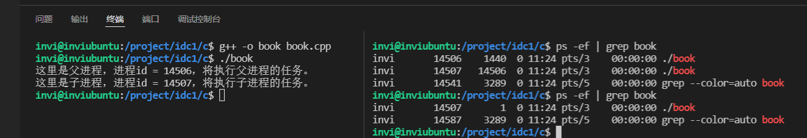
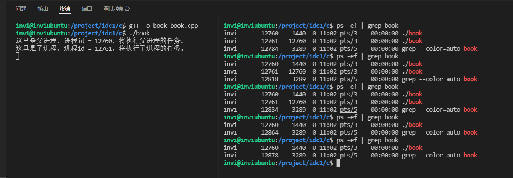
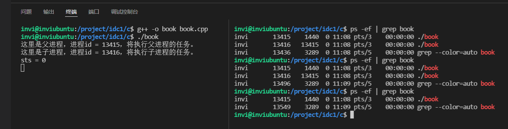
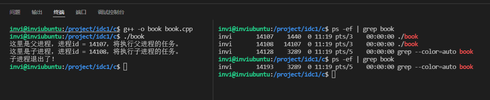
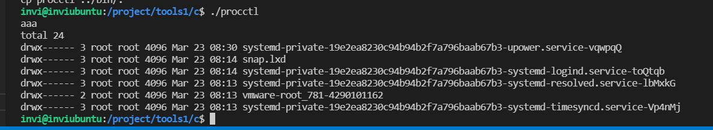
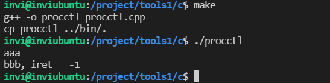
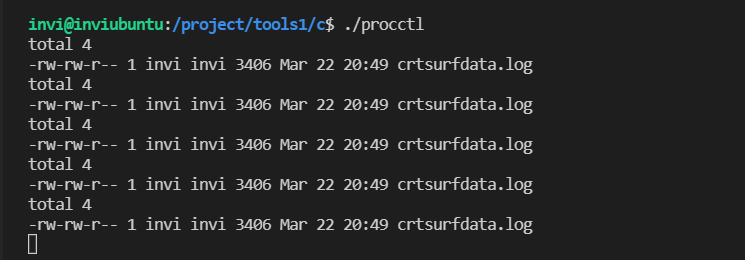
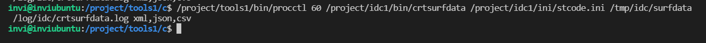
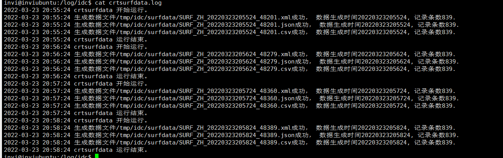

# 服务程序的调度

## linux信号的基础知识和使用方法

```c++
#include <stdio.h>
#include <stdlib.h>
#include <string.h>
#include <unistd.h>
#include <signal.h>

// 信号处理函数
void handler(int sig)
{
    printf("接收到信号：%d\n", sig);
}

// 时钟信号处理函数
void alarmfunc(int num)
{
    printf("接收到了%d时钟信号 \n", num);
    alarm(3);       // 在处理函数中新增这样一行代码，就可以实现没3s闹钟触发一次，而不是之前的只闹一次
}

int main()
{
    for(int i = 1; i < 64; i++)
    {
        signal(i, handler);     // 捕获全部的64个信号量，并使用handler函数进行处理
    }

    signal(15, SIG_IGN);    // 将15这个信号设置为忽略

    signal(15, SIG_DFL);    // 将15这个信号量设置为系统缺省动作

    signal(SIGALRM, alarmfunc);     // 捕获时钟信号，并用时钟信号处理函数进行处理

    alarm(3);   // 设置一个闹钟（3s后触发闹钟），本闹钟是一次性闹钟

    while(1)
    {
        printf("执行了一次任务 \n");
        sleep(1);
    }
}
```

闹钟信号处理函数中不添加 `alarm(3);`时，闹钟只响一次


闹钟信号处理函数中添加 `alarm(3);`后，闹钟没3s就会发送一次闹钟信号。


```c++
#include <stdio.h>
#include <stdlib.h>
#include <string.h>
#include <unistd.h>
#include <signal.h>

// 信号处理函数
void EXIT(int sig)
{
    printf("接收到信号：%d, 程序即将退出\n", sig);

    // 程序退出善后代码
    exit(0);
}

// 时钟信号处理函数
void alarmfunc(int num)
{
    printf("接收到了%d时钟信号 \n", num);
    alarm(3);       // 在处理函数中新增这样一行代码，就可以实现没3s闹钟触发一次，而不是之前的只闹一次
}

int main()
{
    for(int i = 1; i < 64; i++)
    {
        signal(i, SIG_IGN);     // 捕获全部的64个信号量，并将这些进行忽略
    }

    // 设置信号 2 和 信号15 的处理函数,该处理函数命名为EXIT
    signal(SIGINT, EXIT);
    signal(SIGTERM, EXIT);

    while(1)
    {
        printf("执行了一次任务 \n");
        sleep(1);
    }
}
```


## linux多进程的基础知识和使用方法

### linux的 0 ， 1 ，2 号进程

- idle进程（0号进程）：是lunux系统创建的第一个进程，系统启动的时候加载系统，加载完成之后演变成1 号 和 2号 进程。
- systemd进程（1号进程）：负责系统初始化，启动系统服务，例如网络服务，ftp服务，防火墙，ssh服务，是所有其他用户进程的祖先，在有些linux版本中，也叫他init进程
- kthreadd进程（2号进程）：这个进程始终运行在内核，负责所有内核线程的调度和管理

### 进程标识

- 每个进程都有一个非负整数表示的唯一进程ID，在同一时刻绝对不会存在ID相同的多个进程

- 查看进程：`ps -ef|grep 进程名` 可以查看进程的详细信息

  > 进程的详细信息：
  >
  > 第一列：表示启动该进程的操作系统用户（UID）
  >
  > 第二列：进程编号（PID)
  >
  > 第三列：该进程的父进程编号 （PPID）
  >
  > 第四列：CPU占用率（C）
  >
  > 第五列：进程的开始时间（STIME）
  >
  > 第六列：启动进程的终端设备号（TTY）
  >
  > 第七列：该进程运行的总时间（TIME）
  >
  > 第八列：启动这个进程的时候执行的命令，包括他的参数（CMD）
  >
  > 

- getpid(void) 获取进程ID
- getppid(void) 获取当前进程的父进程ID

### fork函数

- 一个现有的进程调用函数fork可以创建一个新的进程，创建出来的新的进程叫做子进程，原来这个进程叫做父进程。
- 调用fork函数之后，子进程和父进程会继续执行fork函数之后的代码
- fork函数调用一次，返回两次。子进程返回0，父进程返回子进程的进程ID
- 子进程是父进程的副本
- 子进程获得了父进程的数据空间，堆和栈的副本，不是共享
- fork函数如果返回-1，表示创建子进程失败，一般这种情况都是进程太多，内存不足，资源不足
- 父进程中打开的文件描述符也会被复制到子进程中
- 如果父进程先退出，子进程会变成孤儿进程，将会被1号进程收养，由1号进程对他们完成状态收集工作
- 如果子进程先退出，内核会向父进程发送SIGCHLD信号，如果父进程不处理这个信号，子进程会变成僵尸进程

```c++
#include <stdio.h>
#include <stdlib.h>
#include <string.h>
#include <unistd.h>

int main()
{
    printf("aaa = %d \n", getpid());

    sleep(10);
    printf("bbb = %d \n", getpid());

    int pid = fork();

    printf("pid = %d\n", pid);

    sleep(1);

    printf("ccc = %d \n", getpid());

    sleep(10);

    printf("ddd = %d \n", getpid());

    return 0;
}
```


示例代码中，父进程ID为8851，在fork之后，父进程返回了子进程的id（pid = 8894），然后子进程返回了0（pid = 0）,然后子进程和父进程都继续执行fork函数之后的代码，分别打印自己的进程ID

```c++
#include <stdio.h>
#include <stdlib.h>
#include <string.h>
#include <unistd.h>

int main()
{
    int pid = fork();

    if(pid == 0)
    {
        printf("这里是子进程，进程id = %d，将执行子进程的任务。\n", getpid());
        sleep(10);
    }

    if(pid > 0)
    {
        printf("这里是父进程，进程id = %d，将执行父进程的任务。\n", getpid());
        sleep(20);
    }

    return 0;
}
```


```c++

#include <stdio.h>
#include <stdlib.h>
#include <string.h>
#include <unistd.h>

int main()
{
    int pid = fork();

    int li = 0; // fork之前定义变量

    if(pid == 0)
    {
        printf("这里是子进程，进程id = %d，将执行子进程的任务。\n", getpid());
        printf("li = %d \n", li++);
        sleep(1);
        printf("li = %d \n", li++);
        sleep(1);
        printf("li = %d \n", li++);
        sleep(1);
        printf("li = %d \n", li++);
        sleep(1);
        printf("li = %d \n", li++);
        sleep(1);
        printf("li = %d \n", li++);
        sleep(1);
    }

    if(pid > 0)
    {
        printf("这里是父进程，进程id = %d，将执行父进程的任务。\n", getpid());
        printf("li = %d \n", li);
        sleep(1);
        printf("li = %d \n", li);
        sleep(1);
        printf("li = %d \n", li);
        sleep(1);
        printf("li = %d \n", li);
        sleep(1);
        printf("li = %d \n", li);
        sleep(1);
    }
    return 0;
}
```


可以看到，子进程中这个变量每秒自增1，而父进程不会受到子进程的影响，说明父子进程中内存空间不是共享的。

```c++

#include <stdio.h>
#include <stdlib.h>
#include <string.h>
#include <unistd.h>

int main()
{
    FILE *fp = fopen("/tmp/tmp.txt", "w+");
    fprintf(fp, "c++程序员\n");

    
    int pid = fork();

    // 打开一个文件,然后向文件中写入一个内容

    if(pid == 0)
    {
        printf("这里是子进程，进程id = %d，将执行子进程的任务。\n", getpid());
        // 然后再子进程中写入一条内容
        fprintf(fp, "子进程 ----------------------------- c++ \n");
    }

    if(pid > 0)
    {
        printf("这里是父进程，进程id = %d，将执行父进程的任务。\n", getpid());
        // 然后再父进程中写入一条内容
        fprintf(fp, "父进程 ----------------------------- c++ \n");
    }

    fclose(fp);     // 关闭文件
    return 0;
}
```


为什么会出现这样的写入？`c++程序员`这段话被写入了两次。造成这种现象的原因是因为文件的缓冲区，在fork之前，我们打开文件，往文件中写入 `fprintf(fp, "c++程序员\n");`这行代码他并没有真正的吧内容写入到文件中，因为写入的内容太少了，它被存放在文件缓冲区里，也就是说这些内容在fork之前存放在内存里，并没有被写入到文件中，接下来在fork的时候，父进程的内存空间被复制一份给了子进程，这个内存空间（数据空间）就包含了文件缓冲区，那么这个缓冲区内存也被复制了一份到子进程中，所以就导致后续在吸入文件的时候，`c++程序员\n`这段内容被写入了两次（子进程和父进程都写了一次。

如何避免这种情况？可以在fork之前，刷新缓冲区，将缓冲区的内容先写入到文件中在继续fork

```c++
 FILE *fp = fopen("/tmp/tmp.txt", "w+");
    fprintf(fp, "c++程序员\n");
    fflush(fp);     // 刷新文件缓冲区

    int pid = fork();
```

同时注意，父进程和子进程虽然是父子关系，但是实际上他们是两个独立的进程，如果再子进程中关闭了文件，是不会影响到父进程的，父进程关系文件，也不会影响到子进程

```c++

#include <stdio.h>
#include <stdlib.h>
#include <string.h>
#include <unistd.h>

int main()
{
    FILE *fp = fopen("/tmp/tmp.txt", "w+");
    fprintf(fp, "c++程序员\n");
    fflush(fp);     // 刷新文件缓冲区

    int pid = fork();

    // 打开一个文件,然后向文件中写入一个内容

    if(pid == 0)
    {
        printf("这里是子进程，进程id = %d，将执行子进程的任务。\n", getpid());
        // 然后再子进程中写入一条内容
        fprintf(fp, "子进程 ----------------------------- c++ \n");
        // 在子进程中关闭文件
        fclose(fp);
    }

    if(pid > 0)
    {
        printf("这里是父进程，进程id = %d，将执行父进程的任务。\n", getpid());
        // 然后再父进程中写入一条内容
        fprintf(fp, "父进程 ----------------------------- c++ \n");
        // 然后父进程写入多行，每写一行，sleep1秒
        sleep(1);
        fprintf(fp, "父进程 ----------------------------- c++ \n");
        sleep(1);
        fprintf(fp, "父进程 ----------------------------- c++ \n");
        sleep(1);
        fprintf(fp, "父进程 ----------------------------- c++ \n");
        sleep(1);
        fprintf(fp, "父进程 ----------------------------- c++ \n");
        sleep(1);
        fprintf(fp, "父进程 ----------------------------- c++ \n");
        sleep(1);
        fprintf(fp, "父进程 ----------------------------- c++ \n");
        sleep(1);
        fprintf(fp, "父进程 ----------------------------- c++ \n");
        sleep(1);
        fprintf(fp, "父进程 ----------------------------- c++ \n");
        sleep(1);
        fprintf(fp, "父进程 ----------------------------- c++ \n");
        sleep(1);
        fprintf(fp, "父进程 ----------------------------- c++ \n");
        sleep(1);
        fprintf(fp, "父进程 ----------------------------- c++ \n");
        sleep(1);
        fprintf(fp, "父进程 ----------------------------- c++ \n");
        fclose(fp);     // 关闭文件
    }
    return 0;
}
```


可以看到，子进程关闭文件，并不会影响到父进程

### 孤儿进程

孤儿进程没有危害，可以不用处理。

让父进程运行10s，子进程运行20秒，父进程先退出，子进程就变成了孤儿进程，被1号进程收养，其父进程就变成了1

```c++

#include <stdio.h>
#include <stdlib.h>
#include <string.h>
#include <unistd.h>
#include <signal.h>
#include <sys/types.h>
#include <sys/wait.h>


int main()
{

    int pid = fork();

    if(pid == 0)
    {
        printf("这里是子进程，进程id = %d，将执行子进程的任务。\n", getpid());
        sleep(20);
    }

    if(pid > 0)
    {
        printf("这里是父进程，进程id = %d，将执行父进程的任务。\n", getpid());

        sleep(10);
    }

    return 0;
}
```



### 僵尸进程

如果子进程在父进程之前终止，内核会为每一个子进程保留一个数据结构，包括进程编号，终止状态和使用功能cpu的时间等。父进程如果处理子进程的退出信息，内核就会释放这个数据结构，如果父进程没有处理子进程的退出信息，内核就不会释放这个数据结构，子进程编号就会一直被占用，但是系统的可用的进程号是有限的，如果大量产生僵尸进程，将会因为没有可用的进程号导致系统不能产生新的进程，这就是僵尸进程及其危害。

子进程sleep 5秒，父进程sleep 10秒。让子进程先退出。

```c++
#include <stdio.h>
#include <stdlib.h>
#include <string.h>
#include <unistd.h>

int main()
{
    int pid = fork();

    if(pid == 0)
    {
        printf("这里是子进程，进程id = %d，将执行子进程的任务。\n", getpid());
        sleep(20);
    }

    if(pid > 0)
    {
        printf("这里是父进程，进程id = %d，将执行父进程的任务。\n", getpid());
        sleep(30);
    }

    return 0;
}
```


然后查看进程信息。可以看到子进程 (pid = 11961) 的进程变得和其他进程不一样了，这种标志就表示这个子进程变成了僵尸进程。


然后等到程序运行结束，我们再看，发现子进程和父进程都没有了，僵尸进程也都消失了。也就是说，僵尸进程在父进程退出之后，也会跟着消失。如果父进程没有退出，那么僵尸进程会一直保留。


#### 解决僵尸进程的3种方法

1. 在父进程中忽略SIGCHLD信号。

   ```c++
   
   #include <stdio.h>
   #include <stdlib.h>
   #include <string.h>
   #include <unistd.h>
   #include <signal.h>
   
   int main()
   {
       // 处理僵尸进程 1
       // 在父进程中忽略 SIGCHLD 信号
       signal(SIGCHLD, SIG_IGN);
   
       int pid = fork();
   
       if(pid == 0)
       {
           printf("这里是子进程，进程id = %d，将执行子进程的任务。\n", getpid());
           sleep(20);
       }
   
       if(pid > 0)
       {
           printf("这里是父进程，进程id = %d，将执行父进程的任务。\n", getpid());
           sleep(30);
       }
   
       return 0;
   }
   ```

   

   可以看到，子进程退出后，也不会产生僵尸进程

2. 在父进程中增加等待子进程的代码

   ```c++
   
   #include <stdio.h>
   #include <stdlib.h>
   #include <string.h>
   #include <unistd.h>
   #include <signal.h>
   #include <sys/types.h>
   #include <sys/wait.h>
   
   int main()
   {
       int pid = fork();
   
       if(pid == 0)
       {
           printf("这里是子进程，进程id = %d，将执行子进程的任务。\n", getpid());
           sleep(20);
       }
   
       if(pid > 0)
       {
           printf("这里是父进程，进程id = %d，将执行父进程的任务。\n", getpid());
   
           // 处理僵尸进程 2
           // 在父进程中增加等待子进程退出的代码
           // wait 这个函数可以等待子进程的退出，wait 这个函数需要包含 #include <sys/types.h> #include <sys/wait.h> 这两个头文件
           // 除了wait函数，waitpid这个函数也可以实现wait函数功能
           int sts;
           wait(&sts);
   
           printf("sts = %d\n", sts);
   
           sleep(30);
       }
   
       return 0;
   }
   ```

   

   但是这种方法有个弊端就是wait会将父进程阻塞在这里等待子进程退出。那么这个时候，父进程就干不了其他事情了。所以这种方法要慎用。

3. 设置信号 SIGCHLD 的信号处理函数，在该信号处理函数中调用wait来获取或者处理子进程退出事务。

   ```c++
   
   #include <stdio.h>
   #include <stdlib.h>
   #include <string.h>
   #include <unistd.h>
   #include <signal.h>
   #include <sys/types.h>
   #include <sys/wait.h>
   
   void funcChld(int sig)
   {
       int sts;
       wait(&sts);
       printf("子进程退出了！\n");
   }
   
   int main()
   {
       // 处理僵尸进程 3
       // 在父进程中设置信号 SIGCHLD 的信号处理函数，在该信号处理函数中调用wait函数。
       signal(SIGCHLD, funcChld);
   
       int pid = fork();
   
       if(pid == 0)
       {
           printf("这里是子进程，进程id = %d，将执行子进程的任务。\n", getpid());
           sleep(20);
       }
   
       if(pid > 0)
       {
           printf("这里是父进程，进程id = %d，将执行父进程的任务。\n", getpid());
   
           sleep(30);
       }
   
       return 0;
   }
   ```

   

## 开发服务程序调度模块

服务程序的调度功能，可以归纳为两种

1. 周期性的启动后台服务程序，比如之前我们实现的生成测试数据的服务程序需要一分钟启动一次
2. 常驻内存中的服务程序异常终止，需要在短时间内重启

我们需要实现的调度程序是这样的。

```shell
/project/tools1/bin/project1 60 /project/idc1/bin/crtsurfdata /project/idc1/ini/stcode.ini /tmp/idc/surfdata /log/idc/crtsurfdata.log xml,json,cvs
```

第一个字段是调度程序的程序名，采用全路径，调度程序后面的参数 60 表示时间间隔为60s执行一次，再后面的参数是被调度的程序以及其程序的运行参数。这一整行的意思就是每60秒将生成测试数据的程序运行一次。

要实现这个调度程序，我们得先知道如何在c程序中实现调度其他程序的实现。c程序中提供了execl系列函数

```shell
       #include <unistd.h>

       extern char **environ;

       int execl(const char *pathname, const char *arg, ...
                       /* (char  *) NULL */);
       int execlp(const char *file, const char *arg, ...
                       /* (char  *) NULL */);
       int execle(const char *pathname, const char *arg, ...
                       /*, (char *) NULL, char *const envp[] */);
       int execv(const char *pathname, char *const argv[]);
       int execvp(const char *file, char *const argv[]);
       int execvpe(const char *file, char *const argv[],
                       char *const envp[]);

   Feature Test Macro Requirements for glibc (see feature_test_macros(7)):

       execvpe(): _GNU_SOURCE

```

使用 `man execl` 查看execl相关说明。可以看到execl是一个函数族，这些函数实现了在c程序中调用其他程序的功能。这些函数的功能是一样的额，但是语法和应用场景有所不同，最常用的是 `execl` 和 `execv`

```c++
#include <stdlib.h>
#include <stdio.h>
#include <unistd.h>
#include <string.h>

int main()
{
    // 比如我们想让这个程序执行这样的一个shell 指令
    // /usr/bin/ls -lt /tmp
    // 第一个参数填程序名，第二个参数也填程序名，第三个及其后面的参数填写程序运行时需要的参数，最后以 0结尾 (char*)0
    execl("/usr/bin/ls", "/usr/bin/ls", "-lt", "/tmp", (char*)0);

    return 0;
}
```

execl 这个函数他的参数是可变的，被执行的程序后面有多少参数就填多少，最后用0结束就可以了。在exec系列函数的说明中，没有说这个函数是用于执行新的进程，而是说把当前进程影像替换为新的进程影像。也就是说exec这些函数，它是使用参数中指定进程替换了当前进程的正文段，数据段，堆和栈

```c++
#include <stdlib.h>
#include <stdio.h>
#include <unistd.h>
#include <string.h>

int main()
{

    printf("aaa\n");

    // 比如我们想让这个程序执行这样的一个shell 指令
    // /usr/bin/ls -lt /tmp
    // 第一个参数填程序名，第二个参数也填程序名，第三个及其后面的参数填写程序运行时需要的参数，最后以 0结尾 (char*)0
    execl("/usr/bin/ls", "/usr/bin/ls", "-lt", "/tmp", (char*)0);

    printf("bbb\n");

    return 0;
}
```

比如上面这个例子，我们在execl之前和之后分别打印一个字符串，然后查看程序运行。发现execl之后的打印没执行到，这就很明显说明了exec系列函数会将参数进程替换掉当前进程。也就是exec之后，当前进程已经不存在了，已经被exec里的参数进程给替换了。所以exec后面的这些代码就相当于已经不存在了。



但是如果exec系列函数调用失败，那么exec后面的这些代码就会被正常执行

```c++
#include <stdlib.h>
#include <stdio.h>
#include <unistd.h>
#include <string.h>

int main()
{

    printf("aaa\n");

    // 比如我们想让这个程序执行这样的一个shell 指令
    // /usr/bin/ls -lt /tmp
    // 第一个参数填程序名，第二个参数也填程序名，第三个及其后面的参数填写程序运行时需要的参数，最后以 0结尾 (char*)0
    int iret = execl("/usr/bin/sls", "/usr/bin/ls", "-lt", "/tmp", (char*)0);

    printf("bbb, iret = %d\n", iret);

    return 0;
}
```

比如这里 sls 这个shell指令是不存在的（或者说这个程序是不存在的），那么exec就会调用失败。这个时候我们就看见execl后面的这个打印代码就被执行了。我们把execl的函数返回值打印出来，发现如果调用失败，返回 -1 。（当然，如果是成功调用，exec系列函数不会返回任何东西）



所以，要实现程序调度，就可以先执行fork函数，创建一个子进程，然后让子进程调用execl执行新的程序，那么新程序就将替换子进程，不会影响到父进程。在父进程中可以调用wait等函数等待新进程（程序）运行结果，这样就实现了程序调度功能。

如下这段代码的效果就是，每次执行ls之后，再休眠10s，然后再继续执行一次ls（也就是没间隔10s就执行一次ls)

```c++
#include <stdlib.h>
#include <stdio.h>
#include <unistd.h>
#include <string.h>
#include <sys/types.h>
#include <sys/wait.h>

int main()
{

    // 要实现程序调度，就可以先执行fork函数，创建一个子进程，然后让子进程调用execl执行新的程序，
    // 那么新程序就将替换子进程，不会影响到父进程。
    // 在父进程中可以调用wait等函数等待新进程（程序）运行结果，这样就实现了程序调度功能。

    while(true)
    {
        if(fork() == 0)
        {
            execl("/usr/bin/ls", "/usr/bin/ls", "-lt", "/log/idc", (char*)0);
        }
        else
        {
            int status;
            wait(&status);
            sleep(10);
        }
    }

    return 0;
}
```



然后要想实现我们的要的这个调度程序，我们可以这样写

```c++
#include <stdlib.h>
#include <stdio.h>
#include <unistd.h>
#include <string.h>
#include <sys/types.h>
#include <sys/wait.h>

int main(int argc, char* argv[])
{
    // 我们要实现的调度程序是这样的
    // /project/tools1/bin/project1 60 /project/idc1/bin/crtsurfdata /project/idc1/ini/stcode.ini /tmp/idc/surfdata /log/idc/crtsurfdata.log xml,json,cvs

    // 要实现程序调度，就可以先执行fork函数，创建一个子进程，然后让子进程调用execl执行新的程序，
    // 那么新程序就将替换子进程，不会影响到父进程。
    // 在父进程中可以调用wait等函数等待新进程（程序）运行结果，这样就实现了程序调度功能。

    while(true)
    {
        if(fork() == 0)
        {
            // execl("/usr/bin/ls", "/usr/bin/ls", "-lt", "/log/idc", (char*)0);

            if(argc == 3) execl(argv[2], argv[2], (char*)0);
            if(argc == 4) execl(argv[2], argv[2], argv[3], (char*)0);
            if(argc == 5) execl(argv[2], argv[2], argv[3], argv[4], (char*)0);
            if(argc == 6) execl(argv[2], argv[2], argv[3], argv[4], argv[5], (char*)0);
            if(argc == 7) execl(argv[2], argv[2], argv[3], argv[4], argv[5], argv[6], (char*)0);
            // ....
        }
        else
        {
            int status;
            wait(&status);
            sleep(atoi(argv[1]));
        }
    }

    return 0;
}
```

但是这里有个问题，到底需要兼容多少个参数？如果我们像上面这种写法，把兼容的参数一直写下去，也不是不行，而且正常来说，一个程序他的参数一帮也不会特别多。但是如果真这样写，我们的程序代码就会显得啰嗦，不够优雅。那么这种情况下就不适合使用execl，而应该考虑使用execv。为了支持程序参数个数不确定的情况，让程序代码更优雅，采用exec家族的另一个 execv 更合适

```c++
#include <stdlib.h>
#include <stdio.h>
#include <unistd.h>
#include <string.h>
#include <sys/types.h>
#include <sys/wait.h>

int main(int argc, char* argv[])
{
    // 我们要实现的调度程序是这样的
    // /project/tools1/bin/project1 60 /project/idc1/bin/crtsurfdata /project/idc1/ini/stcode.ini /tmp/idc/surfdata /log/idc/crtsurfdata.log xml,json,cvs

    // 要实现程序调度，就可以先执行fork函数，创建一个子进程，然后让子进程调用execl执行新的程序，
    // 那么新程序就将替换子进程，不会影响到父进程。
    // 在父进程中可以调用wait等函数等待新进程（程序）运行结果，这样就实现了程序调度功能。

    while(true)
    {
        if(fork() == 0)
        {
            // execl("/usr/bin/ls", "/usr/bin/ls", "-lt", "/log/idc", (char*)0);

            if(argc == 3) execl(argv[2], argv[2], (char*)0);
            if(argc == 4) execl(argv[2], argv[2], argv[3], (char*)0);
            if(argc == 5) execl(argv[2], argv[2], argv[3], argv[4], (char*)0);
            if(argc == 6) execl(argv[2], argv[2], argv[3], argv[4], argv[5], (char*)0);
            if(argc == 7) execl(argv[2], argv[2], argv[3], argv[4], argv[5], argv[6], (char*)0);
            // ....
        }
        else
        {
            int status;
            wait(&status);
            sleep(atoi(argv[1]));
        }
    }

    return 0;
}
```

如下图运行结果所示，就实现了可变参数的程序调度。我们在执行这个程序的时候，分别给了4个参数，3个参数，2个参数，都能得到正确的解析和运行结果


最终实现的服务程序调度程序

```c++
#include <stdlib.h>
#include <stdio.h>
#include <unistd.h>
#include <string.h>
#include <sys/types.h>
#include <sys/wait.h>

int main(int argc, char* argv[])
{
    // 我们要实现的调度程序是这样的
    // /project/tools1/bin/project1 60 /project/idc1/bin/crtsurfdata /project/idc1/ini/stcode.ini /tmp/idc/surfdata /log/idc/crtsurfdata.log xml,json,cvs

    // 首先这个程序运行至少需要两个参数，时间间隔和被执行（调度）的程序名
    if(argc < 3)
    {
        printf("Using: ./procctl timetvl program argv... \n");
        printf("Example: /project/tools1/bin/procctl 5 /usr/bin/ls -lt /log/idc\n");

        printf("本程序是服务程序的调度程序，周期性启动服务程序或shell脚本。\n");
        printf("timetvl 运行周期，单位：秒。被调度的程序运行结束后，在timetvl秒后会被procctl重新启动。\n");
        printf("program 被调度的程序名，必须使用全路径。\n");
        printf("argvs   被调度的程序的参数。\n");
        printf("注意，本程序不会被kill杀死，但可以用kill -9强行杀死。\n\n\n");

        return -1;
    }

    // 要实现程序调度，就可以先执行fork函数，创建一个子进程，然后让子进程调用execl执行新的程序，
    // 那么新程序就将替换子进程，不会影响到父进程。
    // 在父进程中可以调用wait等函数等待新进程（程序）运行结果，这样就实现了程序调度功能。

    // 服务程序一般需要关闭全部的信号，是因为服务程序不希望被信号干扰
    // 同时还要关闭IO，关闭IO是因为这个程序要运行在后台，不需要IO
    for(int ii = 0; ii < 64; ii++)
    {
        // 忽略信号
        signal(ii, SIG_IGN);
        // 关闭io
        close(ii);
    }

    // 让程序运行在后台
    // 生成子进程，父进程退出，让程序运行在后台，由系统1号进程托管
    if(fork() != 0) exit(0);

    // 启用子进程退出的信号
    signal(SIGCHLD, SIG_DFL);

    char* pargv[argc];
    for(int ii = 2; ii < argc; ii++)
    {
        pargv[ii-2] = argv[ii];
    }

    pargv[argc - 2] = NULL;

    while(true)
    {
        if(fork() == 0)
        {
            // execl("/usr/bin/ls", "/usr/bin/ls", "-lt", "/log/idc", (char*)0);
            
            execv(argv[2], pargv);
            
            // 这行代码在 execv 成功的时候，不会被执行，但是在execv失败的时候这行代码就会被执行
            // 然后子进程退出
            exit(0);
            // ....
        }
        else
        {
            int status;
            wait(&status);
            sleep(atoi(argv[1]));
        }
    }

    return 0;
}
```

然后我们启动该服务调度程序



从日志结果可以看到，在4分钟里，该调度程序调度了4次气象数据生成程序


