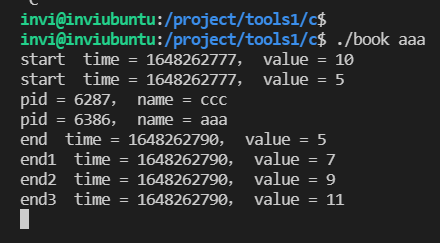
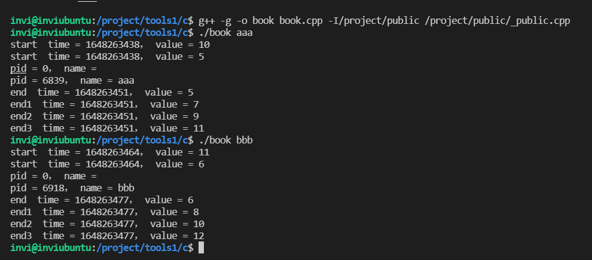

# 守护进程的实现

## linux共享内存的基础知识和使用方法

linux系统中，每个进程的内存空间是独立的，互相之间不能相互访问，共享内存允许多个进程访问一个公共内存，是进程之间共享和传递数据最高效的方式，没有之一。共享内存的操作比较简单，只有4个动作。

1. 调用shmget函数获取或者创建共享内存。如果共享内存不存在，就创建它，如果已经存在就获取它的地址。
2. 调用shmat函数把共享内存连接到当亲进程的地址空间。然后当前进程就可以
3. 调用shmdt函数把共享内存从当前进程中分离。如果当前进程不再需要这块共享内存了，比如进程要退出了，就可以调用shmdt函数把当前进程从共享内存中分离
4. 调用shmctl函数删除共享内存。共享内存创建了，一般不删除，除非整个项目的服务程序都停止运行。

共享内存需要包含如下两个头文件

```c++
#include <sys/ipc.h>
#include <sys/shm.h>
```

### shmget

```c++
SYNOPSIS
       #include <sys/ipc.h>
       #include <sys/shm.h>

       int shmget(key_t key, size_t size, int shmflg);

```

- 第一个参数 key ，在进程通信中，不管是消息队列，共享内存 还是 信号量。每个对象都有一个key。不同的进程通过key来识别不同的对象。key是一个整数，通常用16进制来表示。
- 第二个参数是共享内存的大小
- 第三个参数是共享内存的标志。用于填写操作权限和其他的标志。

```c++
#include <sys/ipc.h>
#include <sys/shm.h>
#include <stdio.h>
#include <stdlib.h>
#include <unistd.h>
#include <string.h>

struct st_pid
{
    int pid;        // 进程编号
    char name[51];  // 进程名称
};

int main(int argc, char* argv[])
{
    // 共享内存标志
    int shmid;

    // 这个共享内存，第一个参数
    // 第二个参数，这里我打算用这个共享内存来保存一个结构体，所以这里内存大小设置为结构体的size值
    // 然后第三个参数，我们一般这么写 0640|IPC_CREAT 
    // 它包括两个部分，前面这部分是操作权限，他的表示方法跟文件和目录的表示方法是一样的（八进制）
    // 第二部分（IPC_CREAT）表示如果共享内存已经存在，就获得他的id，如果不存在就创建它（这部分参数基本上没有选择，只能填这个）
    // shmget函数，成功返回共享内存的id，失败返回-1，系统错误变量并设置，一般来说，如果不是因为系统内存不够，很少会返回失败
    if((shmid = shmget(0x5005, sizeof(struct st_pid), 0640|IPC_CREAT)) == -1)
    {
        printf("shmget(0x5005, sizeof(struct st_pid), 0640|IPC_CREAT) faild \n");
    }

    return 0;
}
```

编译运行，然后使用 `ipcs -m` 这个命令查看共享内存


各个字段信息如下：

- key：共享内存key
- shmid：共享内存ID
- owner：拥有者
- perms：权限
- bytes：字节大小
- nattch：当前共享内存被多少个进程使用了（连接）
- status：状态

关于这里shmget函数里第一个参数为什么要使用16进制，是因为从 `ipcs -m`这个命令可以看到，共享内存的key它是一个16进制的表示，如果我们一开始就用十进制来做参数，那么在查看共享内存的时候，key的这个值会别转换成16进制，前后之间不好理解，可读性较差，所以不如直接就在一开始使用功能16进制作为参数传递进get函数

然后使用 `ipcrm -m 共享内存shmid` 可以删除共享内存，参数就是这个共享内存的shmid


### shmat 和 shmdt

```shell
SYNOPSIS
       #include <sys/types.h>
       #include <sys/shm.h>

       void *shmat(int shmid, const void *shmaddr, int shmflg);

       int shmdt(const void *shmaddr);

```

shmat这个函数就是把共享内存连接到当前进程的地址空间。shmdt就是将共享内存从当前进程的地址空间分离出去。

- shemat它的第一个参数是共享内存的shmid
- 他的第二个参数 和 第三个参数都可以填 0 ，而且一般也都是填 0
- 然后shemat 函数的返回值就是共享内存的地址。在程序中我们使用一个指针来指向这个地址，操作共享内存就像操作本地变量一样方便。

```c++
#include <sys/ipc.h>
#include <sys/shm.h>
#include <stdio.h>
#include <stdlib.h>
#include <unistd.h>
#include <string.h>

struct st_pid
{
    int pid;        // 进程编号
    char name[51];  // 进程名称
};

int main(int argc, char* argv[])
{
    // 共享内存标志
    int shmid;

    // 这个共享内存，第一个参数
    // 第二个参数，这里我打算用这个共享内存来保存一个结构体，所以这里内存大小设置为结构体的size值
    // 然后第三个参数，我们一般这么写 0640|IPC_CREAT 
    // 它包括两个部分，前面这部分是操作权限，他的表示方法跟文件和目录的表示方法是一样的（八进制）
    // 第二部分（IPC_CREAT）表示如果共享内存已经存在，就获得他的id，如果不存在就创建它（这部分参数基本上没有选择，只能填这个）
    // shmget函数，成功返回共享内存的id，失败返回-1，系统错误变量并设置，一般来说，如果不是因为系统内存不够，很少会返回失败
    if((shmid = shmget(0x5005, sizeof(struct st_pid), 0640|IPC_CREAT)) == -1)
    {
        printf("shmget(0x5005, sizeof(struct st_pid), 0640|IPC_CREAT) faild \n");
    }

    // 先定义一个指针变量用于存放 shmat 函数的返回地址。（用于指向共享内存的结构体白能量指针）
    struct st_pid* stpid = nullptr;     // 初始化为 0 或者 NULL 或者在c++11中可以初始化为 nullptr

    // 通常来说，只要shmid 共享内存id没有填错，一般shmat是不会失败的，如果失败会返回 -1
    // 注意，这里shmat的返回值需要强制转换成你需要的类型，同时后面的判断条件 -1 也需要强制转换成 （void *)，因为shmat这个函数他的返回值类型是 一个(void *)指针类型
    if((stpid = (struct st_pid*)shmat(shmid, 0, 0)) == (void *)-1)
    {
        printf("shmat(shmid, 0, 0) faild \n");
    }

    // 然后就可以像使用普通的指针一样使用共享内存了

    // 在赋值之前我们先把共享内存里面的东西读出来
    printf("pid = %d， name = %s \n", stpid->pid, stpid->name);

    stpid->pid = getpid();              // 把当前进程的id赋给共享内存的pid成员
    // strcpy(stpid->name, argv[0]);       // 然后把当前进程（程序）的名称赋给共享内存的name成员
    strcpy(stpid->name, argv[1]);       // 然后把当前进程（程序）的第一个参数赋给共享内存的name成员

    // 在赋值之后我们也把共享内存里面的东西读出来
    printf("pid = %d， name = %s \n", stpid->pid, stpid->name);


    // 把共享内存从当前进程中分离
    // shmdt 这个函数他的参数就是上面这里这个指针变量 stpid 指向的内存地址
    // 只要这个指针变量他的内存地址没有问题，那么shmdt这个函数肯定不会失败，所以这里不用判断他的返回值
    shmdt(stpid);

    return 0;
}
```

然后我们编译运行这个程序


我们分别运行了3次，第一次运行，因为共享内存刚创建，数据为空，所以打印成员值为空，然后我们把进程id和参数aaa写入到共享内存

然后第二次运行，因为共享内存在上次运行的时候已经被创建了，所以这里共享内存里面已经保存了上次存入的进程id和aaa字段，所以这里有信息打印，然后我们继续把这次的进程id和参数 bbb 保存进共享内存中

同理，第三次运行也是一样的。

### shmctl

```shell
SYNOPSIS
       #include <sys/ipc.h>
       #include <sys/shm.h>

       int shmctl(int shmid, int cmd, struct shmid_ds *buf);
       
DESCRIPTION
       shmctl() performs the control operation specified by cmd on the System V shared memory segment whose identifier is given in shmid.

       The buf argument is a pointer to a shmid_ds structure, defined in <sys/shm.h> as follows:

           struct shmid_ds {
               struct ipc_perm shm_perm;    /* Ownership and permissions */
               size_t          shm_segsz;   /* Size of segment (bytes) */
               time_t          shm_atime;   /* Last attach time */
               time_t          shm_dtime;   /* Last detach time */
               time_t          shm_ctime;   /* Creation time/time of last
                                               modification via shmctl() */
               pid_t           shm_cpid;    /* PID of creator */
               pid_t           shm_lpid;    /* PID of last shmat(2)/shmdt(2) */
               shmatt_t        shm_nattch;  /* No. of current attaches */
               ...
           };

```

共享内存的 shmctl 函数，可以用于删除共享内存，也可以用于做更多复杂的操作。

1. 第一个参数shmid：是共享内存的id
2. 第二个参数是想要执行的操作的命令
3. 第三个参数是一个结构体。共享内存在系统中有一个结构体，这个结构体包含了共享内存更多更详细的信息。一般来说，程序员不需要对这个结构体过度关心。用这个函数更多的是用于删除共享内存

```c++
#include <sys/ipc.h>
#include <sys/shm.h>
#include <stdio.h>
#include <stdlib.h>
#include <unistd.h>
#include <string.h>

struct st_pid
{
    int pid;        // 进程编号
    char name[51];  // 进程名称
};

int main(int argc, char* argv[])
{
    // 共享内存标志
    int shmid;

    // 这个共享内存，第一个参数
    // 第二个参数，这里我打算用这个共享内存来保存一个结构体，所以这里内存大小设置为结构体的size值
    // 然后第三个参数，我们一般这么写 0640|IPC_CREAT 
    // 它包括两个部分，前面这部分是操作权限，他的表示方法跟文件和目录的表示方法是一样的（八进制）
    // 第二部分（IPC_CREAT）表示如果共享内存已经存在，就获得他的id，如果不存在就创建它（这部分参数基本上没有选择，只能填这个）
    // shmget函数，成功返回共享内存的id，失败返回-1，系统错误变量并设置，一般来说，如果不是因为系统内存不够，很少会返回失败
    if((shmid = shmget(0x5005, sizeof(struct st_pid), 0640|IPC_CREAT)) == -1)
    {
        printf("shmget(0x5005, sizeof(struct st_pid), 0640|IPC_CREAT) faild \n");
    }

    // 先定义一个指针变量用于存放 shmat 函数的返回地址。（用于指向共享内存的结构体白能量指针）
    struct st_pid* stpid = nullptr;     // 初始化为 0 或者 NULL 或者在c++11中可以初始化为 nullptr

    // 通常来说，只要shmid 共享内存id没有填错，一般shmat是不会失败的，如果失败会返回 -1
    // 注意，这里shmat的返回值需要强制转换成你需要的类型，同时后面的判断条件 -1 也需要强制转换成 （void *)，因为shmat这个函数他的返回值类型是 一个(void *)指针类型
    if((stpid = (struct st_pid*)shmat(shmid, 0, 0)) == (void *)-1)
    {
        printf("shmat(shmid, 0, 0) faild \n");
    }

    // 然后就可以像使用普通的指针一样使用共享内存了

    // 在赋值之前我们先把共享内存里面的东西读出来
    printf("pid = %d， name = %s \n", stpid->pid, stpid->name);

    stpid->pid = getpid();              // 把当前进程的id赋给共享内存的pid成员
    // strcpy(stpid->name, argv[0]);       // 然后把当前进程（程序）的名称赋给共享内存的name成员
    strcpy(stpid->name, argv[1]);       // 然后把当前进程（程序）的第一个参数赋给共享内存的name成员

    // 在赋值之后我们也把共享内存里面的东西读出来
    printf("pid = %d， name = %s \n", stpid->pid, stpid->name);


    // 把共享内存从当前进程中分离
    // shmdt 这个函数他的参数就是上面这里这个指针变量 stpid 指向的内存地址
    // 只要这个指针变量他的内存地址没有问题，那么shmdt这个函数肯定不会失败，所以这里不用判断他的返回值
    shmdt(stpid);

    // 删除共享内存
    // 如果删除失败，返回-1
    if(shmctl(shmid, IPC_RMID, 0) == -1)
    {
        printf("shmctl(stpid, IPC_RMID, 0) faild \n");
    }

    return 0;
}
```

可以看到，在添加了shmctl函数之后，我们每次都会将共享内存进行删除，所以 `ipcs -m`指令就找不到该共享内存了


## linux信号量的基础知识和使用方法

要想让程序安全地执行，就要有一种进程同步的进制，保证在进入临界区的操作是原子操作。例如，可以使用接下来所讲的信号量来进行进程的同步。因为信号量的操作都是原子性的。

使用共享内存的优缺点

1、优点：我们可以看到使用共享内存进行进程间的通信真的是非常方便，而且函数的接口也简单，数据的共享还使进程间的数据不用传送，而是直接访问内存，也加快了程序的效率。同时，它也不像匿名管道那样要求通信的进程有一定的父子关系。

2、缺点：共享内存没有提供同步的机制，这使得我们在使用共享内存进行进程间通信时，往往要借助其他的手段来进行进程间的同步工作。

针对共享内存这个麻烦，如果有一个进程正在往共享内存中写入数据，在没有写入完成之前，是不应该让其他进程访问该共享内存的，共享内存没有提供锁机制，所以需要使用信号量来为共享内存加锁

- 信号量本质上是一个非负数（>= 0）的计数器
- 用于给共享资源建立一个标志，表示该共享资源被占用的情况
- 进程对信号量有两个操作： p操作（申请资源 -1），V操作（释放资源 +1）
- 二值信号量是信号量的一种特殊形式，表示资源只有可用和不可用两种状态：0 不可用， 1 可用，他的功能与互斥锁相同，只有开和关两种状态

对p v 操作举个例子：


```c++
// 信号量。
class CSEM
{
private:
  union semun  // 用于信号量操作的共同体。
  {
    int val;
    struct semid_ds *buf;
    unsigned short  *arry;
  };

  int   m_semid;         // 信号量描述符。

  // 如果把sem_flg设置为SEM_UNDO，操作系统将跟踪进程对信号量的修改情况，
  // 在全部修改过信号量的进程（正常或异常）终止后，操作系统将把信号量恢
  // 复为初始值（就像撤消了全部进程对信号的操作）。
  // 如果信号量用于表示可用资源的数量（不变的），设置为SEM_UNDO更合适。
  // 如果信号量用于生产消费者模型，设置为0更合适。
  // 注意，网上查到的关于sem_flg的用法基本上是错的，一定要自己动手多测试。
  short m_sem_flg;
public:
  CSEM();
  // 如果信号量已存在，获取信号量；如果信号量不存在，则创建它并初始化为value。
  bool init(key_t key,unsigned short value=1,short sem_flg=SEM_UNDO); 
  bool P(short sem_op=-1); // 信号量的P操作。
  bool V(short sem_op=1);  // 信号量的V操作。
  int  value();            // 获取信号量的值，成功返回信号量的值，失败返回-1。
  bool destroy();          // 销毁信号量。
 ~CSEM();
};
```

然后我们采用信号量给上面那个demo程序加锁

```c++
#include <sys/ipc.h>
#include <sys/shm.h>
#include <stdio.h>
#include <stdlib.h>
#include <unistd.h>
#include <string.h>
#include "_public.h"

// 创建一个信号量对象，用于给共享内存加锁
CSEM sem;

struct st_pid
{
    int pid;        // 进程编号
    char name[51];  // 进程名称
};

int main(int argc, char* argv[])
{
    // 共享内存标志
    int shmid;

    // 这个共享内存，第一个参数
    // 第二个参数，这里我打算用这个共享内存来保存一个结构体，所以这里内存大小设置为结构体的size值
    // 然后第三个参数，我们一般这么写 0640|IPC_CREAT 
    // 它包括两个部分，前面这部分是操作权限，他的表示方法跟文件和目录的表示方法是一样的（八进制）
    // 第二部分（IPC_CREAT）表示如果共享内存已经存在，就获得他的id，如果不存在就创建它（这部分参数基本上没有选择，只能填这个）
    // shmget函数，成功返回共享内存的id，失败返回-1，系统错误变量并设置，一般来说，如果不是因为系统内存不够，很少会返回失败
    if((shmid = shmget(0x5005, sizeof(struct st_pid), 0640|IPC_CREAT)) == -1)
    {
        printf("shmget(0x5005, sizeof(struct st_pid), 0640|IPC_CREAT) faild \n");
    }

    // 初始化信号量，第一个参数key：是和信号量那个key是一样的，也是一个十六进制数，注意这里这个key也可以使用共享内存那个key,他们两个是独立的，互不冲突
    // 第二个参数：value 表示信号量的初始值，而知信号量的初始值缺省为1
    // 第三个参数，信号量的标志 如果是二值信号量的化就是 SEM_UNDO 也是缺省的 
    // （所以可以看出，我们提供的这个CSEM 信号量类，默认情况下是一个二值信号量）
    // 如果信号量已经存在，获取信号信号量，如果不存在，则创建它并初始化为value
    if(sem.init(0x5005) == false)
    {
        printf("sem.init(0x5005) faild \n");
        return -1;
    }

    // 然后编写加锁和解锁的代码

    // 先定义一个指针变量用于存放 shmat 函数的返回地址。（用于指向共享内存的结构体白能量指针）
    struct st_pid* stpid = nullptr;     // 初始化为 0 或者 NULL 或者在c++11中可以初始化为 nullptr

    // 通常来说，只要shmid 共享内存id没有填错，一般shmat是不会失败的，如果失败会返回 -1
    // 注意，这里shmat的返回值需要强制转换成你需要的类型，同时后面的判断条件 -1 也需要强制转换成 （void *)，因为shmat这个函数他的返回值类型是 一个(void *)指针类型
    if((stpid = (struct st_pid*)shmat(shmid, 0, 0)) == (void *)-1)
    {
        printf("shmat(shmid, 0, 0) faild \n");
    }
    // 然后就可以像使用普通的指针一样使用共享内存了

    // 在加锁之前将当前时间 和 信号量的值显示出来
    printf("start  time = %ld， value = %d \n", time(0), sem.value());

    sem.P();        // 加锁

    // 在加锁之后将当前时间 和 信号量的值显示出来
    printf("start  time = %ld， value = %d \n", time(0), sem.value());

    // 在赋值之前我们先把共享内存里面的东西读出来
    printf("pid = %d， name = %s \n", stpid->pid, stpid->name);

    stpid->pid = getpid();              // 把当前进程的id赋给共享内存的pid成员
    // strcpy(stpid->name, argv[0]);       // 然后把当前进程（程序）的名称赋给共享内存的name成员
    strcpy(stpid->name, argv[1]);       // 然后把当前进程（程序）的第一个参数赋给共享内存的name成员

    // 在赋值之后我们也把共享内存里面的东西读出来
    printf("pid = %d， name = %s \n", stpid->pid, stpid->name);
    sleep(10);

    // 在解锁之前将当前时间 和 信号量的值显示出来
    printf("end  time = %ld， value = %d \n", time(0), sem.value());

    sem.V();        // 解锁

    // 在解锁之后将当前时间 和 信号量的值显示出来
    printf("end  time = %ld， value = %d \n", time(0), sem.value());


    // 把共享内存从当前进程中分离
    // shmdt 这个函数他的参数就是上面这里这个指针变量 stpid 指向的内存地址
    // 只要这个指针变量他的内存地址没有问题，那么shmdt这个函数肯定不会失败，所以这里不用判断他的返回值
    shmdt(stpid);

    // 删除共享内存
    // 如果删除失败，返回-1
    if(shmctl(shmid, IPC_RMID, 0) == -1)
    {
        printf("shmctl(stpid, IPC_RMID, 0) faild \n");
    }

    return 0;
}
```

然后我们编译运行，查看运行结果


说明：第一行打印，是信号量加锁之前，因为信号量初始化为1，然后接下来执行加锁 （P操作），P操作会将信号量的值-1，所以这里加锁之后的打印，信号量就变成了0。然后，sleep 10秒之后，因为没有进行V操作，锁还在持有中，信号量的值还是0，不变，所以打印出来也就是0。然后执行解锁（V操作）。V操作会将信号量进行的值+1.所以这里信号量的值变成了1.


使用 `ipcs -s` 命令可以查看信号量。

- key：信号量key
- semid：信号量的id
- owner：信号量拥有者
- perms：权限
- nsems：信号量个数


使用 `ipcrm sem 信号量id` 这个指令，可以用于删除信号量，删除成功会提示资源以删除（resource(s) deleted）

然后继续我们上面的代码，我们启动4个终端，分别运行这个book测试程序，运行结果如下：


可以看到一个很奇怪的现象，就是输出结果并没有像我们单独运行一个程序的时候那样，信号量的值是1 0 0 1，而是变成了 1 0 0 0 ，0 0 0 0 ， 0 0 0 0 ， 0 0 0 1

这是为什么？

首先看第一个，它在39s的时候，对信号量进行加锁操作（p)，这个时候，信号量的值由1变成0，打印也是 1 0，然后继续sleep10s,依旧持有锁，这个时候，它进行解锁（v)，它将信号量的值-1，**同时唤醒下一个在等待加锁的进程**，这个时候，bbb 进程被唤醒，执行P操作（加锁），它就会将这个信号量再进行-1操作，所以这个时候在第二个 bbb 程序这里，信号量又变成了0。这里需要特别注意一个点，我们上面说，**同时** 而不是在某一步之后，这个唤醒加锁的动作和前一个锁释放（v操作）是同时完成的。因为这几部操作是原子操作，所以依托原子操作之后，原来解锁之后又唤醒又加锁，信号量就又变成了0，所以在第一个终端里打印的解锁之后的信号量的值其实是第二个终端页面已经加锁了的信号量的值。所以才是0而不是1。也就是说

```c++
    sem.V();        // 解锁

    // 在解锁之后将当前时间 和 信号量的值显示出来
    printf("end  time = %ld， value = %d \n", time(0), sem.value());

```

这个打印虽然是紧跟着V操作，但是因为信号量的原子特性，这个时候这个打印看到的信号量是0。之后的这几个bash也是类似的道理。至于最后这个，因为到这个进程的时候，信号量排队队列中，已经没有进程了，所以没有下一个进程需要来获取锁加锁，也就是没有下一个进程来讲信号量-1了，所以这个时候就打印的是1。很好理解

### 信号量更多细节

学过操作系统的我们都知道，信号量的重点是为了解决生产消费者问题，吸烟者问题，哲学家进餐问题。

信号量是包含一个非负整数型的变量，并且带有两个原子操作wait和signal。Wait还可以被称为down、P或lock，signal还可以被称为up、V、unlock或post。在UNIX的API中（POSIX标准）用的是wait和post。

下面我这里探讨的是linux下的信号量，如果是unix下的信号量，命名上会有区别，但是信号量本质其实都是一样的，这里注意区分

信号量的使用主要是用来保护共享资源，使得资源在一个时刻只有一个进程（线程）所拥有。信号量的值为正的时候，说明它空闲。所测试的线程可以锁定而使用它。若为0，说明它被占用，测试的线程要进入睡眠队列中，等待被唤醒。

#### semget()

```shell
SYNOPSIS
       #include <sys/types.h>
       #include <sys/ipc.h>
       #include <sys/sem.h>

       int semget(key_t key, int nsems, int semflg);

```

首先我们来看一下信号量的第一个函数，`semget`，这个函数用于获取或者创建信号量，它有3个参数

1. `key`：这个key和共享内存的key是一样的意思，是一个十六进制的数（唯一非零），不相关的进程可以通过它访问一个信号量，它代表程序可能要使用的某个资源。程序对所有信号量的访问都是间接的，程序先通过调用semget()函数并提供一个键，再由系统生成一个相应的信号标识符（semget()函数的返回值），只有semget()函数才直接使用信号量键，所有其他的信号量函数使用由semget()函数返回的信号量标识符。如果多个程序使用相同的key值，key将负责协调工作。
2. `nsems`：这个参数是指信号量的个数，一般取值为1，也可以用 n 标识一次创建多个信号量
3. `semflag`：是一组标志，当想要当信号量不存在时创建一个新的信号量，可以和值IPC_CREAT做按位或操作。设置了IPC_CREAT标志后，即使给出的键是一个已有信号量的键，也不会产生错误。而IPC_CREAT | IPC_EXCL则可以创建一个新的，唯一的信号量，如果信号量已存在，返回一个错误。

semget()函数成功返回一个相应信号标识符（非零），失败返回-1.

信号量的初始化不能和共享内存一样，直接使用类似的代码

```c++
semget(key, 1, 0666|IPC_CREAT);
```

因为信号量创建后，初始值是0，0表示没有可用资源。谁都用不了。这时候P操作会永远等待。当然，也许有人会说，那我就用这行代码，然后再去设置信号量的初始值，可是这样做有一个问题就是，如果这个时候有其他的进程正在加锁中，这么做的话，不就把那个进程刚刚加上的锁的给解开了吗

信号量的初始化分为3个步骤

1. 获取信号量，如果成功，函数返回
2. 如果失败，则创建信号量
3. 设置信号量的初始值

比如看下面的我封装的这个信号量类的 init 成员函数实现，这里创建信号量，如果失败，则判断错误代码，如果错误代码为2，则代表信号量不存在，那么就使用 `m_semid=semget(key,1,0666|IPC_CREAT|IPC_EXCL)` 创建信号量，创建信号量的时候，务必加上 `IPC_EXCL` 这个标志，确保只有一个进程创建并初始化信号量，其他进程只能获取。有了这个标志，如果存在信号量（其他进程已经创建），那么上面这行代码就会执行失败返回-1，多进程的程序一定要考虑他们之间的竞争关系。比如说有多个进程同时的走到了这个init成员函数，然后他们发现信号量不存在，然后都往下走，创建信号量，然后因为有 `IPC_EXCL`这个标记的存在，导致即使是他们同时创建，也会只有一个信号量被创建成功。然后其他没创建成功的进程会产生一个 `EEXIST` 的错误，标记已经有信号量被创建了。然后这个创建失败的也只需要去调用 `(m_semid=semget(key,1,0666))` 去获取那个成功创建信号量的进程创建出来的信号量即可。

然后真正创建成功信号量的那个进程会走到下面这个初始化信号量的代码中来，因为信号量创建成功之后，是需要把它初始化为value的。这里涉及到信号量的另外一个函数 semctl ，这个函数我们用的最多的是用来设置信号量的初始值 和 获取信号量的当前值。

```c++
// 信号量创建成功后，还需要把它初始化成value。
      union semun sem_union;
      sem_union.val = value;   // 设置信号量的初始值。
      if (semctl(m_semid,0,SETVAL,sem_union) <  0) { perror("init semctl()"); return false; }
```

注意一些细节，semget函数的第二个参数，表示创建几个信号量，如果创建一个信号量就填1，如果创建10个信号量就填10.

semctl函数的第二个参数，表示信号量的编号，编号是从0开始，如果之前我们创建信号量只创建1个，那么这个值就是0（而不是1）

然后是关于信号量的初始值，二值信号量填1，其他信号量要看需求，也就是你打算用信号量来做什么，根据实际需求来填写

```c++
  bool P(short sem_op=-1); // 信号量的P操作。P操作缺省把信号量的值-1
  bool V(short sem_op=1);  // 信号量的V操作。V操作缺省把信号量的值+1

// 如果信号量已存在，获取信号量；如果信号量不存在，则创建它并初始化为value。
bool CSEM::init(key_t key,unsigned short value,short sem_flg)
{
  if (m_semid!=-1) return false;

  m_sem_flg=sem_flg;

  // 信号量的初始化不能直接用semget(key,1,0666|IPC_CREAT)，因为信号量创建后，初始值是0。

  // 信号量的初始化分三个步骤：
  // 1）获取信号量，如果成功，函数返回。
  // 2）如果失败，则创建信号量。
  // 3) 设置信号量的初始值。

  // 获取信号量。
  if ( (m_semid=semget(key,1,0666)) == -1)
  {
    // 如果信号量不存在，创建它。
    if (errno==2)
    {
      // 用IPC_EXCL标志确保只有一个进程创建并初始化信号量，其它进程只能获取。
      if ( (m_semid=semget(key,1,0666|IPC_CREAT|IPC_EXCL)) == -1)
      {
        if (errno!=EEXIST)
        {
          perror("init 1 semget()"); return false;
        }
        if ( (m_semid=semget(key,1,0666)) == -1)
        { perror("init 2 semget()"); return false; }
    
        return true;
      }

      // 信号量创建成功后，还需要把它初始化成value。
      union semun sem_union;
      sem_union.val = value;   // 设置信号量的初始值。
      if (semctl(m_semid,0,SETVAL,sem_union) <  0) { perror("init semctl()"); return false; }
    }
    else
    { perror("init 3 semget()"); return false; }
  }

  return true;
}
```

#### 信号量的 P操作 & V操作

P操作的含义是等待分配资源，为信号量做减法运算。V操作的含义是释放资源，为信号量做加法运算。P操作和V操作的含义是不同的，但是这两个函数的代码可以看到，我们封装的完全相同。

注意信号量的值不能够直接加减运算哟啊使用 semop 函数

```c++
bool CSEM::P(short sem_op)
{
  if (m_semid==-1) return false;

  struct sembuf sem_b;
  sem_b.sem_num = 0;      // 信号量编号，0代表第一个信号量。
  sem_b.sem_op = sem_op;  // P操作的sem_op必须小于0。
  sem_b.sem_flg = m_sem_flg;   
  if (semop(m_semid,&sem_b,1) == -1) { perror("p semop()"); return false; }

  return true;
}

bool CSEM::V(short sem_op)
{
  if (m_semid==-1) return false;

  struct sembuf sem_b;
  sem_b.sem_num = 0;      // 信号量编号，0代表第一个信号量。
  sem_b.sem_op = sem_op;  // V操作的sem_op必须大于0。
  sem_b.sem_flg = m_sem_flg;
  if (semop(m_semid,&sem_b,1) == -1) { perror("V semop()"); return false; }

  return true;
}
```

#### semop函数

它的作用是改变信号量的值，原型为：

```cpp
int semop(int sem_id, struct sembuf *sem_opa, size_t num_sem_ops);
```

semop 的参数：

第一个参数是信号量id，sem_id是由semget()返回的信号量标识符，

第二第三个参数：

如果操作的是单个信号量，那么第三个参数填1，第二个参数填一个结构体的地址

如果操作的是一组信号量，第三个个参数填这组信号量的信号量个数，第二个参数填结构体数组的地址

这个sembuf结构的定义如下：

```cpp
struct sembuf{
    short sem_num; // 除非使用一组信号量，否则它为0（信号量编号，从0开始）
    short sem_op;  // 信号量在一次操作中需要改变的数据，通常是两个数，一个是-1，即P（等待）操作，
                   // 一个是+1，即V（发送信号）操作。
    short sem_flg; // 通常为SEM_UNDO,使操作系统跟踪信号，
                   // 并在进程没有释放该信号量而终止时，操作系统释放信号量
};
```

这里我们做几个测试

测试1：测试P操作和V操作的第一个参数（注意这里的测试是测试哦我们自己封装的这个信号量类，然后来学习信号量的这几个函数的意义）

```c++
#include <sys/ipc.h>
#include <sys/shm.h>
#include <stdio.h>
#include <stdlib.h>
#include <unistd.h>
#include <string.h>
#include "_public.h"

// 创建一个信号量对象，用于给共享内存加锁
CSEM sem;

struct st_pid
{
    int pid;        // 进程编号
    char name[51];  // 进程名称
};

int main(int argc, char* argv[])
{
    if(argc < 2)
    {
        printf("Using: ./book procname\n");
        return 0;
    }
    // 共享内存标志
    int shmid;
  if((shmid = shmget(0x5005, sizeof(struct st_pid), 0640|IPC_CREAT)) == -1)
    {
        printf("shmget(0x5005, sizeof(struct st_pid), 0640|IPC_CREAT) faild \n");
    }

    if(sem.init(0x5005, 10) == false)   // 注意这里，把信号量的初始值设置为10
    {
        printf("sem.init(0x5005) faild \n");
        return -1;
    }
    
    struct st_pid* stpid = nullptr;

    if((stpid = (struct st_pid*)shmat(shmid, 0, 0)) == (void *)-1)
    {
        printf("shmat(shmid, 0, 0) faild \n");
    }

    // 在加锁之前将当前时间 和 信号量的值显示出来
    printf("start  time = %ld， value = %d \n", time(0), sem.value());

    sem.P(-5);        // 加锁，P操作这里设置为-5

    // 在加锁之后将当前时间 和 信号量的值显示出来
    printf("start  time = %ld， value = %d \n", time(0), sem.value());

    // 在赋值之前我们先把共享内存里面的东西读出来
    printf("pid = %d， name = %s \n", stpid->pid, stpid->name);

    stpid->pid = getpid();              // 把当前进程的id赋给共享内存的pid成员
    // strcpy(stpid->name, argv[0]);       // 然后把当前进程（程序）的名称赋给共享内存的name成员
    strcpy(stpid->name, argv[1]);       // 然后把当前进程（程序）的第一个参数赋给共享内存的name成员
    sleep(3);

    // 在赋值之后我们也把共享内存里面的东西读出来
    printf("pid = %d， name = %s \n", stpid->pid, stpid->name);
    sleep(10);

    // 在解锁之前将当前时间 和 信号量的值显示出来
    printf("end  time = %ld， value = %d \n", time(0), sem.value());

    sem.V(2);        // 解锁，然后V操作我们设置为2

    // 在解锁之后将当前时间 和 信号量的值显示出来
    printf("end1  time = %ld， value = %d \n", time(0), sem.value());
    sem.V(2);        // 解锁，然后V操作我们设置为2

    // 在解锁之后将当前时间 和 信号量的值显示出来
    printf("end2  time = %ld， value = %d \n", time(0), sem.value());
    sem.V(2);        // 解锁，然后V操作我们设置为2

    // 在解锁之后将当前时间 和 信号量的值显示出来
    printf("end3  time = %ld， value = %d \n", time(0), sem.value());

    shmdt(stpid);

    // 删除共享内存
    // 如果删除失败，返回-1
    if(shmctl(shmid, IPC_RMID, 0) == -1)
    {
        printf("shmctl(stpid, IPC_RMID, 0) faild \n");
    }

    return 0;
}
```

如上代码所示，我们设置信号量的初始值为10，然后给P操作设置参数为-5，V操作设置参数为2，执行3次V操作，然后我们看程序执完信号量的值。可以看到 10 - 5 = 5， 5 + 2 = 7， 7+2 = 9， 9 + 2 = 11，最终程序执行完信号量的值为11.


然后我们再次运行一次测试程序，发现，信号量的初始值又变成了10，而不是我们上次的运行结果11，这是为什么？要知道这个信号量一直保存在内存里，我们没有进行信号量的删除，所以理论上这里第二次运行的信号量应该是上次的结果11，但是事实上却不是。


造成这种现象的原因是这样的，在P操作和V操作里面，结构体 `struct sembuf`有一个成员，`sem_flg`这个标志，这个标志位的取值是这么解释的，如果把把标志位 `sem_flg`设置为 `SEM_UNDO`，那么操作系统将跟踪进程对信号量的修改情况，在全部的进程（正常或者异常）终止之后，操作系统将会把信号量的值恢复为初始值（就像是撤销了全部进程对信号的操作），如果信号量用于表示可用资源的数据（可用资源数量不变），设置为 `SEM_UBDO`更合适，如果信号量用于生产消费者模型，设置为0更合适。

这里我们再做一个测试，将上面的测试代码在结尾处设置一个休眠时间，设置长点，比如100s，然后我们启动3个bash来运行这个测试程序。结果如下


可以看到，程序打印正常，多个进程能够正确 P V 信号量的值。这个时候我们将这3个进程都关闭。然后重新在起一个进程，可以看到，因为之前和信号量关联的3个进程都别关闭，所以操作系统将这各信号量的值回复成了10，所以我们新启动的这个进程才会是10



所以这里回到上面，我们说：**如果信号量用于表示可用资源的数据，设置为 `SEM_UBDO`更合适**，为什么？还记得我们开始的时候介绍的那个学生使用电脑的例子，一共有30台电脑，来的人那么多，走的人也那么多，等所有人走光之后，我们的电脑肯定是还是由30台，也就是说，这个资源（信号量）要恢复成初始值。

然后下面我们再举一个例子，把标志位设置为 0 的情况。这里修改信号量初始化函数的第三个参数。

```c++
    if(sem.init(0x5005, 10, 0) == false)   // 注意这里，把信号量的初始值设置为10
    {
        printf("sem.init(0x5005) faild \n");
        return -1;
    }
```

编译，运行（这里我们集不启动多个进程了，而是将sleep时间改小一点，看下一个进程会不会拿到上一个进程结束时的信号量状态（也就是看信号量会不会被初始化成初始值））



从测试结果上可以很容易看出来，如果我们将 `sem_flg`这个成员设置为 0 ，那么他就不会像 `SEM_UNDO`那样在信号量关联的所有进程终止的时候，将信号量的值恢复为初始值，而是会一直保持这个信号量的值，直到你将该信号量给删除。

在生产消费者模型中，信号量表示的是可用产品的数量，虽然本质上也是可用资源的数量，但是这个可用资源的数量是会随着生产和消费过程动态变化的，所以在这种情况下，更适合使用 0 这个标志。

这里再演示一个将标志位设置为 `SEM_UNDO`时，可用用于防止程序死锁的例子。首先我们将上面的例子给恢复成 `SEM_UNDO`,然后再程序中间设置休眠200s(设置长点方便测试)，这里的中间就是在P操作之后，V操作之前就可以。然后我们编译，（这里如果是和我一样在上面的测试之后做的测试，记得先查看信号量，然后将上次的信号量给删除，以防干扰测试）。

首先我们先运行 `./book aaa`，现在aaa进程持有锁，

然后我们在第二个窗口运行第二个程序 `./book bbb`，然后注意看这里，因为这个信号量（锁）是被第一个 aaa 进程给持有的，所以我们刚启动的这个 bbb 进程，它的 P操作是会卡在这里等待 aaa 执行完 V操作释放信号量，然后他才能执行P操作的，所以他会卡在这里等待


然后我们在第三个窗口查看book进程，将第一个 aaa 进程给杀死。发现 第二个卡着等待信号量的这个bbb进程，立刻就执行了P操作（获得了可用信号量）。也就是说 aaa 这个进程的锁，虽然没有执行到V操作，但是因为被杀死，系统自动释放了aaa进程所持有的这个信号量（锁），没有造成死锁（bbb无限等待aaa释放锁）的情况。


然后我们封装的那个信号量类(CSEM) 里面还有两个函数，获取信号量的值和删除信号量，这两个函数比较简单,都是调用信号量的semctl函数，这里贴一下代码即可。

```c++
// 获取信号量的值，成功返回信号量的值，失败返回-1。
int CSEM::value()
{
  return semctl(m_semid,0,GETVAL);
}

bool CSEM::destroy()
{
  if (m_semid==-1) return false;

  if (semctl(m_semid,0,IPC_RMID) == -1) { perror("destroy semctl()"); return false; }

  return true;
}
```

## 开发守护进程模块，于调度模块结合，保证服务程序永不停机

在前面，我们开发出来了服务程序的调度程序，调度程序用于启动服务程序，如果服务程序退出了，不管是正常退出还是异常退出，调度程序在若干秒之后都应该重新启动它。

接下来，我们将开发守护程序，他的功能是检查服务程序是否死机，如果死了，就终止它。服务程序被终止之后，调度程序将重新启动它。这样就可以保证整个系统稳定运行。

- 服务程序由调度程序启动（procctl)
- 如果服务程序死机（挂起），守护程序将终止它
- 服务程序被终止之后，调度程序（procctl）将重新启动它

### 心跳机制

守护进程是如何判断服务程序死掉的呢？我们可以采用心跳机制

具体设计是这样的：


创建一块共享内存，用于存放服务程序心跳信息的结构体数组，心跳信息结构体包括4个成员

1. 进程id
2. 进程名称
3. 超时时间
4. 最后一次心跳时间

每个服务程序启动的时候会查找共享内存，在共享内存数组中找一个空白的位置，把自己的心跳信息写进去，并且程序在运行的时候，还会定时将自己的心跳信息更新到共享内存数组中，表示自己是活着的。

守护进程每隔若干秒遍历一次共享内存，检查每个服务程序的心跳信息，如果 `当前时间 - 最后一次心跳时间 > 超时时间`，表示服务程序没有心跳了，死掉了，就发送信号终止它，死掉的服务程序被终止之后，调度程序将重新启动它。

### 守护进程

我们把这个任务分解成两个小任务

- 服务程序在共享内存中维护自己心跳信息
- 开发守护程序，检查共享内存，终止已经死机的服务程序

##### 首先先看第一个心跳机制实现，这里我们先暂时不考虑信号量给共享内存加锁

- 创建/获取共享内存，大小为 n*sizeof(struc st_pinfo)，这个n：比如说，我们这个程序运行的进程的总数不会超过1000 个，那么这个n就可以取值1000
- 将共享内存连接到当前进程的地址空间
- 创建当前进程心跳信息结构体变量，把本进程的信息填进去
- 在共享内存中查找一个空位置，把当前进程的心跳信息存入到共享内存中
- 然后进入循环之后，每个一段时间就更新更新内存中本进程的心跳时间，表示自己是活着的，要维护这个信息
- 如果跳出这个循环，那么要把当前进程从共享内存中移除，每个进程退出的时候，都应该主动的从共享内存中把自己的信息删除掉
- 把共享内存从当前进程中分离

```c++
#include <sys/ipc.h>
#include <sys/shm.h>
#include <stdio.h>
#include <stdlib.h>
#include <unistd.h>
#include <string.h>
#include "_public.h"

// 这里共享内存的key我们使用一个宏来定义，不要将其写死
#define SHMKEYP_    0X5098  // 共享内存的key
// 共享内存的总数和进程数有关，这里我们也用一个宏来表示
#define MAXNUMP_    1000    // 最大进程数量

// 创建一个心跳信息的结构体
struct st_pinfo
{
    int pid;        // 进程ID
    char pname[51]; // 进程名称，可以为空
    int timeout;    // 超时时间，单位：秒
    time_t atime;   // 最后一次心跳时间，用整数表示
};

int main(int argc, char* argv[])
{
    if(argc < 2)
    {
        printf("Using: ./book procname\n");
        return 0;
    }

    // 创建/获取共享内存，大小为 n*sizeof(struc st_pinfo)，这个n：比如说，我们这个程序运行的进程的总数不会超过1000 个，那么这个n就可以取值1000
    int m_shmid = 0;
    // 这里共享内存的key我们使用一个宏来定义，不要将其写死
    // 共享内存的总数和进程数有关，这里我们也用一个宏来表示
    if( (m_shmid = shmget(SHMKEYP_, MAXNUMP_*sizeof(struct st_pinfo), 0640|IPC_CREAT)) == -1 )
    {
        printf("shmget(SHMKEYP_, MAXNUMP_*sizeof(struct st_pinfo), 0640|IPC_CREAT) faild\n");
    }

    // 将共享内存连接到当前进程的地址空间
    struct st_pinfo* m_shm;
    m_shm = (struct st_pinfo*)shmat(m_shmid, 0, 0);

    // 创建当前进程心跳信息结构体变量，把本进程的信息填进去
    struct st_pinfo stpinfo;
    memset(&stpinfo, 0, sizeof(struct st_pinfo));
    stpinfo.pid = getpid();
    STRNCPY(stpinfo.pname, sizeof(stpinfo.pname), argv[1], 50); // STRNCPY自己封装的安全的字符串拷贝函数
    stpinfo.timeout = 30;
    stpinfo.atime = time(0);        // 最后一次心跳时间，用当前时间

    int m_post = -1;

    // 进程id是循环使用的，如果曾经有一个很进程异常退出，没有清理自己的心跳信息
    // 他的进程信息就将残留在共享内存中，不巧的是，当前进程重用了上述进程的id
    // 这样就会在共享内存中存在两个进程id相同的记录，守护进程检查到残留进程心跳时
    // 会想进程id发送退出信号，这个信号将会误杀当前进程

    // 在共享内存中查找一个空位置，把当前进程的心跳信息存入到共享内存中
    for(int i = 0; i < SHMKEYP_; i++)
    {
        // if((m_shm+i)->pid == 0) // 采用地址运算的方法遍历
        if(m_shm[i].pid == 0)   // 采用数组下标的方法来遍历
        {
            // 找到了一个空位置
            m_post = i;
            break;
        }
    }

    // 当然也不排除找不到空位置的情况，这种情况就是进程数实在是太多，已经把共享内存数耗尽了
    if(m_post == -1)
    {
        printf("共享内存空间已经耗尽\n");
        return -1;
    }

    // 找到了这个空位置，把这个结构体拷贝到这个功能内存位置中去
    memcpy(m_shm+m_post, &stpinfo, sizeof(struct st_pinfo));

    while(true)
    {
        // 然后进入循环之后，每个一段时间就更新更新内存中本进程的心跳时间，表示自己是活着的，要维护这个信息
        m_shm[m_post].atime = time(0);
        sleep(10);
    }

    // 如果跳出这个循环，那么要把当前进程从共享内存中移除，每个进程退出的时候，都应该主动的从共享内存中把自己的信息删除掉
    m_shm[m_post].pid = 0;      // 移除方法其实就是把进程id设置为0，因为我们是通过判断进程id是否为0来判断是否是空位置的
    memset(m_shm+m_post, 0, sizeof(struct st_pinfo));  // 当然更稳妥的方法是加上把这个结构体置0的操作，不过影响不大

    // 把共享内存从当前进程中分离
    shmdt(m_shm);

    return 0;
}
```

这里我们使用GDB调试，查看程序是否正常。

首先我们打开一个终端编译运行 aaa 进程，然后再另起一个终端运行bbb进程，然后再第三个终端运行GDB调试，断点设置在第74行，设置参数 ccc ，然后运行。查看这个时候共享内存中的的值，这里应该已经包含了aaa和bbb的心跳信息


我们上面这个心跳机制有没有漏洞？其实是有的

进程id是循环使用的，如果曾经有一个很进程异常退出，没有清理自己的心跳信息，他的进程信息就将残留在共享内存中，不巧的是，当前进程重用了上述进程的id，这样就会在共享内存中存在两个进程id相同的记录，守护进程检查到残留进程心跳时，会向进程id发送退出信号，这个信号将会误杀当前进程

其实，如果我们在遍历共享内存的时候，如果发现存在当前进程编号，那么就一定可以说明这个编号一定是其他进程残留的数据，我们这个进程恰好就使用了这个进程编号，那么我们这个时候只需要重用该位置就可以了。

所以我们改进方法就是在查找空位置之前先遍历一遍共享内存，看是否存在和当前进程id相同的数据。如果存在，那么就复用该位置即可，不存在再继续用之前的逻辑

```c++
#include <sys/ipc.h>
#include <sys/shm.h>
#include <stdio.h>
#include <stdlib.h>
#include <unistd.h>
#include <string.h>
#include "_public.h"

// 这里共享内存的key我们使用一个宏来定义，不要将其写死
#define SHMKEYP_    0X5098  // 共享内存的key
// 共享内存的总数和进程数有关，这里我们也用一个宏来表示
#define MAXNUMP_    1000    // 最大进程数量

// 创建一个心跳信息的结构体
struct st_pinfo
{
    int pid;        // 进程ID
    char pname[51]; // 进程名称，可以为空
    int timeout;    // 超时时间，单位：秒
    time_t atime;   // 最后一次心跳时间，用整数表示
};

int main(int argc, char* argv[])
{
    if(argc < 2)
    {
        printf("Using: ./book procname\n");
        return 0;
    }

    // 创建/获取共享内存，大小为 n*sizeof(struc st_pinfo)，这个n：比如说，我们这个程序运行的进程的总数不会超过1000 个，那么这个n就可以取值1000
    int m_shmid = 0;
    // 这里共享内存的key我们使用一个宏来定义，不要将其写死
    // 共享内存的总数和进程数有关，这里我们也用一个宏来表示
    if( (m_shmid = shmget(SHMKEYP_, MAXNUMP_*sizeof(struct st_pinfo), 0640|IPC_CREAT)) == -1 )
    {
        printf("shmget(SHMKEYP_, MAXNUMP_*sizeof(struct st_pinfo), 0640|IPC_CREAT) faild\n");
    }

    // 将共享内存连接到当前进程的地址空间
    struct st_pinfo* m_shm;
    m_shm = (struct st_pinfo*)shmat(m_shmid, 0, 0);

    // 创建当前进程心跳信息结构体变量，把本进程的信息填进去
    struct st_pinfo stpinfo;
    memset(&stpinfo, 0, sizeof(struct st_pinfo));
    stpinfo.pid = getpid();
    STRNCPY(stpinfo.pname, sizeof(stpinfo.pname), argv[1], 50); // STRNCPY自己封装的安全的字符串拷贝函数
    stpinfo.timeout = 30;
    stpinfo.atime = time(0);        // 最后一次心跳时间，用当前时间

    int m_post = -1;

    // 进程id是循环使用的，如果曾经有一个很进程异常退出，没有清理自己的心跳信息
    // 他的进程信息就将残留在共享内存中，不巧的是，当前进程重用了上述进程的id
    // 这样就会在共享内存中存在两个进程id相同的记录，守护进程检查到残留进程心跳时
    // 会想进程id发送退出信号，这个信号将会误杀当前进程

    // 如果共享内存中存在当前进程编号，一定是其他进程残留的数据，当前进程就重用该位置即可
    for(int i = 0; i < MAXNUMP_; i++)
    {
        if(m_shm[i].pid == stpinfo.pid)
        {
            m_post = i;
            break;
        }
    }

    // 这里只有在上面没找到相同进程id的情况下，才进行空位置寻找
    // 在共享内存中查找一个空位置，把当前进程的心跳信息存入到共享内存中
    if(m_post == -1)
    {
        for(int i = 0; i < MAXNUMP_; i++)
        {
            // if((m_shm+i)->pid == 0) // 采用地址运算的方法遍历
            if(m_shm[i].pid == 0)   // 采用数组下标的方法来遍历
            {
                // 找到了一个空位置
                m_post = i;
                break;
            }
        }
    }

    // 当然也不排除找不到空位置的情况，这种情况就是进程数实在是太多，已经把共享内存数耗尽了
    if(m_post == -1)
    {
        printf("共享内存空间已经耗尽\n");
        return -1;
    }

    // 找到了这个空位置，把这个结构体拷贝到这个功能内存位置中去
    memcpy(m_shm+m_post, &stpinfo, sizeof(struct st_pinfo));

    while(true)
    {
        // 然后进入循环之后，每个一段时间就更新更新内存中本进程的心跳时间，表示自己是活着的，要维护这个信息
        m_shm[m_post].atime = time(0);
        sleep(10);
    }

    // 如果跳出这个循环，那么要把当前进程从共享内存中移除，每个进程退出的时候，都应该主动的从共享内存中把自己的信息删除掉
    m_shm[m_post].pid = 0;      // 移除方法其实就是把进程id设置为0，因为我们是通过判断进程id是否为0来判断是否是空位置的
    memset(m_shm+m_post, 0, sizeof(struct st_pinfo));  // 当然更稳妥的方法是加上把这个结构体置0的操作，不过影响不大

    // 把共享内存从当前进程中分离
    shmdt(m_shm);

    return 0;
}
```

搞定了心跳信息之后，我们再给共享内存加锁

```c++
#include <sys/ipc.h>
#include <sys/shm.h>
#include <stdio.h>
#include <stdlib.h>
#include <unistd.h>
#include <string.h>
#include "_public.h"

// 这里共享内存的key我们使用一个宏来定义，不要将其写死
#define SHMKEYP_    0X5098  // 共享内存的key
// 共享内存的总数和进程数有关，这里我们也用一个宏来表示
#define MAXNUMP_    1000    // 最大进程数量
#define SEMKEYP_    0X5098  // 信号量key

// 创建一个心跳信息的结构体
struct st_pinfo
{
    int pid;        // 进程ID
    char pname[51]; // 进程名称，可以为空
    int timeout;    // 超时时间，单位：秒
    time_t atime;   // 最后一次心跳时间，用整数表示
};

int main(int argc, char* argv[])
{
    if(argc < 2)
    {
        printf("Using: ./book procname\n");
        return 0;
    }

    // 创建/获取共享内存，大小为 n*sizeof(struc st_pinfo)，这个n：比如说，我们这个程序运行的进程的总数不会超过1000 个，那么这个n就可以取值1000
    int m_shmid = 0;
    // 这里共享内存的key我们使用一个宏来定义，不要将其写死
    // 共享内存的总数和进程数有关，这里我们也用一个宏来表示
    if( (m_shmid = shmget(SHMKEYP_, MAXNUMP_*sizeof(struct st_pinfo), 0640|IPC_CREAT)) == -1 )
    {
        printf("shmget(SHMKEYP_, MAXNUMP_*sizeof(struct st_pinfo), 0640|IPC_CREAT) faild\n");
    }

    CSEM m_sem;
    if((m_sem.init(SEMKEYP_)) == false)
    {
        printf("m_sem.init(SEMKEYP_) faild\n");
    }

    // 将共享内存连接到当前进程的地址空间
    struct st_pinfo* m_shm;
    m_shm = (struct st_pinfo*)shmat(m_shmid, 0, 0);

    // 创建当前进程心跳信息结构体变量，把本进程的信息填进去
    struct st_pinfo stpinfo;
    memset(&stpinfo, 0, sizeof(struct st_pinfo));
    stpinfo.pid = getpid();
    STRNCPY(stpinfo.pname, sizeof(stpinfo.pname), argv[1], 50); // STRNCPY自己封装的安全的字符串拷贝函数
    stpinfo.timeout = 30;
    stpinfo.atime = time(0);        // 最后一次心跳时间，用当前时间

    int m_post = -1;

    // 进程id是循环使用的，如果曾经有一个很进程异常退出，没有清理自己的心跳信息
    // 他的进程信息就将残留在共享内存中，不巧的是，当前进程重用了上述进程的id
    // 这样就会在共享内存中存在两个进程id相同的记录，守护进程检查到残留进程心跳时
    // 会想进程id发送退出信号，这个信号将会误杀当前进程

    // 如果共享内存中存在当前进程编号，一定是其他进程残留的数据，当前进程就重用该位置即可
    for(int i = 0; i < MAXNUMP_; i++)
    {
        if(m_shm[i].pid == stpinfo.pid)
        {
            m_post = i;
            break;
        }
    }

    // 信号量加锁
    m_sem.P();      // 加锁

    // 这里只有在上面没找到相同进程id的情况下，才进行空位置寻找
    // 在共享内存中查找一个空位置，把当前进程的心跳信息存入到共享内存中
    if(m_post == -1)
    {
        for(int i = 0; i < MAXNUMP_; i++)
        {
            // if((m_shm+i)->pid == 0) // 采用地址运算的方法遍历
            if(m_shm[i].pid == 0)   // 采用数组下标的方法来遍历
            {
                // 找到了一个空位置
                m_post = i;
                break;
            }
        }
    }

    // 当然也不排除找不到空位置的情况，这种情况就是进程数实在是太多，已经把共享内存数耗尽了
    if(m_post == -1)
    {
        // 这里异常退出，如果是走到这个分支，不要忘记把这里解锁了
        m_sem.V();
        printf("共享内存空间已经耗尽\n");
        return -1;
    }

    // 找到了这个空位置，把这个结构体拷贝到这个功能内存位置中去
    memcpy(m_shm+m_post, &stpinfo, sizeof(struct st_pinfo));

    // 信号量解锁
    m_sem.V();

    while(true)
    {
        // 然后进入循环之后，每个一段时间就更新更新内存中本进程的心跳时间，表示自己是活着的，要维护这个信息
        m_shm[m_post].atime = time(0);
        sleep(10);
    }

    // 如果跳出这个循环，那么要把当前进程从共享内存中移除，每个进程退出的时候，都应该主动的从共享内存中把自己的信息删除掉
    m_shm[m_post].pid = 0;      // 移除方法其实就是把进程id设置为0，因为我们是通过判断进程id是否为0来判断是否是空位置的
    memset(m_shm+m_post, 0, sizeof(struct st_pinfo));  // 当然更稳妥的方法是加上把这个结构体置0的操作，不过影响不大

    // 把共享内存从当前进程中分离
    shmdt(m_shm);

    return 0;
}
```

至此，我们这个带信号锁的心跳检测测试程序就完成了。但是因为这个是一个通用的模块，所以可以将这个程序进行封装，封装成一个类，给其他程序使用

```c++
#include <sys/ipc.h>
#include <sys/shm.h>
#include <stdio.h>
#include <stdlib.h>
#include <unistd.h>
#include <string.h>
#include "_public.h"

// 这里共享内存的key我们使用一个宏来定义，不要将其写死
#define SHMKEYP_    0X5098  // 共享内存的key
// 共享内存的总数和进程数有关，这里我们也用一个宏来表示
#define MAXNUMP_    1000    // 最大进程数量
#define SEMKEYP_    0X5098  // 信号量key

// 创建一个心跳信息的结构体
struct st_pinfo
{
    int pid;        // 进程ID
    char pname[51]; // 进程名称，可以为空
    int timeout;    // 超时时间，单位：秒
    time_t atime;   // 最后一次心跳时间，用整数表示
};

class PActive
{
private:
    CSEM m_sem;             // 用于给共享内存加锁的信号量ID
    int m_shmid;            // 共享内存id
    int m_pos;              // 当前进程在共享内存中的地址空间（或者下标）
    struct st_pinfo *m_shm; // 指向共享内存的地址空间

public:
    PActive();              // 初始化成员变量
    bool AddPInfo(const int timeout, const char* pname);        // 把当前进程的心跳信息写入到共享内存中
    bool UptATime();        // 更新共享内存中当前进程的心跳时间
    ~PActive();             // 从共享内存中删除当前进程的心跳记录
};

int main(int argc, char* argv[])
{
    if(argc < 2)
    {
        printf("Using: ./book procname\n");
        return 0;
    }

    PActive Active;

    Active.AddPInfo(30, argv[1]);

    while(true)
    {
        Active.UptATime();

        sleep(10);
    }
    
    return 0;
}


// 初始化成员变量
PActive::PActive()
{
    m_shmid = -1;               // 共享内存id
    m_pos = -1;                 // 当前进程在共享内存组中的位置
    m_shm = nullptr;            // 指向共享内存的地址空间（首地址）
}

// 把当前进程的心跳信息加入共享内存中
bool PActive::AddPInfo(const int timeout, const char* pname)
{
    if(m_pos != -1)
    {
        return true;
    }
    // 创建/获取共享内存，大小为 n*sizeof(struc st_pinfo)，这个n：比如说，我们这个程序运行的进程的总数不会超过1000 个，那么这个n就可以取值1000

    // 这里共享内存的key我们使用一个宏来定义，不要将其写死
    // 共享内存的总数和进程数有关，这里我们也用一个宏来表示
    if( (m_shmid = shmget(SHMKEYP_, MAXNUMP_*sizeof(struct st_pinfo), 0640|IPC_CREAT)) == -1 )
    {
        printf("shmget(SHMKEYP_, MAXNUMP_*sizeof(struct st_pinfo), 0640|IPC_CREAT) faild\n");
        return false;
    }

    // 将共享内存连接到当前进程的地址空间
    struct st_pinfo* m_shm;
    m_shm = (struct st_pinfo*)shmat(m_shmid, 0, 0);

    // 创建当前进程心跳信息结构体变量，把本进程的信息填进去
    struct st_pinfo stpinfo;
    memset(&stpinfo, 0, sizeof(struct st_pinfo));
    stpinfo.pid = getpid();
    STRNCPY(stpinfo.pname, sizeof(stpinfo.pname), pname, 50); // STRNCPY自己封装的安全的字符串拷贝函数
    stpinfo.timeout = timeout;
    stpinfo.atime = time(0);        // 最后一次心跳时间，用当前时间

    // 进程id是循环使用的，如果曾经有一个很进程异常退出，没有清理自己的心跳信息
    // 他的进程信息就将残留在共享内存中，不巧的是，当前进程重用了上述进程的id
    // 这样就会在共享内存中存在两个进程id相同的记录，守护进程检查到残留进程心跳时
    // 会想进程id发送退出信号，这个信号将会误杀当前进程

    // 如果共享内存中存在当前进程编号，一定是其他进程残留的数据，当前进程就重用该位置即可
    for(int i = 0; i < MAXNUMP_; i++)
    {
        if(m_shm[i].pid == stpinfo.pid)
        {
            m_pos = i;
            break;
        }
    }

    // 信号量加锁
    m_sem.P();      // 加锁

    // 这里只有在上面没找到相同进程id的情况下，才进行空位置寻找
    // 在共享内存中查找一个空位置，把当前进程的心跳信息存入到共享内存中
    if(m_pos == -1)
    {
        for(int i = 0; i < MAXNUMP_; i++)
        {
            // if((m_shm+i)->pid == 0) // 采用地址运算的方法遍历
            if(m_shm[i].pid == 0)   // 采用数组下标的方法来遍历
            {
                // 找到了一个空位置
                m_pos = i;
                break;
            }
        }
    }

    // 当然也不排除找不到空位置的情况，这种情况就是进程数实在是太多，已经把共享内存数耗尽了
    if(m_pos == -1)
    {
        // 这里异常退出，如果是走到这个分支，不要忘记把这里解锁了
        m_sem.V();
        printf("共享内存空间已经耗尽\n");
        return false;
    }

    // 找到了这个空位置，把这个结构体拷贝到这个功能内存位置中去
    memcpy(m_shm+m_pos, &stpinfo, sizeof(struct st_pinfo));

    // 信号量解锁
    m_sem.V();

    return true;

}

// 更新共享内存中当前进程的心跳时间
bool PActive::UptATime()
{
    if(m_shm == nullptr)
    {
        return false;
    }
    m_shm[m_pos].atime = time(0);
    return true;
}

// 从共享内存中删除当前进程的心跳记录
PActive::~PActive()
{
    if(m_pos != -1)
    {
        m_shm[m_pos].pid = 0;      // 移除方法其实就是把进程id设置为0，因为我们是通过判断进程id是否为0来判断是否是空位置的
        memset(m_shm+m_pos, 0, sizeof(struct st_pinfo));  // 当然更稳妥的方法是加上把这个结构体置0的操作，不过影响不大
    }

    if(m_shm != nullptr)
    {
        // 把共享内存从当前进程中分离
        shmdt(m_shm);
    }
}
```

其实这个类已经在 `_public.h`中包含了 `CPActive`类。所以以后如果有服务程序需要报告自己的心跳信息，只需要如下几行代码就可以了

```c++
    CPActive PActive;

    PActive.AddPInfo(30, argv[1]);

    while(true)
    {
        PActive.UptATime();

        sleep(10);
    }
```


##### 进程的心跳机制

