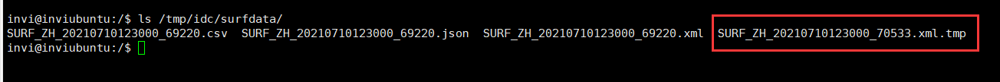

# 完善生成测试数据程序

在最开始我们完成了生成测试数据程序，再开发完调度程序和守护进程之后，发现之前写的生成测试数据程序不够完善。

我们还需要为该程序添加如下功能

- 增加生成历史数据文件的功能，为压缩文件和清理文件模块准备历史数据文件
- 增加信号处理函数，处理2和15的信号
- 解决调用exit函数退出时局部对象没有调用析构函数的问题
- 把心跳信息写入共享内存，让守护进程来监控它

## 增加生成历史数据文件的功能，为压缩文件和清理文件模块准备历史数据文件

我们现在的这个生成测试数据的程序，它生成数据的时候，采用的时间是当前时间，文件名里的时间也是当前时间，文件的时间也是当前的时间。现在我们需要增加一个功能，给他指定一个历史的时间，让他生成的文件的时间要是历史时间，文件名里面的时间也要是历史时间。文件里面的数据也要是历史时间。

我们可以在程序运行的时候，用一个参数给他指定历史时间。

```c++
/*
 *  程序名：crtsurfdata.cpp  本程序用于生成全国气象站点观测的分钟数据。
 *  author：invi
*/

#include "_public.h"

// class CLogFile;
// class CCmdStr;
// class CFile;

// 日志类一般会将其定义为全局的变量
CLogFile logfile;

// 气象站点参数数据eg（结构体）
// 省   站号  站名 纬度   经度  海拔高度
// 安徽,58015,砀山,34.27,116.2,44.2
struct st_stcode
{
  char provname[31];      // 省代码（省名）
  char obtid[11];         // 站号
  char obtname[31];       // 站名
  double lat;             // 纬度
  double lon;             // 经度
  double height;          // 海拔高度
};

// 定义一个存放站点参数的容器
vector<struct st_stcode> vstcode;

// 把气象站点参数加载到参数容器中的函数
bool LoadSTCode(const char * inifile);

char strddatatime[21];    // 观测数据时间

// 全国气象站点分钟观测数据结构
struct st_surfdata
{
  char obtid[11];      // 站点代码。
  char ddatetime[21];  // 数据时间：格式yyyymmddhh24miss
  int  t;              // 气温：单位，0.1摄氏度。
  int  p;              // 气压：0.1百帕。
  int  u;              // 相对湿度，0-100之间的值。
  int  wd;             // 风向，0-360之间的值。
  int  wf;             // 风速：单位0.1m/s
  int  r;              // 降雨量：0.1mm。
  int  vis;            // 能见度：0.1米。
};

// 然后声明一个用于存放观测数据的容器(存放全国气象站点分钟观测数据的容器)
vector<struct st_surfdata> vsurfdata;

// 生成气象观测数据的函数
// 这个函数是根据一个容器再加上一个随机数生成另外一个容器，这种函数的运行不会失败，所以不需要返回值
void CrtSurfData();

// 生成数据文件
bool CrtSurfFile(const char* outpath, const char* datafmt);

// ///////////////////////////////////////////////////////////////////////////////////////////////////////////////////////////////

int main(int argc, char *argv[])
{

  // 全国气象站点参数文件 inifile
  // 生成的测试气象数据存放的目录 outpath
  // 存放的日志 logfile
  // 指定生成的数据保存为什么格式 datafmt
  // 增加一个可选参数，该参数表示生成测试数据的历史时间


  // 所以这个程序有4个参数，那么argc的值应该为5
  if(argc != 5 && argc != 6)
  {
    // 增加一个可选的历史时间参数
    // 不等于4表示程序运行的方法不正确(这里打印提示改程序需要这4个参数)
    printf("Using:./crtsurfdata inifile outpath logfile datafmt [datatime]\n");

    // 只提示正确方法还不够，这里给一个例子说明
    printf("Example:/project/idc1/bin/crtsurfdata /project/idc1/ini/stcode.ini /tmp/surfdata /log/idc/crtsurfdata.log xml,json,csv\n\n");

    // 然后对这些参数做一个详细的打印说明
    printf("全国气象站点参数文件 : inifile \n");
    printf("生成的测试气象数据存放的目录 : outpath\n");
    printf("日志存放路径 : logfile\n");
    printf("指定生成的数据保存为什么格式 : datafmt\n");
    printf("这是一个可选参数，表示生成指定时间的数据和文件： datatime\n\n\n");

    // 程序退出
    return -1;
  }

  // 打开日志
  if(logfile.Open(argv[3]) == false)
  {
    // 日志文件打开失败
    printf("logfile.Open(%s) faild.\n", argv[3]);
    // 程序退出
    return -1;
  }

  // 往日志中写入内容
  logfile.Write("crtsurfdata 开始运行。\n");

  // 业务代码
  // 把气象站点参数加载到参数容器中的函数
  if(LoadSTCode(argv[1]) == false)
  {
    return -1;
  }

  memset(strddatatime, 0, sizeof(strddatatime));
  if(argc == 5)
  {
    // 获取当前时间，作为观测时间
    LocalTime(strddatatime, "yyyymmddhh24miss");
  }
  else
  {
    // 如果提供了历史时间这个参数，就使用历史时间这个参数
    STRCPY(strddatatime, sizeof(strddatatime), argv[5]);
  }

  // 模拟生成全国气象站点分钟观测数据，存放在vsurfdata容器中。
  CrtSurfData();

  // 将生成的测试数据格式化为指定格式的数据文件
  if(strstr(argv[4], "xml") != 0) CrtSurfFile(argv[2], "xml");      // xml
  if(strstr(argv[4], "json") != 0) CrtSurfFile(argv[2], "json");    // json
  if(strstr(argv[4], "csv") != 0) CrtSurfFile(argv[2], "csv");      // csv

  logfile.Write("crtsurfdata 运行结束。\n");

  return 0;
}

// /////////////////////////////////////////////////////////////////////////////////////////////////////////////////////////////////

// 把气象站点参数加载到参数容器中的函数
bool LoadSTCode(const char * inifile)
{
  CFile File;
  // 打开站点参数文件(用只读的方式打开文件)
  if(File.Open(inifile, "r") == false)
  {
    // 文件打开失败，写日志，函数返回
    logfile.Write("File.Open(%s) faild.\n", inifile);
    return false;
  }

  // 定义一个buffer，用于存放从文件中读取到的每一行数据
  char strBuffer[301];

  // 用于字符串拆分的类
  CCmdStr CmdStr;

  // 定义用于保存拆分后的结构体
  struct st_stcode stcode;

  while(true)
  {
    // 从站点参数文件中读取一行，如果已经读取完毕，跳出循环
    // 字符串变量在每一次使用之前，最好进行初始化，但是我们的fgets这个成员函数中，有对buffer的初始化，所以这里可以不写初始化代码
    // memset(strBuffer, 0, sizeof(strBuffer));
    if(File.Fgets(strBuffer, 300, true) == false)
    {
      break;
    }

    // 把读取到的每一行进行拆分, 拆分出来的数据保存到strBuffer中，按","进行拆分，然后删除拆分出来的字符串的前后的空格
    CmdStr.SplitToCmd(strBuffer, ",", true);

    // 这行代码主要是为了处理站点数据文件中第一行的无效数据（因为这行数据没有用","分割，所以拆分结果是1，就不会是6，所以这行拆分数据就给忽略就好
    if(CmdStr.CmdCount() != 6) continue;

    // 把站点参数的每一个数据项保存到站点参数结构体中
    CmdStr.GetValue(0, stcode.provname, 30);    // 省代码（省名
    CmdStr.GetValue(1, stcode.obtid, 10);       // 站号
    CmdStr.GetValue(2, stcode.obtname, 30);     // 站名
    CmdStr.GetValue(3, &stcode.lat);            // 纬度
    CmdStr.GetValue(4, &stcode.lon);            // 经度
    CmdStr.GetValue(5, &stcode.height);         // 海拔高度

    // 把站点参数结构体放入站点参数容器中
    vstcode.push_back(stcode);

  }

  // 关闭文件(这里不用关闭，在CFile类的析构函数中有文件关闭代码，因为是栈上定义的变量，所以超出作用域会自动释放)

  return true;
}

// 生成气象观测数据的函数,将生成的测试数据存放在 vsurfdata容器中
// 这个函数是根据一个容器再加上一个随机数生成另外一个容器，这种函数的运行不会失败，所以不需要返回值
void CrtSurfData()
{
  // 生成随机数种子
  srand(time(0));

  struct st_surfdata stsurfdata;

  // 遍历站点参数容器vscode
  for(auto iter = vstcode.begin(); iter != vstcode.end(); ++iter)
  {
    // 初始化结构体
    memset(&stsurfdata, 0, sizeof(st_surfdata));
    // 用随机数填充分钟观测数据的结构体
    strncpy(stsurfdata.obtid, (*iter).obtid, 10);        // 站点代码
    strncpy(stsurfdata.ddatetime, strddatatime, 14);    // 数据时间，格式yyyymmddhh24miss
    stsurfdata.t=rand()%351;       // 气温：单位，0.1摄氏度
    stsurfdata.p=rand()%265+10000; // 气压：0.1百帕
    stsurfdata.u=rand()%100+1;     // 相对湿度，0-100之间的值。
    stsurfdata.wd=rand()%360;      // 风向，0-360之间的值。
    stsurfdata.wf=rand()%150;      // 风速：单位0.1m/s
    stsurfdata.r=rand()%16;        // 降雨量：0.1mm
    stsurfdata.vis=rand()%5001+100000;  // 能见度：0.1米

    // 把观测数据的结构体放入vsurfdata容器中
    vsurfdata.push_back(stsurfdata);

  }
}

// 生成数据文件 把容器vsurfdata中的全国气象站点的分钟观测数据写入文件
bool CrtSurfFile(const char* outpath, const char* datafmt)
{
  CFile File;
  // 拼接生成数据的文件名 例如：/tmp/surfdata/SURF_ZH_20220322180345_2243.CSV
  char strFileName[301];

  // 文件名采用全路径，文件目录_数据生成时间_进程id.文件类型（注意，文件名拼接上进程id是常用的命名手法，目的是为了保证生成的文件名不重复，当然不加这个也是可以的）
  sprintf(strFileName, "%s/SURF_ZH_%s_%d.%s", outpath, strddatatime, getpid(), datafmt);

  // 打开文件, 以写入的方式打开文件
  if(File.OpenForRename(strFileName, "w") == false)
  {
    // 失败的话，打印日志做一个提示
    // 失败的原因一般都是磁盘空间不足或者权限不足
    logfile.Write("File.OpenForRename(%s) faild.\n", strFileName);
    return false;
  }

  // 写入第一行标题（标题是为了增加该数据文件的可读性，不然你这个数据文件各个字段表示什么意思别人不清楚）
  // 注意，只有数据格式为csv的时候才需要写入标题
  if(strcmp(datafmt, "csv") == 0)
  {
    File.Fprintf("站点代码,数据时间,气温,气压,相对湿度,风向,风速,降雨量,能见度\n");
  }

  // xml数据集开始标签
  if(strcmp(datafmt, "xml") == 0)
  {
    File.Fprintf("<data>\n");
  }

  // Json格式
  if(strcmp(datafmt, "json") == 0)
  {
    File.Fprintf("{\"data\":[\n");
  }

  // 遍历存放观测数据的vsurfdata容器
  for(auto iter = vsurfdata.begin(); iter != vsurfdata.end(); ++iter)
  {

    // 写入一条记录
    if(strcmp(datafmt, "csv") == 0)
    {
      // 这里最后面这3个字段要除以10.0，表示是一个浮点数的运算
      File.Fprintf("%s,%s,%.1f,%.1f,%d,%d,%.1f,%.1f,%.1f\n",\
        (*iter).obtid,(*iter).ddatetime,(*iter).t/10.0,(*iter).p/10.0,\
        (*iter).u,(*iter).wd,(*iter).wf/10.0,(*iter).r/10.0,(*iter).vis/10.0);
    }

    if(strcmp(datafmt, "xml") == 0)
    {
      // 这里最后面这3个字段要除以10.0，表示是一个浮点数的运算
      File.Fprintf("<obtid>%s</obtid><ddatetime>%s</ddatetime><t>%.1f</t><p>%.1f</p>"\
                   "<u>%d</u><wd>%d</wd><wf>%.1f</wf><r>%.1f</r><vis>%.1f</vis><endl/>\n",\
                    (*iter).obtid,(*iter).ddatetime,(*iter).t/10.0,(*iter).p/10.0,\
                    (*iter).u,(*iter).wd,(*iter).wf/10.0,(*iter).r/10.0,(*iter).vis/10.0);
    }

    // 写入一条记录
    if(strcmp(datafmt, "json") == 0)
    {
      // 这里最后面这3个字段要除以10.0，表示是一个浮点数的运算
      File.Fprintf("{\"obtid\":\"%s\",\"ddatetime\":\"%s\",\"t\":\"%.1f\",\"p\":\"%.1f\","\
                   "\"u\":\"%d\",\"wd\":\"%d\",\"wf\":\"%.1f\",\"r\":\"%.1f\",\"vis\":\"%.1f\"}",\
                    (*iter).obtid,(*iter).ddatetime,(*iter).t/10.0,(*iter).p/10.0,\
                    (*iter).u,(*iter).wd,(*iter).wf/10.0,(*iter).r/10.0,(*iter).vis/10.0);
      if(iter != vsurfdata.end() - 1)
      {
        // 如果是最后一行，json数据里就不需要加","
        File.Fprintf(",\n");
      }
      else
      {
        File.Fprintf("\n");
      }
    }

  }

  // xml 数据集结束标签
  if(strcmp(datafmt, "xml") == 0)
  {
    File.Fprintf("</data>\n");
  }

  // json 数据集结束标签
  if(strcmp(datafmt, "json") == 0)
  {
    File.Fprintf("]}\n");
  }

  // 关闭文件
  File. CloseAndRename();

  // 如果程序提供了历史时间这个参数，表示想要生成这个历史时间的测试数据，那么这里生成的文件的时间属性也要更改
  UTime(strFileName, strddatatime);     // 修改文件的时间属性

  // 写日志提示生成文件成功
  logfile.Write("生成数据文件%s成功， 数据生成时间%s, 记录条数%d.\n", strFileName, strddatatime, vsurfdata.size());

  return true;
}

```

编译运行，查看日志。可以看到我们提供的这个历史时间参数已经生效


同时文件的时间属性也被成功修改成我们指定的时间了


## 增加信号处理函数，处理2和15的信号

这个比较简单，就不贴完整代码了

```c++
  // 增加信号处理代码
  // 设置信号，在shell状态下可以用 "kill + 进程号" 正常终止一些进程
  // 但是不要用 "kill -9 + 进程号"强行终止
  CloseIOAndSignal(true);   // 关闭信号和io 这个关闭io和信号的代码不能放在打开日志文件的代码之后，因为它在关闭io的时候会将日志文件的描述符给还回去
  signal(SIGINT, EXIT);    // 信号2处理函数
  signal(SIGTERM, EXIT);   // 信号15处理函数

////////////////////////////////////////////////////////
// 信号处理函数(程序退出的 2 和 15 号信号)
void EXIT(int sig)
{
  logfile.Write("程序退出，sig=%d\n\n", sig);
  exit(0);
}
```

## 解决调用exit函数退出时局部对象没有调用析构函数的问题

注意看我们上面信号处理函数，对于程序终止的代码使用的是 exit函数。而对于exit函数，我们知道

**exit函数和析构函数**

- exit函数不会调用局部对象的析构函数
- exit函数会调用全局对象的析构函数
- return会调用局部和全局对象的析构函数

为了测试，我们程序添加30秒的休眠时间，编译运行，然后在这期间 ctrl + c 中断程序。查看日志，


我们现在这个代码是存在exit退出没有调用局部对象的析构函数的问题的，首先我们使用到了CFile这个类，同时在 `CrtSurfFile` 这个函数中定义了这个类的局部变量并使用。注意CFile这个类操作文件的时候我们采用了临时文件的方法来处理多进程读写文件的问题。OpenForRename这个方法会创建一个临时文件，然后往里面写数据，写完之后再讲文件改名为正式文件。在写入数据的过程中，如果程序被终止，应该把这些临时文件清理掉，清理的工作我们也在CFile这个类的析构函数中写了，但是析构函数如果没有被调用，那么就会在磁盘上留下这些临时文件，所以这里我们这个exit函数调用，是会存在无法调用局部变量CFile这个类的析构函数的问题的。

验证一下，这时候我们看一下生成的数据文件的情况。可以看到确实存在没有被清理的临时文件



要解决这个问题也很简单，把 CFile这个类对象定义为全局对象即可。

```c++
// 定义为全局的对象，解决exit函数不会调用局部对象的析构函数的问题
CFile File;
```

## 把心跳信息写入共享内存，让守护进程来监控它

```c++
  // 进程心跳
  PActive.AddPInfo(20, "crtsurfdata");
  // 然后因为该进程运行时间很短（0.1s都不到），所以就不用更新心跳了（只需要每次调度程序定时调度写入该进程的心跳即可）
```
