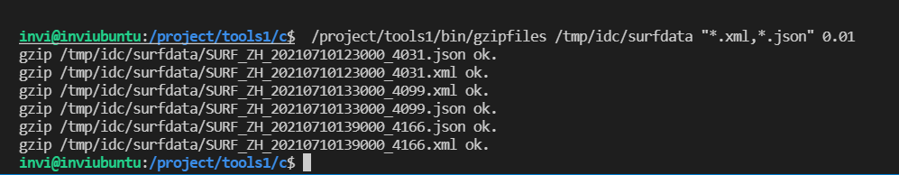

# 两个常用的小工具

- 开发压缩文件模块
- 开发清理历史数据文件模块

这两个工具都是常用的通用工具，所以放在tools目录下

## 开发压缩文件模块

开发思路：

> // 编写程序的帮助
>
> // 关闭全部信号和io(输入输出)
>
> // 获取文件超时的时间点（本程序要压缩历史文件，历史文件怎么定义？）
>
> // 这里可以认为一个小时之前的文件属于历史文件，或者认为3天之前的属于历史文件，这里总有一个时间点，这里我们就获取这个时间点
>
> // 这个时间点，应该是由main函数的参数指定的
>
> // 打开目录，CDir.OpenDir()。打开目录可以使用开发框架里这个CDir类的OpenDir方法来打开目录
>
> // 然后就是遍历目录中的文件名
>
> while(true)
>
> {
>
> ​    // 在循环中调用 CDir.ReadDir()方法读取每个文件的信息（包括文件名，文件时间）
>
> ​    // 然后把文件的时间和超时时间点做比较，如果文件时间更早，就说明是一个历史文件，就需要进行压缩
>
> ​    // 压缩文件，调用操作系统的gzip命令压缩文件
>
> }

### 程序帮助

首先我们先看一下这个帮助

```c++
    if(argc != 4)
    {
        printf("\n");
        printf("Using:/project/tools1/bin/gzipfiles pathname matchstr timeout\n\n");

        printf("Example:/project/tools1/bin/gzipfiles /log/idc \"*.log.20*\" 0.02\n");
        printf("        /project/tools1/bin/gzipfiles /tmp/idc/surfdata \"*.xml,*.json\" 0.01\n");
        printf("        /project/tools1/bin/procctl 300 /project/tools1/bin/gzipfiles /log/idc \"*.log.20*\" 0.02\n");
        printf("        /project/tools1/bin/procctl 300 /project/tools1/bin/gzipfiles /tmp/idc/surfdata \"*.xml,*.json\" 0.01\n\n");

        printf("这是一个工具程序，用于压缩历史的数据文件或日志文件。\n");
        printf("本程序把pathname目录及子目录中timeout天之前的匹配matchstr文件全部压缩，timeout可以是小数。\n");
        printf("本程序不写日志文件，也不会在控制台输出任何信息。\n");
        printf("本程序调用/usr/bin/gzip命令压缩文件。\n\n\n");

        return -1;
    }
```

这里这个程序需要3个参数，psthname指定了扫描的目录，然后matchstr 表示需要处理该目录下的什么文件。timeout是一个时间点，在这个时间点之前的文件会被压缩

看第一个例子：

`/project/tools1/bin/gzipfiles /log/idc \"*.log.20*\" 0.02`

这个例子就表示运行程序，压缩 `/log/idc`这个目录下，匹配 `*.log.20*`的，0.02天之前的文件。

为什么要使用双引号将这个matchstr包起来呢？是因为这个参数它有特殊字符，特殊字符在这里就是这个 `*` ，在linux下，程序的参数如果有特殊字符，是需要使用双引号包起来，比如 `ls -lt`这个命令，`-lt`是他的参数，那么这里给他加上和这个双引号也是可以的，比如 `ls "-lt"`，不加也是可以的，只要记住，如果是存在特殊字符的参数，是需要使用双引号包起来的。然后在c/c++里，双引号做打印的时候，又需要做转义，这里要留意一下。

`/project/tools1/bin/gzipfiles /tmp/idc/surfdata \"*.xml,*.json\" 0.01`

然后看这个，这个程序运行的意思就是将 `/tmp/idc/surfdata`目录下0.01天以前的，以xml和json结尾的文件给删除，这里没什么好讲的，只是要注意一点，就是如果规则中有多个需要匹配的规则，那么规则之间需要使用 `,`分割。

`/project/tools1/bin/procctl 300 /project/tools1/bin/gzipfiles /log/idc \"*.log.20*\" 0.02`

这个表示这个程序需要使用调度程序 `/project/tools1/bin/procctl`来启动

### 关闭IO和信号

```c++
    // 关闭全部信号和io(输入输出)
    // 设置信号,在shell状态下可用 "kill + 进程号" 正常终止些进程。
    // 但请不要用 "kill -9 +进程号" 强行终止。
    CloseIOAndSignal(true);
    signal(SIGINT, EXIT);
    signal(SIGTERM, EXIT);
```

但是在开发阶段，这里io先暂时不关闭，方便调试

### 获取文件超时的时间点

这里我们使用一个字符串来存放这个时间点

```c++
    // 获取文件超时的时间点（本程序要压缩历史文件，历史文件怎么定义？）
    // 这里可以认为一个小时之前的文件属于历史文件，或者认为3天之前的属于历史文件，这里总有一个时间点，这里我们就获取这个时间点
    // 这个时间点，应该是由main函数的参数指定的
    char strTimeOut[21];
    LocalTime(strTimeOut, "yyyy-mm-dd hh:24:ss", 0 - (int)(atof(argv[3])*24*60*60));
```

> atof()是C 语言标准库中的一个字符串处理函数，功能是把字符串转换成浮点数，所使用的头文件为<stdlib.h>。该函数名是 “ascii to floating point numbers” 的缩写。语法格式为：double atof(const char *nptr)。

### 打开目录，CDir.OpenDir()。打开目录可以使用开发框架里这个CDir类的OpenDir方法来打开目录

CDir类声明

```c++
///////////////////////////////////// /////////////////////////////////////
// 目录操作相关的类

// 根据绝对路径的文件名或目录名逐级的创建目录。
// pathorfilename：绝对路径的文件名或目录名。
// bisfilename：说明pathorfilename的类型，true-pathorfilename是文件名，否则是目录名，缺省值为true。
// 返回值：true-成功，false-失败，如果返回失败，原因有大概有三种情况：1）权限不足；2）pathorfilename参数不是合法的文件名或目录名；3）磁盘空间不足。
bool MKDIR(const char *pathorfilename,bool bisfilename=true);


// 获取某目录及其子目录中的文件列表信息。
class CDir
{
public:
  char m_DirName[301];        // 目录名，例如：/tmp/root。
  char m_FileName[301];       // 文件名，不包括目录名，例如：data.xml。
  char m_FullFileName[301];   // 文件全名，包括目录名，例如：/tmp/root/data.xml。
  int  m_FileSize;            // 文件的大小，单位：字节。
  char m_ModifyTime[21];      // 文件最后一次被修改的时间，即stat结构体的st_mtime成员。
  char m_CreateTime[21];      // 文件生成的时间，即stat结构体的st_ctime成员。
  char m_AccessTime[21];      // 文件最后一次被访问的时间，即stat结构体的st_atime成员。
  char m_DateFMT[25];         // 文件时间显示格式，由SetDateFMT方法设置。

  vector<string> m_vFileName; // 存放OpenDir方法获取到的绝对路径文件名清单。
  int m_pos;                  // 已读取m_vFileName容器的位置，每调用一次ReadDir方法m_pos加1。

  CDir();  // 构造函数。

  void initdata(); // 初始化成员变量。

  // 设置文件时间的格式，支持"yyyy-mm-dd hh24:mi:ss"和"yyyymmddhh24miss"两种，缺省是前者。
  void SetDateFMT(const char *in_DateFMT);

  // 打开目录，获取目录中的文件列表信息，存放于m_vFileName容器中。
  // in_DirName，待打开的目录名，采用绝对路径，如/tmp/root。
  // in_MatchStr，待获取文件名的匹配规则，不匹配的文件被忽略，具体请参见开发框架的MatchStr函数。
  // in_MaxCount，获取文件的最大数量，缺省值为10000个。
  // bAndChild，是否打开各级子目录，缺省值为false-不打开子目录。
  // bSort，是否对获取到的文件列表（即m_vFileName容器中的内容）进行排序，缺省值为false-不排序。
  // 返回值：true-成功，false-失败，如果in_DirName参数指定的目录不存在，OpenDir方法会创建该目录，如果创建失败，返回false，如果当前用户对in_DirName目录下的子目录没有读取权限也会返回false。
  bool OpenDir(const char *in_DirName,const char *in_MatchStr,const unsigned int in_MaxCount=10000,const bool bAndChild=false,bool bSort=false);

  // 这是一个递归函数，被OpenDir()的调用，在CDir类的外部不需要调用它。
  bool _OpenDir(const char *in_DirName,const char *in_MatchStr,const unsigned int in_MaxCount,const bool bAndChild);

  // 从m_vFileName容器中获取一条记录（文件名），同时获取该文件的大小、修改时间等信息。
  // 调用OpenDir方法时，m_vFileName容器被清空，m_pos归零，每调用一次ReadDir方法m_pos加1。
  // 当m_pos小于m_vFileName.size()，返回true，否则返回false。
  bool ReadDir();

  ~CDir();  // 析构函数。
};

///////////////////////////////////// /////////////////////////////////////
```

CDir类实现

```c++
CDir::CDir()
{
  m_pos=0;

  STRCPY(m_DateFMT,sizeof(m_DateFMT),"yyyy-mm-dd hh24:mi:ss");

  m_vFileName.clear();

  initdata();
}

void CDir::initdata()
{
  memset(m_DirName,0,sizeof(m_DirName));
  memset(m_FileName,0,sizeof(m_FileName));
  memset(m_FullFileName,0,sizeof(m_FullFileName));
  m_FileSize=0;
  memset(m_CreateTime,0,sizeof(m_CreateTime));
  memset(m_ModifyTime,0,sizeof(m_ModifyTime));
  memset(m_AccessTime,0,sizeof(m_AccessTime));
}

// 设置文件时间的格式，支持"yyyy-mm-dd hh24:mi:ss"和"yyyymmddhh24miss"两种，缺省是前者。
void CDir::SetDateFMT(const char *in_DateFMT)
{
  memset(m_DateFMT,0,sizeof(m_DateFMT));
  STRCPY(m_DateFMT,sizeof(m_DateFMT),in_DateFMT);
}

// 打开目录，获取目录中的文件列表信息，存放于m_vFileName容器中。
// in_DirName，待打开的目录名。
// in_MatchStr，待获取文件名的匹配规则，不匹配的文件被忽略。
// in_MaxCount，获取文件的最大数量，缺省值为10000个。
// bAndChild，是否打开各级子目录，缺省值为false-不打开子目录。
// bSort，是否对获取到的文件列表（即m_vFileName容器中的内容）进行排序，缺省值为false-不排序。
// 返回值：如果in_DirName参数指定的目录不存在，OpenDir方法会创建该目录，如果创建失败，返回false，还有，如果当前用户对in_DirName目录下的子目录没有读取权限也会返回false，其它正常情况下都会返回true。
bool CDir::OpenDir(const char *in_DirName,const char *in_MatchStr,const unsigned int in_MaxCount,const bool bAndChild,bool bSort)
{
  m_pos=0;
  m_vFileName.clear();

  // 如果目录不存在，就创建该目录
  if (MKDIR(in_DirName,false) == false) return false;

  bool bRet=_OpenDir(in_DirName,in_MatchStr,in_MaxCount,bAndChild);

  if (bSort==true)
  {
    sort(m_vFileName.begin(), m_vFileName.end());
  }

  return bRet;
}

// 这是一个递归函数，用于OpenDir()的调用，在CDir类的外部不需要调用它。
bool CDir::_OpenDir(const char *in_DirName,const char *in_MatchStr,const unsigned int in_MaxCount,const bool bAndChild)
{
  DIR *dir;

  if ( (dir=opendir(in_DirName)) == 0 ) return false;

  char strTempFileName[3001];

  struct dirent *st_fileinfo;
  struct stat st_filestat;

  while ((st_fileinfo=readdir(dir)) != 0)
  {
    // 以"."打头的文件不处理
    if (st_fileinfo->d_name[0]=='.') continue;
        
    SNPRINTF(strTempFileName,sizeof(strTempFileName),300,"%s//%s",in_DirName,st_fileinfo->d_name);

    UpdateStr(strTempFileName,"//","/");

    stat(strTempFileName,&st_filestat);

    // 判断是否是目录，如果是，处理各级子目录。
    if (S_ISDIR(st_filestat.st_mode))
    {
      if (bAndChild == true)
      {
        if (_OpenDir(strTempFileName,in_MatchStr,in_MaxCount,bAndChild) == false) 
        {
          closedir(dir); return false;
        }
      }
    }
    else
    {
      // 如果是文件，把能匹配上的文件放入m_vFileName容器中。
      if (MatchStr(st_fileinfo->d_name,in_MatchStr) == false) continue;

      m_vFileName.push_back(strTempFileName);

      if ( m_vFileName.size()>=in_MaxCount ) break;
    }
  }

  closedir(dir);

  return true;
}

/*
st_gid 
  Numeric identifier of group that owns file (UNIX-specific) This field will always be zero on NT systems. A redirected file is classified as an NT file.
st_atime
  Time of last access of file.
st_ctime
  Time of creation of file.
st_dev
  Drive number of the disk containing the file (same as st_rdev).
st_ino
  Number of the information node (the inode) for the file (UNIX-specific). On UNIX file systems, the inode describes the file date and time stamps, permissions, and content. When files are hard-linked to one another, they share the same inode. The inode, and therefore st_ino, has no meaning in the FAT, HPFS, or NTFS file systems.
st_mode
  Bit mask for file-mode information. The _S_IFDIR bit is set if path specifies a directory; the _S_IFREG bit is set if path specifies an ordinary file or a device. User read/write bits are set according to the file’s permission mode; user execute bits are set according to the filename extension.
st_mtime
  Time of last modification of file.
st_nlink
  Always 1 on non-NTFS file systems.
st_rdev
  Drive number of the disk containing the file (same as st_dev).
st_size
  Size of the file in bytes; a 64-bit integer for _stati64 and _wstati64
st_uid
  Numeric identifier of user who owns file (UNIX-specific). This field will always be zero on NT systems. A redirected file is classified as an NT file.
*/

// 从m_vFileName容器中获取一条记录（文件名），同时得到该文件的大小、修改时间等信息。
// 调用OpenDir方法时，m_vFileName容器被清空，m_pos归零，每调用一次ReadDir方法m_pos加1。
// 当m_pos小于m_vFileName.size()，返回true，否则返回false。
bool CDir::ReadDir()
{
  initdata();

  int ivsize=m_vFileName.size();

  // 如果已读完，清空容器
  if (m_pos >= ivsize) 
  {
    m_pos=0; m_vFileName.clear(); return false;
  }

  int pos=0;

  pos=m_vFileName[m_pos].find_last_of("/");

  // 目录名
  STRCPY(m_DirName,sizeof(m_DirName),m_vFileName[m_pos].substr(0,pos).c_str());

  // 文件名
  STRCPY(m_FileName,sizeof(m_FileName),m_vFileName[m_pos].substr(pos+1,m_vFileName[m_pos].size()-pos-1).c_str());

  // 文件全名，包括路径
  SNPRINTF(m_FullFileName,sizeof(m_FullFileName),300,"%s",m_vFileName[m_pos].c_str());

  struct stat st_filestat;

  stat(m_FullFileName,&st_filestat);

  m_FileSize=st_filestat.st_size;

  struct tm nowtimer;

  if (strcmp(m_DateFMT,"yyyy-mm-dd hh24:mi:ss") == 0)
  {
    nowtimer = *localtime(&st_filestat.st_mtime);
    // localtime_r(&st_filestat.st_mtime,&nowtimer); 
    nowtimer.tm_mon++;
    snprintf(m_ModifyTime,20,"%04u-%02u-%02u %02u:%02u:%02u",\
             nowtimer.tm_year+1900,nowtimer.tm_mon,nowtimer.tm_mday,\
             nowtimer.tm_hour,nowtimer.tm_min,nowtimer.tm_sec);

    nowtimer = *localtime(&st_filestat.st_ctime);
    // localtime_r(&st_filestat.st_ctime,&nowtimer); 
    nowtimer.tm_mon++;
    snprintf(m_CreateTime,20,"%04u-%02u-%02u %02u:%02u:%02u",\
             nowtimer.tm_year+1900,nowtimer.tm_mon,nowtimer.tm_mday,\
             nowtimer.tm_hour,nowtimer.tm_min,nowtimer.tm_sec);

    nowtimer = *localtime(&st_filestat.st_atime);
    // localtime_r(&st_filestat.st_atime,&nowtimer); 
    nowtimer.tm_mon++;
    snprintf(m_AccessTime,20,"%04u-%02u-%02u %02u:%02u:%02u",\
             nowtimer.tm_year+1900,nowtimer.tm_mon,nowtimer.tm_mday,\
             nowtimer.tm_hour,nowtimer.tm_min,nowtimer.tm_sec);
  }

  if (strcmp(m_DateFMT,"yyyymmddhh24miss") == 0)
  {
    nowtimer = *localtime(&st_filestat.st_mtime);
    // localtime_r(&st_filestat.st_mtime,&nowtimer); 
    nowtimer.tm_mon++;
    snprintf(m_ModifyTime,20,"%04u%02u%02u%02u%02u%02u",\
             nowtimer.tm_year+1900,nowtimer.tm_mon,nowtimer.tm_mday,\
             nowtimer.tm_hour,nowtimer.tm_min,nowtimer.tm_sec);

    nowtimer = *localtime(&st_filestat.st_ctime);
    // localtime_r(&st_filestat.st_ctime,&nowtimer); 
    nowtimer.tm_mon++;
    snprintf(m_CreateTime,20,"%04u%02u%02u%02u%02u%02u",\
             nowtimer.tm_year+1900,nowtimer.tm_mon,nowtimer.tm_mday,\
             nowtimer.tm_hour,nowtimer.tm_min,nowtimer.tm_sec);

    nowtimer = *localtime(&st_filestat.st_atime);
    // localtime_r(&st_filestat.st_atime,&nowtimer); 
    nowtimer.tm_mon++;
    snprintf(m_AccessTime,20,"%04u%02u%02u%02u%02u%02u",\
             nowtimer.tm_year+1900,nowtimer.tm_mon,nowtimer.tm_mday,\
             nowtimer.tm_hour,nowtimer.tm_min,nowtimer.tm_sec);
  }

  m_pos++;

  return true;
}

CDir::~CDir()
{
  m_vFileName.clear();

  // m_vDirName.clear();
}

// 删除目录中的文件，类似Linux系统的rm命令。
// filename：待删除的文件名，建议采用绝对路径的文件名，例如/tmp/root/data.xml。
// times：执行删除文件的次数，缺省是1，建议不要超过3，从实际应用的经验看来，如果删除文件第1次不成功，再尝试
// 2次是可以的，更多就意义不大了。还有，如果执行删除失败，usleep(100000)后再重试。
// 返回值：true-删除成功；false-删除失败，失败的主要原因是权限不足。
// 在应用开发中，可以用REMOVE函数代替remove库函数。
bool REMOVE(const char *filename,const int times)
{
  // 如果文件不存在，直接返回失败
  if (access(filename,R_OK) != 0) return false;

  for (int ii=0;ii<times;ii++)
  {
    if (remove(filename) == 0) return true;

    usleep(100000);
  }

  return false;
}

// 把文件重命名，类似Linux系统的mv命令。
// srcfilename：原文件名，建议采用绝对路径的文件名。
// dstfilename：目标文件名，建议采用绝对路径的文件名。
// times：执行重命名文件的次数，缺省是1，建议不要超过3，从实际应用的经验看来，如果重命名文件第1次不成功，再尝
// 试2次是可以的，更多次就意义不大了。还有，如果执行重命名失败，usleep(100000)后再重试。
// 返回值：true-重命名成功；false-重命名失败，失败的主要原因是权限不足或磁盘空间不够，如果原文件和目标文件不
// 在同一个磁盘分区，重命名也可能失败。
// 注意，在重命名文件之前，会自动创建dstfilename参数中的目录名。
// 在应用开发中，可以用RENAME函数代替rename库函数。
bool RENAME(const char *srcfilename,const char *dstfilename,const int times)
{
  // 如果文件不存在，直接返回失败
  if (access(srcfilename,R_OK) != 0) return false;

  if (MKDIR(dstfilename) == false) return false;

  for (int ii=0;ii<times;ii++)
  {
    if (rename(srcfilename,dstfilename) == 0) return true;

    usleep(100000);
  }

  return false;
}
```

CDir这个类用于获取某目录及其子目录文件列表中的文件信息，使用这个类的流程是这样的，首先调用OpenDir方法，这个方法会打开目录，把目录中的文件清单存放在  `vector<string> m_vFileName; // 存放OpenDir方法获取到的绝对路径文件名清单。` 这个容器中，然后用一个循环，在循环中调用ReadDir方法，每调用一次ReadDir，就会从容器中获取一条记录，一条记录就是一个文件名，同时获取该文件的详细信息，包括他的大小，修改时间等等。文件的详细信息存放在类的成员变量中。

**这里 `OpenDir`这个方法，它里面有一个参数，获取文件数量，为什么需要这个参数呢？**

原因是这样的， `OpenDir`这个方法把某个文件目录下的文件清单读取出来，放到一个容器中，有时候这个目录下的文件数量可能有几十万个之多，会让这个容器变得非常大。但是实际业务处理的时候，并不需要一次性把全部的文件都读取出来，他可以分批次处理，一次处理一万或者两万个，这样的话就不会对内存照成太大的压力。

### 然后把文件的时间和超时时间点做比较，如果文件时间更早，就说明是一个历史文件，就需要进行压缩

```c++
        // 然后把文件的时间和超时时间点做比较，如果文件时间更早，就说明是一个历史文件，就需要进行压缩
        // 注意：这里不仅要和时间点做比较，还要和文件名做比（通过文件名来判断是否是已经被压缩过的文件，压缩过的文件就需要进行压缩了）
        // MatchStr 是框架里的一个用于比较字符串是否匹配的函数
        if((strcmp(Dir.m_ModifyTime, strTimeOut)) < 0 && (MatchStr(Dir.m_FileName, "*.gz") == false))
        {
            // 压缩文件，调用操作系统的gzip命令压缩文件
            // SNPRINTF 函数是框架里的安全函数，功能和snprintf是一样的（将可变参数 “…” 按照format的格式格式化为字符串，然后再将其拷贝至str中。）
            // 1>/dev/null 2>/dev/null 这两各参数的写法是我们经常的写法，就是将标准输出和标准错误都定位为空（黑洞），也就是不用输出任何东西
            SNPRINTF(strCmd, sizeof(strCmd), 1000, "/usr/bin/gzip -f %s 1>/dev/null 2>/dev/null", Dir.m_FullFileName);
            if(system(strCmd) == 0)
            {
                printf("gzip %s ok.\n", Dir.m_FullFileName);
            }
            else
            {
                printf("gzip %s faild.\n", Dir.m_FullFileName);
            }
        }
```

### 压缩文件，调用操作系统的gzip命令压缩文件

这里调用系统的 `gzip`指令可以使用我们之前的 `execl 和 execv`这两个函数，也可以使用另外一个更简单的函数，`system`

**system**

```shell
SYNOPSIS
       #include <stdlib.h>

       int system(const char *command);

DESCRIPTION
       The system() library function uses fork(2) to create a child process that executes the shell command specified in command using execl(3) as follows:

           execl("/bin/sh", "sh", "-c", command, (char *) NULL);

       system() returns after the command has been completed.

       During execution of the command, SIGCHLD will be blocked, and SIGINT and SIGQUIT will be ignored, in the process that calls system().  (These signals will be handled according
       to their defaults inside the child process that executes command.)

       If command is NULL, then system() returns a status indicating whether a shell is available on the system.

```

system是一个C/C++的函数。windows操作系统下system () 函数详解主要是在C语言中的应用，system函数需加头文件<stdlib.h>后方可调用。功 能： 发出一个 DOS/shell 命令

这个函数很简单，只有一个参数，这个参数就是需要执行命令。

编译运行，然后生成测试数据，然后运行压缩文件程序，只压缩json和xml文件



查看文件压缩情况，成功


**关于这个压缩程序是否需要写心跳？**

这个服务程序我认为是不需要写心跳的，首先，因为这个程序比较简单，这种很简单的程序一般不会死机，其二，对于压缩程序来说，有的压缩文件较大，需要的时间会比较久，那么这个心跳超时时间就不好定夺，所以基于这两点，这个程序的心跳就可以不写了。

### 源代码

```c++
#include "_public.h"

// 程序退出和信号2,15的处理函数
void EXIT(int sig);

int main(int argc, char* argv[])
{
    // 程序的帮助
    if(argc != 4)
    {
        printf("\n");
        printf("Using:/project/tools1/bin/gzipfiles pathname matchstr timeout\n\n");

        printf("Example:/project/tools1/bin/gzipfiles /log/idc \"*.log.20*\" 0.02\n");
        printf("        /project/tools1/bin/gzipfiles /tmp/idc/surfdata \"*.xml,*.json\" 0.01\n");
        printf("        /project/tools1/bin/procctl 300 /project/tools1/bin/gzipfiles /log/idc \"*.log.20*\" 0.02\n");
        printf("        /project/tools1/bin/procctl 300 /project/tools1/bin/gzipfiles /tmp/idc/surfdata \"*.xml,*.json\" 0.01\n\n");

        printf("这是一个工具程序，用于压缩历史的数据文件或日志文件。\n");
        printf("本程序把pathname目录及子目录中timeout天之前的匹配matchstr文件全部压缩，timeout可以是小数。\n");
        printf("本程序不写日志文件，也不会在控制台输出任何信息。\n");
        printf("本程序调用/usr/bin/gzip命令压缩文件。\n\n\n");

        return -1;
    }

    // 关闭全部信号和io(输入输出)                                                                                       
    // 设置信号,在shell状态下可用 "kill + 进程号" 正常终止些进程。
    // 但请不要用 "kill -9 +进程号" 强行终止。
    // CloseIOAndSignal(true);
    signal(SIGINT, EXIT);
    signal(SIGTERM, EXIT);

    // 获取文件超时的时间点（本程序要压缩历史文件，历史文件怎么定义？）
    // 这里可以认为一个小时之前的文件属于历史文件，或者认为3天之前的属于历史文件，这里总有一个时间点，这里我们就获取这个时间点
    // 这个时间点，应该是由main函数的参数指定的
    char strTimeOut[21];
    LocalTime(strTimeOut, "yyyy-mm-dd hh24:mi:ss", 0 - (int)(atof(argv[3])*24*60*60));

    // 打开目录，CDir.OpenDir()。打开目录可以使用开发框架里这个CDir类的OpenDir方法来打开目录
    CDir Dir;
    // 打开文件的目录，打开文件的匹配规则，最多打开10000个文件，需要遍历子目录，对文件不排序
    if(Dir.OpenDir(argv[1], argv[2], 10000, true, false) == false)
    {
        printf("Dir.OpenDir(%s, %s, 10000, true, false) faild \n", argv[1], argv[2]);
        return -1;
    }

    char strCmd[1024];      // 存放 gzip 压缩文件的命令
    // 然后就是遍历目录中的文件名
    while(true)
    {
        // 在循环中调用 CDir.ReadDir()方法读取每个文件的信息（包括文件名，文件时间）
        if(Dir.ReadDir() == false)
        {
            // 读取失败，表示没有文件了（读完了）
            break;
        }

        // printf("DirName=%s, FileName=%s, FullFileName=%s, FileSize=%d, ModifyTime=%s, CreateTime=%s, AccessTime=%s\n",\
        //         Dir.m_DirName, Dir.m_FileName, Dir.m_FullFileName, Dir.m_FileSize, Dir.m_ModifyTime, Dir.m_CreateTime, Dir.m_AccessTime);

        // 然后把文件的时间和超时时间点做比较，如果文件时间更早，就说明是一个历史文件，就需要进行压缩
        // 注意：这里不仅要和时间点做比较，还要和文件名做比（通过文件名来判断是否是已经被压缩过的文件，压缩过的文件就需要进行压缩了）
        // MatchStr 是框架里的一个用于比较字符串是否匹配的函数
        if((strcmp(Dir.m_ModifyTime, strTimeOut)) < 0 && (MatchStr(Dir.m_FileName, "*.gz") == false))
        {
            // 压缩文件，调用操作系统的gzip命令压缩文件
            // SNPRINTF 函数是框架里的安全函数，功能和snprintf是一样的（将可变参数 “…” 按照format的格式格式化为字符串，然后再将其拷贝至str中。）
            // 1>/dev/null 2>/dev/null 这两各参数的写法是我们经常的写法，就是将标准输出和标准错误都定位为空（黑洞），也就是不用输出任何东西
            SNPRINTF(strCmd, sizeof(strCmd), 1000, "/usr/bin/gzip -f %s 1>/dev/null 2>/dev/null", Dir.m_FullFileName);
            if(system(strCmd) == 0)
            {
                printf("gzip %s ok.\n", Dir.m_FullFileName);
            }
            else
            {
                printf("gzip %s faild.\n", Dir.m_FullFileName);
            }
        }

    }

    return 0;
}

void EXIT(int sig)
{
    printf("程序退出， sig = %d\n\n", sig);

    exit(0);
}
```

---


## 开发清理历史数据文件模块

这个服务程序他的原理和压缩文件其实是一致的，区别在于最后的执行的系统指令的不同，清理历史数据，调用的是系统的删除文件的指令。

```c++
#include "_public.h"

// 程序退出和信号2、15的处理函数。
void EXIT(int sig);

int main(int argc,char *argv[])
{
  // 程序的帮助。
  if (argc != 4)
  {
    printf("\n");
    printf("Using:/project/tools1/bin/deletefiles pathname matchstr timeout\n\n");

    printf("Example:/project/tools1/bin/deletefiles /log/idc \"*.log.20*\" 0.02\n");
    printf("        /project/tools1/bin/deletefiles /tmp/idc/surfdata \"*.xml,*.json\" 0.01\n");
    printf("        /project/tools1/bin/procctl 300 /project/tools1/bin/deletefiles /log/idc \"*.log.20*\" 0.02\n");
    printf("        /project/tools1/bin/procctl 300 /project/tools1/bin/deletefiles /tmp/idc/surfdata \"*.xml,*.json\" 0.01\n\n");

    printf("这是一个工具程序，用于删除历史的数据文件或日志文件。\n");
    printf("本程序把pathname目录及子目录中timeout天之前的匹配matchstr文件全部删除，timeout可以是小数。\n");
    printf("本程序不写日志文件，也不会在控制台输出任何信息。\n\n\n");

    return -1;
  }

  // 关闭全部的信号和输入输出。
  // 设置信号,在shell状态下可用 "kill + 进程号" 正常终止些进程。
  // 但请不要用 "kill -9 +进程号" 强行终止。
  CloseIOAndSignal(true);
  signal(SIGINT,EXIT);  signal(SIGTERM,EXIT);

  // 获取文件超时的时间点。
  char strTimeOut[21];
  LocalTime(strTimeOut,"yyyy-mm-dd hh24:mi:ss",0-(int)(atof(argv[3])*24*60*60));

  CDir Dir;
  // 打开目录，CDir.OpenDir()
  if (Dir.OpenDir(argv[1],argv[2],10000,true)==false)
  {
    printf("Dir.OpenDir(%s) failed.\n",argv[1]); return -1;
  }

  // 遍历目录中的文件名。
  while (true)
  {
    // 得到一个文件的信息，CDir.ReadDir()
    if (Dir.ReadDir()==false) break;
        printf("=%s=\n",Dir.m_FullFileName);  
    // 与超时的时间点比较，如果更早，就需要删除。
    if (strcmp(Dir.m_ModifyTime,strTimeOut)<0) 
    {
      if (REMOVE(Dir.m_FullFileName)==0) 
        printf("REMOVE %s ok.\n",Dir.m_FullFileName);
      else
        printf("REMOVE %s failed.\n",Dir.m_FullFileName);
    }
  }

  return 0;
}

void EXIT(int sig)
{
  printf("程序退出，sig=%d\n\n",sig);

  exit(0);
}

```

注意：这里删除调用的是封装好的 `REMOVE`函数，它里面封装调用的是系统的 `remove`函数。
