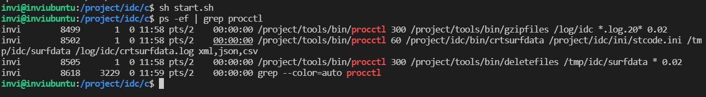
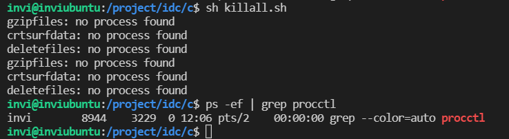

# 服务程序运行的策略

以上我们已经完成生成测试数据服务程序，调度程序，守护程序等程序的开发，有了这些程序，我们现在就可以搭建服务程序的运行框架，让程序先跑起来，然后我们再可以继续向框架中添加功能程序。

软件项目是系统工程，工程有大有小，大的软件项目在后台运行的程序会有上千个，这么多的服务程序在后台怎么管理，怎么启动，怎么停止？

我们可以采用shell脚本来进行管理。

## 启动数据中心后台服务程序的脚本

```shell
####################################################################
# 启动数据中心后台服务程序的脚本。
####################################################################

# 检查服务程序是否超时，配置在/etc/rc.local中由root用户执行。
#/project/tools1/bin/procctl 30 /project/tools1/bin/checkproc

# 压缩数据中心后台服务程序的备份日志。
/project/tools1/bin/procctl 300 /project/tools1/bin/gzipfiles /log/idc "*.log.20*" 0.02

# 生成用于测试的全国气象站点观测的分钟数据。
/project/tools1/bin/procctl  60 /project/idc1/bin/crtsurfdata /project/idc/ini/stcode.ini /tmp/idc/surfdata /log/idc/crtsurfdata.log xml,json,csv

# 清理原始的全国气象站点观测的分钟数据目录/tmp/idc/surfdata中的历史数据文件。
/project/tools1/bin/procctl 300 /project/tools1/bin/deletefiles /tmp/idc/surfdata "*" 0.02

```



可以看到执行shell脚本，可以成功将服务程序启动。

## 停止数据中心后台服务程序的脚本

如果需要停止这些服务程序，我们可以另写一个shell脚本。

```shell
####################################################################
# 停止数据中心后台服务程序的脚本。
####################################################################

killall -9 procctl
killall gzipfiles crtsurfdata deletefiles

sleep 3

killall -9 gzipfiles crtsurfdata deletefiles

```

这个脚本，第一行，先使用 -9 的参数杀死调度程序，然后再kill每个服务程序，然后等待3秒，然后在 -9 杀掉全部的服务程序。

注意这里，开头两行的脚本顺序不能颠倒，必须先终止调度程序，然后才能发送killall，否则，如果先killall，然后调度程序还存活的情况下，有可能会把刚刚杀死的程序又给调度启动了。



执行脚本，可以看到可以正常终止我们之前启动的程序

## 如何在操作系统启动的时候，把服务程序运行起来

注意：因为我这边使用的是ubuntu21，所以，系统开机启动程序的配置文件不是普通linux（centeros)下的 `/etc/rc.local`这个文件，而是 `/lib/systemd/system/rc-local.service`这个文件。注意区别，我们打开这个 文件然后再尾部添加服务启动程序脚本。保存退出，

```shell
# 检查服务程序是否超时，配置在/etc/rc.local中由root用户执行。
/project/tools/bin/procctl 30 /project/tools/bin/checkproc

# 启动数据中心的后台服务程序
su - invi -c "/bin/sh /project/idc/c/start.h"
```

守护进程由超级用户直接启动它。普通用户是杀不了超级用户的进程的。守护进程和其他业务不一样，业务服务程序偶尔需要重新启动，但是守护进程不需要，还有如果守护进程停下来了，就不能够监视其他进程，所以让守护进程用超级用户来启动。

`su - invi -c "/bin/sh /project/idc/c/start.h"`这行脚本就是让系统切换到 invi 用户，然后去执行shell脚本

# ubuntu20.04设置开机启动

```shell
sudo vim /lib/systemd/system/rc-local.service
```

在文件尾部中添加：

```shell
# 检查服务程序是否超时，配置在/etc/rc.local中由root用户执行。
/project/tools/bin/procctl 30 /project/tools/bin/checkproc

# 启动数据中心的后台服务程序
su - invi -c "/bin/sh /project/idc/c/start.h"
```

随后创建rc.local文件，

```shell
sudo vim /etc/rc.local
```

并添加以下内容：#不能添加阻塞进程 不然开机卡死

```shell
#!/bin/sh
echo "看到这行字，说明添加自启动脚本成功。" > /usr/local/test.log
exit 0
```

给rc.local加上权限

```shell
sudo chmod +x /etc/rc.local
```

在 /etc/systemd/system 目录下创建软链接

```shell
sudo ln -s /lib/systemd/system/rc-local.service /etc/systemd/system/
```

重启后在 /usr/local/test.log中看到文字说明设置成功
