# FTP客户端封装

- 寻找开源的ftplib库，封装成C++的 Cftp类
- 掌握Cftp类的使用方法

在项目中需要编程的是FTP客户端，不用管服务端，服务端在各个系统中已经有成熟的ftp服务端软件

首先在github上找一个开源的ftp库 <https://github.com/codebrainz/ftplib，然后将其ftplib.c和ftplib.h拷贝下来，放在public>目录下。然后把它编译成库。编译指令：

```makefile
libftp.a:ftplib.h ftplib.c
 gcc -c -o libftp.a ftplib.c
```

把它编译为.a文件。因为这个是一个纯c的库，所以为了使用方便，这里做了另外一层封装，将其封装为c++的类。

_ftp.h

```c++
/****************************************************************************************/
/*   程序名：_ftp.h，此程序是开发框架的ftp客户端工具的类的声明文件。                    */
/*   author：invi 
/****************************************************************************************/

#ifndef __FTP_H
#define __FTP_H

#include "_public.h"
#include "ftplib.h"

class Cftp
{
public:
  netbuf *m_ftpconn;   // ftp连接句柄。
  unsigned int m_size; // 文件的大小，单位：字节。
  char m_mtime[21];    // 文件的修改时间，格式：yyyymmddhh24miss。

  // 以下三个成员变量用于存放login方法登录失败的原因。
  bool m_connectfailed;    // 连接失败。
  bool m_loginfailed;      // 登录失败，用户名和密码不正确，或没有登录权限。
  bool m_optionfailed;     // 设置传输模式失败。

  Cftp();  // 类的构造函数。
 ~Cftp();  // 类的析构函数。

  void initdata();   // 初始化m_size和m_mtime成员变量。

  // 登录ftp服务器。
  // host：ftp服务器ip地址和端口，中间用":"分隔，如"192.168.1.1:21"。
  // username：登录ftp服务器用户名。
  // password：登录ftp服务器的密码。
  // imode：传输模式，1-FTPLIB_PASSIVE是被动模式，2-FTPLIB_PORT是主动模式，缺省是被动模式。
  bool login(const char *host,const char *username,const char *password,const int imode=FTPLIB_PASSIVE);
  
  // 注销。
  bool logout();

  // 获取ftp服务器上文件的时间。
  // remotefilename：待获取的文件名。
  // 返回值：false-失败；true-成功，获取到的文件时间存放在m_mtime成员变量中。
  bool mtime(const char *remotefilename);

  // 获取ftp服务器上文件的大小。
  // remotefilename：待获取的文件名。
  // 返回值：false-失败；true-成功，获取到的文件大小存放在m_size成员变量中。
  bool size(const char *remotefilename);

  // 改变ftp服务器的当前工作目录。
  // remotedir：ftp服务器上的目录名。
  // 返回值：true-成功；false-失败。
  bool chdir(const char *remotedir);

  // 在ftp服务器上创建目录。
  // remotedir：ftp服务器上待创建的目录名。
  // 返回值：true-成功；false-失败。
  bool mkdir(const char *remotedir);

  // 删除ftp服务器上的目录。
  // remotedir：ftp服务器上待删除的目录名。
  // 返回值：true-成功；如果权限不足、目录不存在或目录不为空会返回false。
  bool rmdir(const char *remotedir);

  // 发送NLST命令列出ftp服务器目录中的子目录名和文件名。
  // remotedir：ftp服务器的目录名。
  // listfilename：用于保存从服务器返回的目录和文件名列表。
  // 返回值：true-成功；false-失败。
  // 注意：如果列出的是ftp服务器当前目录，remotedir用"","*","."都可以，但是，不规范的ftp服务器可能有差别。
  bool nlist(const char *remotedir,const char *listfilename);

  // 从ftp服务器上获取文件。
  // remotefilename：待获取ftp服务器上的文件名。
  // localfilename：保存到本地的文件名。
  // bCheckMTime：文件传输完成后，是否核对远程文件传输前后的时间，保证文件的完整性。
  // 返回值：true-成功；false-失败。
  // 注意：文件在传输的过程中，采用临时文件命名的方法，即在localfilename后加".tmp"，在传输
  // 完成后才正式改为localfilename。
  bool get(const char *remotefilename,const char *localfilename,const bool bCheckMTime=true);

  // 向ftp服务器发送文件。
  // localfilename：本地待发送的文件名。
  // remotefilename：发送到ftp服务器上的文件名。
  // bCheckSize：文件传输完成后，是否核对本地文件和远程文件的大小，保证文件的完整性。
  // 返回值：true-成功；false-失败。
  // 注意：文件在传输的过程中，采用临时文件命名的方法，即在remotefilename后加".tmp"，在传输
  // 完成后才正式改为remotefilename。
  bool put(const char *localfilename,const char *remotefilename,const bool bCheckSize=true);

  // 删除ftp服务器上的文件。
  // remotefilename：待删除的ftp服务器上的文件名。
  // 返回值：true-成功；false-失败。
  bool ftpdelete(const char *remotefilename);

  // 重命名ftp服务器上的文件。
  // srcremotefilename：ftp服务器上的原文件名。
  // dstremotefilename：ftp服务器上的目标文件名。
  // 返回值：true-成功；false-失败。
  bool ftprename(const char *srcremotefilename,const char *dstremotefilename);

  /* 以下三个方法如果理解不了就算了，可以不启用。 */
  // 发送LIST命令列出ftp服务器目录中的文件。
  // 参数和返回值与nlist方法相同。
  bool dir(const char *remotedir,const char *listfilename);

  // 向ftp服务器发送site命令。
  // command：命令的内容。
  // 返回值：true-成功；false-失败。
  bool site(const char *command);

  // 获取服务器返回信息的最后一条(return a pointer to the last response received)。
  char *response();
};

#endif

```

_ftp.cpp

```c++
/****************************************************************************************/
/*   程序名：_ftp.cpp，此程序是开发框架的ftp客户端工具的类的定义文件。                  */
/*   author：invi 
/****************************************************************************************/

#include "_ftp.h"

Cftp::Cftp()
{
  m_ftpconn=0;

  initdata();

  FtpInit();

  m_connectfailed=false;
  m_loginfailed=false;
  m_optionfailed=false;
}

Cftp::~Cftp()
{
  logout();
}

void Cftp::initdata()
{
  m_size=0;

  memset(m_mtime,0,sizeof(m_mtime));
}

bool Cftp::login(const char *host,const char *username,const char *password,const int imode)
{
  if (m_ftpconn != 0) { FtpQuit(m_ftpconn); m_ftpconn=0; }

  m_connectfailed=m_loginfailed=m_optionfailed=false;

  if (FtpConnect(host,&m_ftpconn) == false)  { m_connectfailed=true; return false; }

  if (FtpLogin(username,password,m_ftpconn) == false)  { m_loginfailed=true; return false; }

  if (FtpOptions(FTPLIB_CONNMODE,(long)imode,m_ftpconn) == false) { m_optionfailed=true; return false; }

  return true;
}

bool Cftp::logout()
{
  if (m_ftpconn == 0) return false;

  FtpQuit(m_ftpconn);

  m_ftpconn=0;

  return true;
}

bool Cftp::get(const char *remotefilename,const char *localfilename,const bool bCheckMTime)
{
  if (m_ftpconn == 0) return false;

  // 创建本地文件目录。
  MKDIR(localfilename);

  // 生成本地文件的临时文件名。
  char strlocalfilenametmp[301];
  memset(strlocalfilenametmp,0,sizeof(strlocalfilenametmp));
  snprintf(strlocalfilenametmp,300,"%s.tmp",localfilename);

  // 获取远程服务器的文件的时间。
  if (mtime(remotefilename) == false) return false;

  // 取文件。
  if (FtpGet(strlocalfilenametmp,remotefilename,FTPLIB_IMAGE,m_ftpconn) == false) return false;
  
  // 判断文件获取前和获取后的时间，如果时间不同，表示在文件传输的过程中已发生了变化，返回失败。
  if (bCheckMTime==true)
  {
    char strmtime[21];
    strcpy(strmtime,m_mtime);

    if (mtime(remotefilename) == false) return false;

    if (strcmp(m_mtime,strmtime) != 0) return false;
  }

  // 重置文件时间。
  UTime(strlocalfilenametmp,m_mtime);

  // 改为正式的文件。
  if (rename(strlocalfilenametmp,localfilename) != 0) return false; 

  // 获取文件的大小。
  m_size=FileSize(localfilename);

  return true;
}

bool Cftp::mtime(const char *remotefilename)
{
  if (m_ftpconn == 0) return false;
  
  memset(m_mtime,0,sizeof(m_mtime));
  
  char strmtime[21];
  memset(strmtime,0,sizeof(strmtime));

  if (FtpModDate(remotefilename,strmtime,14,m_ftpconn) == false) return false;

  AddTime(strmtime,m_mtime,0+8*60*60,"yyyymmddhh24miss");

  return true;
}

bool Cftp::size(const char *remotefilename)
{
  if (m_ftpconn == 0) return false;

  m_size=0;
  
  if (FtpSize(remotefilename,&m_size,FTPLIB_IMAGE,m_ftpconn) == false) return false;

  return true;
}

bool Cftp::site(const char *command)
{
  if (m_ftpconn == 0) return false;
  
  if (FtpSite(command,m_ftpconn) == false) return false;

  return true;
}

bool Cftp::chdir(const char *remotedir)
{
  if (m_ftpconn == 0) return false;
  
  if (FtpChdir(remotedir,m_ftpconn) == false) return false;

  return true;
}

bool Cftp::mkdir(const char *remotedir)
{
  if (m_ftpconn == 0) return false;
  
  if (FtpMkdir(remotedir,m_ftpconn) == false) return false;

  return true;
}

bool Cftp::rmdir(const char *remotedir)
{
  if (m_ftpconn == 0) return false;
  
  if (FtpRmdir(remotedir,m_ftpconn) == false) return false;

  return true;
}

bool Cftp::dir(const char *remotedir,const char *listfilename)
{
  if (m_ftpconn == 0) return false;
  
  if (FtpDir(listfilename,remotedir,m_ftpconn) == false) return false;

  return true;
}

bool Cftp::nlist(const char *remotedir,const char *listfilename)
{
  if (m_ftpconn == 0) return false;

  // 创建本地文件目录
  MKDIR(listfilename);
  
  if (FtpNlst(listfilename,remotedir,m_ftpconn) == false) return false;

  return true;
}

bool Cftp::put(const char *localfilename,const char *remotefilename,const bool bCheckSize)
{
  if (m_ftpconn == 0) return false;

  // 生成服务器文件的临时文件名。
  char strremotefilenametmp[301];
  memset(strremotefilenametmp,0,sizeof(strremotefilenametmp));
  snprintf(strremotefilenametmp,300,"%s.tmp",remotefilename);

  // 发送文件。
  if (FtpPut(localfilename,strremotefilenametmp,FTPLIB_IMAGE,m_ftpconn) == false) return false;

  // 重命名文件。
  if (FtpRename(strremotefilenametmp,remotefilename,m_ftpconn) == false) return false;

  // 判断已上传的文件的大小与本地文件是否相同，确保上传成功。
  if (bCheckSize==true)
  {
    if (size(remotefilename) == false) return false;

    if (m_size != FileSize(localfilename)) return false; 
  }

  return true;
}

bool Cftp::ftpdelete(const char *remotefilename)
{
  if (m_ftpconn == 0) return false;

  if (FtpDelete(remotefilename,m_ftpconn) == false) return false;
  
  return true;
}

bool Cftp::ftprename(const char *srcremotefilename,const char *dstremotefilename)
{
  if (m_ftpconn == 0) return false;

  if (FtpRename(srcremotefilename,dstremotefilename,m_ftpconn) == false) return false;
  
  return true;
}

char *Cftp::response()
{
  if (m_ftpconn == 0) return 0;

  return FtpLastResponse(m_ftpconn);
}


```

## Cftp类的用法演示

在一个文件夹下建一个名为 `ftpclient.cpp`的测试文件，头文件包含我们封装的 `_ftp.h`。该程序的编译指令如下

```shell
g++ -g -o ftpclinet ftpclinet.cpp /project/public/_ftp.cpp /project/public/_public.cpp -I/project/public/ -L/project/public -lftp -lm -lc
```

这个演示程序的编译指令比较复杂。

我们需要把 `ftpclinet.cpp /project/public/_ftp.cpp /project/public/_public.cpp`这3个程序都进行编译，public也要一起编译的原因是因为ftp.cpp里面用到了一些public里面的一些函数，然后是头文件的搜索目录 `-I/project/public/`，然后是库文件的搜索目录，`-L/project/public`也给它包含进来，注意因为我们上面说了，开源库ftplib我们把它由原始的c代码给编译成了库，所以需要把这个ftp库使用`-l`给链接进去，然后库文件的搜索目录就是使用 `-L`来指定。这就是 `-L/project/public -lftp`这段编译指令的解释。

当然，你也许会说，我们可以把原始的.c文件拿来直接编译，这样也是可以的，比如直接：

`g++ -g -o ftpclinet ftpclinet.cpp /project/public/_ftp.cpp /project/public/_public.cpp -I/project/public/ /project/public/ftplib.c -lm -lc`

但是这样直接编译会发现出了很多错误，其实这些错误基本上都是一些兼容性问题，要解决的话，要么就修改编译参数，要么就修改源代码把它强制做一些类型转换。我们这里没这样做，所以我们是先将其编译成库，然后把库给链接进来。

### linux 下 g++编译程序时，-I（大写i） 与-L（大写l）-l(小写l) 的作用

> 作为一个linux入门级使用者，gcc/g++ 的简单操作已经用过多次， 但是有时稍微复杂一点的程序就会使用到库。在遇到问题的时候我查了挺多前辈总结的资料。
>
> **例如：libz.so**
>
> g++ -o compress  compress.cpp  -I/home/include/  -L/lib/  -lz

#### （1） -I (大写i)

> 编译程序按照-I指定的路进去搜索头文件。
>
> -I/home/include/表示将-I/home/include/目录作为第一个寻找头文件的目录，寻找的顺序是：
>
> /home/include/ -->/usr/include-->/usr/local/include

#### （2）-L(大写l)

> 表示：编译程序按照－L指定的路进去寻找库文件，一般的在-L的后面可以一次用-l指定多个库文件。
>
> -L/lib/表示到/lib/目录下找库文件

#### （3）-l(小写l)

> 表示：编译程序到系统默认路进搜索，如果找不到，到当前目录，如果当前目录找不到，则到LD_LIBRARY_PATH等环境变量置顶的路进去查找，如果还找不到，那么编译程序提示找不到库。
>
> 本例子使用的是gunzip库，库文件名是libz.so，库名是z。很容易看出，把库文件名的头lib和尾.so去掉就是库名了。

### linux 编译链接库:-lz -lrt -lm -lc

- -lz 压缩库（Z）
- -lrt 实时库（real time）：shm_open系列
- -lm 数学库（math）
- -lc 标准C库（C lib）
- -dl ，是显式加载动态库的动态函数库

```c++
#include "_ftp.h"

Cftp ftp;

int main()
{
    // 采用默认的被动模式登陆
    if(ftp.login("192.168.31.166:21", "invi", "sh269jgl105") == false)
    {
        printf("登陆失败！\n");
        return -1;
    }
    printf("登陆成功！\n");


    // 获取文件时间
    if(ftp.mtime("/ftptest/cProject8_2.cpp") == false)
    {
        printf("ftp.mtime(\"/ftptest/cProject8_2.cpp\") 文件时间获取失败\n");
        return -1;
    }

    printf("ftp.mtime(\"/ftptest/cProject8_2.cpp\") 文件时间获取成功，time = %s\n", ftp.m_mtime);

    // 、获取文件大小
    if(ftp.size("/ftptest/cProject8_2.cpp") == false)
    {
        printf("ftp.size(\"/ftptest/cProject8_2.cpp\") 文件大小获取失败\n");
        return -1;
    }

    printf("ftp.size(\"/ftptest/cProject8_2.cpp\") 文件大小获取成功, size = %d\n", ftp.m_size);

    // 将ftp服务下的/ftptest里的子目录和文件都列举出来,并输出到 /tmp/aaa/bbb.list 中
    // 注意 nlist 只会列举出子目录，子目录中的文件不会列举出来
    if(ftp.nlist("/ftptest", "/tmp/aaa/bbb.list") == false)
    {
        printf("ftp.nlist(\"/ftptest\", \"/tmp/aaa/bbb.list\") 文件目录输出失败！\n");
    }
    printf("ftp.nlist(\"/ftptest\", \"/tmp/aaa/bbb.list\") 文件和目录输出成功！\n");

    // 退出登陆
    ftp.logout();

    return 0;
}
```

编译运行


然后查看打印输出情况


### Cftp::get()

该函数用于实现ftp的文件下载功能

```c++
 // 从ftp服务器上获取文件。
  // remotefilename：待获取ftp服务器上的文件名。
  // localfilename：保存到本地的文件名。
  // bCheckMTime：文件传输完成后，是否核对远程文件传输前后的时间，保证文件的完整性。
  // 返回值：true-成功；false-失败。
  // 注意：文件在传输的过程中，采用临时文件命名的方法，即在localfilename后加".tmp"，在传输
  // 完成后才正式改为localfilename。
  bool get(const char *remotefilename,const char *localfilename,const bool bCheckMTime=true);
```

代码实现

```c++
bool Cftp::get(const char *remotefilename,const char *localfilename,const bool bCheckMTime)
{
  if (m_ftpconn == 0) return false;

  // 创建本地文件目录。
  MKDIR(localfilename);

  // 生成本地文件的临时文件名。
  char strlocalfilenametmp[301];
  memset(strlocalfilenametmp,0,sizeof(strlocalfilenametmp));
  snprintf(strlocalfilenametmp,300,"%s.tmp",localfilename);

  // 获取远程服务器的文件的时间。
  if (mtime(remotefilename) == false) return false;

  // 取文件。
  if (FtpGet(strlocalfilenametmp,remotefilename,FTPLIB_IMAGE,m_ftpconn) == false) return false;
  
  // 判断文件获取前和获取后的时间，如果时间不同，表示在文件传输的过程中已发生了变化，返回失败。
  if (bCheckMTime==true)
  {
    char strmtime[21];
    strcpy(strmtime,m_mtime);

    if (mtime(remotefilename) == false) return false;

    if (strcmp(m_mtime,strmtime) != 0) return false;
  }

  // 重置文件时间。
  UTime(strlocalfilenametmp,m_mtime);

  // 改为正式的文件。
  if (rename(strlocalfilenametmp,localfilename) != 0) return false; 

  // 获取文件的大小。
  m_size=FileSize(localfilename);

  return true;
}
```

该函数第一个参数，是ftp服务器上待下载的文件名。第二个参数是文件被下载后保存到本地的文件名，这两个文件名可以相同也可以不同，第三个参数是核对服务器上文件下载前和下载后的时间，如果这两个时间是相同的，表示文件在下载过程中没有变化。如果这个时间发生了改变，意味着获取到的内容是不完整的，文件在下载的过程中会采用临时文件命名的方法，下载成功后再改为正式的文件名。

首先，第一步创建本地文件名目录，本地目录如果不存在，就创建它。第二步，生成本地文件名的临时文件名，就是在正式文件名后面加一个tmp后缀。第三步获取远程服务器的文件时间，然后取文件。取完文件后，如果需要核对文件下载前后的时间，那就再次获取文件的时间，把它和文件下载之前的时间做比较，如果时间不同return false。最后在重置文件名的时间，将其重置为下载前的时间。然后就可以将临时文件名改为正式文件名。获取文件大小放进m_size成员变量中。

### Cftp::put()

该函数用于实现ftp的文件上传功能

```c++
  // 向ftp服务器发送文件。
  // localfilename：本地待发送的文件名。
  // remotefilename：发送到ftp服务器上的文件名。
  // bCheckSize：文件传输完成后，是否核对本地文件和远程文件的大小，保证文件的完整性。
  // 返回值：true-成功；false-失败。
  // 注意：文件在传输的过程中，采用临时文件命名的方法，即在remotefilename后加".tmp"，在传输
  // 完成后才正式改为remotefilename。
  bool put(const char *localfilename,const char *remotefilename,const bool bCheckSize=true);
```

具体实现

```c++
bool Cftp::put(const char *localfilename,const char *remotefilename,const bool bCheckSize)
{
  if (m_ftpconn == 0) return false;

  // 生成服务器文件的临时文件名。
  char strremotefilenametmp[301];
  memset(strremotefilenametmp,0,sizeof(strremotefilenametmp));
  snprintf(strremotefilenametmp,300,"%s.tmp",remotefilename);

  // 发送文件。
  if (FtpPut(localfilename,strremotefilenametmp,FTPLIB_IMAGE,m_ftpconn) == false) return false;

  // 重命名文件。
  if (FtpRename(strremotefilenametmp,remotefilename,m_ftpconn) == false) return false;

  // 判断已上传的文件的大小与本地文件是否相同，确保上传成功。
  if (bCheckSize==true)
  {
    if (size(remotefilename) == false) return false;

    if (m_size != FileSize(localfilename)) return false; 
  }

  return true;
}
```

该函数第一个参数，本地待发送的文件名，第二个参数，发送到ftp服务器上的文件名，第三个参数，文件传输完成后，是否核对本地文件和远程文件的大小，保证文件的完整性。注意，这里个get不一样，这里核对的是文件大小，不是时间。

首先同样的，生成服务器的临时文件名（就是将正式文件名 + tmp），然后发送文件，发送完毕之后，将文件名改回正式文件，然后如果需要核对大小，就获取服务器上文件的大小，将其和本地文件的大小进行比较，如果不同就返回失败。

这里或许会有个疑问，同样是为了保证文件的完整性，在下载的时候是核对文件的时间，在上传的时候是核对文件的大小，为什么会有这样一个区别？

一个文件是否发生了变化，只能用文件时间不能用文件大小来判断。比如一个文件，里面aaa变成了bbb，文件大小没有变化，但是文件的时间发生了变化。在上传文件的过程，服务器上文件的时间是由上传文件的动作，也就是调用fti.put这个函数的时间，这个时间是没有意义的，我们可以保证在上传过程中本地的文件不发生变化，所以只需要比较最后服务器上收到的文件大小和本地文件的大小是否相同就可以了。

demo测试程序代码

```c++
#include "_ftp.h"

Cftp ftp;

int main()
{
    // 采用默认的被动模式登陆
    if(ftp.login("192.168.31.166:21", "invi", "sh269jgl105") == false)
    {
        printf("登陆失败！\n");
        return -1;
    }
    printf("登陆成功！\n");


    // 获取文件时间
    if(ftp.mtime("/ftptest/cProject8_2.cpp") == false)
    {
        printf("ftp.mtime(\"/ftptest/cProject8_2.cpp\") 文件时间获取失败\n");
        ftp.logout();
        return -1;
    }

    printf("ftp.mtime(\"/ftptest/cProject8_2.cpp\") 文件时间获取成功，time = %s\n", ftp.m_mtime);

    // 、获取文件大小
    if(ftp.size("/ftptest/cProject8_2.cpp") == false)
    {
        printf("ftp.size(\"/ftptest/cProject8_2.cpp\") 文件大小获取失败\n");
        ftp.logout();
        return -1;
    }

    printf("ftp.size(\"/ftptest/cProject8_2.cpp\") 文件大小获取成功, size = %d\n", ftp.m_size);

    // 将ftp服务下的/ftptest里的子目录和文件都列举出来,并输出到 /tmp/aaa/bbb.list 中
    // 注意 nlist 只会列举出子目录，子目录中的文件不会列举出来
    if(ftp.nlist("/ftptest", "/tmp/aaa/bbb.list") == false)
    {
        printf("ftp.nlist(\"/ftptest\", \"/tmp/aaa/bbb.list\") 文件目录输出失败！\n");
        ftp.logout();
        return -1;
    }
    printf("ftp.nlist(\"/ftptest\", \"/tmp/aaa/bbb.list\") 文件和目录输出成功！\n");

    // 下载
    if(ftp.get("/ftptest/cProject8_2.cpp", "/tmp/ftptest/cProject8_2.cpp.bak", true) == false)
    {
        printf("文件下载失败\n");
        ftp.logout();
        return -1;
    }
    printf("文件下载成功\n");

    // 上传
    if(ftp.put("/project/tools/c/ftpclinet.cpp", "/ftptest/ftpclient.cpp.bak", true) == false)
    {
        printf("文件上传失败\n");
        ftp.logout();
        return -1;
    }

    printf("文件上传成功！\n");

    // 退出登陆
    ftp.logout();

    return 0;
}
```

编译运行。


---

# 下载文件

开发通用的文件下载模块，从ftp服务器下载文件。ftp文件下载是一个通用的模块，放在tools目录下

## 搭建程序的框架

把服务器上某目录的文件全部下载到本地目录（可以指定文件名的匹配规则）

把ftp服务上的某目录中的文件下载到本地目录中，代码思路

> 处理程序的退出信号
>
> 打开日志文件
>
> 解析xml。得到程序运行的参数
>
> 进入ftp服务存放文件的目录
>
> 调用ftp.nlist()方法列出服务器目录中的文件，结果存放在本地文件中。
>
> 把ftp.nlist()方法获取到的list文件加载到容器vfilelist中
>
> 遍历容器vfilelist
>
> for(int i = 0; i < vfilelist.size(); i++)
>
> {
>
> ​    调用ftp.get()方法从服务器中下载文件
>
> }
>
> 退出ftp服务

这里，开发框架里（_public）有关于xml解析的函数。

```c++
///////////////////////////////////// /////////////////////////////////////
// 解析xml格式字符串的函数族。
// xml格式的字符串的内容如下：
// <filename>/tmp/_public.h</filename><mtime>2020-01-01 12:20:35</mtime><size>18348</size>
// <filename>/tmp/_public.cpp</filename><mtime>2020-01-01 10:10:15</mtime><size>50945</size>
// xmlbuffer：待解析的xml格式字符串。
// fieldname：字段的标签名。
// value：传入变量的地址，用于存放字段内容，支持bool、int、insigned int、long、
//       unsigned long、double和char[]。
// 注意，当value参数的数据类型为char []时，必须保证value数组的内存足够，否则可能发生
//       内存溢出的问题，也可以用ilen参数限定获取字段内容的长度，ilen的缺省值为0，表示不限长度。
// 返回值：true-成功；如果fieldname参数指定的标签名不存在，返回失败。
bool GetXMLBuffer(const char *xmlbuffer,const char *fieldname,char *value,const int ilen=0);
bool GetXMLBuffer(const char *xmlbuffer,const char *fieldname,bool *value);
bool GetXMLBuffer(const char *xmlbuffer,const char *fieldname,int  *value);
bool GetXMLBuffer(const char *xmlbuffer,const char *fieldname,unsigned int *value);
bool GetXMLBuffer(const char *xmlbuffer,const char *fieldname,long *value);
bool GetXMLBuffer(const char *xmlbuffer,const char *fieldname,unsigned long *value);
bool GetXMLBuffer(const char *xmlbuffer,const char *fieldname,double *value);
///////////////////////////////////// /////////////////////////////////////
```

采用xml作为程序的运行参数，易扩展，不容易出错。

```c++
#include "_ftp.h"
#include "_public.h"

CLogFile logfile;

Cftp ftp;

CFile File;

// 程序运行参数结构体
struct st_arg
{
  char host[31];           // 远程服务器的IP和端口。
  int  mode;               // 传输模式，1-被动模式，2-主动模式，缺省采用被动模式。
  char username[31];       // 远程服务器ftp的用户名。
  char password[31];       // 远程服务器ftp的密码。
  char remotepath[301];    // 远程服务器存放文件的目录。
  char localpath[301];     // 本地文件存放的目录。
  char matchname[101];     // 待下载文件匹配的规则。
  char listfilename[301];  // 下载前列出服务器文件名的文件。
} starg;

// 文件信息结构体
struct st_fileinfo
{
    char filename[301];   // 文件名。
    char mtime[21];       // 文件时间。
};

// 存储文件信息的容器，存放下载前列出的服务器文件名的容器
vector<struct st_fileinfo> vfilelist;

// 处理 2， 15的处理函数
void EXIT(int sig);

// 帮助文档
void _help();

// 解析第二个参数，（解析xml得到程序运行参数），将解析结果放到starg中
bool _xmltoarg(const char* args);

// 下载文件功能的主要函数
bool _ftpgetfiles();

// 把ftp.nlist()方法获取到的list文件加载到vfilelist中
bool LoadListFile();

int main(int argc, char *argv[])
{

    // 1：把服务器撒花姑娘某目录的文件全部下载到本地目录（可以指定文件名的匹配规则）
    // 日志文件名，ftp服务器的IP和端口，传输模式【主动|被动】ftp的用户名，ftp密码
    // 服务器存放文件的目录，蹦迪存放文件的目录，下载文件名匹配规则
    if(argc != 3)
    {
        _help();
        return -1;
    }

    // 把ftp服务上的某目录中的文件下载到本地目录中
    
    // 处理程序的退出信号
    // 设置信号,在shell状态下可用 "kill + 进程号" 正常终止些进程。
    // 但请不要用 "kill -9 +进程号" 强行终止。
    // CloseIOAndSignal(); 
    signal(SIGINT,EXIT);
    signal(SIGTERM,EXIT);

    // 打开日志文件
    if(logfile.Open(argv[1], "a+") == false)
    {
        printf("打开日志文件%s失败！\n", argv[1]);
        return -1;
    }

    // 解析xml。得到程序运行的参数
    if(_xmltoarg(argv[2]) == false)
    {
        return -1;
    }


    // 进入ftp服务存放文件的目录
    if(ftp.login(starg.host, starg.username, starg.password, starg.mode) == false)
    {
        logfile.Write("ftp.login(%s, %s, %s) faild\n", starg.host, starg.username, starg.password, starg.mode);
        return -1;
    }
    logfile.Write("登陆%s成功\n", starg.host);

    // 文件下载
    if(_ftpgetfiles() == false)
    {
        return -1;
    }

    // 退出ftp服务
    ftp.logout();

    return 0;
}

void EXIT(int sig)
{
    printf("程序退出， sig = %d\n", sig);

    exit(0);
}

void _help()
{
    printf("\n");
    printf("Using:/project/tools/bin/ftpgetfiles logfilename xmlbuffer\n\n");

    printf("Sample:/project/tools/bin/procctl 30 /project/tools/bin/ftpgetfiles /log/idc/ftpgetfiles_surfdata.log \"<host>127.0.0.1:21</host><mode>1</mode><username>wucz</username><password>wuczpwd</password><localpath>/idcdata/surfdata</localpath><remotepath>/tmp/idc/surfdata</remotepath><matchname>SURF_ZH*.XML,SURF_ZH*.CSV</matchname><listfilename>/idcdata/ftplist/ftpgetfiles_surfdata.list</listfilename>\"\n\n\n");

    printf("本程序是通用的功能模块，用于把远程ftp服务器的文件下载到本地目录。\n");
    printf("logfilename是本程序运行的日志文件。\n");
    printf("xmlbuffer为文件下载的参数，如下：\n");
    printf("<host>127.0.0.1:21</host> 远程服务器的IP和端口。\n");
    printf("<mode>1</mode> 传输模式，1-被动模式，2-主动模式，缺省采用被动模式。\n");
    printf("<username>wucz</username> 远程服务器ftp的用户名。\n");
    printf("<password>wuczpwd</password> 远程服务器ftp的密码。\n");
    printf("<remotepath>/tmp/idc/surfdata</remotepath> 远程服务器存放文件的目录。\n");
    printf("<localpath>/idcdata/surfdata</localpath> 本地文件存放的目录。\n");
    printf("<matchname>SURF_ZH*.XML,SURF_ZH*.CSV</matchname> 待下载文件匹配的规则。"\
         "不匹配的文件不会被下载，本字段尽可能设置精确，不建议用*匹配全部的文件。\n");
    printf("<listfilename>/idcdata/ftplist/ftpgetfiles_surfdata.list</listfilename> 下载前列出服务器文件名的文件。\n\n\n");
}

bool _xmltoarg(const char* args)
{
    memset(&starg, 0, sizeof(struct st_arg));
    GetXMLBuffer(args, "host", starg.host, 30);      // 远程ftp服务器的IP和端口
    if(strlen(starg.host) == 0)
    {
        logfile.Write("host is null\n");
        return false;
    }
    GetXMLBuffer(args, "mode", &starg.mode);       // 传输模式，1-被动模式，2-主动模式，缺省采用被动模式。
    if(starg.mode != 2)
    {
        starg.mode = 1;     // 也就是说，如果没有指定ftp传输模式，那就默认都指定为被动模式
    }
    GetXMLBuffer(args, "username", starg.username, 30);      // 远程服务器ftp的用户名。
    if(strlen(starg.username) == 0)
    {
        logfile.Write("username is null\n");
        return false;
    }
    GetXMLBuffer(args, "password", starg.password, 30);       // 远程服务器ftp的密码。
    if(strlen(starg.password) == 0)
    {
        logfile.Write("password is null\n");
        return false;
    }
    GetXMLBuffer(args, "remotepath", starg.remotepath, 300);      // 远程服务器存放文件的目录
    if(strlen(starg.remotepath) == 0)
    {
        logfile.Write("remotepath is null\n");
        return false;
    }
    GetXMLBuffer(args, "localpath", starg.localpath, 300);      // 本地文件存放的目录
    if(strlen(starg.localpath) == 0)
    {
        logfile.Write("localpath is null\n");
        return false;
    }
    GetXMLBuffer(args, "matchname", starg.matchname, 100);     // 待下载文件匹配的规则
    if(strlen(starg.matchname) == 0)
    {
        logfile.Write("matchname is null\n");
        return false;
    }

    GetXMLBuffer(args,"listfilename",starg.listfilename,300);   // 下载前列出服务器文件名的文件。
    if (strlen(starg.listfilename)==0)
    {
        logfile.Write("listfilename is null.\n");
        return false;
    }

    return true;
}

bool _ftpgetfiles()
{
    // 调用ftp.nlist()方法列出服务器目录中的文件，结果存放在本地文件中。
    if(ftp.chdir(starg.remotepath) == false)
    {
        logfile.Write("ftp.chdir(%s) faild\n", starg.remotepath);
        return false;
    }

    // 注意这里 ftp.nlist(".", starg.listfilename) 第一个参数如果是"."表示只拿当前目录下的文件名，不是全路径
    // 如果这里改成 ftp.nlist(starg.remotepath, starg.listfilename) 第一个参数改为服务器目录，那么得到的结构就是全路径
    // 这里采用只有文件名比较好，第一：返回这个目录名是没有意义的，第二：去掉这些目录前缀，还可以节省网络开销（文件小）
    if(ftp.nlist(".", starg.listfilename) == false)
    {
        logfile.Write("ftp.nlist(\".\", %s) faild \n", starg.listfilename);
        return false;
    }

    // 把ftp.nlist()方法获取到的list文件加载到容器vfilelist中.
    if(LoadListFile() == false)
    {
        logfile.Write("LoadListFile() faild\n");
        return false;
    }

    // 遍历容器vfilelist

    // 在调用get方法之前，需要将文件的全路径拼接出来(分别是服务器的文件名 和 本地文件名)
    char strremotfilename[301], strlocalfilename[301];

    for(auto iter = vfilelist.begin(); iter != vfilelist.end(); ++iter)
    {
        SNPRINTF(strremotfilename, sizeof(strremotfilename), 300, "%s/%s", starg.remotepath, (*iter).filename);  // 服务器文件全路径文件名
        SNPRINTF(strlocalfilename, sizeof(strlocalfilename), 300, "%s/%s", starg.localpath, (*iter).filename);  // 本地文件全路径文件名

        // 调用ftp.get()方法从服务器中下载文件
        logfile.Write("get %s ... \n", strremotfilename);
        if(ftp.get(strremotfilename, strlocalfilename) == false)
        {
            logfile.Write("ftp.get(%s, %s) faild\n", strremotfilename, strlocalfilename);
            break;
        }

        logfile.Write("OK\n");
    }

    return true;
}

// 把ftp.nlist()方法获取到的list文件加载到vfilelist中
bool LoadListFile()
{
    vfilelist.clear();

    // 用只读的方式打开该list文件
    if(File.Open(starg.listfilename, "r") == false)
    {
        logfile.Write("File.Open(%s) faild\n", starg.listfilename);
        return false;
    }

    struct st_fileinfo stfileinfo;

    while(true)
    {
        memset(&stfileinfo, 0, sizeof(struct st_fileinfo));

        // 读取每一行，然后第三个参数设置为true，表示删除每行字符串结尾的换行和空格
        if(File.Fgets(stfileinfo.filename, 300, true) == false) break;

        // 判断文件名是否匹配我们传递进来的文件名匹配字符串，如果不匹配，说明不是我们想要的文件，就不放进容器中
        if(MatchStr(stfileinfo.filename, starg.matchname) == false) continue;

        vfilelist.push_back(stfileinfo);
    }

    return true;
}

```

编译运行

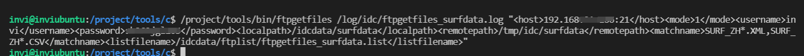

然后查看日志和文件下载目录，可以看到能够正确下载并匹配到我们想要的文件下载。

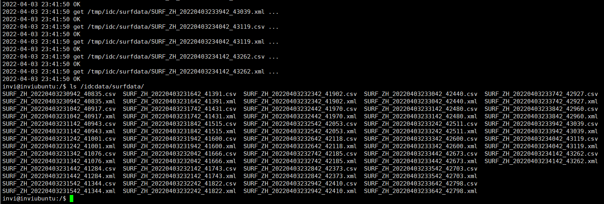

## 清理、转存文件、下载新增文件，下载修改文件

文件下载的三种需求

1. 增量下载文件，每次只下载新增的和修改过的文件
2. 下载文件后，删除ftp服务器上的文件
3. 下载文件后，把ftp服务器上的文件移动到备份目录

这三种需求的应用场景是这样的：


如果ftp服务端的文件只为一个ftp客户端服务，那么就属于第二和第三种情况。客户端把文件下载下来后，就可以把服务端的文件删除或者移动到备份目录。

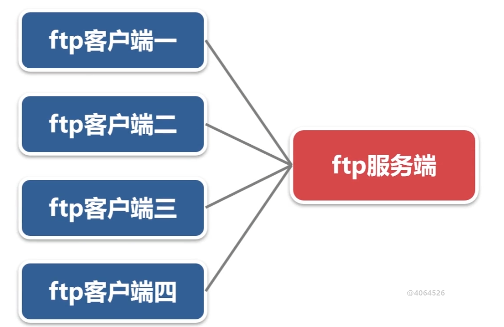

但是如果ftp服务端要为多个客户端服务，那么每个客户端在下载完文件后，不能删除或者移动服务端的文件，每个客户端只能把自己已经下载的文件记录下来，既不能重复下载，也不能漏掉没下载的文件。

### 下载文件后，删除ftp服务器上的文件

运行程序，下载xml和csv格式的测试数据，然后删除服务端的文件。程序运行结束后查看日志和ftp服务器里的文件情况，发现可以正确下载并删除服务器里的文件。只留下了json的（最后这几条是新生成的文件）

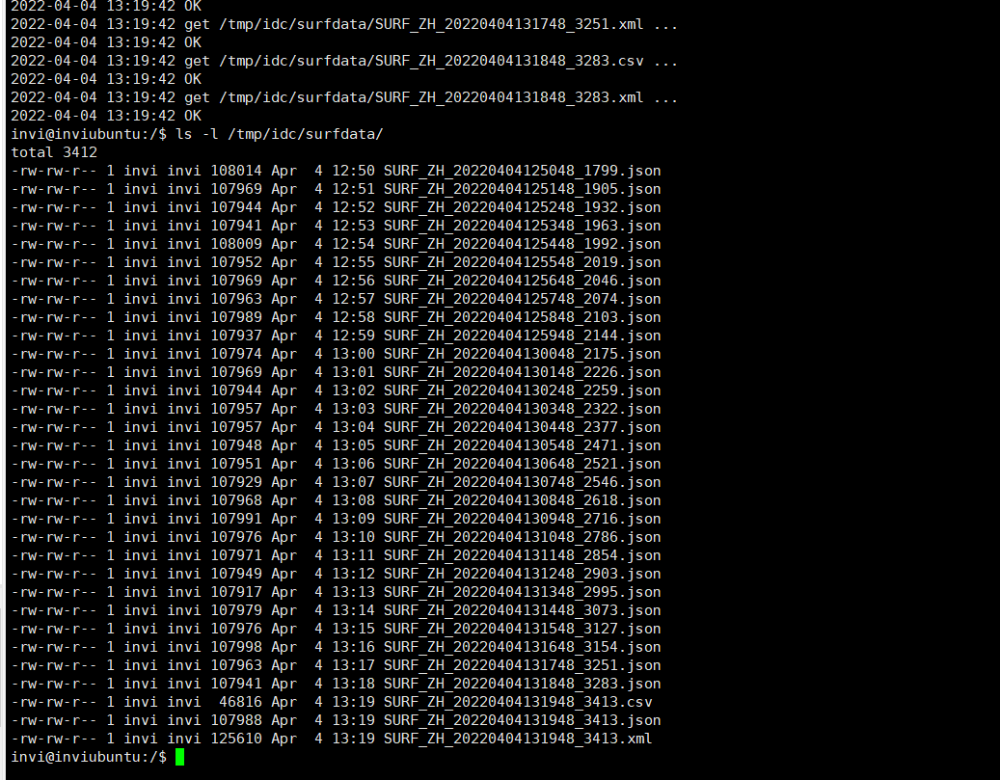

### 下载文件后，把ftp服务器上的文件移动到备份目录

这里需要注意，在全部的ftp的函数中，远程的目录（strremotfilenamebak）如果不存在，是都不会创建的，只有本地目录不存在才会创建，所以需要事先在ftp服务器上创建好备份目录

运行程序，我们把ftp服务器上的json文件给全部下载下来，然后服务端下载过的json文件给移动到备份目录里去。然后程序运行结束，查看日志和ftp服务端的原始文件夹和备份文件夹。发现能够成功正确移动文件。

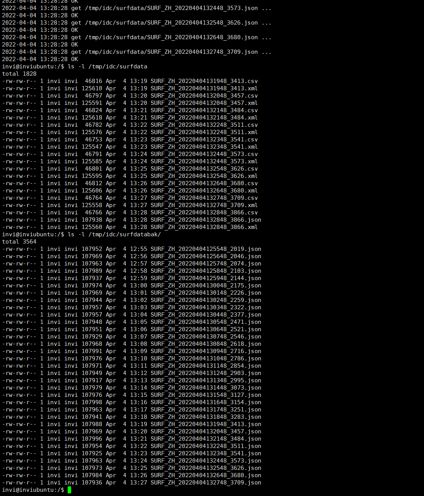

### 增量下载文件，每次只下载新增的和修改过的文件

这种情况又细分为两种

1. 下载增量文件
2. 下载修改文件

#### 下载增量文件

首先先搞清楚增量下载的算法。

首先假设ftp服务端server文件夹下有 5 个文件，ftp客户端有0个文件。假设客户端和服务端的文件情况是这样的

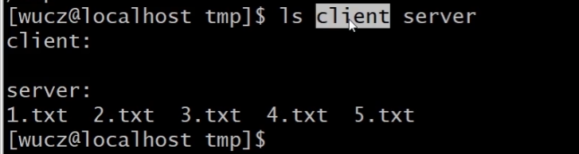

如果需要实现增量下载的功能，需要设计4个容器。

第一个容器：存放已经成功下载的文件，程序第一次运行的时候这个容器是空的

第二个容器：存放nlist返回的结果

第三个容器：存放已下载的文件

第四个容器：存放待下载的文件

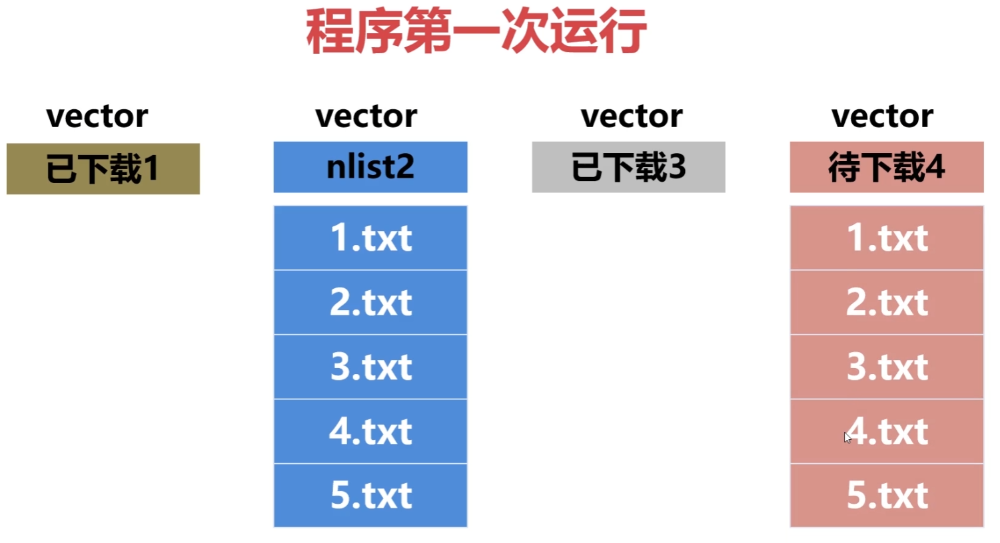

现在ftp服务端有5个文件，那么nlist之后，加载放到第二个到容器中就会有5条文件记录，然后把第二个容器和第一个容器进行对比，把第二个容器中有的，但是第一个容器中没有的文件，放到第4个待下载容器中。第二个容器中有，并且第一个容器中也有的文件，放在第三个已下载容器中。对比之后，得到了如上图所示的结果。第四个容器就是这一次需要下载的文件。把他给下载下来就可以了。

下载结果就是客户端有5个文件，然后服务端也有5个文件。

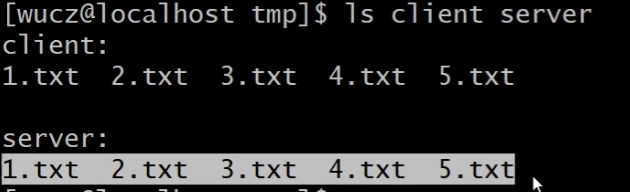

程序第二次运行的时候，这4个容器又都是空的了，然后先把已经成功下载的文件加载到第一个容器中，然后再nlist服务端的文件，假设这个时候，ftp服务端文件发生了如下改变，1.txt和2.txt被删除了，然后新增了6和7这两个文件。

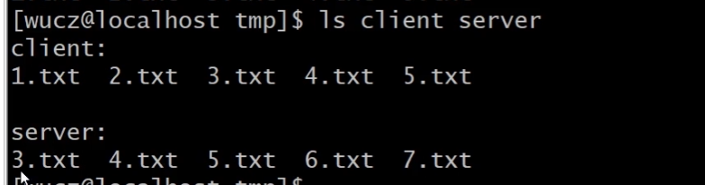

程序nlist之后，加载到容器中文件情况就变成这样。


然后继续，对比第二个容器和第一个容器，第二个容器中有，但是第一个容器中没有的文件，放在第四个容器职工（6,7）。然后第二个容器中有，第一个容器中也有的，放在第三个容器中。（3,4,5）。对比之后得到的结果就是这样的，


然后程序就把第四个容器中的文件下载下来就可以。运行效果就是这样的

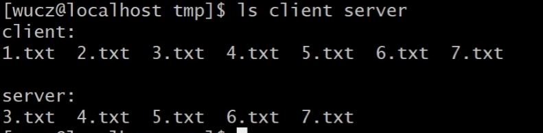

这就是增量下载文件的一个实现思路。

```c++
#include "_ftp.h"
#include "_public.h"

CLogFile logfile;

Cftp ftp;

// 程序运行参数结构体
struct st_arg
{
  char host[31];           // 远程服务器的IP和端口。
  int  mode;               // 传输模式，1-被动模式，2-主动模式，缺省采用被动模式。
  char username[31];       // 远程服务器ftp的用户名。
  char password[31];       // 远程服务器ftp的密码。
  char remotepath[301];    // 远程服务器存放文件的目录。
  char localpath[301];     // 本地文件存放的目录。
  char matchname[101];     // 待下载文件匹配的规则。
  char listfilename[301];  // 下载前列出服务器文件名的文件。
  int  ptype;              // 下载后服务器文件的处理方式：1-什么也不做；2-删除；3-备份。
  char remotepathbak[301]; // 下载后服务器文件的备份目录。
  char okfilename[301];    // 已下载成功文件名清单。
} starg;

// 文件信息结构体
struct st_fileinfo
{
    char filename[301];   // 文件名。
    char mtime[21];       // 文件时间。
};

vector<struct st_fileinfo> vfilelist1;    // 已下载成功文件名的容器，从okfilename中加载。
vector<struct st_fileinfo> vfilelist2;    // 下载前列出服务器文件名的容器，从nlist文件中加载。
vector<struct st_fileinfo> vfilelist3;    // 本次不需要下载的文件的容器。
vector<struct st_fileinfo> vfilelist4;    // 本次需要下载的文件的容器。

// 处理 2， 15的处理函数
void EXIT(int sig);

// 帮助文档
void _help();

// 解析第二个参数，（解析xml得到程序运行参数），将解析结果放到starg中
bool _xmltoarg(const char* args);

// 下载文件功能的主要函数
bool _ftpgetfiles();

// 把ftp.nlist()方法获取到的list文件加载到vfilelist中
bool LoadListFile();

// 加载okfilename文件中的内容到容器vlistfile1中
bool LoadOKFile();

// 比较vfilelist2和vfilelist1，得到vfilelist3和vfilelist4
bool CompVector();

// 把容器vfilelist3中的内容写入到okfilename中，覆盖之前旧的okfilename文件
bool WriteToOKFile();

// 如果ptype == 1,把下载成功的文件记录追加到okfilename文件中
bool AppendToOkFile(struct st_fileinfo *stfilename);

int main(int argc, char *argv[])
{

    // 1：把服务器撒花姑娘某目录的文件全部下载到本地目录（可以指定文件名的匹配规则）
    // 日志文件名，ftp服务器的IP和端口，传输模式【主动|被动】ftp的用户名，ftp密码
    // 服务器存放文件的目录，蹦迪存放文件的目录，下载文件名匹配规则
    if(argc != 3)
    {
        _help();
        return -1;
    }

    // 把ftp服务上的某目录中的文件下载到本地目录中
    
    // 处理程序的退出信号
    // 设置信号,在shell状态下可用 "kill + 进程号" 正常终止些进程。
    // 但请不要用 "kill -9 +进程号" 强行终止。
    // CloseIOAndSignal(); 
    signal(SIGINT,EXIT);
    signal(SIGTERM,EXIT);

    // 打开日志文件
    if(logfile.Open(argv[1], "a+") == false)
    {
        printf("打开日志文件%s失败！\n", argv[1]);
        return -1;
    }

    // 解析xml。得到程序运行的参数
    if(_xmltoarg(argv[2]) == false)
    {
        return -1;
    }


    // 进入ftp服务存放文件的目录
    if(ftp.login(starg.host, starg.username, starg.password, starg.mode) == false)
    {
        logfile.Write("ftp.login(%s, %s, %s) faild\n", starg.host, starg.username, starg.password, starg.mode);
        return -1;
    }
    logfile.Write("登陆%s成功\n", starg.host);

    // 文件下载
    if(_ftpgetfiles() == false)
    {
        return -1;
    }

    // 退出ftp服务
    ftp.logout();

    return 0;
}

void EXIT(int sig)
{
    printf("程序退出， sig = %d\n", sig);

    exit(0);
}

void _help()
{
    printf("\n");
    printf("Using:/project/tools/bin/ftpgetfiles logfilename xmlbuffer\n\n");

    printf("Sample:/project/tools/bin/procctl 30 /project/tools/bin/ftpgetfiles /log/idc/ftpgetfiles_surfdata.log \"<host>127.0.0.1:21</host><mode>1</mode><username>wucz</username><password>wuczpwd</password><localpath>/idcdata/surfdata</localpath><remotepath>/tmp/idc/surfdata</remotepath><matchname>SURF_ZH*.XML,SURF_ZH*.CSV</matchname><listfilename>/idcdata/ftplist/ftpgetfiles_surfdata.list</listfilename><ptype>1</ptype><remotepathbak>/tmp/idc/surfdatabak</remotepathbak><okfilename>/idcdata/ftplist/ftpgetfiles_surfdata.xml</okfilename>\"\n\n\n");

    printf("本程序是通用的功能模块，用于把远程ftp服务器的文件下载到本地目录。\n");
    printf("logfilename是本程序运行的日志文件。\n");
    printf("xmlbuffer为文件下载的参数，如下：\n");
    printf("<host>127.0.0.1:21</host> 远程服务器的IP和端口。\n");
    printf("<mode>1</mode> 传输模式，1-被动模式，2-主动模式，缺省采用被动模式。\n");
    printf("<username>wucz</username> 远程服务器ftp的用户名。\n");
    printf("<password>wuczpwd</password> 远程服务器ftp的密码。\n");
    printf("<remotepath>/tmp/idc/surfdata</remotepath> 远程服务器存放文件的目录。\n");
    printf("<localpath>/idcdata/surfdata</localpath> 本地文件存放的目录。\n");
    printf("<matchname>SURF_ZH*.XML,SURF_ZH*.CSV</matchname> 待下载文件匹配的规则。"\
         "不匹配的文件不会被下载，本字段尽可能设置精确，不建议用*匹配全部的文件。\n");
    printf("<listfilename>/idcdata/ftplist/ftpgetfiles_surfdata.list</listfilename> 下载前列出服务器文件名的文件。\n");
    printf("<ptype>1</ptype> 文件下载成功后，远程服务器文件的处理方式：1-什么也不做；2-删除；3-备份，如果为3，还要指定备份的目录。\n");
    printf("<remotepathbak>/tmp/idc/surfdatabak</remotepathbak> 文件下载成功后，服务器文件的备份目录，此参数只有当ptype=3时才有效。\n");
    printf("<okfilename>/idcdata/ftplist/ftpgetfiles_surfdata.xml</okfilename> 已下载成功文件名清单，此参数只有当ptype=1时才有效。\n\n\n");

}

bool _xmltoarg(const char* args)
{
    memset(&starg, 0, sizeof(struct st_arg));

    GetXMLBuffer(args, "host", starg.host, 30);      // 远程ftp服务器的IP和端口
    if(strlen(starg.host) == 0)
    {
        logfile.Write("host is null\n");
        return false;
    }

    GetXMLBuffer(args, "mode", &starg.mode);       // 传输模式，1-被动模式，2-主动模式，缺省采用被动模式。
    if(starg.mode != 2)
    {
        starg.mode = 1;     // 也就是说，如果没有指定ftp传输模式，那就默认都指定为被动模式
    }

    GetXMLBuffer(args, "username", starg.username, 30);      // 远程服务器ftp的用户名。
    if(strlen(starg.username) == 0)
    {
        logfile.Write("username is null\n");
        return false;
    }

    GetXMLBuffer(args, "password", starg.password, 30);       // 远程服务器ftp的密码。
    if(strlen(starg.password) == 0)
    {
        logfile.Write("password is null\n");
        return false;
    }

    GetXMLBuffer(args, "remotepath", starg.remotepath, 300);      // 远程服务器存放文件的目录
    if(strlen(starg.remotepath) == 0)
    {
        logfile.Write("remotepath is null\n");
        return false;
    }

    GetXMLBuffer(args, "localpath", starg.localpath, 300);      // 本地文件存放的目录
    if(strlen(starg.localpath) == 0)
    {
        logfile.Write("localpath is null\n");
        return false;
    }

    GetXMLBuffer(args, "matchname", starg.matchname, 100);     // 待下载文件匹配的规则
    if(strlen(starg.matchname) == 0)
    {
        logfile.Write("matchname is null\n");
        return false;
    }

    GetXMLBuffer(args,"listfilename",starg.listfilename,300);   // 下载前列出服务器文件名的文件。
    if (strlen(starg.listfilename)==0)
    {
        logfile.Write("listfilename is null.\n");
        return false;
    }

    // 下载后服务器文件的处理方式：1-什么也不做；2-删除；3-备份。
    GetXMLBuffer(args,"ptype",&starg.ptype);   
    if ( (starg.ptype!=1) && (starg.ptype!=2) && (starg.ptype!=3) )
    {
        logfile.Write("ptype is error.\n");
        return false;
    }

    GetXMLBuffer(args,"remotepathbak",starg.remotepathbak,300); // 下载后服务器文件的备份目录。
    if ( (starg.ptype==3) && (strlen(starg.remotepathbak)==0) )
    {
        logfile.Write("remotepathbak is null.\n");
        return false;
    }

    GetXMLBuffer(args,"okfilename",starg.okfilename,300); // 已下载成功文件名清单。
    if ( (starg.ptype==1) && (strlen(starg.okfilename)==0) )
    {
        logfile.Write("okfilename is null.\n");
        return false;
    }

    return true;
}

bool _ftpgetfiles()
{
    // 调用ftp.nlist()方法列出服务器目录中的文件，结果存放在本地文件中。
    if(ftp.chdir(starg.remotepath) == false)
    {
        logfile.Write("ftp.chdir(%s) faild\n", starg.remotepath);
        return false;
    }

    // 注意这里 ftp.nlist(".", starg.listfilename) 第一个参数如果是"."表示只拿当前目录下的文件名，不是全路径
    // 如果这里改成 ftp.nlist(starg.remotepath, starg.listfilename) 第一个参数改为服务器目录，那么得到的结构就是全路径
    // 这里采用只有文件名比较好，第一：返回这个目录名是没有意义的，第二：去掉这些目录前缀，还可以节省网络开销（文件小）
    if(ftp.nlist(".", starg.listfilename) == false)
    {
        logfile.Write("ftp.nlist(\".\", %s) faild \n", starg.listfilename);
        return false;
    }

    // 把ftp.nlist()方法获取到的list文件加载到容器vfilelist2中.
    if(LoadListFile() == false)
    {
        logfile.Write("LoadListFile() faild\n");
        return false;
    }

    // 如果是增量下载
    if(starg.ptype == 1)
    {
        // 加载okfilename文件中的内容到容器vlistfile1中
        LoadOKFile();

        // 比较vfilelist2和vfilelist1，得到vfilelist3和vfilelist4
        CompVector();

        // 把容器vfilelist3中的内容写入到okfilename中，覆盖之前旧的okfilename文件
        // （这样做的目的是为了更新okfilename，不用每次都拿客户端已经有的文件作为okfilename，
        // 因为你是从服务端下载，服务端数据变了，删除了一些文件，那么你之前下载好的那些文件其实就没必要再读进来做比较了，服务端不关心这些（或者说，增量下载不关心这些））
        WriteToOKFile();

        // 把vfilelist4中的文件复制到vlistfile2中，然后就可以继续走下面的下载流程了
        vfilelist2.clear();
        vfilelist2.swap(vfilelist4);

    }

    // 遍历容器vfilelist

    // 在调用get方法之前，需要将文件的全路径拼接出来(分别是服务器的文件名 和 本地文件名)
    char strremotfilename[301], strlocalfilename[301];

    for(auto iter = vfilelist2.begin(); iter != vfilelist2.end(); ++iter)
    {
        SNPRINTF(strremotfilename, sizeof(strremotfilename), 300, "%s/%s", starg.remotepath, (*iter).filename);  // 服务器文件全路径文件名
        SNPRINTF(strlocalfilename, sizeof(strlocalfilename), 300, "%s/%s", starg.localpath, (*iter).filename);  // 本地文件全路径文件名

        // 调用ftp.get()方法从服务器中下载文件
        logfile.Write("get %s ... \n", strremotfilename);
        if(ftp.get(strremotfilename, strlocalfilename) == false)
        {
            logfile.Write("ftp.get(%s, %s) faild\n", strremotfilename, strlocalfilename);
            return false;
        }

        logfile.Write("OK\n");

        // 如果ptype == 1,把下载成功的文件记录追加到okfilename文件中
        if(starg.ptype == 1)
        {
            AppendToOkFile(&(*iter));
        }

        // 文件下载完成后，服务端的动作 1-什么也不做；2-删除；3-备份，如果为3，还要指定备份的目录。
        // 删除文件
        if(starg.ptype == 2)
        {
            if(ftp.ftpdelete(strremotfilename) == false)
            {
                logfile.Write("文件%s删除失败!请检查用户权限或者文件路径\n", strremotfilename);
                return false;
            }
        }
        // 转存到备份文件
        if(starg.ptype == 3)
        {
            // 要备份文件，还需要先生成备份文件名
            char strremotfilenamebak[301];
            SNPRINTF(strremotfilenamebak, sizeof(strremotfilenamebak), 300, "%s/%s", starg.remotepathbak, (*iter).filename);

            // 然后调用 ftp 的rename函数给备份文件改名
            // 这里需要注意，在全部的ftp的函数中，远程的目录（strremotfilenamebak）如果不存在，是都不会创建的，只有本地目录不存在才会创建，所以需要事先在ftp服务器上创建好备份目录
            if(ftp.ftprename(strremotfilename, strremotfilenamebak) == false)
            {
                logfile.Write("文件[%s]备份（移动）到[%s]失败!请检查用户权限或者文件路径\n", strremotfilename, strremotfilenamebak);
                return false;
            }
        }
    }


    return true;
}

// 把ftp.nlist()方法获取到的list文件加载到vfilelist容器中
bool LoadListFile()
{
    CFile File;
    vfilelist2.clear();

    // 用只读的方式打开该list文件
    if(File.Open(starg.listfilename, "r") == false)
    {
        logfile.Write("File.Open(%s) faild\n", starg.listfilename);
        return false;
    }

    struct st_fileinfo stfileinfo;

    while(true)
    {
        memset(&stfileinfo, 0, sizeof(struct st_fileinfo));

        // 读取每一行，然后第三个参数设置为true，表示删除每行字符串结尾的换行和空格
        if(File.Fgets(stfileinfo.filename, 300, true) == false) break;

        // 判断文件名是否匹配我们传递进来的文件名匹配字符串，如果不匹配，说明不是我们想要的文件，就不放进容器中
        if(MatchStr(stfileinfo.filename, starg.matchname) == false) continue;

        vfilelist2.push_back(stfileinfo);
    }

    return true;
}

// 加载okfilename文件中的内容到容器vlistfile1中
bool LoadOKFile()
{
    vfilelist1.clear();

    CFile File;

   if(File.Open(starg.okfilename, "r") == false)
   {
        // 注意这里，如果 okfilename 打开失败，这里是不需要放回false的，因为第一次打开这个文件，是不存在这个文件的，那么直接放回true就好了
        // vfilelist1就直接为空
        return true;
   }

   struct st_fileinfo stfileinfo;

    while(true)
    {
        memset(&stfileinfo, 0, sizeof(struct st_fileinfo));

        // 读取每一行，然后第三个参数设置为true，表示删除每行字符串结尾的换行和空格
        if(File.Fgets(stfileinfo.filename, 300, true) == false) break;

        vfilelist1.push_back(stfileinfo);
    }

    return true;
}

// 比较vfilelist2和vfilelist1，得到vfilelist3和vfilelist4
bool CompVector()
{
    vfilelist3.clear();
    vfilelist4.clear();

    auto iter1 = vfilelist2.begin();
    auto iter2 = vfilelist1.begin();

    // 遍历容器vfilelist2
    for(iter1 = vfilelist2.begin(); iter1 != vfilelist2.end(); ++iter1)
    {
        // 在容器filelist1中查找vfilelist2(iter1)的记录
        for(iter2 = vfilelist1.begin(); iter2 != vfilelist1.end(); ++iter2)
        {
            if(strcmp((*iter1).filename, (*iter2).filename) == 0)
            {
                // 容器2中找到容器1中相同的文件名，那就把这条文件信息放入到容器3中
                vfilelist3.push_back(*iter1);
                // 这里为什么可以直接break，是因为一个容器中不会存在两个同名的文件，找到了，那么其他的就不用看了，一定是不同名的，就可以直接break这层循环了
                break;
            }
        }

        // 如果没找到，就把记录放入到vfilelist4中(也就是把vfilelist1给遍历完了还没有找到)
        if(iter2 == vfilelist1.end())
        {
            vfilelist4.push_back(*iter1);
        }
    }

    return true;
}

// 把容器vfilelist3中的内容写入到okfilename中，覆盖之前旧的okfilename文件
bool WriteToOKFile()
{
    CFile File;

    if(File.Open(starg.okfilename, "w") == false)
    {
        logfile.Write("File.Open(%s, \"w\") faild\n", starg.okfilename);
        return false;
    }

    for(auto iter = vfilelist3.begin(); iter != vfilelist3.end(); ++iter)
    {
        File.Fprintf("%s\n", (*iter).filename);
    }

    return true;
}

// 如果ptype == 1,把下载成功的文件记录追加到okfilename文件中
bool AppendToOkFile(struct st_fileinfo *stfilename)
{
    CFile File;

    if(File.Open(starg.okfilename, "a") == false)
    {
        logfile.Write("File.Open(%s, \"w\") faild\n", starg.okfilename);
        return false;
    }

    File.Fprintf("%s\n", stfilename->filename);

    return true;
}

```

编译运行。

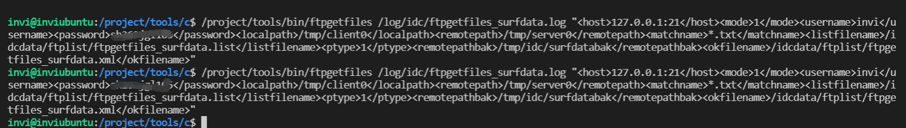

然后查看两次测试结果

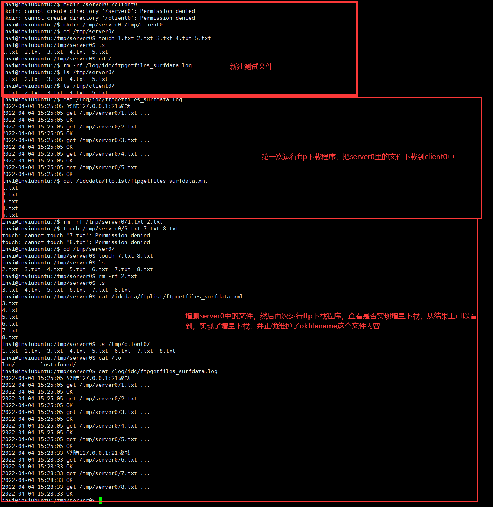

#### 下载修改文件

如果ftp服务端的文件被修改，那么下载程序的增量下载算法就得做点适配。程序算法总体上和之前的增量下载是一样的，只不过需要额外把文件的时间给考虑进去。这4个容器除了存放文件名，还需要存放文件的修改时间，

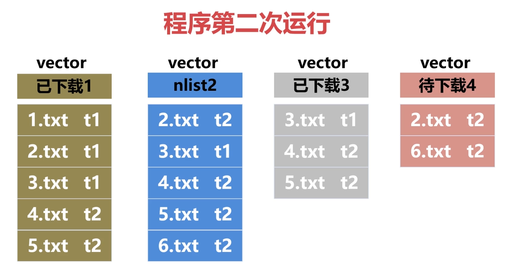

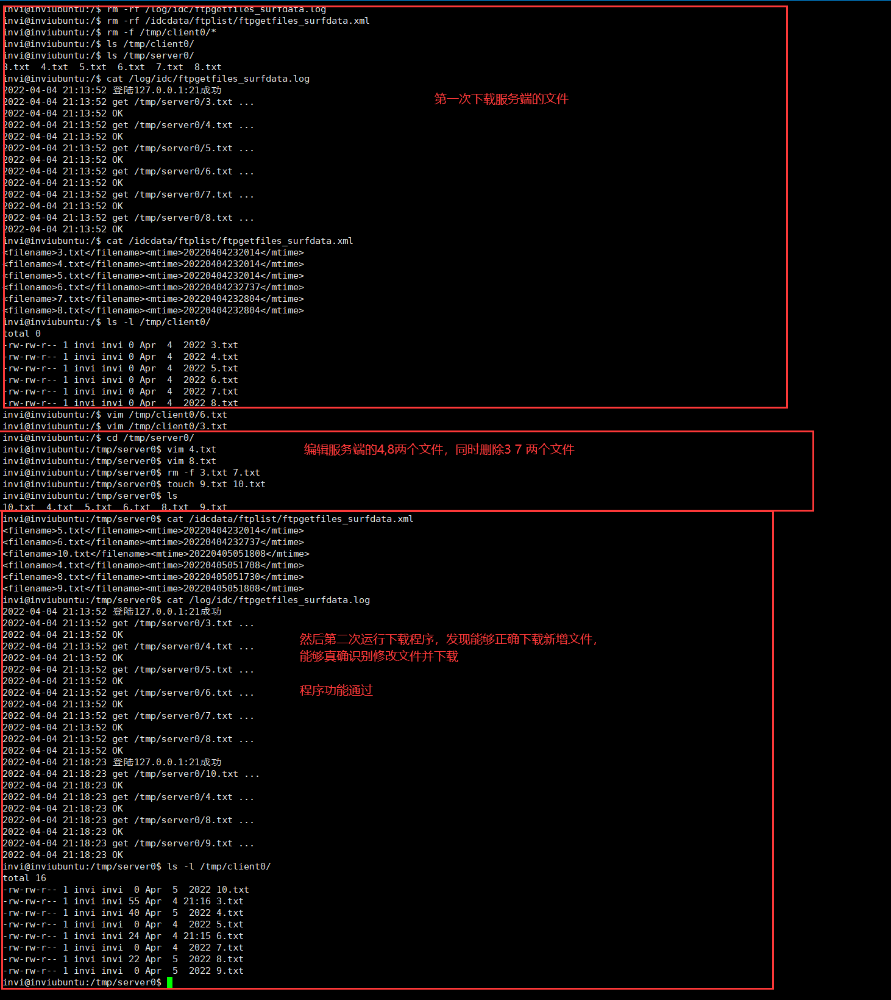
