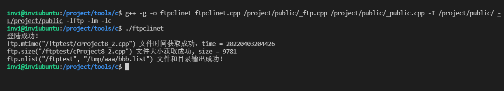
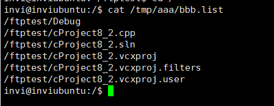
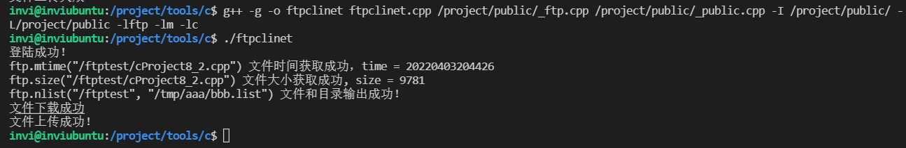

# FTP客户端封装

- 寻找开源的ftplib库，封装成C++的 Cftp类
- 掌握Cftp类的使用方法

在项目中需要编程的是FTP客户端，不用管服务端，服务端在各个系统中已经有成熟的ftp服务端软件

首先在github上找一个开源的ftp库 <https://github.com/codebrainz/ftplib，然后将其ftplib.c和ftplib.h拷贝下来，放在public>目录下。然后把它编译成库。编译指令：

```makefile
libftp.a:ftplib.h ftplib.c
 gcc -c -o libftp.a ftplib.c
```

把它编译为.a文件。因为这个是一个纯c的库，所以为了使用方便，这里做了另外一层封装，将其封装为c++的类。

_ftp.h

```c++
/****************************************************************************************/
/*   程序名：_ftp.h，此程序是开发框架的ftp客户端工具的类的声明文件。                    */
/*   author：invi 
/****************************************************************************************/

#ifndef __FTP_H
#define __FTP_H

#include "_public.h"
#include "ftplib.h"

class Cftp
{
public:
  netbuf *m_ftpconn;   // ftp连接句柄。
  unsigned int m_size; // 文件的大小，单位：字节。
  char m_mtime[21];    // 文件的修改时间，格式：yyyymmddhh24miss。

  // 以下三个成员变量用于存放login方法登录失败的原因。
  bool m_connectfailed;    // 连接失败。
  bool m_loginfailed;      // 登录失败，用户名和密码不正确，或没有登录权限。
  bool m_optionfailed;     // 设置传输模式失败。

  Cftp();  // 类的构造函数。
 ~Cftp();  // 类的析构函数。

  void initdata();   // 初始化m_size和m_mtime成员变量。

  // 登录ftp服务器。
  // host：ftp服务器ip地址和端口，中间用":"分隔，如"192.168.1.1:21"。
  // username：登录ftp服务器用户名。
  // password：登录ftp服务器的密码。
  // imode：传输模式，1-FTPLIB_PASSIVE是被动模式，2-FTPLIB_PORT是主动模式，缺省是被动模式。
  bool login(const char *host,const char *username,const char *password,const int imode=FTPLIB_PASSIVE);
  
  // 注销。
  bool logout();

  // 获取ftp服务器上文件的时间。
  // remotefilename：待获取的文件名。
  // 返回值：false-失败；true-成功，获取到的文件时间存放在m_mtime成员变量中。
  bool mtime(const char *remotefilename);

  // 获取ftp服务器上文件的大小。
  // remotefilename：待获取的文件名。
  // 返回值：false-失败；true-成功，获取到的文件大小存放在m_size成员变量中。
  bool size(const char *remotefilename);

  // 改变ftp服务器的当前工作目录。
  // remotedir：ftp服务器上的目录名。
  // 返回值：true-成功；false-失败。
  bool chdir(const char *remotedir);

  // 在ftp服务器上创建目录。
  // remotedir：ftp服务器上待创建的目录名。
  // 返回值：true-成功；false-失败。
  bool mkdir(const char *remotedir);

  // 删除ftp服务器上的目录。
  // remotedir：ftp服务器上待删除的目录名。
  // 返回值：true-成功；如果权限不足、目录不存在或目录不为空会返回false。
  bool rmdir(const char *remotedir);

  // 发送NLST命令列出ftp服务器目录中的子目录名和文件名。
  // remotedir：ftp服务器的目录名。
  // listfilename：用于保存从服务器返回的目录和文件名列表。
  // 返回值：true-成功；false-失败。
  // 注意：如果列出的是ftp服务器当前目录，remotedir用"","*","."都可以，但是，不规范的ftp服务器可能有差别。
  bool nlist(const char *remotedir,const char *listfilename);

  // 从ftp服务器上获取文件。
  // remotefilename：待获取ftp服务器上的文件名。
  // localfilename：保存到本地的文件名。
  // bCheckMTime：文件传输完成后，是否核对远程文件传输前后的时间，保证文件的完整性。
  // 返回值：true-成功；false-失败。
  // 注意：文件在传输的过程中，采用临时文件命名的方法，即在localfilename后加".tmp"，在传输
  // 完成后才正式改为localfilename。
  bool get(const char *remotefilename,const char *localfilename,const bool bCheckMTime=true);

  // 向ftp服务器发送文件。
  // localfilename：本地待发送的文件名。
  // remotefilename：发送到ftp服务器上的文件名。
  // bCheckSize：文件传输完成后，是否核对本地文件和远程文件的大小，保证文件的完整性。
  // 返回值：true-成功；false-失败。
  // 注意：文件在传输的过程中，采用临时文件命名的方法，即在remotefilename后加".tmp"，在传输
  // 完成后才正式改为remotefilename。
  bool put(const char *localfilename,const char *remotefilename,const bool bCheckSize=true);

  // 删除ftp服务器上的文件。
  // remotefilename：待删除的ftp服务器上的文件名。
  // 返回值：true-成功；false-失败。
  bool ftpdelete(const char *remotefilename);

  // 重命名ftp服务器上的文件。
  // srcremotefilename：ftp服务器上的原文件名。
  // dstremotefilename：ftp服务器上的目标文件名。
  // 返回值：true-成功；false-失败。
  bool ftprename(const char *srcremotefilename,const char *dstremotefilename);

  /* 以下三个方法如果理解不了就算了，可以不启用。 */
  // 发送LIST命令列出ftp服务器目录中的文件。
  // 参数和返回值与nlist方法相同。
  bool dir(const char *remotedir,const char *listfilename);

  // 向ftp服务器发送site命令。
  // command：命令的内容。
  // 返回值：true-成功；false-失败。
  bool site(const char *command);

  // 获取服务器返回信息的最后一条(return a pointer to the last response received)。
  char *response();
};

#endif

```

_ftp.cpp

```c++
/****************************************************************************************/
/*   程序名：_ftp.cpp，此程序是开发框架的ftp客户端工具的类的定义文件。                  */
/*   author：invi 
/****************************************************************************************/

#include "_ftp.h"

Cftp::Cftp()
{
  m_ftpconn=0;

  initdata();

  FtpInit();

  m_connectfailed=false;
  m_loginfailed=false;
  m_optionfailed=false;
}

Cftp::~Cftp()
{
  logout();
}

void Cftp::initdata()
{
  m_size=0;

  memset(m_mtime,0,sizeof(m_mtime));
}

bool Cftp::login(const char *host,const char *username,const char *password,const int imode)
{
  if (m_ftpconn != 0) { FtpQuit(m_ftpconn); m_ftpconn=0; }

  m_connectfailed=m_loginfailed=m_optionfailed=false;

  if (FtpConnect(host,&m_ftpconn) == false)  { m_connectfailed=true; return false; }

  if (FtpLogin(username,password,m_ftpconn) == false)  { m_loginfailed=true; return false; }

  if (FtpOptions(FTPLIB_CONNMODE,(long)imode,m_ftpconn) == false) { m_optionfailed=true; return false; }

  return true;
}

bool Cftp::logout()
{
  if (m_ftpconn == 0) return false;

  FtpQuit(m_ftpconn);

  m_ftpconn=0;

  return true;
}

bool Cftp::get(const char *remotefilename,const char *localfilename,const bool bCheckMTime)
{
  if (m_ftpconn == 0) return false;

  // 创建本地文件目录。
  MKDIR(localfilename);

  // 生成本地文件的临时文件名。
  char strlocalfilenametmp[301];
  memset(strlocalfilenametmp,0,sizeof(strlocalfilenametmp));
  snprintf(strlocalfilenametmp,300,"%s.tmp",localfilename);

  // 获取远程服务器的文件的时间。
  if (mtime(remotefilename) == false) return false;

  // 取文件。
  if (FtpGet(strlocalfilenametmp,remotefilename,FTPLIB_IMAGE,m_ftpconn) == false) return false;
  
  // 判断文件获取前和获取后的时间，如果时间不同，表示在文件传输的过程中已发生了变化，返回失败。
  if (bCheckMTime==true)
  {
    char strmtime[21];
    strcpy(strmtime,m_mtime);

    if (mtime(remotefilename) == false) return false;

    if (strcmp(m_mtime,strmtime) != 0) return false;
  }

  // 重置文件时间。
  UTime(strlocalfilenametmp,m_mtime);

  // 改为正式的文件。
  if (rename(strlocalfilenametmp,localfilename) != 0) return false; 

  // 获取文件的大小。
  m_size=FileSize(localfilename);

  return true;
}

bool Cftp::mtime(const char *remotefilename)
{
  if (m_ftpconn == 0) return false;
  
  memset(m_mtime,0,sizeof(m_mtime));
  
  char strmtime[21];
  memset(strmtime,0,sizeof(strmtime));

  if (FtpModDate(remotefilename,strmtime,14,m_ftpconn) == false) return false;

  AddTime(strmtime,m_mtime,0+8*60*60,"yyyymmddhh24miss");

  return true;
}

bool Cftp::size(const char *remotefilename)
{
  if (m_ftpconn == 0) return false;

  m_size=0;
  
  if (FtpSize(remotefilename,&m_size,FTPLIB_IMAGE,m_ftpconn) == false) return false;

  return true;
}

bool Cftp::site(const char *command)
{
  if (m_ftpconn == 0) return false;
  
  if (FtpSite(command,m_ftpconn) == false) return false;

  return true;
}

bool Cftp::chdir(const char *remotedir)
{
  if (m_ftpconn == 0) return false;
  
  if (FtpChdir(remotedir,m_ftpconn) == false) return false;

  return true;
}

bool Cftp::mkdir(const char *remotedir)
{
  if (m_ftpconn == 0) return false;
  
  if (FtpMkdir(remotedir,m_ftpconn) == false) return false;

  return true;
}

bool Cftp::rmdir(const char *remotedir)
{
  if (m_ftpconn == 0) return false;
  
  if (FtpRmdir(remotedir,m_ftpconn) == false) return false;

  return true;
}

bool Cftp::dir(const char *remotedir,const char *listfilename)
{
  if (m_ftpconn == 0) return false;
  
  if (FtpDir(listfilename,remotedir,m_ftpconn) == false) return false;

  return true;
}

bool Cftp::nlist(const char *remotedir,const char *listfilename)
{
  if (m_ftpconn == 0) return false;

  // 创建本地文件目录
  MKDIR(listfilename);
  
  if (FtpNlst(listfilename,remotedir,m_ftpconn) == false) return false;

  return true;
}

bool Cftp::put(const char *localfilename,const char *remotefilename,const bool bCheckSize)
{
  if (m_ftpconn == 0) return false;

  // 生成服务器文件的临时文件名。
  char strremotefilenametmp[301];
  memset(strremotefilenametmp,0,sizeof(strremotefilenametmp));
  snprintf(strremotefilenametmp,300,"%s.tmp",remotefilename);

  // 发送文件。
  if (FtpPut(localfilename,strremotefilenametmp,FTPLIB_IMAGE,m_ftpconn) == false) return false;

  // 重命名文件。
  if (FtpRename(strremotefilenametmp,remotefilename,m_ftpconn) == false) return false;

  // 判断已上传的文件的大小与本地文件是否相同，确保上传成功。
  if (bCheckSize==true)
  {
    if (size(remotefilename) == false) return false;

    if (m_size != FileSize(localfilename)) return false; 
  }

  return true;
}

bool Cftp::ftpdelete(const char *remotefilename)
{
  if (m_ftpconn == 0) return false;

  if (FtpDelete(remotefilename,m_ftpconn) == false) return false;
  
  return true;
}

bool Cftp::ftprename(const char *srcremotefilename,const char *dstremotefilename)
{
  if (m_ftpconn == 0) return false;

  if (FtpRename(srcremotefilename,dstremotefilename,m_ftpconn) == false) return false;
  
  return true;
}

char *Cftp::response()
{
  if (m_ftpconn == 0) return 0;

  return FtpLastResponse(m_ftpconn);
}


```

## Cftp类的用法演示

在一个文件夹下建一个名为 `ftpclient.cpp`的测试文件，头文件包含我们封装的 `_ftp.h`。该程序的编译指令如下

```shell
g++ -g -o ftpclinet ftpclinet.cpp /project/public/_ftp.cpp /project/public/_public.cpp -I/project/public/ -L/project/public -lftp -lm -lc
```

这个演示程序的编译指令比较复杂。

我们需要把 `ftpclinet.cpp /project/public/_ftp.cpp /project/public/_public.cpp`这3个程序都进行编译，public也要一起编译的原因是因为ftp.cpp里面用到了一些public里面的一些函数，然后是头文件的搜索目录 `-I/project/public/`，然后是库文件的搜索目录，`-L/project/public`也给它包含进来，注意因为我们上面说了，开源库ftplib我们把它由原始的c代码给编译成了库，所以需要把这个ftp库使用`-l`给链接进去，然后库文件的搜索目录就是使用 `-L`来指定。这就是 `-L/project/public -lftp`这段编译指令的解释。

当然，你也许会说，我们可以把原始的.c文件拿来直接编译，这样也是可以的，比如直接：

`g++ -g -o ftpclinet ftpclinet.cpp /project/public/_ftp.cpp /project/public/_public.cpp -I/project/public/ /project/public/ftplib.c -lm -lc`

但是这样直接编译会发现出了很多错误，其实这些错误基本上都是一些兼容性问题，要解决的话，要么就修改编译参数，要么就修改源代码把它强制做一些类型转换。我们这里没这样做，所以我们是先将其编译成库，然后把库给链接进来。

### linux 下 g++编译程序时，-I（大写i） 与-L（大写l）-l(小写l) 的作用

> 作为一个linux入门级使用者，gcc/g++ 的简单操作已经用过多次， 但是有时稍微复杂一点的程序就会使用到库。在遇到问题的时候我查了挺多前辈总结的资料。
>
> **例如：libz.so**
>
> g++ -o compress  compress.cpp  -I/home/include/  -L/lib/  -lz

#### （1） -I (大写i)

> 编译程序按照-I指定的路进去搜索头文件。
>
> -I/home/include/表示将-I/home/include/目录作为第一个寻找头文件的目录，寻找的顺序是：
>
> /home/include/ -->/usr/include-->/usr/local/include

#### （2）-L(大写l)

> 表示：编译程序按照－L指定的路进去寻找库文件，一般的在-L的后面可以一次用-l指定多个库文件。
>
> -L/lib/表示到/lib/目录下找库文件

#### （3）-l(小写l)

> 表示：编译程序到系统默认路进搜索，如果找不到，到当前目录，如果当前目录找不到，则到LD_LIBRARY_PATH等环境变量置顶的路进去查找，如果还找不到，那么编译程序提示找不到库。
>
> 本例子使用的是gunzip库，库文件名是libz.so，库名是z。很容易看出，把库文件名的头lib和尾.so去掉就是库名了。

### linux 编译链接库:-lz -lrt -lm -lc

- -lz 压缩库（Z）
- -lrt 实时库（real time）：shm_open系列
- -lm 数学库（math）
- -lc 标准C库（C lib）
- -dl ，是显式加载动态库的动态函数库

```c++
#include "_ftp.h"

Cftp ftp;

int main()
{
    // 采用默认的被动模式登陆
    if(ftp.login("192.168.31.166:21", "invi", "sh269jgl105") == false)
    {
        printf("登陆失败！\n");
        return -1;
    }
    printf("登陆成功！\n");


    // 获取文件时间
    if(ftp.mtime("/ftptest/cProject8_2.cpp") == false)
    {
        printf("ftp.mtime(\"/ftptest/cProject8_2.cpp\") 文件时间获取失败\n");
        return -1;
    }

    printf("ftp.mtime(\"/ftptest/cProject8_2.cpp\") 文件时间获取成功，time = %s\n", ftp.m_mtime);

    // 、获取文件大小
    if(ftp.size("/ftptest/cProject8_2.cpp") == false)
    {
        printf("ftp.size(\"/ftptest/cProject8_2.cpp\") 文件大小获取失败\n");
        return -1;
    }

    printf("ftp.size(\"/ftptest/cProject8_2.cpp\") 文件大小获取成功, size = %d\n", ftp.m_size);

    // 将ftp服务下的/ftptest里的子目录和文件都列举出来,并输出到 /tmp/aaa/bbb.list 中
    // 注意 nlist 只会列举出子目录，子目录中的文件不会列举出来
    if(ftp.nlist("/ftptest", "/tmp/aaa/bbb.list") == false)
    {
        printf("ftp.nlist(\"/ftptest\", \"/tmp/aaa/bbb.list\") 文件目录输出失败！\n");
    }
    printf("ftp.nlist(\"/ftptest\", \"/tmp/aaa/bbb.list\") 文件和目录输出成功！\n");

    // 退出登陆
    ftp.logout();

    return 0;
}
```

编译运行



然后查看打印输出情况



### Cftp::get()

该函数用于实现ftp的文件下载功能

```c++
 // 从ftp服务器上获取文件。
  // remotefilename：待获取ftp服务器上的文件名。
  // localfilename：保存到本地的文件名。
  // bCheckMTime：文件传输完成后，是否核对远程文件传输前后的时间，保证文件的完整性。
  // 返回值：true-成功；false-失败。
  // 注意：文件在传输的过程中，采用临时文件命名的方法，即在localfilename后加".tmp"，在传输
  // 完成后才正式改为localfilename。
  bool get(const char *remotefilename,const char *localfilename,const bool bCheckMTime=true);
```

代码实现

```c++
bool Cftp::get(const char *remotefilename,const char *localfilename,const bool bCheckMTime)
{
  if (m_ftpconn == 0) return false;

  // 创建本地文件目录。
  MKDIR(localfilename);

  // 生成本地文件的临时文件名。
  char strlocalfilenametmp[301];
  memset(strlocalfilenametmp,0,sizeof(strlocalfilenametmp));
  snprintf(strlocalfilenametmp,300,"%s.tmp",localfilename);

  // 获取远程服务器的文件的时间。
  if (mtime(remotefilename) == false) return false;

  // 取文件。
  if (FtpGet(strlocalfilenametmp,remotefilename,FTPLIB_IMAGE,m_ftpconn) == false) return false;
  
  // 判断文件获取前和获取后的时间，如果时间不同，表示在文件传输的过程中已发生了变化，返回失败。
  if (bCheckMTime==true)
  {
    char strmtime[21];
    strcpy(strmtime,m_mtime);

    if (mtime(remotefilename) == false) return false;

    if (strcmp(m_mtime,strmtime) != 0) return false;
  }

  // 重置文件时间。
  UTime(strlocalfilenametmp,m_mtime);

  // 改为正式的文件。
  if (rename(strlocalfilenametmp,localfilename) != 0) return false; 

  // 获取文件的大小。
  m_size=FileSize(localfilename);

  return true;
}
```

该函数第一个参数，是ftp服务器上待下载的文件名。第二个参数是文件被下载后保存到本地的文件名，这两个文件名可以相同也可以不同，第三个参数是核对服务器上文件下载前和下载后的时间，如果这两个时间是相同的，表示文件在下载过程中没有变化。如果这个时间发生了改变，意味着获取到的内容是不完整的，文件在下载的过程中会采用临时文件命名的方法，下载成功后再改为正式的文件名。

首先，第一步创建本地文件名目录，本地目录如果不存在，就创建它。第二步，生成本地文件名的临时文件名，就是在正式文件名后面加一个tmp后缀。第三步获取远程服务器的文件时间，然后取文件。取完文件后，如果需要核对文件下载前后的时间，那就再次获取文件的时间，把它和文件下载之前的时间做比较，如果时间不同return false。最后在重置文件名的时间，将其重置为下载前的时间。然后就可以将临时文件名改为正式文件名。获取文件大小放进m_size成员变量中。

### Cftp::put()

该函数用于实现ftp的文件上传功能

```c++
  // 向ftp服务器发送文件。
  // localfilename：本地待发送的文件名。
  // remotefilename：发送到ftp服务器上的文件名。
  // bCheckSize：文件传输完成后，是否核对本地文件和远程文件的大小，保证文件的完整性。
  // 返回值：true-成功；false-失败。
  // 注意：文件在传输的过程中，采用临时文件命名的方法，即在remotefilename后加".tmp"，在传输
  // 完成后才正式改为remotefilename。
  bool put(const char *localfilename,const char *remotefilename,const bool bCheckSize=true);
```

具体实现

```c++
bool Cftp::put(const char *localfilename,const char *remotefilename,const bool bCheckSize)
{
  if (m_ftpconn == 0) return false;

  // 生成服务器文件的临时文件名。
  char strremotefilenametmp[301];
  memset(strremotefilenametmp,0,sizeof(strremotefilenametmp));
  snprintf(strremotefilenametmp,300,"%s.tmp",remotefilename);

  // 发送文件。
  if (FtpPut(localfilename,strremotefilenametmp,FTPLIB_IMAGE,m_ftpconn) == false) return false;

  // 重命名文件。
  if (FtpRename(strremotefilenametmp,remotefilename,m_ftpconn) == false) return false;

  // 判断已上传的文件的大小与本地文件是否相同，确保上传成功。
  if (bCheckSize==true)
  {
    if (size(remotefilename) == false) return false;

    if (m_size != FileSize(localfilename)) return false; 
  }

  return true;
}
```

该函数第一个参数，本地待发送的文件名，第二个参数，发送到ftp服务器上的文件名，第三个参数，文件传输完成后，是否核对本地文件和远程文件的大小，保证文件的完整性。注意，这里个get不一样，这里核对的是文件大小，不是时间。

首先同样的，生成服务器的临时文件名（就是将正式文件名 + tmp），然后发送文件，发送完毕之后，将文件名改回正式文件，然后如果需要核对大小，就获取服务器上文件的大小，将其和本地文件的大小进行比较，如果不同就返回失败。

这里或许会有个疑问，同样是为了保证文件的完整性，在下载的时候是核对文件的时间，在上传的时候是核对文件的大小，为什么会有这样一个区别？

一个文件是否发生了变化，只能用文件时间不能用文件大小来判断。比如一个文件，里面aaa变成了bbb，文件大小没有变化，但是文件的时间发生了变化。在上传文件的过程，服务器上文件的时间是由上传文件的动作，也就是调用fti.put这个函数的时间，这个时间是没有意义的，我们可以保证在上传过程中本地的文件不发生变化，所以只需要比较最后服务器上收到的文件大小和本地文件的大小是否相同就可以了。

demo测试程序代码

```c++
#include "_ftp.h"

Cftp ftp;

int main()
{
    // 采用默认的被动模式登陆
    if(ftp.login("192.168.31.166:21", "invi", "sh269jgl105") == false)
    {
        printf("登陆失败！\n");
        return -1;
    }
    printf("登陆成功！\n");


    // 获取文件时间
    if(ftp.mtime("/ftptest/cProject8_2.cpp") == false)
    {
        printf("ftp.mtime(\"/ftptest/cProject8_2.cpp\") 文件时间获取失败\n");
        ftp.logout();
        return -1;
    }

    printf("ftp.mtime(\"/ftptest/cProject8_2.cpp\") 文件时间获取成功，time = %s\n", ftp.m_mtime);

    // 、获取文件大小
    if(ftp.size("/ftptest/cProject8_2.cpp") == false)
    {
        printf("ftp.size(\"/ftptest/cProject8_2.cpp\") 文件大小获取失败\n");
        ftp.logout();
        return -1;
    }

    printf("ftp.size(\"/ftptest/cProject8_2.cpp\") 文件大小获取成功, size = %d\n", ftp.m_size);

    // 将ftp服务下的/ftptest里的子目录和文件都列举出来,并输出到 /tmp/aaa/bbb.list 中
    // 注意 nlist 只会列举出子目录，子目录中的文件不会列举出来
    if(ftp.nlist("/ftptest", "/tmp/aaa/bbb.list") == false)
    {
        printf("ftp.nlist(\"/ftptest\", \"/tmp/aaa/bbb.list\") 文件目录输出失败！\n");
        ftp.logout();
        return -1;
    }
    printf("ftp.nlist(\"/ftptest\", \"/tmp/aaa/bbb.list\") 文件和目录输出成功！\n");

    // 下载
    if(ftp.get("/ftptest/cProject8_2.cpp", "/tmp/ftptest/cProject8_2.cpp.bak", true) == false)
    {
        printf("文件下载失败\n");
        ftp.logout();
        return -1;
    }
    printf("文件下载成功\n");

    // 上传
    if(ftp.put("/project/tools/c/ftpclinet.cpp", "/ftptest/ftpclient.cpp.bak", true) == false)
    {
        printf("文件上传失败\n");
        ftp.logout();
        return -1;
    }

    printf("文件上传成功！\n");

    // 退出登陆
    ftp.logout();

    return 0;
}
```

编译运行。



---

# 下载文件

开发通用的文件下载模块，从ftp服务器下载文件。ftp文件下载是一个通用的模块，放在tools目录下

## 搭建程序的框架

把服务器上某目录的文件全部下载到本地目录（可以指定文件名的匹配规则）

把ftp服务上的某目录中的文件下载到本地目录中，代码思路

> 处理程序的退出信号
>
> 打开日志文件
>
> 解析xml。得到程序运行的参数
>
> 进入ftp服务存放文件的目录
>
> 调用ftp.nlist()方法列出服务器目录中的文件，结果存放在本地文件中。
>
>  把ftp.nlist()方法获取到的list文件加载到容器vfilelist中
>
> 遍历容器vfilelist
>
> for(int i = 0; i < vfilelist.size(); i++)
>
> {
>
> ​    调用ftp.get()方法从服务器中下载文件
>
>  }
>
>  退出ftp服务

这里，开发框架里（_public）有关于xml解析的函数。

```c++
///////////////////////////////////// /////////////////////////////////////
// 解析xml格式字符串的函数族。
// xml格式的字符串的内容如下：
// <filename>/tmp/_public.h</filename><mtime>2020-01-01 12:20:35</mtime><size>18348</size>
// <filename>/tmp/_public.cpp</filename><mtime>2020-01-01 10:10:15</mtime><size>50945</size>
// xmlbuffer：待解析的xml格式字符串。
// fieldname：字段的标签名。
// value：传入变量的地址，用于存放字段内容，支持bool、int、insigned int、long、
//       unsigned long、double和char[]。
// 注意，当value参数的数据类型为char []时，必须保证value数组的内存足够，否则可能发生
//       内存溢出的问题，也可以用ilen参数限定获取字段内容的长度，ilen的缺省值为0，表示不限长度。
// 返回值：true-成功；如果fieldname参数指定的标签名不存在，返回失败。
bool GetXMLBuffer(const char *xmlbuffer,const char *fieldname,char *value,const int ilen=0);
bool GetXMLBuffer(const char *xmlbuffer,const char *fieldname,bool *value);
bool GetXMLBuffer(const char *xmlbuffer,const char *fieldname,int  *value);
bool GetXMLBuffer(const char *xmlbuffer,const char *fieldname,unsigned int *value);
bool GetXMLBuffer(const char *xmlbuffer,const char *fieldname,long *value);
bool GetXMLBuffer(const char *xmlbuffer,const char *fieldname,unsigned long *value);
bool GetXMLBuffer(const char *xmlbuffer,const char *fieldname,double *value);
///////////////////////////////////// /////////////////////////////////////
```

采用xml作为程序的运行参数，易扩展，不容易出错。
