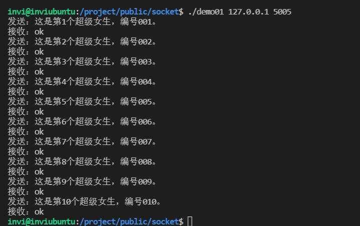
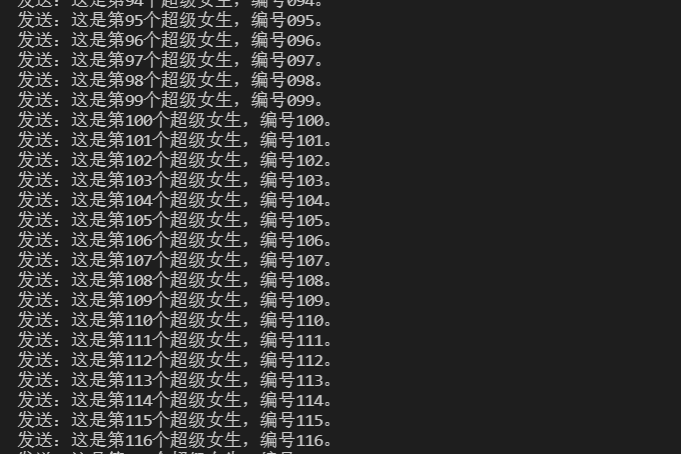
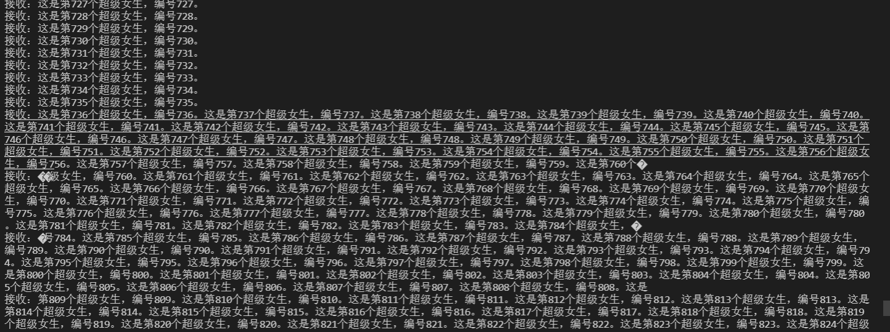
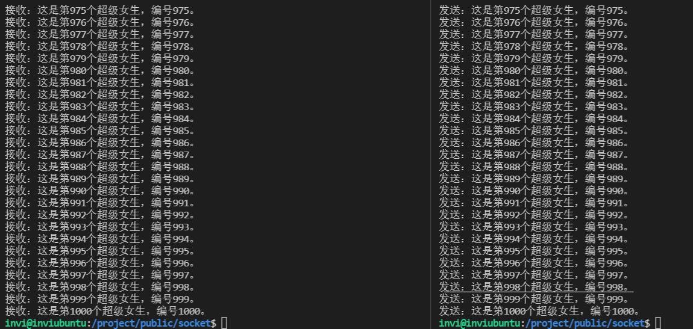
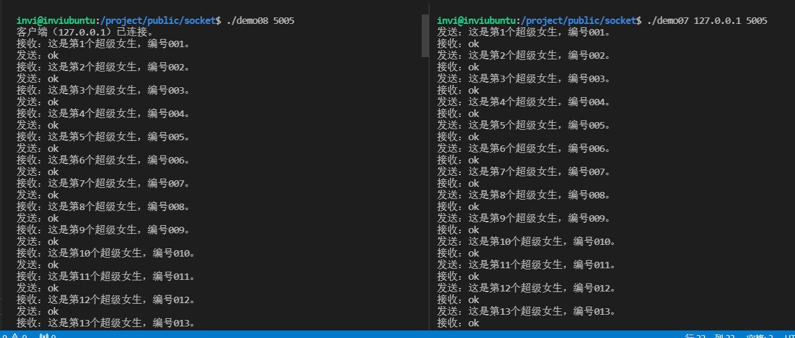

# 封装socket的API

## 解决TCP报文粘包/分包的问题

粘包：发送方发送了两个字符串“hello” ， ”world“，接收方却一次性收到了”helloworld“

分包：发送方发送了一个字符串“helloworld”，接收方却收到了两个字符串“hello”，“world”

socket环境有以上问题,但是TCP传输数据能保证几点:

1. 顺序不变,例如发送方发送hello,接收方也一定顺序接收到hello,这个是TCP协议承诺的,因此这点成为我们解决分包,黏包问题的关键.
2. 分割的包中间不会插入其他数据

 因此如果要使用socket通信,就一定要自己定义一份协议.目前最常用的协议标准是:消息头部(包头)+消息长度+消息正文

### CP分包的原理

  TCP是以段（Segment）为单位发送数据的,建立TCP链接后,有一个最大消息长度（MSS）.如果应用层数据包超过MSS,就会把应用层数据包拆分,分成两个段来发送.

  这个时候接收端的应用层就要拼接这两个TCP包，才能正确处理数据。

  相关的,路由器有一个MTU（ 最大传输单元）一般是1500字节,除去IP头部20字节,留给TCP的就只有MTU-20字节。所以一般TCP的MSS为MTU-20=1460字节

  当应用层数据超过1460字节时,TCP会分多个数据包来发送。

### TCP粘包的原理

   TCP为了提高网络的利用率,会使用一个叫做Nagle的算法.该算法是指,发送端即使有要发送的数据,如果很少的话,会延迟发送.

​    如果应用层给TCP传送数据很快的话,就会把两个应用层数据包“粘”在一起,TCP最后只发一个TCP数据包给接收端.

### 自定义消息头部

  消息头部不一定只能是一个字节比如`0xAA`什么的,也可以包含协议版本号,指令等,当然也可以把消息长度合并到消息头部里，

  唯一的要求是包头长度要固定的，包体则可变长。下面是我自定义的一个包头：

  

  版本号,消息长度,指令数据类型 都是无符号32位整型变量,于是这个消息长度固定为4×3=12字节  每个整数类型变量占用4个字节的长度

首先看第一个demo程序---tcp服务端

```c++
/*
 * 程序名：demo02.cpp，此程序用于演示socket通讯的服务端。
 * author：invi
*/
#include <stdio.h>
#include <string.h>
#include <unistd.h>
#include <stdlib.h>
#include <netdb.h>
#include <sys/types.h>
#include <sys/socket.h>
#include <arpa/inet.h>

int main(int argc,char *argv[])
{
  if (argc!=2)
  {
    printf("Using:./demo02 port\nExample:./demo02 5005\n\n"); return -1;
  }

  // 第1步：创建服务端的socket。
  int listenfd;
  if ( (listenfd = socket(AF_INET,SOCK_STREAM,0))==-1) { perror("socket"); return -1; }
  
  // 第2步：把服务端用于通讯的地址和端口绑定到socket上。
  struct sockaddr_in servaddr;    // 服务端地址信息的数据结构。
  memset(&servaddr,0,sizeof(servaddr));
  servaddr.sin_family = AF_INET;  // 协议族，在socket编程中只能是AF_INET。
  servaddr.sin_addr.s_addr = htonl(INADDR_ANY);          // 任意ip地址。
  servaddr.sin_port = htons(atoi(argv[1]));  // 指定通讯端口。
  if (bind(listenfd,(struct sockaddr *)&servaddr,sizeof(servaddr)) != 0 )
  { perror("bind"); close(listenfd); return -1; }
 
  // 第3步：把socket设置为监听模式。
  if (listen(listenfd,5) != 0 ) { perror("listen"); close(listenfd); return -1; }

  // 第4步：接受客户端的连接。
  int  clientfd;                  // 客户端的socket。
  int  socklen=sizeof(struct sockaddr_in); // struct sockaddr_in的大小
  struct sockaddr_in clientaddr;  // 客户端的地址信息。
  clientfd=accept(listenfd,(struct sockaddr *)&clientaddr,(socklen_t*)&socklen);
  printf("客户端（%s）已连接。\n",inet_ntoa(clientaddr.sin_addr));
 
  int iret;
  char buffer[102400];

  // 第5步：与客户端通讯，接收客户端发过来的报文后，回复ok。
  while (1)
  {
    memset(buffer,0,sizeof(buffer));
    if ( (iret=recv(clientfd,buffer,sizeof(buffer),0))<=0) // 接收客户端的请求报文。
    {
       printf("iret=%d\n",iret); break;   
    }
    printf("接收：%s\n",buffer);

    strcpy(buffer,"ok");
    if ( (iret=send(clientfd,buffer,strlen(buffer),0))<=0) // 向客户端发送响应结果。
    { perror("send"); break; }
    printf("发送：%s\n",buffer);
  }
 
  // 第6步：关闭socket，释放资源。
  close(listenfd); close(clientfd); 
}

```

然后是客户端服务程序

```c++
/*
 * 程序名：demo01.cpp，此程序用于演示socket通讯的客户端。
 * author：invi
*/
#include <stdio.h>
#include <string.h>
#include <unistd.h>
#include <stdlib.h>
#include <netdb.h>
#include <sys/types.h>
#include <sys/socket.h>
#include <arpa/inet.h>
 
int main(int argc,char *argv[])
{
  if (argc!=3)
  {
    printf("Using:./demo01 ip port\nExample:./demo01 127.0.0.1 5005\n\n"); return -1;
  }

  // 第1步：创建客户端的socket。
  int sockfd;
  if ( (sockfd = socket(AF_INET,SOCK_STREAM,0))==-1) { perror("socket"); return -1; }
 
  // 第2步：向服务器发起连接请求。
  struct hostent* h;
  if ( (h = gethostbyname(argv[1])) == 0 )   // 指定服务端的ip地址。
  { printf("gethostbyname failed.\n"); close(sockfd); return -1; }
  struct sockaddr_in servaddr;
  memset(&servaddr,0,sizeof(servaddr));
  servaddr.sin_family = AF_INET;
  servaddr.sin_port = htons(atoi(argv[2])); // 指定服务端的通讯端口。
  memcpy(&servaddr.sin_addr,h->h_addr,h->h_length);
  if (connect(sockfd, (struct sockaddr *)&servaddr,sizeof(servaddr)) != 0)  // 向服务端发起连接清求。
  { perror("connect"); close(sockfd); return -1; }

  int iret;
  char buffer[102400];
 
  // 第3步：与服务端通讯，发送一个报文后等待回复，然后再发下一个报文。
  for (int ii=0;ii<10;ii++)
  {
    memset(buffer,0,sizeof(buffer));
    sprintf(buffer,"这是第%d个超级女生，编号%03d。",ii+1,ii+1);
    if ( (iret=send(sockfd,buffer,strlen(buffer),0))<=0) // 向服务端发送请求报文。
    { perror("send"); break; }
    printf("发送：%s\n",buffer);

    memset(buffer,0,sizeof(buffer));
    if ( (iret=recv(sockfd,buffer,sizeof(buffer),0))<=0) // 接收服务端的回应报文。
    {
      printf("iret=%d\n",iret); break;
    }
    printf("接收：%s\n",buffer);

    sleep(1);  // 每隔一秒后再次发送报文。
  }
 
  // 第4步：关闭socket，释放资源。
  close(sockfd);
}
```

启动服务端，然后启动客户端，通讯结果如下



乍一看没什么问题，这是因为我们现在的通讯量太小，看不出来有什么分包和粘包的问题。这里改一下程序代码，演示粘包的情况，我们让客户端连续不断的发送报文。

```c++
/*
 * 程序名：demo04.cpp，此程序用于演示粘包的socket服务端。
 * author：invi
*/
#include <stdio.h>
#include <string.h>
#include <unistd.h>
#include <stdlib.h>
#include <netdb.h>
#include <sys/types.h>
#include <sys/socket.h>
#include <arpa/inet.h>
 
int main(int argc,char *argv[])
{
  if (argc!=2)
  {
    printf("Using:./demo04 port\nExample:./demo04 5005\n\n"); return -1;
  }

  // 第1步：创建服务端的socket。
  int listenfd;
  if ( (listenfd = socket(AF_INET,SOCK_STREAM,0))==-1) { perror("socket"); return -1; }
  
  // 第2步：把服务端用于通讯的地址和端口绑定到socket上。
  struct sockaddr_in servaddr;    // 服务端地址信息的数据结构。
  memset(&servaddr,0,sizeof(servaddr));
  servaddr.sin_family = AF_INET;  // 协议族，在socket编程中只能是AF_INET。
  servaddr.sin_addr.s_addr = htonl(INADDR_ANY);          // 任意ip地址。
  servaddr.sin_port = htons(atoi(argv[1]));  // 指定通讯端口。
  if (bind(listenfd,(struct sockaddr *)&servaddr,sizeof(servaddr)) != 0 )
  { perror("bind"); close(listenfd); return -1; }
 
  // 第3步：把socket设置为监听模式。
  if (listen(listenfd,5) != 0 ) { perror("listen"); close(listenfd); return -1; }
 
  // 第4步：接受客户端的连接。
  int  clientfd;                  // 客户端的socket。
  int  socklen=sizeof(struct sockaddr_in); // struct sockaddr_in的大小
  struct sockaddr_in clientaddr;  // 客户端的地址信息。
  clientfd=accept(listenfd,(struct sockaddr *)&clientaddr,(socklen_t*)&socklen);
  printf("客户端（%s）已连接。\n",inet_ntoa(clientaddr.sin_addr));
 
  int iret;
  char buffer[1024];

  // 第5步：与客户端通讯，接收客户端发过来的报文。
  while (1)
  {
    memset(buffer,0,sizeof(buffer));

    if ( (iret=recv(clientfd,buffer,sizeof(buffer),0))<=0) // 接收客户端的请求报文。
    {
       printf("iret=%d\n",iret); break;   
    }

    printf("接收：%s\n",buffer);
  }
 
  // 第6步：关闭socket，释放资源。
  close(listenfd); close(clientfd); 
}
```

客户端

```c++
/*
 * 程序名：demo03.cpp，此程序用于演示粘包的socket客户端。
 * author：invi
*/
#include <stdio.h>
#include <string.h>
#include <unistd.h>
#include <stdlib.h>
#include <netdb.h>
#include <sys/types.h>
#include <sys/socket.h>
#include <arpa/inet.h>
 
int main(int argc,char *argv[])
{
  if (argc!=3)
  {
    printf("Using:./demo03 ip port\nExample:./demo03 127.0.0.1 5005\n\n"); return -1;
  }

  // 第1步：创建客户端的socket。
  int sockfd;
  if ( (sockfd = socket(AF_INET,SOCK_STREAM,0))==-1) { perror("socket"); return -1; }
 
  // 第2步：向服务器发起连接请求。
  struct hostent* h;
  if ( (h = gethostbyname(argv[1])) == 0 )   // 指定服务端的ip地址。
  { printf("gethostbyname failed.\n"); close(sockfd); return -1; }
  struct sockaddr_in servaddr;
  memset(&servaddr,0,sizeof(servaddr));
  servaddr.sin_family = AF_INET;
  servaddr.sin_port = htons(atoi(argv[2])); // 指定服务端的通讯端口。
  memcpy(&servaddr.sin_addr,h->h_addr,h->h_length);
  if (connect(sockfd, (struct sockaddr *)&servaddr,sizeof(servaddr)) != 0)  // 向服务端发起连接清求。
  { perror("connect"); close(sockfd); return -1; }

  int iret;
  char buffer[1024];
 
  // 第3步：与服务端通讯，连续发送1000个报文。
  for (int ii=0;ii<1000;ii++)
  {
    memset(buffer,0,sizeof(buffer));
    sprintf(buffer,"这是第%d个超级女生，编号%03d。",ii+1,ii+1);

    if ( (iret=send(sockfd,buffer,strlen(buffer),0))<=0) // 向服务端发送请求报文。
    { perror("send"); break; }

    printf("发送：%s\n",buffer);
  }
 
  // 第4步：关闭socket，释放资源。
  close(sockfd);
}

```

编译运行，通讯打印结果如下

客户端发送数据



但是服务端出现了明显的粘包现象



接下来如何解决这个问题，依据上面提到的采用 `包头+包体`的数据包格式的思想，我封装了一个tcp的通讯类，调用这个类，就可以解决数据粘包和分包的问题。这里先演示一下效果，然后再探讨类实现细节。

```c++
/*
 * 程序名：demo06.cpp，此程序用于演示不粘包的socket服务端。
 * author：invi
*/
#include "../_public.h"
 
int main(int argc,char *argv[])
{
  if (argc!=2)
  {
    printf("Using:./demo06 port\nExample:./demo06 5005\n\n"); return -1;
  }

  // 第1步：创建服务端的socket。
  int listenfd;
  if ( (listenfd = socket(AF_INET,SOCK_STREAM,0))==-1) { perror("socket"); return -1; }
  
  // 第2步：把服务端用于通讯的地址和端口绑定到socket上。
  struct sockaddr_in servaddr;    // 服务端地址信息的数据结构。
  memset(&servaddr,0,sizeof(servaddr));
  servaddr.sin_family = AF_INET;  // 协议族，在socket编程中只能是AF_INET。
  servaddr.sin_addr.s_addr = htonl(INADDR_ANY);          // 任意ip地址。
  servaddr.sin_port = htons(atoi(argv[1]));  // 指定通讯端口。
  if (bind(listenfd,(struct sockaddr *)&servaddr,sizeof(servaddr)) != 0 )
  { perror("bind"); close(listenfd); return -1; }
 
  // 第3步：把socket设置为监听模式。
  if (listen(listenfd,5) != 0 ) { perror("listen"); close(listenfd); return -1; }
 
  // 第4步：接受客户端的连接。
  int  clientfd;                  // 客户端的socket。
  int  socklen=sizeof(struct sockaddr_in); // struct sockaddr_in的大小
  struct sockaddr_in clientaddr;  // 客户端的地址信息。
  clientfd=accept(listenfd,(struct sockaddr *)&clientaddr,(socklen_t*)&socklen);
  printf("客户端（%s）已连接。\n",inet_ntoa(clientaddr.sin_addr));
 
  char buffer[1024];

  // 第5步：与客户端通讯，接收客户端发过来的报文。
  while (1)
  {
    memset(buffer,0,sizeof(buffer));

    int ibuflen=0;
    if (TcpRead(clientfd,buffer,&ibuflen)==false) break; // 接收客户端的请求报文。

    printf("接收：%s\n",buffer);
  }
 
  // 第6步：关闭socket，释放资源。
  close(listenfd); close(clientfd); 
}

```

客户端

```c++
/*
 * 程序名：demo05.cpp，此程序用于演示不粘包的socket客户端。
 * author：invi
*/
#include "../_public.h"
 
int main(int argc,char *argv[])
{
  if (argc!=3)
  {
    printf("Using:./demo05 ip port\nExample:./demo05 127.0.0.1 5005\n\n"); return -1;
  }

  // 第1步：创建客户端的socket。
  int sockfd;
  if ( (sockfd = socket(AF_INET,SOCK_STREAM,0))==-1) { perror("socket"); return -1; }
 
  // 第2步：向服务器发起连接请求。
  struct hostent* h;
  if ( (h = gethostbyname(argv[1])) == 0 )   // 指定服务端的ip地址。
  { printf("gethostbyname failed.\n"); close(sockfd); return -1; }
  struct sockaddr_in servaddr;
  memset(&servaddr,0,sizeof(servaddr));
  servaddr.sin_family = AF_INET;
  servaddr.sin_port = htons(atoi(argv[2])); // 指定服务端的通讯端口。
  memcpy(&servaddr.sin_addr,h->h_addr,h->h_length);
  if (connect(sockfd, (struct sockaddr *)&servaddr,sizeof(servaddr)) != 0)  // 向服务端发起连接清求。
  { perror("connect"); close(sockfd); return -1; }

  char buffer[1024];
 
  // 第3步：与服务端通讯，连续发送1000个报文。
  for (int ii=0;ii<1000;ii++)
  {
    memset(buffer,0,sizeof(buffer));
    sprintf(buffer,"这是第%d个超级女生，编号%03d。",ii+1,ii+1);

    if (TcpWrite(sockfd,buffer,strlen(buffer))==false) break; // 向服务端发送请求报文。

    printf("发送：%s\n",buffer);
  }
 
  // 第4步：关闭socket，释放资源。
  close(sockfd);
}

```

编译运行，然后分别启动服务端和客户端，通讯结果如下。数据粘包问题得到了解决



#### TcpWrite

```c++
// 向socket的对端发送数据。
// sockfd：可用的socket连接。
// buffer：待发送数据缓冲区的地址。
// ibuflen：待发送数据的字节数，如果发送的是ascii字符串，ibuflen填0或字符串的长度，
//          如果是二进制流数据，ibuflen为二进制数据块的大小。
// 返回值：true-成功；false-失败，如果失败，表示socket连接已不可用。
bool TcpWrite(const int sockfd,const char *buffer,const int ibuflen)
{
  if (sockfd==-1) return false;

  int ilen=0;  // 报文长度。

  // 如果ibuflen==0，就认为需要发送的是字符串，报文长度为字符串的长度。
  if (ibuflen==0) ilen=strlen(buffer);
  else ilen=ibuflen;

  int ilenn=htonl(ilen);    // 把报文长度转换为网络字节序。

  char TBuffer[ilen+4];     // 发送缓冲区。
  memset(TBuffer,0,sizeof(TBuffer));  // 清区发送缓冲区。
  memcpy(TBuffer,&ilenn,4);           // 把报文长度拷贝到缓冲区。
  memcpy(TBuffer+4,buffer,ilen);      // 把报文内容拷贝到缓冲区。
  
  // 发送缓冲区中的数据。
  if (Writen(sockfd,TBuffer,ilen+4) == false) return false;

  return true;
}
```

首先先看TcpWrite函数，在这个函数里，首先先获取报文长度，然后将这个报文长度转换为网络字节序，然后将包文长度拷贝进发送缓冲区中（一个字符串变量中），然后再偏移4个字节，将包文内容拷贝进缓冲区中。这里为什么要偏移4字节，因为报文长度信息是一个整形变量，他的字节数为4，所以报文内容就得偏移这4个字节拷贝进发送缓冲区，不然就会把包头（报文长度信息）给覆盖了。

然后后续调用我们封装的Writen函数进行数据发送，这里为什么不直接用socket通讯里的send函数？其实Writen就是对send函数的封装，send函数我们知道，socket他有两个缓冲区，发送缓冲区和接收缓冲区。调用send函数的时候，如果你想发送1000个字节，它可能只发送了500字节，因为这个时候socket的发送缓冲区快满了，只有500字节的空间可以用，那么这次send就只能写入前500字节的报文，剩余的内容就只能等到发送缓冲区空闲的时候才能写入。这里可以看一下Writen函数的实现，其实就是循环调用send函数，判断是否还有未发送的字节数。如果发送的过程中tcp连接断开了或者其他错误，返回false。

```c++
// 向已经准备好的socket中写入数据。
// sockfd：已经准备好的socket连接。
// buffer：待发送数据缓冲区的地址。
// n：待发送数据的字节数。
// 返回值：成功发送完n字节的数据后返回true，socket连接不可用返回false。
bool Writen(const int sockfd,const char *buffer,const size_t n)
{
  int nLeft=n;  // 剩余需要写入的字节数。
  int idx=0;    // 已成功写入的字节数。
  int nwritten; // 每次调用send()函数写入的字节数。
  
  while(nLeft > 0 )
  {    
    if ( (nwritten=send(sockfd,buffer+idx,nLeft,0)) <= 0) return false;      
    
    nLeft=nLeft-nwritten;
    idx=idx+nwritten;
  }

  return true;
}

```

#### TcpRead

```c++
// 接收socket的对端发送过来的数据。
// sockfd：可用的socket连接。
// buffer：接收数据缓冲区的地址。
// ibuflen：本次成功接收数据的字节数。
// itimeout：接收等待超时的时间，单位：秒，-1-不等待；0-无限等待；>0-等待的秒数。
// 返回值：true-成功；false-失败，失败有两种情况：1）等待超时；2）socket连接已不可用。
bool TcpRead(const int sockfd,char *buffer,int *ibuflen,const int itimeout)
{
  if (sockfd==-1) return false;

  // 如果itimeout>0，表示需要等待itimeout秒，如果itimeout秒后还没有数据到达，返回false。
  if (itimeout>0)
  {
    struct pollfd fds;
    fds.fd=sockfd;
    fds.events=POLLIN;
    if ( poll(&fds,1,itimeout*1000) <= 0 ) return false;
  }

  // 如果itimeout==-1，表示不等待，立即判断socket的缓冲区中是否有数据，如果没有，返回false。
  if (itimeout==-1)
  {
    struct pollfd fds;
    fds.fd=sockfd;
    fds.events=POLLIN;
    if ( poll(&fds,1,0) <= 0 ) return false;
  }

  (*ibuflen) = 0;  // 报文长度变量初始化为0。

  // 先读取报文长度，4个字节。
  if (Readn(sockfd,(char*)ibuflen,4) == false) return false;

  (*ibuflen)=ntohl(*ibuflen);  // 把报文长度由网络字节序转换为主机字节序。

  // 再读取报文内容。
  if (Readn(sockfd,buffer,(*ibuflen)) == false) return false;

  return true;
}
```

这个函数稍微麻烦点，他的第四个参数是超时时间。ibuflen：本次成功接收数据的字节数，这是一个整形变量的地址。调用这个函数的时候，对于传进来的 ibuflen 用于存放接收包文的长度，先初始化为0。我们知道，我们现在定义的这个报文，它是由 `报文长度 + 报文内容组成`，报文长度是整数，固定4个字节，我们就可以先读取这4个字节，然后再把这个报文长度由网络字节序转为主机字节序，拿到报文长度信息。最后再继续调用Readn函数，以报文长度作为参数，把报文内容读取出来，放到buffer里面。

在TcpRead函数中，读取报文调用的是我们封装的Readn函数，不是原生的recv函数，封装这个函数就是为了解决粘包和分包问题。注意看第三个参数n，本次接收数据的字节数，我们每次调用Readn函数，都只会从接收缓冲区中取走这n个字节的数据，不会多也不会少，在函数里面，循环调用recv读取数据，如果成功读取到了n个字节的数据，函数返回true。如果读取过程职工发生了意外，比如连接断开等，就返回false。注意这里有个细节，我们每次调用recv读取数据的时候，要更新buffer的偏移位置，比如第一次调用读取了100字节，那么下次调用recv的时候，就需要将数据存放变量地址往后偏移100字节，这样才能保证读完n个字节的数据后，buffer里保存的是完整的数据。

```c++
// 从已经准备好的socket中读取数据。
// sockfd：已经准备好的socket连接。
// buffer：接收数据缓冲区的地址。
// n：本次接收数据的字节数。
// 返回值：成功接收到n字节的数据后返回true，socket连接不可用返回false。
bool Readn(const int sockfd,char *buffer,const size_t n)
{
  int nLeft=n;  // 剩余需要读取的字节数。
  int idx=0;    // 已成功读取的字节数。
  int nread;    // 每次调用recv()函数读到的字节数。

  while(nLeft > 0)
  {
    if ( (nread=recv(sockfd,buffer+idx,nLeft,0)) <= 0) return false;

    idx=idx+nread;
    nLeft=nLeft-nread;
  }

  return true;
}
```

## 封装socket的常用函数

这里先演示几个使用封装的socket通讯类写的程序。

服务端

```c++
/*
 * 程序名：demo08.cpp，此程序用于演示采用TcpServer类实现socket通讯的服务端。
 * author：invi
*/
#include "../_public.h"
 
int main(int argc,char *argv[])
{
  if (argc!=2)
  {
    printf("Using:./demo08 port\nExample:./demo08 5005\n\n"); return -1;
  }

  CTcpServer TcpServer;

  // 服务端初始化。
  if (TcpServer.InitServer(atoi(argv[1]))==false)
  {
    printf("TcpServer.InitServer(%s) failed.\n",argv[1]); return -1;
  }

  // 等待客户端的连接请求。
  if (TcpServer.Accept()==false)
  {
    printf("TcpServer.Accept() failed.\n"); return -1;
  }

  printf("客户端（%s）已连接。\n",TcpServer.GetIP());

  char buffer[102400];

  // 与客户端通讯，接收客户端发过来的报文后，回复ok。
  while (1)
  {
    memset(buffer,0,sizeof(buffer));
    if (TcpServer.Read(buffer)==false) break; // 接收客户端的请求报文。
    printf("接收：%s\n",buffer);

    strcpy(buffer,"ok");
    if (TcpServer.Write(buffer)==false) break; // 向客户端发送响应结果。
    printf("发送：%s\n",buffer);
  }
}

```

客户端

```c++
/*
 * 程序名：demo07.cpp，此程序用于演示采用TcpClient类实现socket通讯的客户端。
 * author：invi
*/
#include "../_public.h"
 
int main(int argc,char *argv[])
{
  if (argc!=3)
  {
    printf("Using:./demo07 ip port\nExample:./demo07 127.0.0.1 5005\n\n"); return -1;
  }

  CTcpClient TcpClient;

  // 向服务端发起连接请求。
  if (TcpClient.ConnectToServer(argv[1],atoi(argv[2]))==false)
  {
    printf("TcpClient.ConnectToServer(%s,%s) failed.\n",argv[1],argv[2]); return -1;
  }

  char buffer[102400];
 
  // 与服务端通讯，发送一个报文后等待回复，然后再发下一个报文。
  for (int ii=0;ii<100000;ii++)
  {
    SPRINTF(buffer,sizeof(buffer),"这是第%d个超级女生，编号%03d。",ii+1,ii+1);
    if (TcpClient.Write(buffer)==false) break; // 向服务端发送请求报文。
    printf("发送：%s\n",buffer);

    memset(buffer,0,sizeof(buffer));
    if (TcpClient.Read(buffer)==false) break; // 接收服务端的回应报文。
    printf("接收：%s\n",buffer);

    sleep(1);  // 每隔一秒后再次发送报文。
  }
}

```

编译后运行，可以看到使用我们封装的通讯类，可以正常进行tcp通讯



以下是socket通讯的函数和类的声明代码

```c++
///////////////////////////////////////////////////////////////////////////////////////////////////
// 以下是socket通讯的函数和类

// socket通讯的客户端类
class CTcpClient
{
public:
  int  m_connfd;    // 客户端的socket.
  char m_ip[21];    // 服务端的ip地址。
  int  m_port;      // 与服务端通讯的端口。
  bool m_btimeout;  // 调用Read方法时，失败的原因是否是超时：true-超时，false-未超时。
  int  m_buflen;    // 调用Read方法后，接收到的报文的大小，单位：字节。

  CTcpClient();  // 构造函数。

  // 向服务端发起连接请求。
  // ip：服务端的ip地址。
  // port：服务端监听的端口。
  // 返回值：true-成功；false-失败。
  bool ConnectToServer(const char *ip,const int port);

  // 接收服务端发送过来的数据。
  // buffer：接收数据缓冲区的地址，数据的长度存放在m_buflen成员变量中。
  // itimeout：等待数据的超时时间，单位：秒，缺省值是0-无限等待。
  // 返回值：true-成功；false-失败，失败有两种情况：1）等待超时，成员变量m_btimeout的值被设置为true；2）socket连接已不可用。
  bool Read(char *buffer,const int itimeout=0);

  // 向服务端发送数据。
  // buffer：待发送数据缓冲区的地址。
  // ibuflen：待发送数据的大小，单位：字节，缺省值为0，如果发送的是ascii字符串，ibuflen取0，如果是二进制流数据，ibuflen为二进制数据块的大小。
  // 返回值：true-成功；false-失败，如果失败，表示socket连接已不可用。
  bool Write(const char *buffer,const int ibuflen=0);

  // 断开与服务端的连接
  void Close();

  ~CTcpClient();  // 析构函数自动关闭socket，释放资源。
};

// socket通讯的服务端类
class CTcpServer
{
private:
  int m_socklen;                    // 结构体struct sockaddr_in的大小。
  struct sockaddr_in m_clientaddr;  // 客户端的地址信息。
  struct sockaddr_in m_servaddr;    // 服务端的地址信息。
public:
  int  m_listenfd;   // 服务端用于监听的socket。
  int  m_connfd;     // 客户端连接上来的socket。
  bool m_btimeout;   // 调用Read方法时，失败的原因是否是超时：true-超时，false-未超时。
  int  m_buflen;     // 调用Read方法后，接收到的报文的大小，单位：字节。

  CTcpServer();  // 构造函数。

  // 服务端初始化。
  // port：指定服务端用于监听的端口。
  // 返回值：true-成功；false-失败，一般情况下，只要port设置正确，没有被占用，初始化都会成功。
  bool InitServer(const unsigned int port,const int backlog=5); 

  // 阻塞等待客户端的连接请求。
  // 返回值：true-有新的客户端已连接上来，false-失败，Accept被中断，如果Accept失败，可以重新Accept。
  bool Accept();

  // 获取客户端的ip地址。
  // 返回值：客户端的ip地址，如"192.168.1.100"。
  char *GetIP();

  // 接收客户端发送过来的数据。
  // buffer：接收数据缓冲区的地址，数据的长度存放在m_buflen成员变量中。
  // itimeout：等待数据的超时时间，单位：秒，缺省值是0-无限等待。
  // 返回值：true-成功；false-失败，失败有两种情况：1）等待超时，成员变量m_btimeout的值被设置为true；2）socket连接已不可用。
  bool Read(char *buffer,const int itimeout=0);

  // 向客户端发送数据。
  // buffer：待发送数据缓冲区的地址。
  // ibuflen：待发送数据的大小，单位：字节，缺省值为0，如果发送的是ascii字符串，ibuflen取0，如果是二进制流数据，ibuflen为二进制数据块的大小。
  // 返回值：true-成功；false-失败，如果失败，表示socket连接已不可用。
  bool Write(const char *buffer,const int ibuflen=0);

  // 关闭监听的socket，即m_listenfd，常用于多进程服务程序的子进程代码中。
  void CloseListen();

  // 关闭客户端的socket，即m_connfd，常用于多进程服务程序的父进程代码中。
  void CloseClient();

  ~CTcpServer();  // 析构函数自动关闭socket，释放资源。
};

// 接收socket的对端发送过来的数据。
// sockfd：可用的socket连接。
// buffer：接收数据缓冲区的地址。
// ibuflen：本次成功接收数据的字节数。
// itimeout：接收等待超时的时间，单位：秒，-1-不等待；0-无限等待；>0-等待的秒数。
// 返回值：true-成功；false-失败，失败有两种情况：1）等待超时；2）socket连接已不可用。
bool TcpRead(const int sockfd,char *buffer,int *ibuflen,const int itimeout=0);

// 向socket的对端发送数据。
// sockfd：可用的socket连接。
// buffer：待发送数据缓冲区的地址。
// ibuflen：待发送数据的字节数，如果发送的是ascii字符串，ibuflen填0或字符串的长度，
//          如果是二进制流数据，ibuflen为二进制数据块的大小。
// 返回值：true-成功；false-失败，如果失败，表示socket连接已不可用。
bool TcpWrite(const int sockfd,const char *buffer,const int ibuflen=0);

// 从已经准备好的socket中读取数据。
// sockfd：已经准备好的socket连接。
// buffer：接收数据缓冲区的地址。
// n：本次接收数据的字节数。
// 返回值：成功接收到n字节的数据后返回true，socket连接不可用返回false。
bool Readn(const int sockfd,char *buffer,const size_t n);

// 向已经准备好的socket中写入数据。
// sockfd：已经准备好的socket连接。
// buffer：待发送数据缓冲区的地址。
// n：待发送数据的字节数。
// 返回值：成功发送完n字节的数据后返回true，socket连接不可用返回false。
bool Writen(const int sockfd,const char *buffer,const size_t n);

// 以上是socket通讯的函数和类
///////////////////////////////////// /////////////////////////////////////
```

以下是socket通讯的函数和类的具体实现

```c++
CTcpClient::CTcpClient()
{
  m_connfd=-1;
  memset(m_ip,0,sizeof(m_ip));
  m_port=0;
  m_btimeout=false;
}

bool CTcpClient::ConnectToServer(const char *ip,const int port)
{
  // 如果已连接到服务端，则断开，这种处理方法没有特别的原因，不要纠结。
  if (m_connfd!=-1) { close(m_connfd); m_connfd=-1; }
 
  // 忽略SIGPIPE信号，防止程序异常退出。
  // 如果send到一个disconnected socket上，内核就会发出SIGPIPE信号。这个信号
  // 的缺省处理方法是终止进程，大多数时候这都不是我们期望的。我们重新定义这
  // 个信号的处理方法，大多数情况是直接屏蔽它。
  signal(SIGPIPE,SIG_IGN);   

  STRCPY(m_ip,sizeof(m_ip),ip);
  m_port=port;

  struct hostent* h;
  struct sockaddr_in servaddr;

  if ( (m_connfd = socket(AF_INET,SOCK_STREAM,0) ) < 0) return false;

  if ( !(h = gethostbyname(m_ip)) )
  {
    close(m_connfd);  m_connfd=-1; return false;
  }

  memset(&servaddr,0,sizeof(servaddr));
  servaddr.sin_family = AF_INET;
  servaddr.sin_port = htons(m_port);  // 指定服务端的通讯端口
  memcpy(&servaddr.sin_addr,h->h_addr,h->h_length);

  if (connect(m_connfd, (struct sockaddr *)&servaddr,sizeof(servaddr)) != 0)
  {
    close(m_connfd);  m_connfd=-1; return false;
  }

  return true;
}

// 接收服务端发送过来的数据。
// buffer：接收数据缓冲区的地址，数据的长度存放在m_buflen成员变量中。
// itimeout：等待数据的超时时间，单位：秒，缺省值是0-无限等待。
// 返回值：true-成功；false-失败，失败有两种情况：1）等待超时，成员变量m_btimeout的值被设置为true；2）socket连接已不可用。
bool CTcpClient::Read(char *buffer,const int itimeout)
{
  if (m_connfd==-1) return false;

  // 如果itimeout>0，表示需要等待itimeout秒，如果itimeout秒后还没有数据到达，返回false。
  if (itimeout>0)
  {
    struct pollfd fds;
    fds.fd=m_connfd;
    fds.events=POLLIN;  
    int iret;
    m_btimeout=false;
    if ( (iret=poll(&fds,1,itimeout*1000)) <= 0 )
    {
      if (iret==0) m_btimeout = true;
      return false;
    }
  }

  m_buflen = 0;
  return (TcpRead(m_connfd,buffer,&m_buflen));
}

bool CTcpClient::Write(const char *buffer,const int ibuflen)
{
  if (m_connfd==-1) return false;

  int ilen=ibuflen;

  if (ibuflen==0) ilen=strlen(buffer);

  return(TcpWrite(m_connfd,buffer,ilen));
}

void CTcpClient::Close()
{
  if (m_connfd > 0) close(m_connfd); 

  m_connfd=-1;
  memset(m_ip,0,sizeof(m_ip));
  m_port=0;
  m_btimeout=false;
}

CTcpClient::~CTcpClient()
{
  Close();
}

CTcpServer::CTcpServer()
{
  m_listenfd=-1;
  m_connfd=-1;
  m_socklen=0;
  m_btimeout=false;
}

bool CTcpServer::InitServer(const unsigned int port,const int backlog)
{
  // 如果服务端的socket>0，关掉它，这种处理方法没有特别的原因，不要纠结。
  if (m_listenfd > 0) { close(m_listenfd); m_listenfd=-1; }

  if ( (m_listenfd = socket(AF_INET,SOCK_STREAM,0))<=0) return false;

  // 忽略SIGPIPE信号，防止程序异常退出。
  signal(SIGPIPE,SIG_IGN);   

  // 打开SO_REUSEADDR选项，当服务端连接处于TIME_WAIT状态时可以再次启动服务器，
  // 否则bind()可能会不成功，报：Address already in use。
  //char opt = 1; unsigned int len = sizeof(opt);
  int opt = 1; unsigned int len = sizeof(opt);
  setsockopt(m_listenfd,SOL_SOCKET,SO_REUSEADDR,&opt,len);    

  memset(&m_servaddr,0,sizeof(m_servaddr));
  m_servaddr.sin_family = AF_INET;
  m_servaddr.sin_addr.s_addr = htonl(INADDR_ANY);   // 任意ip地址。
  m_servaddr.sin_port = htons(port);
  if (bind(m_listenfd,(struct sockaddr *)&m_servaddr,sizeof(m_servaddr)) != 0 )
  {
    CloseListen(); return false;
  }

  if (listen(m_listenfd,backlog) != 0 )
  {
    CloseListen(); return false;
  }

  return true;
}

bool CTcpServer::Accept()
{
  if (m_listenfd==-1) return false;

  m_socklen = sizeof(struct sockaddr_in);

  if ((m_connfd=accept(m_listenfd,(struct sockaddr *)&m_clientaddr,(socklen_t*)&m_socklen)) < 0)
      return false;

  return true;
}

char *CTcpServer::GetIP()
{
  return(inet_ntoa(m_clientaddr.sin_addr));
}

bool CTcpServer::Read(char *buffer,const int itimeout)
{
  if (m_connfd==-1) return false;

  // 如果itimeout>0，表示需要等待itimeout秒，如果itimeout秒后还没有数据到达，返回false。
  if (itimeout>0)
  {
    struct pollfd fds;
    fds.fd=m_connfd;
    fds.events=POLLIN;
    m_btimeout=false;
    int iret;
    if ( (iret=poll(&fds,1,itimeout*1000)) <= 0 )
    {
      if (iret==0) m_btimeout = true;
      return false;
    }
  }

  m_buflen = 0;
  return(TcpRead(m_connfd,buffer,&m_buflen));
}

bool CTcpServer::Write(const char *buffer,const int ibuflen)
{
  if (m_connfd==-1) return false;

  int ilen = ibuflen;
  if (ilen==0) ilen=strlen(buffer);

  return(TcpWrite(m_connfd,buffer,ilen));
}

void CTcpServer::CloseListen()
{
  if (m_listenfd > 0)
  {
    close(m_listenfd); m_listenfd=-1;
  }
}

void CTcpServer::CloseClient()
{
  if (m_connfd > 0)
  {
    close(m_connfd); m_connfd=-1; 
  }
}

CTcpServer::~CTcpServer()
{
  CloseListen(); CloseClient();
}

// 接收socket的对端发送过来的数据。
// sockfd：可用的socket连接。
// buffer：接收数据缓冲区的地址。
// ibuflen：本次成功接收数据的字节数。
// itimeout：接收等待超时的时间，单位：秒，-1-不等待；0-无限等待；>0-等待的秒数。
// 返回值：true-成功；false-失败，失败有两种情况：1）等待超时；2）socket连接已不可用。
bool TcpRead(const int sockfd,char *buffer,int *ibuflen,const int itimeout)
{
  if (sockfd==-1) return false;

  // 如果itimeout>0，表示需要等待itimeout秒，如果itimeout秒后还没有数据到达，返回false。
  if (itimeout>0)
  {
    struct pollfd fds;
    fds.fd=sockfd;
    fds.events=POLLIN;
    if ( poll(&fds,1,itimeout*1000) <= 0 ) return false;
  }

  // 如果itimeout==-1，表示不等待，立即判断socket的缓冲区中是否有数据，如果没有，返回false。
  if (itimeout==-1)
  {
    struct pollfd fds;
    fds.fd=sockfd;
    fds.events=POLLIN;
    if ( poll(&fds,1,0) <= 0 ) return false;
  }

  (*ibuflen) = 0;  // 报文长度变量初始化为0。

  // 先读取报文长度，4个字节。
  if (Readn(sockfd,(char*)ibuflen,4) == false) return false;

  (*ibuflen)=ntohl(*ibuflen);  // 把报文长度由网络字节序转换为主机字节序。

  // 再读取报文内容。
  if (Readn(sockfd,buffer,(*ibuflen)) == false) return false;

  return true;
}

// 向socket的对端发送数据。
// sockfd：可用的socket连接。
// buffer：待发送数据缓冲区的地址。
// ibuflen：待发送数据的字节数，如果发送的是ascii字符串，ibuflen填0或字符串的长度，
//          如果是二进制流数据，ibuflen为二进制数据块的大小。
// 返回值：true-成功；false-失败，如果失败，表示socket连接已不可用。
bool TcpWrite(const int sockfd,const char *buffer,const int ibuflen)
{
  if (sockfd==-1) return false;

  int ilen=0;  // 报文长度。

  // 如果ibuflen==0，就认为需要发送的是字符串，报文长度为字符串的长度。
  if (ibuflen==0) ilen=strlen(buffer);
  else ilen=ibuflen;

  int ilenn=htonl(ilen);    // 把报文长度转换为网络字节序。

  char TBuffer[ilen+4];     // 发送缓冲区。
  memset(TBuffer,0,sizeof(TBuffer));  // 清区发送缓冲区。
  memcpy(TBuffer,&ilenn,4);           // 把报文长度拷贝到缓冲区。
  memcpy(TBuffer+4,buffer,ilen);      // 把报文内容拷贝到缓冲区。
  
  // 发送缓冲区中的数据。
  if (Writen(sockfd,TBuffer,ilen+4) == false) return false;

  return true;
}

// 从已经准备好的socket中读取数据。
// sockfd：已经准备好的socket连接。
// buffer：接收数据缓冲区的地址。
// n：本次接收数据的字节数。
// 返回值：成功接收到n字节的数据后返回true，socket连接不可用返回false。
bool Readn(const int sockfd,char *buffer,const size_t n)
{
  int nLeft=n;  // 剩余需要读取的字节数。
  int idx=0;    // 已成功读取的字节数。
  int nread;    // 每次调用recv()函数读到的字节数。

  while(nLeft > 0)
  {
    if ( (nread=recv(sockfd,buffer+idx,nLeft,0)) <= 0) return false;

    idx=idx+nread;
    nLeft=nLeft-nread;
  }

  return true;
}

// 向已经准备好的socket中写入数据。
// sockfd：已经准备好的socket连接。
// buffer：待发送数据缓冲区的地址。
// n：待发送数据的字节数。
// 返回值：成功发送完n字节的数据后返回true，socket连接不可用返回false。
bool Writen(const int sockfd,const char *buffer,const size_t n)
{
  int nLeft=n;  // 剩余需要写入的字节数。
  int idx=0;    // 已成功写入的字节数。
  int nwritten; // 每次调用send()函数写入的字节数。
  
  while(nLeft > 0 )
  {    
    if ( (nwritten=send(sockfd,buffer+idx,nLeft,0)) <= 0) return false;      
    
    nLeft=nLeft-nwritten;
    idx=idx+nwritten;
  }

  return true;
}
```

在CTcpServer::InitServer这个初始化socket函数中，我们发现它有一行忽略 `SIGPIPE`信号的代码，这里解释一下这个代码的用意。在网络通讯的程序中，往往需要忽略 SIGPIPE 信号。忽略SIGPIPE信号，防止程序异常退出。如果send到一个disconnected socket上（也就是向一个已经关闭的socket发送数据），内核就会发出SIGPIPE信号。这个信号的缺省处理方法是终止进程，大多数时候这都不是我们期望的。我们重新定义这个信号的处理方法，大多数情况是直接屏蔽它。也就是说，我们应该根据socket通讯的错误返回值来决定程序的执行流程，而不是任由这个信号来杀死进程，终止程序运行。

```c++
  signal(SIGPIPE,SIG_IGN);  
```

然后我们继续看CTcpClient::Read函数，他的第二个参数是等待数据的超时时间，单位是s，缺省值是0，表示无限等待。为什么需要超时时间这个参数呢？举个例子，比如说打电话，电话拨通之后就应该说话，如果某一方一直不说话，或者信号不好对方听不见，对方肯定会在等待十几秒之后把电话挂断。网络通讯也是如此，如果再约定的时间之内，没有收到对方的报文，就会认为网络连接有问题，或者对方的程序有问题，这样的话就可以关闭这个socket，其实这也是一种心跳机制。

```c++
// 接收服务端发送过来的数据。
// buffer：接收数据缓冲区的地址，数据的长度存放在m_buflen成员变量中。
// itimeout：等待数据的超时时间，单位：秒，缺省值是0-无限等待。
// 返回值：true-成功；false-失败，失败有两种情况：1）等待超时，成员变量m_btimeout的值被设置为true；2）socket连接已不可用。
bool CTcpClient::Read(char *buffer,const int itimeout)
{
  if (m_connfd==-1) return false;

  // 如果itimeout>0，表示需要等待itimeout秒，如果itimeout秒后还没有数据到达，返回false。
  if (itimeout>0)
  {
    struct pollfd fds;
    fds.fd=m_connfd;
    fds.events=POLLIN;
    int iret;
    m_btimeout=false;
    if ( (iret=poll(&fds,1,itimeout*1000)) <= 0 )
    {
      if (iret==0) m_btimeout = true;
      return false;
    }
  }

  m_buflen = 0;
  return (TcpRead(m_connfd,buffer,&m_buflen));
}

```

然后我们可以看到在这个函数中用到了io复用的代码 poll ，这里暂时不讨论io复用的问题，后续会对io复用进行深入探讨。这里只需要知道有这回事即可。poll所在的这段代码，只会判断timeout时间内是否有数据到达，不会去读取数据，数据读取采用的是下面的TcpRead函数。

然后我们继续看服务端的这个tcp类。首先看socket初始化的这个方法

```c++
bool CTcpServer::InitServer(const unsigned int port,const int backlog)
{
  // 如果服务端的socket>0，关掉它，这种处理方法没有特别的原因，不要纠结。
  if (m_listenfd > 0) { close(m_listenfd); m_listenfd=-1; }

  if ( (m_listenfd = socket(AF_INET,SOCK_STREAM,0))<=0) return false;

  // 忽略SIGPIPE信号，防止程序异常退出。
  signal(SIGPIPE,SIG_IGN);   

  // 打开SO_REUSEADDR选项，当服务端连接处于TIME_WAIT状态时可以再次启动服务器，
  // 否则bind()可能会不成功，报：Address already in use。
  //char opt = 1; unsigned int len = sizeof(opt);
  int opt = 1; unsigned int len = sizeof(opt);
  setsockopt(m_listenfd,SOL_SOCKET,SO_REUSEADDR,&opt,len);    

  memset(&m_servaddr,0,sizeof(m_servaddr));
  m_servaddr.sin_family = AF_INET;
  m_servaddr.sin_addr.s_addr = htonl(INADDR_ANY);   // 任意ip地址。
  m_servaddr.sin_port = htons(port);
  if (bind(m_listenfd,(struct sockaddr *)&m_servaddr,sizeof(m_servaddr)) != 0 )
  {
    CloseListen(); return false;
  }

  if (listen(m_listenfd,backlog) != 0 )
  {
    CloseListen(); return false;
  }

  return true;
}
```

一样的，在初始化的时候，忽略 `SIGPIPE`这个信号。然后这里还有一个细节就是打开 `SO_REUSEADDR`地址复用这个选项。对于服务端程序来说，一定要打开这个选项，不然的话，你服务端比如在1s的时候开启服务，然后立刻关闭服务，然后再3s的时候你想再次启动服务端的服务，这时候你就会发现你的服务端没办法成功绑定服务端ip，这是因为当前服务端处于TIME_WAIT状态，这个状态是由持续时间的，这期间内这个ip将不能被绑定给其他socket。除非你打开 `SO_REUSEADDR`这个选项，字面意思就是允许ip地址复用。打开SO_REUSEADDR选项，当服务端连接处于TIME_WAIT状态时可以再次启动服务器，否则bind()可能会不成功，报：Address already in use。
