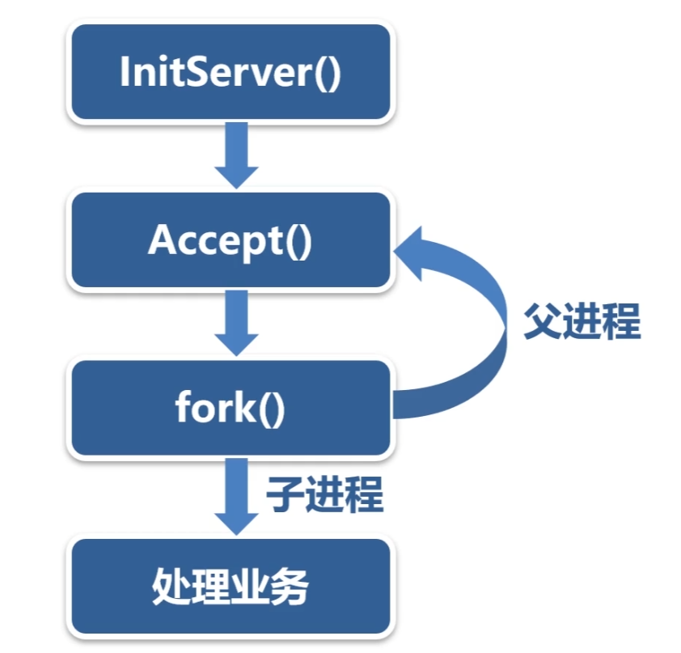
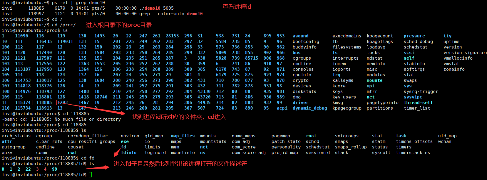
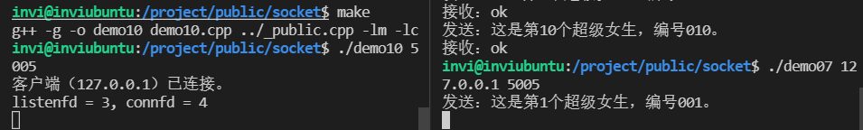
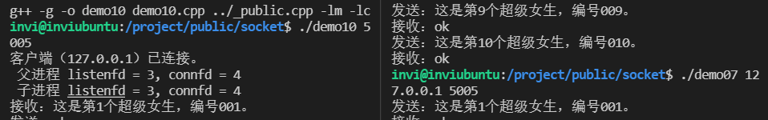
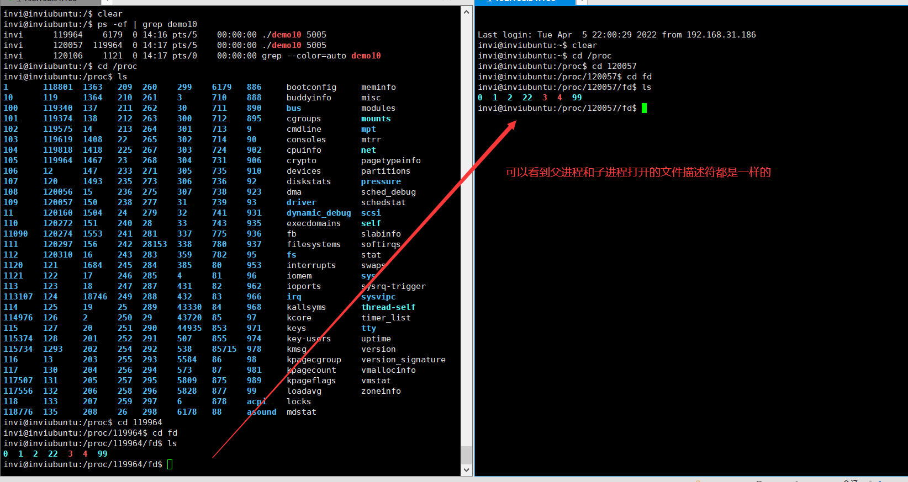
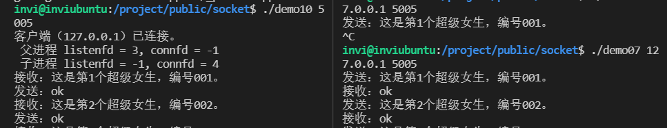
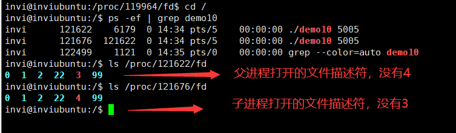
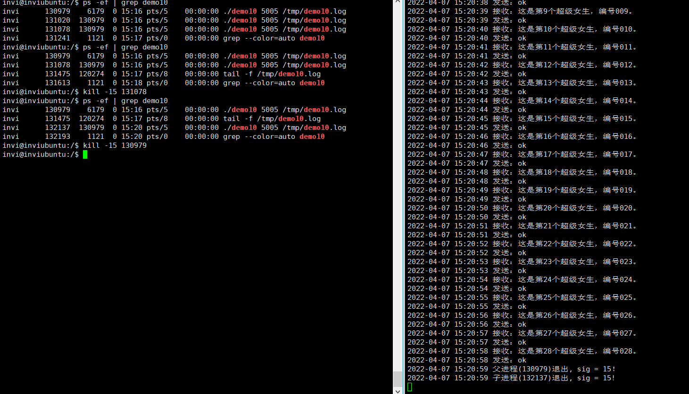
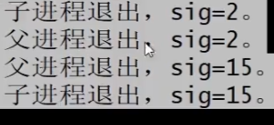

# 多进程的网络服务端

搭建多进程的网络服务程序框架

TCP短链接/长连接和心跳机制

---

# 搭建多进程的网络服务程序框架

之前我们实现的tcp通讯是服务端和客户端一对一的关系，但是在很多情况下，服务端与客户端的关系往往是一对多的关系，一个服务端要为多个客户端服务。

服务端可以是多进程，也可以是多线程。如果是采用io复用技术，单进程当线程的服务端也可以和多个客户端进行通讯。关于这个io复用我们后续再详细介绍，这里我们先搞定多进程和多线程的服务端。



多进程的服务端主体流程是这样的。父进程先初始化服务端，然后accept等待客户端的连接，然后新的客户端连上来以后，fork一个新的子进程出来，然后父进程回到accept继续等待其他客户端连接。那个fork出来的子进程就负责为那个连入的客户端进行通信服务和处理业务。子进程与客户端的通信方式，业务流程等，要根据具体的业务需求。

```c++
    // 等待客户端的连接请求。
    if (TcpServer.Accept()==false)
    {
      printf("TcpServer.Accept() failed.\n"); return -1;
    }

    printf("客户端（%s）已连接。\n",TcpServer.GetIP());

    printf("listenfd = %d, connfd = %d \n", TcpServer.m_listenfd, TcpServer.m_connfd);
```

我们知道linux下一切皆文件，socket也是文件，如何查看这个文件呢？我们不妨做个测试，在客户端连接上tcp服务端后，打印一下客户端和服务端的fd（套接字）。然后查看当前服务端的进程，进入根目录下的 `/proc`目录，这里罗列了当前系统打开的文件描述符，找到我们进程id的那个文件，cd进入，然后查看当前进程打开的文件描述符，cd 进入fd目录，ls列举当前打开的文件描述符。可以看到 `0 1 2 22 3 4 99`，这里 `0 1 2`分别表示标准输入，标准输出和标准错误，然后 3 和 4 就正好对应我们的在程序里打印的服务端和客户端的套接字文件描述符



然后这是我们在程序里打印出的服务端和客户端的socketid，和我们上面找到的正好对应



然后我们继续，我们在fork之后，也把子进程的打开的套接字打印出来。



然后重复上面的动作，查看这两个父子进程打开的文件描述符的情况



可以看到父进程和子进程打开的文件描述符都是一样的。在linux多进程中，父进程关闭自己的文件描述符是不会影响子进程的，同样子进程关闭自己的文件描述符也是不会影响父进程的，在网络服务程序中，父进程只负责监听客户端的连接。客户端连接上来以后，对于父进程来说connfd是不需要的，除此之外，子进程只负责与客户端进行通讯，它使用的socket是connfd，listenfd从来没有用到，也就是对于子进程来说，listenfd也是不需要的，所以这样的话，在父进程中可以关闭4（connfd），在子进程中可以关闭3(listenfd)，**也就是在父进程中关闭连接套接字（connfd），在子进程中关闭监听套接字（listenfd)**

```c++

    printf("客户端（%s）已连接。\n",TcpServer.GetIP());

    if(fork() > 0)
    {
      TcpServer.CloseClient();    // 父进程中关闭连接套接字（client 客户端套接字）
      printf(" 父进程 listenfd = %d, connfd = %d \n", TcpServer.m_listenfd, TcpServer.m_connfd);
      continue;   // 父进程继续回到accept
    }

    TcpServer.CloseListen();    // 然后再子进程中关闭监听套接字

    printf(" 子进程 listenfd = %d, connfd = %d \n", TcpServer.m_listenfd, TcpServer.m_connfd);
```

编译运行。查看打印，可以看到在关闭了对于文件描述符后，在父进程中连接套接字变成-1，子进程中监听套接字变成了-1。



我们可以继续看一下这两个进程打开的文件描述符



### 多进程网络服务程序的退出

如何让多进程的网络服务程序有计划的退出？

之前我们知道可以使用信号来让单进程的服务程序退出，但是多进程的网络服务的退出要比单进程的服务程序退出要麻烦。

在多进程的服务程序中，如果杀掉一个子进程，和这个子进程通讯的客户端会断开，但是不会影响其他的子进程和客户端，也不会影响父进程

如果杀掉父进程，不会像正在通讯的子进程，但是新的客户端将无法建立连接。

如果用killall+进程名，可以杀掉父进程和全部的子进程

**多进程网络服务端程序退出的三种情况：**

* 如果是子进程收到退出信号，该子进程断开与客户端连接的socket，然后退出。
* 如果是父进程收到退出信号，父进程先关闭监听的socket，然后向全部的子进程发出退出信号。
* 如果父子进程都收到退出信号，本质上与第2种情况相同。

我们给父子进程都写入相应的退出信号处理函数，然后测试，可以看到能够正常响应。



那这个时候我们再次启动服务程序，然后启动一个客户端连接上来，然后我们使用ctrl+c终止服务端demo10程序，查看日志。



有可能会出现如上这种情况，这种情况是因为在信号处理函数处理信号的时候，又接到了信号照成的。要解决这种情况，我们可以在信号处理函数中把信号给忽略掉

```c++
void FathEXIT(int sig)   // 父进程退出函数
{
  // 忽略信号,防止干扰
  signal(SIGINT, SIG_IGN);
  signal(SIGTERM, SIG_IGN);
  // 先关闭监听套接字
  TcpServer.CloseListen();

  // 然后给所有的子进程发送退出信号
  kill(0, 15);

  // 然后退出
  logfile.Write("父进程(%d)退出, sig = %d！\n", getpid(), sig);
  exit(0);
}


void ChildEXIT(int sig)  // 子进程退出函数
{
  // 忽略信号,防止干扰
  signal(SIGINT, SIG_IGN);
  signal(SIGTERM, SIG_IGN);
  // 关闭当前客户端的套接字
  TcpServer.CloseClient();

  logfile.Write("子进程(%d)退出, sig = %d!\n", getpid(), sig);
  // 然后退出
  exit(0);
}

```

完整demo代码

```c++
/*
 * 程序名：demo10.cpp，此程序演示采用开发框架的CTcpServer类实现socket通讯多进程的服务端。
 * 1）在多进程的服务程序中，如果杀掉一个子进程，和这个子进程通讯的客户端会断开，但是，不
 *    会影响其它的子进程和客户端，也不会影响父进程。
 * 2）如果杀掉父进程，不会影响正在通讯中的子进程，但是，新的客户端无法建立连接。
 * 3）如果用killall+程序名，可以杀掉父进程和全部的子进程。
 *
 * 多进程网络服务端程序退出的三种情况：
 * 1）如果是子进程收到退出信号，该子进程断开与客户端连接的socket，然后退出。
 * 2）如果是父进程收到退出信号，父进程先关闭监听的socket，然后向全部的子进程发出退出信号。
 * 3）如果父子进程都收到退出信号，本质上与第2种情况相同。
 *
 * author：invi
*/
#include "../_public.h"

CLogFile logfile;      // 服务程序的运行日志。
CTcpServer TcpServer;  // 创建服务端对象。

void FathEXIT(int sig);  // 父进程退出函数。
void ChldEXIT(int sig);  // 子进程退出函数。
 
int main(int argc,char *argv[])
{
  if (argc!=3)
  {
    
  }

  // 关闭全部的信号和输入输出。
  // 设置信号,在shell状态下可用 "kill + 进程号" 正常终止些进程
  // 但请不要用 "kill -9 +进程号" 强行终止
  CloseIOAndSignal();
  signal(SIGINT,FathEXIT);
  signal(SIGTERM,FathEXIT);

  if (logfile.Open(argv[2],"a+")==false) { printf("logfile.Open(%s) failed.\n",argv[2]); return -1; }

  // 服务端初始化。
  if (TcpServer.InitServer(atoi(argv[1]))==false)
  {
    logfile.Write("TcpServer.InitServer(%s) failed.\n",argv[1]); return -1;
  }

  while (true)
  {
    // 等待客户端的连接请求。
    if (TcpServer.Accept()==false)
    {
      logfile.Write("TcpServer.Accept() failed.\n"); FathEXIT(-1);
    }

    logfile.Write("客户端（%s）已连接。\n",TcpServer.GetIP());

    if (fork()>0) { TcpServer.CloseClient(); continue; }  // 父进程继续回到Accept()。
   
    // 子进程重新设置退出信号。
    signal(SIGINT,ChldEXIT); signal(SIGTERM,ChldEXIT);

    TcpServer.CloseListen();

    // 子进程与客户端进行通讯，处理业务。
    char buffer[102400];

    // 与客户端通讯，接收客户端发过来的报文后，回复ok。
    while (1)
    {
      memset(buffer,0,sizeof(buffer));
      if (TcpServer.Read(buffer)==false) break; // 接收客户端的请求报文。
      logfile.Write("接收：%s\n",buffer);

      strcpy(buffer,"ok");
      if (TcpServer.Write(buffer)==false) break; // 向客户端发送响应结果。
      logfile.Write("发送：%s\n",buffer);
    }

    ChldEXIT(0);
  }
}

// 父进程退出函数。
void FathEXIT(int sig)  
{
  // 以下代码是为了防止信号处理函数在执行的过程中被信号中断。
  signal(SIGINT,SIG_IGN); signal(SIGTERM,SIG_IGN);

  logfile.Write("父进程退出，sig=%d。\n",sig);

  TcpServer.CloseListen();    // 关闭监听的socket。

  kill(0,15);     // 通知全部的子进程退出。

  exit(0);
}

// 子进程退出函数。
void ChldEXIT(int sig)  
{
  // 以下代码是为了防止信号处理函数在执行的过程中被信号中断。
  signal(SIGINT,SIG_IGN); signal(SIGTERM,SIG_IGN);

  logfile.Write("子进程退出，sig=%d。\n",sig);

  TcpServer.CloseClient();    // 关闭客户端的socket。

  exit(0);
}

```
