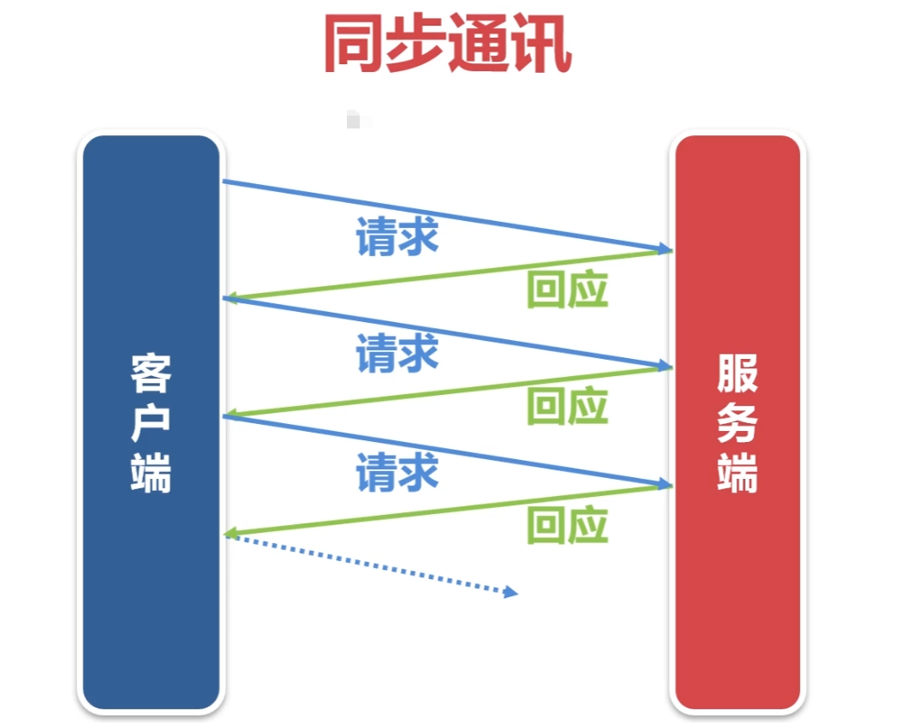
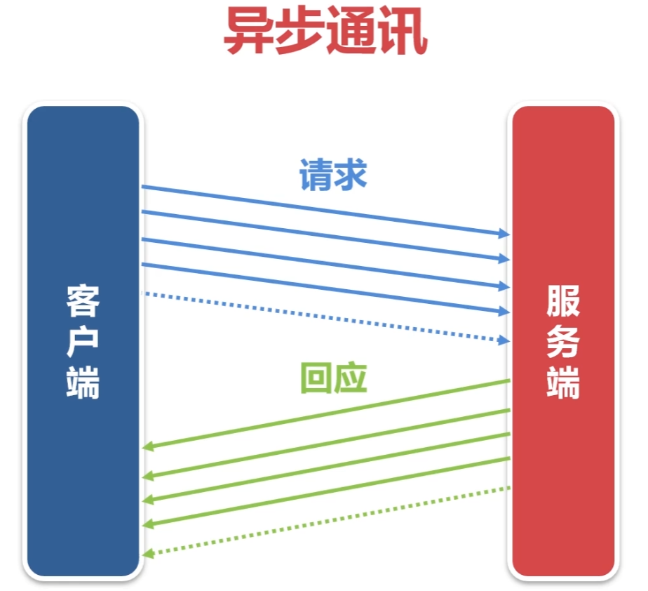

# 基于TCP的文件传输系统

实现文件的上传和下载功能

采用异步通信机制，实现文件的快速传输

文件传输的服务端模块（支持上传和下载）

文件上传的客户端模块

文件下载的客户端模块

---

# 实现文件的上传和下载功能

## 搭建上传程序的框架


这里登陆，客户端登陆最重要的意义不是判断用户的账号和密码，而是与服务端协商文件传输的参数，最重要的参数是文件存放的目录，

第二步客户端获取本地目录的清单

接下使用一个循环，在循环里主要做这3个事情，把文件的信息发送给服务端（文件名，文件时间，文件大小），然后再把文件内容发送给服务端，然后服务端成功接收文件后再向客户端回应确认报文。客户端收到这个确认报文之后，这个文件就算是确认上传成功了。然后回到循环，把下一个文件发送给服务端。这样循环下去，直到所有的文件全都上传成功。

这里有两个细节需要注意：

tcp文件传输系统用于系统内部，对文件传输的时效要求很高，不能延时太长时间，所以客户端程序一直运行在内存中，不会退出，传完一批文件之后，sleep几秒就会接着传下一批文件。

还有客户端不需要增量上传的功能，文件上传成功之后，删除本地文件或者转存到其他备份目录即可。因为这是我们本地的服务，为了保证效率，每次上传完就删除它，如果需要上传到多个服务端怎么办呢？那就在生成文件的时候，将这个文件拷贝到多个目录下就可以了，然后不同的服务端上传的时候去读取不同的上传路径即可。

**文件上传客户端的思路**

> 调用OpenDir()打开starg.clientpath目录
>
> while(1)
>
> {
>
> 遍历目录中的每个文件，调用ReadDir()获取一个文件名
>
> 然后把文件名，文件修改时间，文件大小组成报文，发送给对端
>
> 把文件内容发送给对端
>
> 接收对端的确认报文
>
> 删除或者转存到备份目录
>
> }

**文件上传服务端的思路**

> 接收客户端的报文。
>
> 第二个参数（超时时间）的取值必须大于starg.timetvl，小于starg.timeout。
>
> starg.timetvl扫描本地目录文件的时间间隔，单位：秒。
>
> starg.timeout进程心跳的超时时间
>
> 也就是你不能在它还在扫描文件的间隔期间就判定为超时，也不能已经超时超过了进程的心跳时间了还不认为是超时
>
> TcpServer.Read(strrecvbuffer,starg.timetvl+10
>
> 处理心跳报文。
>
> 处理上传文件的请求报文。上传报文他的开头10个字符一定是<filename>
>
> 解析上传文件请求报文的xml
>
> 接收上传文件的内容
>
> 把接收结果返回给客户端

**客户端上传文件的核心思路**

> 文件内容上传函数
>
> 打开文件，使用“rb"模式，因为我们要上传的文件除了文本数据，还有二进制的数据
>
> 同时如果文件比较大，不可能一次性把文件内容都读取出来，所以这里用一个循环，每次从文件中读取若干字节，然后发送
>
> while(true)
>
> {
>
> 计算本次应该读取的字节数，如果属于的数据超过1000字节，就打算读取1000字节。
>
> 然后从文件里读取数据
>
> 把读取到的数据发送给对端
>
> 注意这里发送使用框架里的Writen函数，如果使用TcpClient.Write函数，不一定能保证全部发送完毕
>
> 计算文件已经读取的字节数，如果文件已经读取完毕，就跳出循环
>
> 如果以读取的字节数等于文件大小，就表示已经读取完该文件的所有数据
>
> 关闭文件指针

**服务端接收上传的核心思路**

> // 接收上传文件内容的函数
>
> bool RecvFile(const int socketfd, char *filename, const char*mtime, int filesize)
>
> {
>
> // 生成临时文件名，等待这个文件全部接收完毕之后，再改名为正式文件
>
> // 创建临时文件
>
> while(1)
>
> {
>
> // 计算本次应该接收的字节数
>
> // 接收文件内容
>
> // 把接收到的内容写入文件
>
> // 计算已经接收到的总字节数，如果文件已经接收完毕，跳出循环
>
> }
>
> // 关闭临时文件
>
> // 重置文件时间 (注意：这里如果没有重置文件时间，那么文件时间就是传输这次文件的时间， 文件传输时间是没有意义的，文件原始时间更有意义)
>
> // 把临时文件RENAME为正式文件
>
> return true;
>
> }

**文件上传后本地文件的转存和删除**

```c++
// 删除或者转存到备份目录
bool AckMessage(const char* buffer)
{

  // 解析buffer
  char filename[301];
  char result[11];
  memset(filename, 0, sizeof(filename));
  memset(result, 0, sizeof(result));

  GetXMLBuffer(buffer, "filename", filename, 300);
  GetXMLBuffer(buffer, "result", result, 10);

  if(strcmp(result, "ok") != 0)
  {
    return true;
  }
  
  // ptype == 1.删除文件
  if(starg.ptype == 1)
  {
    if(REMOVE(filename) == false)
    {
      logfile.Write("REMOVE(%s) failed \n", filename);
      return false;
    }
  }

  // ptype == 2 .转存到备份目录
  if(starg.ptype == 2)
  {
    // 先生成备份目录的文件名
    char filenamebak[301];

    STRCPY(filenamebak, sizeof(filenamebak), filename);

    // 然后将备份目录的路径替换进去
    UpdateStr(filenamebak, starg.clientpath, starg.clientpathbak, false);

    if(RENAME(filename, filenamebak) == false)
    {
      logfile.Write("RENAME(%s, %s) failed\n", filename, filenamebak);
      return false;
    }
  }

  return true;
}
```

---

# 采用异步通信机制，实现文件的快速传输

**定义：同步和异步关注的是\**消息通信机制\** (synchronous communication/ asynchronous communication)。同步，就是调用某个东西是，调用方得等待这个调用返回结果才能继续往后执行。异步，和同步相反 调用方不会理解得到结果，而是在调用发出后调用者可用继续执行后续操作，被调用者通过状体来通知调用者，或者通过回掉函数来处理这个调用**

**同步异步与阻塞非阻塞不能混为一谈**

看了上面的讲解，你可能会说这不就是阻塞机制吗？不不不，同步异步不能和阻塞非阻塞混为一谈。

阻塞和非阻塞 强调的是程序在等待调用结果（消息，返回值）时的状态. 阻塞调用是指调用结果返回之前，当前线程会被挂起。调用线程只有在得到结果之后才会返回。非阻塞调用指在不能立刻得到结果之前，该调用不会阻塞当前线程。 对于同步调用来说，很多时候当前线程还是激活的状态，只是从逻辑上当前函数没有返回而已，即同步等待时什么都不干，白白占用着资源。

同步和异步强调的是消息通信机制 (synchronous communication/ asynchronous communication)。所谓同步，就是在发出一个"调用"时，在没有得到结果之前，该“调用”就不返回。但是一旦调用返回，就得到返回值了。换句话说，就是由“调用者”主动等待这个“调用”的结果。而异步则是相反，"调用"在发出之后，这个调用就直接返回了，所以没有返回结果。换句话说，当一个异步过程调用发出后，调用者不会立刻得到结果。而是在"调用"发出后，"被调用者"通过状态、通知来通知调用者，或通过回调函数处理这个调用



如图所示，同步通讯可以简化为上述这种一问一答的通讯方式，客户端发出请求，然后等待服务端回应，在请求发出去之后 到  接收到回应之间这段时间，客户端什么也没做，就是干等待。所以同步通讯他的效率比较低，因为把大量的时间都浪费在了等待上面。但是同步通讯流程较为简单，编码难度也不高。



异步通讯他的过程是这样的，客户单发送n个请求，同时它也会接收到服务端的n个回应，采用异步通讯方式不会把时间浪费在等待响应报文上面，所以效率会很高，但是带来的问题就是流程控制会很麻烦，编码也会更复杂。比如客户端向服务端发送了1000个请求，这个时候网络断开了，这1000个请求中，客户端只收到了500个回应，然后500个回应丢失了，那么这丢失了的500个回应客户端就不知道服务端处理是成功还是失败，这种该怎么办？这个处理方式因人而异，因项目而异，没有固定的解决办法。

## 异步通讯的实现

异步通讯有3中常见的实现方法

- 多进程：用不同的进程发送报文和接收报文。客户端连上服务端后，fork一个新的进程出来，这样程序就有父进程和子进程两个进程，一个进程负责发送，一个进程负责接收。
- 多线程：用不同的线程发送报文和接收报文。他的原理和多进程是一样的，一个线程负责发送，一个线程负责接收。
- I/O复用：select、poll、epoll 技术来实现。

## 异步上传文件

## 下载文件

tcp连接由客户端发起，登陆协商文件传输的参数。

上传：由客户端发起文件传输请求，把客户端目录中的文件发送给服务端。

下载：由服务端发起文件传输请求，把服务端目录中的文件发送给客户端

## 文件上传下载服务端程序

```c++

#include "_public.h"

// 程序运行的参数结构体。
struct st_arg
{
  int  clienttype;          // 客户端类型，1-上传文件；2-下载文件。
  char ip[31];              // 服务端的IP地址。
  int  port;                // 服务端的端口。
  int  ptype;               // 文件成功传输后的处理方式：1-删除文件；2-移动到备份目录。
  char clientpath[301];     // 客户端文件存放的根目录。
  bool andchild;            // 是否传输各级子目录的文件，true-是；false-否。
  char matchname[301];      // 待传输文件名的匹配规则，如"*.TXT,*.XML"。
  char srvpath[301];        // 服务端文件存放的根目录。
  char srvpathbak[301];     // 服务端文件存放的根目录。
  int  timetvl;             // 扫描目录文件的时间间隔，单位：秒。
  int  timeout;             // 进程心跳的超时时间。
  char pname[51];           // 进程名，建议用"tcpgetfiles_后缀"的方式。
} starg;

// 把xml解析到参数starg结构中。
bool _xmltoarg(char *strxmlbuffer);

CLogFile logfile;      // 服务程序的运行日志。
CTcpServer TcpServer;  // 创建服务端对象。

void FathEXIT(int sig);  // 父进程退出函数。
void ChldEXIT(int sig);  // 子进程退出函数。

bool ActiveTest();    // 心跳。

char strrecvbuffer[1024];   // 发送报文的buffer。
char strsendbuffer[1024];   // 接收报文的buffer。

// 文件下载的主函数，执行一次文件下载的任务。
bool _tcpputfiles();
bool bcontinue=true;   // 如果调用_tcpputfiles发送了文件，bcontinue为true，初始化为true。

// 把文件的内容发送给对端。
bool SendFile(const int sockfd,const char *filename,const int filesize);

// 删除或者转存本地的文件。
bool AckMessage(const char *strrecvbuffer);

// 登录业务处理函数。
bool ClientLogin();

// 上传文件的主函数。
void RecvFilesMain();

// 下载文件的主函数。
void SendFilesMain();

// 接收文件的内容。
bool RecvFile(const int sockfd,const char *filename,const char *mtime,int filesize);

CPActive PActive;  // 进程心跳。

int main(int argc,char *argv[])
{
  if (argc!=3)
  {
    printf("Using:./fileserver port logfile\n");
    printf("Example:./fileserver 5005 /log/idc/fileserver.log\n"); 
    printf("         /project/tools1/bin/procctl 10 /project/tools1/bin/fileserver 5005 /log/idc/fileserver.log\n\n\n"); 
    return -1;
  }

  // 关闭全部的信号和输入输出。
  // 设置信号,在shell状态下可用 "kill + 进程号" 正常终止些进程
  // 但请不要用 "kill -9 +进程号" 强行终止
  CloseIOAndSignal(); signal(SIGINT,FathEXIT); signal(SIGTERM,FathEXIT);

  if (logfile.Open(argv[2],"a+")==false) { printf("logfile.Open(%s) failed.\n",argv[2]); return -1; }

  // 服务端初始化。
  if (TcpServer.InitServer(atoi(argv[1]))==false)
  {
    logfile.Write("TcpServer.InitServer(%s) failed.\n",argv[1]); return -1;
  }

  while (true)
  {
    // 等待客户端的连接请求。
    if (TcpServer.Accept()==false)
    {
      logfile.Write("TcpServer.Accept() failed.\n"); FathEXIT(-1);
    }

    logfile.Write("客户端（%s）已连接。\n",TcpServer.GetIP());

    if (fork()>0) { TcpServer.CloseClient(); continue; }  // 父进程继续回到Accept()。
   
    // 子进程重新设置退出信号。
    signal(SIGINT,ChldEXIT); signal(SIGTERM,ChldEXIT);

    TcpServer.CloseListen();

    // 子进程与客户端进行通讯，处理业务。

    // 处理登录客户端的登录报文。
    if (ClientLogin()==false) ChldEXIT(-1);

    // 如果clienttype==1，调用上传文件的主函数。
    if (starg.clienttype==1) RecvFilesMain();

    // 如果clienttype==2，调用下载文件的主函数。
    if (starg.clienttype==2) SendFilesMain();

    ChldEXIT(0);
  }
}

// 父进程退出函数。
void FathEXIT(int sig)  
{
  // 以下代码是为了防止信号处理函数在执行的过程中被信号中断。
  signal(SIGINT,SIG_IGN); signal(SIGTERM,SIG_IGN);

  logfile.Write("父进程退出，sig=%d。\n",sig);

  TcpServer.CloseListen();    // 关闭监听的socket。

  kill(0,15);     // 通知全部的子进程退出。

  exit(0);
}

// 子进程退出函数。
void ChldEXIT(int sig)  
{
  // 以下代码是为了防止信号处理函数在执行的过程中被信号中断。
  signal(SIGINT,SIG_IGN); signal(SIGTERM,SIG_IGN);

  logfile.Write("子进程退出，sig=%d。\n",sig);

  TcpServer.CloseClient();    // 关闭客户端的socket。

  exit(0);
}

// 登录。
bool ClientLogin()
{
  memset(strrecvbuffer,0,sizeof(strrecvbuffer));
  memset(strsendbuffer,0,sizeof(strsendbuffer));

  if (TcpServer.Read(strrecvbuffer,20)==false)
  {
    logfile.Write("TcpServer.Read() failed.\n"); return false;
  }
  logfile.Write("strrecvbuffer=%s\n",strrecvbuffer);

  // 解析客户端登录报文。
  _xmltoarg(strrecvbuffer);

  if ( (starg.clienttype!=1) && (starg.clienttype!=2) )
    strcpy(strsendbuffer,"failed");
  else
    strcpy(strsendbuffer,"ok");

  if (TcpServer.Write(strsendbuffer)==false)
  {
    logfile.Write("TcpServer.Write() failed.\n"); return false;
  }

  logfile.Write("%s login %s.\n",TcpServer.GetIP(),strsendbuffer);
  
  return true;
}

// 把xml解析到参数starg结构中
bool _xmltoarg(char *strxmlbuffer)
{
  memset(&starg,0,sizeof(struct st_arg));

  // 不需要对参数做合法性判断，客户端已经判断过了。
  GetXMLBuffer(strxmlbuffer,"clienttype",&starg.clienttype);
  GetXMLBuffer(strxmlbuffer,"ptype",&starg.ptype);
  GetXMLBuffer(strxmlbuffer,"clientpath",starg.clientpath);
  GetXMLBuffer(strxmlbuffer,"andchild",&starg.andchild);
  GetXMLBuffer(strxmlbuffer,"matchname",starg.matchname);
  GetXMLBuffer(strxmlbuffer,"srvpath",starg.srvpath);
  GetXMLBuffer(strxmlbuffer,"srvpathbak",starg.srvpathbak);

  GetXMLBuffer(strxmlbuffer,"timetvl",&starg.timetvl);
  if (starg.timetvl>30) starg.timetvl=30;

  GetXMLBuffer(strxmlbuffer,"timeout",&starg.timeout);
  if (starg.timeout<50) starg.timeout=50;

  GetXMLBuffer(strxmlbuffer,"pname",starg.pname,50);
  strcat(starg.pname,"_srv");

  return true;
}

// 上传文件的主函数。
void RecvFilesMain()
{
  PActive.AddPInfo(starg.timeout,starg.pname);

  while (true)
  {
    memset(strsendbuffer,0,sizeof(strsendbuffer));
    memset(strrecvbuffer,0,sizeof(strrecvbuffer));

    PActive.UptATime();

    // 接收客户端的报文。
    // 第二个参数的取值必须大于starg.timetvl，小于starg.timeout。
    if (TcpServer.Read(strrecvbuffer,starg.timetvl+10)==false)
    {
      logfile.Write("TcpServer.Read() failed.\n"); return;
    }
    // logfile.Write("strrecvbuffer=%s\n",strrecvbuffer);

    // 处理心跳报文。
    if (strcmp(strrecvbuffer,"<activetest>ok</activetest>")==0)
    {
      strcpy(strsendbuffer,"ok");
      // logfile.Write("strsendbuffer=%s\n",strsendbuffer);
      if (TcpServer.Write(strsendbuffer)==false)
      {
        logfile.Write("TcpServer.Write() failed.\n"); return;
      }
    }

    // 处理上传文件的请求报文。
    if (strncmp(strrecvbuffer,"<filename>",10)==0)
    {
      // 解析上传文件请求报文的xml。
      char clientfilename[301];  memset(clientfilename,0,sizeof(clientfilename));
      char mtime[21];            memset(mtime,0,sizeof(mtime));
      int  filesize=0;
      GetXMLBuffer(strrecvbuffer,"filename",clientfilename,300);
      GetXMLBuffer(strrecvbuffer,"mtime",mtime,19);
      GetXMLBuffer(strrecvbuffer,"size",&filesize);

      // 客户端和服务端文件的目录是不一样的，以下代码生成服务端的文件名。
      // 把文件名中的clientpath替换成srvpath，要小心第三个参数
      char serverfilename[301];  memset(serverfilename,0,sizeof(serverfilename));
      strcpy(serverfilename,clientfilename);
      UpdateStr(serverfilename,starg.clientpath,starg.srvpath,false);

      // 接收文件的内容。
      logfile.Write("recv %s(%d) ...",serverfilename,filesize);
      if (RecvFile(TcpServer.m_connfd,serverfilename,mtime,filesize)==true)
      {
        logfile.WriteEx("ok.\n");
        SNPRINTF(strsendbuffer,sizeof(strsendbuffer),1000,"<filename>%s</filename><result>ok</result>",clientfilename);
      }
      else
      {
        logfile.WriteEx("failed.\n");
        SNPRINTF(strsendbuffer,sizeof(strsendbuffer),1000,"<filename>%s</filename><result>failed</result>",clientfilename);
      }

      // 把接收结果返回给对端。
      // logfile.Write("strsendbuffer=%s\n",strsendbuffer);
      if (TcpServer.Write(strsendbuffer)==false)
      {
        logfile.Write("TcpServer.Write() failed.\n"); return;
      }
    }
  }
}

// 接收文件的内容。
bool RecvFile(const int sockfd,const char *filename,const char *mtime,int filesize)
{
  // 生成临时文件名。
  char strfilenametmp[301];
  SNPRINTF(strfilenametmp,sizeof(strfilenametmp),300,"%s.tmp",filename);

  int  totalbytes=0;        // 已接收文件的总字节数。
  int  onread=0;            // 本次打算接收的字节数。
  char buffer[1000];        // 接收文件内容的缓冲区。
  FILE *fp=NULL;

  // 创建临时文件。
  if ( (fp=FOPEN(strfilenametmp,"wb"))==NULL ) return false;

  while (true)
  {
    memset(buffer,0,sizeof(buffer));

    // 计算本次应该接收的字节数。
    if (filesize-totalbytes>1000) onread=1000;
    else onread=filesize-totalbytes;

    // 接收文件内容。
    if (Readn(sockfd,buffer,onread)==false) { fclose(fp); return false; }

    // 把接收到的内容写入文件。
    fwrite(buffer,1,onread,fp);

    // 计算已接收文件的总字节数，如果文件接收完，跳出循环。
    totalbytes=totalbytes+onread;

    if (totalbytes==filesize) break;
  }

  // 关闭临时文件。
  fclose(fp);

  // 重置文件的时间。
  UTime(strfilenametmp,mtime);

  // 把临时文件RENAME为正式的文件。
  if (RENAME(strfilenametmp,filename)==false) return false;

  return true;
}

// 下载文件的主函数。
void SendFilesMain()
{
  PActive.AddPInfo(starg.timeout,starg.pname);

  while (true)
  {
    // 调用文件下载的主函数，执行一次文件下载的任务。
    if (_tcpputfiles()==false) { logfile.Write("_tcpputfiles() failed.\n"); return; }

    if (bcontinue==false)
    {
      sleep(starg.timetvl);

      if (ActiveTest()==false) break;
    }

    PActive.UptATime();
  }
}

// 心跳。
bool ActiveTest()
{
  memset(strsendbuffer,0,sizeof(strsendbuffer));
  memset(strrecvbuffer,0,sizeof(strrecvbuffer));

  SPRINTF(strsendbuffer,sizeof(strsendbuffer),"<activetest>ok</activetest>");
  // logfile.Write("发送：%s\n",strsendbuffer);
  if (TcpServer.Write(strsendbuffer)==false) return false; // 向服务端发送请求报文。

  if (TcpServer.Read(strrecvbuffer,20)==false) return false; // 接收服务端的回应报文。
  // logfile.Write("接收：%s\n",strrecvbuffer);

  return true;
}

// 文件下载的主函数，执行一次文件下载的任务。
bool _tcpputfiles()
{
  CDir Dir;

  // 调用OpenDir()打开starg.srvpath目录。
  if (Dir.OpenDir(starg.srvpath,starg.matchname,10000,starg.andchild)==false)
  {
    logfile.Write("Dir.OpenDir(%s) 失败。\n",starg.srvpath); return false;
  }

  int delayed=0;        // 未收到对端确认报文的文件数量。
  int buflen=0;         // 用于存放strrecvbuffer的长度。

  bcontinue=false;

  while (true)
  {
    memset(strsendbuffer,0,sizeof(strsendbuffer));
    memset(strrecvbuffer,0,sizeof(strrecvbuffer));

    // 遍历目录中的每个文件，调用ReadDir()获取一个文件名。
    if (Dir.ReadDir()==false) break;

    bcontinue=true;

    // 把文件名、修改时间、文件大小组成报文，发送给对端。
    SNPRINTF(strsendbuffer,sizeof(strsendbuffer),1000,"<filename>%s</filename><mtime>%s</mtime><size>%d</size>",Dir.m_FullFileName,Dir.m_ModifyTime,Dir.m_FileSize);

    // logfile.Write("strsendbuffer=%s\n",strsendbuffer);
    if (TcpServer.Write(strsendbuffer)==false)
    {
      logfile.Write("TcpServer.Write() failed.\n"); return false;
    }

    // 把文件的内容发送给对端。
    logfile.Write("send %s(%d) ...",Dir.m_FullFileName,Dir.m_FileSize);
    if (SendFile(TcpServer.m_connfd,Dir.m_FullFileName,Dir.m_FileSize)==true)
    {
      logfile.WriteEx("ok.\n"); delayed++;
    }
    else
    {
      logfile.WriteEx("failed.\n"); TcpServer.CloseClient(); return false;
    }

    PActive.UptATime();

    // 接收对端的确认报文。
    while (delayed>0)
    {
      memset(strrecvbuffer,0,sizeof(strrecvbuffer));
      if (TcpRead(TcpServer.m_connfd,strrecvbuffer,&buflen,-1)==false) break;
      // logfile.Write("strrecvbuffer=%s\n",strrecvbuffer);

      // 删除或者转存本地的文件。
      delayed--;
      AckMessage(strrecvbuffer);
    }
  }

  // 继续接收对端的确认报文。
  while (delayed>0)
  {
    memset(strrecvbuffer,0,sizeof(strrecvbuffer));
    if (TcpRead(TcpServer.m_connfd,strrecvbuffer,&buflen,10)==false) break;
    // logfile.Write("strrecvbuffer=%s\n",strrecvbuffer);

    // 删除或者转存本地的文件。
    delayed--;
    AckMessage(strrecvbuffer);
  }

  return true;
}

// 把文件的内容发送给对端。
bool SendFile(const int sockfd,const char *filename,const int filesize)
{
  int  onread=0;        // 每次调用fread时打算读取的字节数。
  int  bytes=0;         // 调用一次fread从文件中读取的字节数。
  char buffer[1000];    // 存放读取数据的buffer。
  int  totalbytes=0;    // 从文件中已读取的字节总数。
  FILE *fp=NULL;

  // 以"rb"的模式打开文件。
  if ( (fp=fopen(filename,"rb"))==NULL )  return false;

  while (true)
  {
    memset(buffer,0,sizeof(buffer));

    // 计算本次应该读取的字节数，如果剩余的数据超过1000字节，就打算读1000字节。
    if (filesize-totalbytes>1000) onread=1000;
    else onread=filesize-totalbytes;

    // 从文件中读取数据。
    bytes=fread(buffer,1,onread,fp);

    // 把读取到的数据发送给对端。
    if (bytes>0)
    {
      if (Writen(sockfd,buffer,bytes)==false) { fclose(fp); return false; }
    }

    // 计算文件已读取的字节总数，如果文件已读完，跳出循环。
    totalbytes=totalbytes+bytes;

    if (totalbytes==filesize) break;
  }

  fclose(fp);

  return true;
}

// 删除或者转存本地的文件。
bool AckMessage(const char *strrecvbuffer)
{
  char filename[301];
  char result[11];

  memset(filename,0,sizeof(filename));
  memset(result,0,sizeof(result));

  GetXMLBuffer(strrecvbuffer,"filename",filename,300);
  GetXMLBuffer(strrecvbuffer,"result",result,10);

  // 如果服务端接收文件不成功，直接返回。
  if (strcmp(result,"ok")!=0) return true;

  // ptype==1，删除文件。
  if (starg.ptype==1)
  {
    if (REMOVE(filename)==false) { logfile.Write("REMOVE(%s) failed.\n",filename); return false; }
  }

  // ptype==2，移动到备份目录。
  if (starg.ptype==2)
  {
    // 生成转存后的备份目录文件名。
    char bakfilename[301];
    STRCPY(bakfilename,sizeof(bakfilename),filename);
    UpdateStr(bakfilename,starg.srvpath,starg.srvpathbak,false);
    if (RENAME(filename,bakfilename)==false)
    { logfile.Write("RENAME(%s,%s) failed.\n",filename,bakfilename); return false; }
  }

  return true;
}
```

## tcp文件上传客户端程序

```c++
/*
 * 程序名：tcpputfiles.cpp，采用tcp协议，实现文件上传的客户端。
 * author：invi
*/
#include "_public.h"

CTcpClient TcpClient;   // 客户端tcp通讯对象
CLogFile logfile;   // 日志
CPActive PActive;   // 进程心跳

// 程序运行的参数结构体。
struct st_arg
{
  int  clienttype;          // 客户端类型，1-上传文件；2-下载文件。
  char ip[31];              // 服务端的IP地址。
  int  port;                // 服务端的端口。
  int  ptype;               // 文件上传成功后文件的处理方式：1-删除文件；2-移动到备份目录。
  char clientpath[301];     // 本地文件存放的根目录。
  char clientpathbak[301];  // 文件成功上传后，本地文件备份的根目录，当ptype==2时有效。
  bool andchild;            // 是否上传clientpath目录下各级子目录的文件，true-是；false-否。
  char matchname[301];      // 待上传文件名的匹配规则，如"*.TXT,*.XML"。
  char srvpath[301];        // 服务端文件存放的根目录。
  int  timetvl;             // 扫描本地目录文件的时间间隔，单位：秒。
  int  timeout;             // 进程心跳的超时时间。
  char pname[51];           // 进程名，建议用"tcpputfiles_后缀"的方式。
} starg;

bool ActiveTest();    // tcp心跳
bool Login(const char* argv);    // 登陆业务

// 程序退出和信号2、15的处理函数。
void EXIT(int sig);

// 程序帮助文档方法
void _help();

// 发送报文的buffer
char strsendbuffer[1024];

// 接收报文的buffer
char strrecvbuffer[1024];

// 如果调用_tcpputfiles发送了文件，bocontinue为true，初始化为true
bool bcontinue = true;

// 解析xml到参数starg中
bool _xmltoarg(char * strxmlbuffer);

// 文件上传函数
bool _tcpputfiles();

// 文件内容上传函数
bool SendFile(const int socketfd, char *filename, const int filesize);

// 删除或者转存到备份目录
bool AckMessage(const char* buffer);
 
int main(int argc,char *argv[])
{
  if (argc!=3) { _help(); return -1; }

  // 关闭全部的信号和输入输出。
  // 设置信号,在shell状态下可用 "kill + 进程号" 正常终止些进程。
  // 但请不要用 "kill -9 +进程号" 强行终止。
  CloseIOAndSignal(); signal(SIGINT,EXIT); signal(SIGTERM,EXIT);

  // 打开日志文件
  if(logfile.Open(argv[1],  "a+") == false)
  {
    printf("logfile.Open(%s,  \"a+\") failed", argv[1]);
    return -1;
  }

  // 解析xml,得到程序的运行参数
  if(_xmltoarg(argv[2]) == false)
  {
    return -1;
  }

  // 把进程心跳写入共享内存
  PActive.AddPInfo(starg.timeout, starg.pname);

  // 向服务端发起连接请求。
  if (TcpClient.ConnectToServer(starg.ip, starg.port)==false)
  {
    logfile.Write("TcpClient.ConnectToServer(%s,%d) failed.\n",starg.ip, starg.port);
    EXIT(-1);
  }

  if(Login(argv[2]) == false)
  {
    logfile.Write("登陆失败！\n");
    EXIT(-1);
  }

  // 登陆成功后
  while (1)
  {
    // 调用文件上传的主函数，执行一次文件上传任务
    if(_tcpputfiles() == false)
    {
      logfile.Write("_tcpputfiles() failed\n");
      EXIT(-1);
    }

    if(bcontinue == false)
    {
      sleep(starg.timetvl);     // 休息这么多秒，也就是每隔timetvl就检测一次文件，看是否有新文件需要上传
      if(ActiveTest() == false) break;    // 休息结束发送一次心跳
    }

    PActive.UptATime();

  }

  EXIT(0);

}

bool ActiveTest()    // 心跳函数
{
  memset(strrecvbuffer, 0, sizeof(strrecvbuffer));
  memset(strsendbuffer, 0, sizeof(strsendbuffer));

  SPRINTF(strsendbuffer, sizeof(strsendbuffer), "<activetest>ok</activetest>");
  // logfile.Write("发送：%s\n", strsendbuffer);

  if(TcpClient.Write(strsendbuffer) == false)   // 向服务端发送心跳报文
  {
    return false;
  }

  // 超时时间设置为20s
  if(TcpClient.Read(strrecvbuffer, 20) == false)    // 接收服务端的回应报文
  {
    return false;
  }
  // logfile.Write("接收：%s\n", strrecvbuffer);

  return true;
}

bool Login(const char *argv)    // 登陆业务
{
  memset(strrecvbuffer, 0, sizeof(strrecvbuffer));
  memset(strsendbuffer, 0, sizeof(strsendbuffer));

  SPRINTF(strsendbuffer, sizeof(strsendbuffer), "%s<clienttype>1</clienttype>", argv);
  // logfile.Write("发送：%s\n", strsendbuffer);
  if(TcpClient.Write(strsendbuffer) == false)   // 向服务端发送请求报文
  {
    return false;
  }

  // 超时时间设置为20s
  if(TcpClient.Read(strsendbuffer, 20) == false)
  {
    return false;
  }
  // logfile.Write("接收：%s\n", strsendbuffer);

  logfile.Write("登陆%s:%d成功\n", starg.ip, starg.port);

  return true;
}

void _help()
{
  printf("\n");
  printf("Using:/project/tools/bin/tcpputfiles logfilename xmlbuffer\n\n");

  printf("Sample:/project/tools/bin/procctl 20 /project/tools/bin/tcpputfiles /log/idc/tcpputfiles_surfdata.log \"<ip>192.168.31.166</ip><port>5005</port><ptype>1</ptype><clientpath>/tmp/tcp/surfdata1</clientpath><clientpathbak>/tmp/tcp/surfdata1bak</clientpathbak><andchild>true</andchild><matchname>*.XML,*.CSV</matchname><srvpath>/tmp/tcp/surfdata2</srvpath><timetvl>10</timetvl><timeout>50</timeout><pname>tcpputfiles_surfdata</pname>\"\n");
  printf("       /project/tools/bin/procctl 20 /project/tools/bin/tcpputfiles /log/idc/tcpputfiles_surfdata.log \"<ip>192.168.31.166</ip><port>5005</port><ptype>2</ptype><clientpath>/tmp/tcp/surfdata1</clientpath><clientpathbak>/tmp/tcp/surfdata1bak</clientpathbak><andchild>true</andchild><matchname>*.XML,*.CSV</matchname><srvpath>/tmp/tcp/surfdata2</srvpath><timetvl>10</timetvl><timeout>50</timeout><pname>tcpputfiles_surfdata</pname>\"\n\n\n");

  printf("本程序是数据中心的公共功能模块，采用tcp协议把文件发送给服务端。\n");
  printf("logfilename   本程序运行的日志文件。\n");
  printf("xmlbuffer     本程序运行的参数，如下：\n");
  printf("ip            服务端的IP地址。\n");
  printf("port          服务端的端口。\n");
  printf("ptype         文件上传成功后的处理方式：1-删除文件；2-移动到备份目录。\n");
  printf("clientpath    本地文件存放的根目录。\n");
  printf("clientpathbak 文件成功上传后，本地文件备份的根目录，当ptype==2时有效。\n");
  printf("andchild      是否上传clientpath目录下各级子目录的文件，true-是；false-否，缺省为false。\n");
  printf("matchname     待上传文件名的匹配规则，如\"*.TXT,*.XML\"\n");
  printf("srvpath       服务端文件存放的根目录。\n");
  printf("timetvl       扫描本地目录文件的时间间隔，单位：秒，取值在1-30之间。\n");
  printf("timeout       本程序的超时时间，单位：秒，视文件大小和网络带宽而定，建议设置50以上。\n");
  printf("pname         进程名，尽可能采用易懂的、与其它进程不同的名称，方便故障排查。\n\n");
}

void EXIT(int sig)
{
  logfile.Write("程序退出，sig=%d\n\n",sig);

  exit(0);
}

// 把xml解析到参数starg结构
bool _xmltoarg(char *strxmlbuffer)
{
  memset(&starg,0,sizeof(struct st_arg));

  GetXMLBuffer(strxmlbuffer,"ip",starg.ip);
  if (strlen(starg.ip)==0) { logfile.Write("ip is null.\n"); return false; }

  GetXMLBuffer(strxmlbuffer,"port",&starg.port);
  if ( starg.port==0) { logfile.Write("port is null.\n"); return false; }

  GetXMLBuffer(strxmlbuffer,"ptype",&starg.ptype);
  if ((starg.ptype!=1)&&(starg.ptype!=2)) { logfile.Write("ptype not in (1,2).\n"); return false; }

  GetXMLBuffer(strxmlbuffer,"clientpath",starg.clientpath);
  if (strlen(starg.clientpath)==0) { logfile.Write("clientpath is null.\n"); return false; }

  GetXMLBuffer(strxmlbuffer,"clientpathbak",starg.clientpathbak);
  if ((starg.ptype==2)&&(strlen(starg.clientpathbak)==0)) { logfile.Write("clientpathbak is null.\n"); return false; }

  GetXMLBuffer(strxmlbuffer,"andchild",&starg.andchild);

  GetXMLBuffer(strxmlbuffer,"matchname",starg.matchname);
  if (strlen(starg.matchname)==0) { logfile.Write("matchname is null.\n"); return false; }

  GetXMLBuffer(strxmlbuffer,"srvpath",starg.srvpath);
  if (strlen(starg.srvpath)==0) { logfile.Write("srvpath is null.\n"); return false; }

  GetXMLBuffer(strxmlbuffer,"timetvl",&starg.timetvl);
  if (starg.timetvl==0) { logfile.Write("timetvl is null.\n"); return false; }

  // 扫描本地目录文件的时间间隔，单位：秒。
  // starg.timetvl没有必要超过30秒。
  if (starg.timetvl>30) starg.timetvl=30;

  // 进程心跳的超时时间，一定要大于starg.timetvl，没有必要小于50秒。
  GetXMLBuffer(strxmlbuffer,"timeout",&starg.timeout);
  if (starg.timeout==0) { logfile.Write("timeout is null.\n"); return false; }
  if (starg.timeout<50) starg.timeout=50;

  GetXMLBuffer(strxmlbuffer,"pname",starg.pname,50);
  if (strlen(starg.pname)==0) { logfile.Write("pname is null.\n"); return false; }

  return true;
}

// 文件上传函数,执行一次文件上传
bool _tcpputfiles()
{
  CDir Dir;
  // 调用OpenDir()打开starg.clientpath目录
  if(Dir.OpenDir(starg.clientpath, starg.matchname, 10000, starg.andchild) == false)
  {
    logfile.Write("Dir.OpenDir(%s, %s, 10000, true) failed\n", starg.clientpath, starg.matchname);
    return false;
  }

  // 定义一个变量，表示未收到确认报文的数量
  int delayed = 0;    // 每发送一个报文，该数量+1，每收到一个确认报文，该数量-1

  bcontinue = false;

  while(1)
  {
    memset(strrecvbuffer, 0, sizeof(strrecvbuffer));
    memset(strsendbuffer, 0, sizeof(strsendbuffer));

    // 遍历目录中的每个文件，调用ReadDir()获取一个文件名
    if(Dir.ReadDir() == false) break;

    // 只要有文件，就把变量 bcontinue 设置为true
    bcontinue = true;

    // 然后把文件名，文件修改时间，文件大小组成报文，发送给对端
    SNPRINTF(strsendbuffer, sizeof(strsendbuffer), 1000, "<filename>%s</filename><mtime>%s</mtime><size>%d</size>", Dir.m_FullFileName, Dir.m_ModifyTime, Dir.m_FileSize);

    // logfile.Write("strsendbuffer: %s\n", strsendbuffer);
    if(TcpClient.Write(strsendbuffer) == false)
    {
      logfile.Write("TcpClient.Write(%s) failed\n", strsendbuffer);
      return false;
    }

    // 把文件内容发送给对端
    logfile.Write("send %s(%d) ... ", Dir.m_FullFileName, Dir.m_FileSize);
    if(SendFile(TcpClient.m_connfd, Dir.m_FullFileName, Dir.m_FileSize) == true)
    {
      logfile.WriteEx("ok\n");
      delayed++;
    }
    else
    {
      logfile.WriteEx("failed\n");
      TcpClient.Close();
      return false;
    }

    PActive.UptATime();

    // 接收对端的确认报文
    while (delayed > 0)
    {
      memset(strrecvbuffer, 0, sizeof(strrecvbuffer));
      if(TcpRead(TcpClient.m_connfd, strrecvbuffer, 0, -1) == false) break;

      // 删除或者转存到备份目录
      delayed--;
      AckMessage(strrecvbuffer);
    }
  }

  // 继续接收对端的确认报文
  while (delayed > 0)
  {
    memset(strrecvbuffer, 0, sizeof(strrecvbuffer));
    if(TcpRead(TcpClient.m_connfd, strrecvbuffer, 0, 10) == false) break;
    
    // 删除或者转存到备份目录
    delayed--;
    AckMessage(strrecvbuffer);
  }

  return true;
}

// 文件内容上传函数
bool SendFile(const int socketfd, char *filename, const int filesize)
{
  int onread = 0;   // 每次调用fread时打算读取的字节数
  int bytes = 0;    // 每次调用fread时从文件中读取的字节数
  char buffer[1000];    // 存放读取到数据的buffer
  int totalbytes = 0;       // 从文件中以读取的文件字节总数
  FILE *fp = nullptr;

  // 打开文件，使用“rb"模式，因为我们要上传的文件除了文本数据，还有二进制的数据
  if((fp = fopen(filename, "rb")) == nullptr)
  {
    return false;
  }

  // 同时如果文件比较大，不可能一次性把文件内容都读取出来，所以这里用一个循环，每次从文件中读取若干字节，然后发送
  while(true)
  {
    memset(buffer, 0, sizeof(buffer));
    // 计算本次应该读取的字节数，如果属于的数据超过1000字节，就打算读取1000字节。
    if(filesize - totalbytes > 1000) onread = 1000;
    else onread = filesize - totalbytes;

    // 然后从文件里读取数据
    bytes = fread(buffer, 1, onread, fp);   // bytes这个变量是成功读取的字节数

    // 把读取到的数据发送给对端
    if(bytes > 0)
    {
      // 注意这里发送使用框架里的Writen函数，如果使用TcpClient.Write函数，不一定能保证全部发送完毕
      if(Writen(socketfd, buffer, bytes) == false)
      {
        fclose(fp);
        return false;
      }
    }

    // 计算文件已经读取的字节数，如果文件已经读取完毕，就跳出循环
    totalbytes = totalbytes + bytes;

    if(totalbytes == filesize)    // 如果以读取的字节数等于文件大小，就表示已经读取完该文件的所有数据
    {
      break;
    }

  }

  if(fp != nullptr)
  {
    fclose(fp);     // 关闭文件指针
  }

  return true;
}

// 删除或者转存到备份目录
bool AckMessage(const char* buffer)
{

  // 解析buffer
  char filename[301];
  char result[11];
  memset(filename, 0, sizeof(filename));
  memset(result, 0, sizeof(result));

  GetXMLBuffer(buffer, "filename", filename, 300);
  GetXMLBuffer(buffer, "result", result, 10);

  if(strcmp(result, "ok") != 0)
  {
    return true;
  }
  
  // ptype == 1.删除文件
  if(starg.ptype == 1)
  {
    if(REMOVE(filename) == false)
    {
      logfile.Write("REMOVE(%s) failed \n", filename);
      return false;
    }
  }

  // ptype == 2 .转存到备份目录
  if(starg.ptype == 2)
  {
    // 先生成备份目录的文件名
    char filenamebak[301];

    STRCPY(filenamebak, sizeof(filenamebak), filename);

    // 然后将备份目录的路径替换进去
    UpdateStr(filenamebak, starg.clientpath, starg.clientpathbak, false);

    if(RENAME(filename, filenamebak) == false)
    {
      logfile.Write("RENAME(%s, %s) failed\n", filename, filenamebak);
      return false;
    }
  }

  return true;
}

```

## tcp文件下载客户端程序

```c++
/*
 * 程序名：tcpgetfiles.cpp，采用tcp协议，实现文件下载的客户端。
 * 作者：吴从周。
*/
#include "_public.h"

// 程序运行的参数结构体。
struct st_arg
{
  int  clienttype;          // 客户端类型，1-上传文件；2-下载文件。
  char ip[31];              // 服务端的IP地址。
  int  port;                // 服务端的端口。
  int  ptype;               // 文件下载成功后服务端文件的处理方式：1-删除文件；2-移动到备份目录。
  char srvpath[301];        // 服务端文件存放的根目录。
  char srvpathbak[301];     // 文件成功下载后，服务端文件备份的根目录，当ptype==2时有效。
  bool andchild;            // 是否下载srvpath目录下各级子目录的文件，true-是；false-否。
  char matchname[301];      // 待下载文件名的匹配规则，如"*.TXT,*.XML"。
  char clientpath[301];     // 客户端文件存放的根目录。
  int  timetvl;             // 扫描服务端目录文件的时间间隔，单位：秒。
  int  timeout;             // 进程心跳的超时时间。
  char pname[51];           // 进程名，建议用"tcpgetfiles_后缀"的方式。
} starg;

CLogFile logfile;

// 程序退出和信号2、15的处理函数。
void EXIT(int sig);

void _help();

// 把xml解析到参数starg结构中。
bool _xmltoarg(char *strxmlbuffer);

CTcpClient TcpClient;

bool Login(const char *argv);    // 登录业务。

char strrecvbuffer[1024];   // 发送报文的buffer。
char strsendbuffer[1024];   // 接收报文的buffer。

// 文件下载的主函数。
void _tcpgetfiles();

// 接收文件的内容。
bool RecvFile(const int sockfd,const char *filename,const char *mtime,int filesize);

CPActive PActive;  // 进程心跳。

int main(int argc,char *argv[])
{
  if (argc!=3) { _help(); return -1; }

  // 关闭全部的信号和输入输出。
  // 设置信号,在shell状态下可用 "kill + 进程号" 正常终止些进程。
  // 但请不要用 "kill -9 +进程号" 强行终止。
  CloseIOAndSignal(); signal(SIGINT,EXIT); signal(SIGTERM,EXIT);

  // 打开日志文件。
  if (logfile.Open(argv[1],"a+")==false)
  {
    printf("打开日志文件失败（%s）。\n",argv[1]); return -1;
  }

  // 解析xml，得到程序运行的参数。
  if (_xmltoarg(argv[2])==false) return -1;

  PActive.AddPInfo(starg.timeout,starg.pname);  // 把进程的心跳信息写入共享内存。

  // 向服务端发起连接请求。
  if (TcpClient.ConnectToServer(starg.ip,starg.port)==false)
  {
    logfile.Write("TcpClient.ConnectToServer(%s,%d) failed.\n",starg.ip,starg.port); EXIT(-1);
  }

  // 登录业务。
  if (Login(argv[2])==false) { logfile.Write("Login() failed.\n"); EXIT(-1); }

  // 调用文件下载的主函数。
  _tcpgetfiles();

  EXIT(0);
}


// 登录业务。 
bool Login(const char *argv)    
{
  memset(strsendbuffer,0,sizeof(strsendbuffer));
  memset(strrecvbuffer,0,sizeof(strrecvbuffer));
 
  SPRINTF(strsendbuffer,sizeof(strsendbuffer),"%s<clienttype>2</clienttype>",argv);
  logfile.Write("发送：%s\n",strsendbuffer);
  if (TcpClient.Write(strsendbuffer)==false) return false; // 向服务端发送请求报文。

  if (TcpClient.Read(strrecvbuffer,20)==false) return false; // 接收服务端的回应报文。
  logfile.Write("接收：%s\n",strrecvbuffer);

  logfile.Write("登录(%s:%d)成功。\n",starg.ip,starg.port); 

  return true;
}

void EXIT(int sig)
{
  logfile.Write("程序退出，sig=%d\n\n",sig);

  exit(0);
}

void _help()
{
  printf("\n");
  printf("Using:/project/tools/bin/tcpgetfiles logfilename xmlbuffer\n\n");

  printf("Sample:/project/tools/bin/procctl 20 /project/tools/bin/tcpgetfiles /log/idc/tcpgetfiles_surfdata.log \"<ip>192.168.174.132</ip><port>5005</port><ptype>1</ptype><srvpath>/tmp/tcp/surfdata2</srvpath><andchild>true</andchild><matchname>*.XML,*.CSV,*.JSON</matchname><clientpath>/tmp/tcp/surfdata3</clientpath><timetvl>10</timetvl><timeout>50</timeout><pname>tcpgetfiles_surfdata</pname>\"\n");
  printf("       /project/tools/bin/procctl 20 /project/tools/bin/tcpgetfiles /log/idc/tcpgetfiles_surfdata.log \"<ip>192.168.174.132</ip><port>5005</port><ptype>2</ptype><srvpath>/tmp/tcp/surfdata2</srvpath><srvpathbak>/tmp/tcp/surfdata2bak</srvpathbak><andchild>true</andchild><matchname>*.XML,*.CSV,*.JSON</matchname><clientpath>/tmp/tcp/surfdata3</clientpath><timetvl>10</timetvl><timeout>50</timeout><pname>tcpgetfiles_surfdata</pname>\"\n\n\n");

  printf("本程序是数据中心的公共功能模块，采用tcp协议从服务端下载文件。\n");
  printf("logfilename   本程序运行的日志文件。\n");
  printf("xmlbuffer     本程序运行的参数，如下：\n");
  printf("ip            服务端的IP地址。\n");
  printf("port          服务端的端口。\n");
  printf("ptype         文件下载成功后服务端文件的处理方式：1-删除文件；2-移动到备份目录。\n");
  printf("srvpath       服务端文件存放的根目录。\n");
  printf("srvpathbak    文件成功下载后，服务端文件备份的根目录，当ptype==2时有效。\n");
  printf("andchild      是否下载srvpath目录下各级子目录的文件，true-是；false-否，缺省为false。\n");
  printf("matchname     待下载文件名的匹配规则，如\"*.TXT,*.XML\"\n");
  printf("clientpath    客户端文件存放的根目录。\n");
  printf("timetvl       扫描服务目录文件的时间间隔，单位：秒，取值在1-30之间。\n");
  printf("timeout       本程序的超时时间，单位：秒，视文件大小和网络带宽而定，建议设置50以上。\n");
  printf("pname         进程名，尽可能采用易懂的、与其它进程不同的名称，方便故障排查。\n\n");
}

// 把xml解析到参数starg结构
bool _xmltoarg(char *strxmlbuffer)
{
  memset(&starg,0,sizeof(struct st_arg));

  GetXMLBuffer(strxmlbuffer,"ip",starg.ip);
  if (strlen(starg.ip)==0) { logfile.Write("ip is null.\n"); return false; }

  GetXMLBuffer(strxmlbuffer,"port",&starg.port);
  if ( starg.port==0) { logfile.Write("port is null.\n"); return false; }

  GetXMLBuffer(strxmlbuffer,"ptype",&starg.ptype);
  if ((starg.ptype!=1)&&(starg.ptype!=2)) { logfile.Write("ptype not in (1,2).\n"); return false; }

  GetXMLBuffer(strxmlbuffer,"srvpath",starg.srvpath);
  if (strlen(starg.srvpath)==0) { logfile.Write("srvpath is null.\n"); return false; }

  GetXMLBuffer(strxmlbuffer,"srvpathbak",starg.srvpathbak);
  if ((starg.ptype==2)&&(strlen(starg.srvpathbak)==0)) { logfile.Write("srvpathbak is null.\n"); return false; }

  GetXMLBuffer(strxmlbuffer,"andchild",&starg.andchild);

  GetXMLBuffer(strxmlbuffer,"matchname",starg.matchname);
  if (strlen(starg.matchname)==0) { logfile.Write("matchname is null.\n"); return false; }

  GetXMLBuffer(strxmlbuffer,"clientpath",starg.clientpath);
  if (strlen(starg.clientpath)==0) { logfile.Write("clientpath is null.\n"); return false; }

  GetXMLBuffer(strxmlbuffer,"timetvl",&starg.timetvl);
  if (starg.timetvl==0) { logfile.Write("timetvl is null.\n"); return false; }

  // 扫描服务端目录文件的时间间隔，单位：秒。
  // starg.timetvl没有必要超过30秒。
  if (starg.timetvl>30) starg.timetvl=30;

  // 进程心跳的超时时间，一定要大于starg.timetvl，没有必要小于50秒。
  GetXMLBuffer(strxmlbuffer,"timeout",&starg.timeout);
  if (starg.timeout==0) { logfile.Write("timeout is null.\n"); return false; }
  if (starg.timeout<50) starg.timeout=50;

  GetXMLBuffer(strxmlbuffer,"pname",starg.pname,50);
  if (strlen(starg.pname)==0) { logfile.Write("pname is null.\n"); return false; }

  return true;
}

// 文件下载的主函数。
void _tcpgetfiles()
{
  PActive.AddPInfo(starg.timeout,starg.pname);

  while (true)
  {
    memset(strsendbuffer,0,sizeof(strsendbuffer));
    memset(strrecvbuffer,0,sizeof(strrecvbuffer));

    PActive.UptATime();

    // 接收服务端的报文。
    // 第二个参数的取值必须大于starg.timetvl，小于starg.timeout。
    if (TcpClient.Read(strrecvbuffer,starg.timetvl+10)==false)
    {
      logfile.Write("TcpClient.Read() failed.\n"); return;
    }
    // logfile.Write("strrecvbuffer=%s\n",strrecvbuffer);

    // 处理心跳报文。
    if (strcmp(strrecvbuffer,"<activetest>ok</activetest>")==0)
    {
      strcpy(strsendbuffer,"ok");
      // logfile.Write("strsendbuffer=%s\n",strsendbuffer);
      if (TcpClient.Write(strsendbuffer)==false)
      {
        logfile.Write("TcpClient.Write() failed.\n"); return;
      }
    }

    // 处理下载文件的请求报文。
    if (strncmp(strrecvbuffer,"<filename>",10)==0)
    {
      // 解析下载文件请求报文的xml。
      char serverfilename[301];  memset(serverfilename,0,sizeof(serverfilename));
      char mtime[21];            memset(mtime,0,sizeof(mtime));
      int  filesize=0;
      GetXMLBuffer(strrecvbuffer,"filename",serverfilename,300);
      GetXMLBuffer(strrecvbuffer,"mtime",mtime,19);
      GetXMLBuffer(strrecvbuffer,"size",&filesize);

      // 客户端和服务端文件的目录是不一样的，以下代码生成客户端的文件名。
      // 把文件名中的srvpath替换成clientpath，要小心第三个参数
      char clientfilename[301];  memset(clientfilename,0,sizeof(clientfilename));
      strcpy(clientfilename,serverfilename);
      UpdateStr(clientfilename,starg.srvpath,starg.clientpath,false);

      // 接收文件的内容。
      logfile.Write("recv %s(%d) ...",clientfilename,filesize);
      if (RecvFile(TcpClient.m_connfd,clientfilename,mtime,filesize)==true)
      {
        logfile.WriteEx("ok.\n");
        SNPRINTF(strsendbuffer,sizeof(strsendbuffer),1000,"<filename>%s</filename><result>ok</result>",serverfilename);
      }
      else
      {
        logfile.WriteEx("failed.\n");
        SNPRINTF(strsendbuffer,sizeof(strsendbuffer),1000,"<filename>%s</filename><result>failed</result>",serverfilename);
      }

      // 把接收结果返回给对端。
      // logfile.Write("strsendbuffer=%s\n",strsendbuffer);
      if (TcpClient.Write(strsendbuffer)==false)
      {
        logfile.Write("TcpClient.Write() failed.\n"); return;
      }
    }
  }
}

// 接收文件的内容。
bool RecvFile(const int sockfd,const char *filename,const char *mtime,int filesize)
{
  // 生成临时文件名。
  char strfilenametmp[301];
  SNPRINTF(strfilenametmp,sizeof(strfilenametmp),300,"%s.tmp",filename);

  int  totalbytes=0;        // 已接收文件的总字节数。
  int  onread=0;            // 本次打算接收的字节数。
  char buffer[1000];        // 接收文件内容的缓冲区。
  FILE *fp=NULL;

  // 创建临时文件。
  if ( (fp=FOPEN(strfilenametmp,"wb"))==NULL ) return false;

  while (true)
  {
    memset(buffer,0,sizeof(buffer));

    // 计算本次应该接收的字节数。
    if (filesize-totalbytes>1000) onread=1000;
    else onread=filesize-totalbytes;

    // 接收文件内容。
    if (Readn(sockfd,buffer,onread)==false) { fclose(fp); return false; }

    // 把接收到的内容写入文件。
    fwrite(buffer,1,onread,fp);

    // 计算已接收文件的总字节数，如果文件接收完，跳出循环。
    totalbytes=totalbytes+onread;

    if (totalbytes==filesize) break;
  }

  // 关闭临时文件。
  fclose(fp);

  // 重置文件的时间。
  UTime(strfilenametmp,mtime);

  // 把临时文件RENAME为正式的文件。
  if (RENAME(strfilenametmp,filename)==false) return false;

  return true;
}

```

