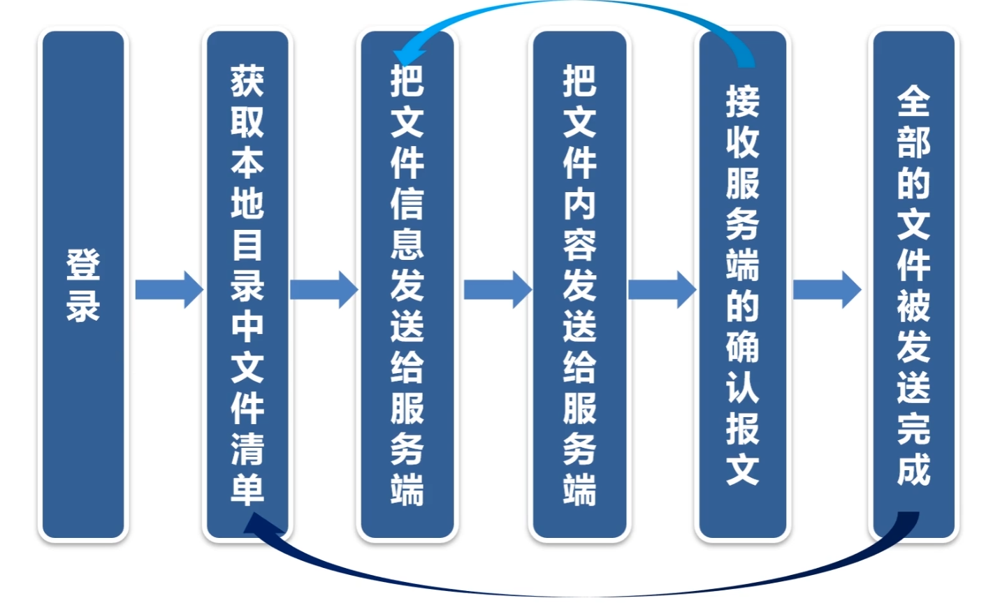

# 基于TCP的文件传输系统

实现文件的上传和下载功能

采用异步通信机制，实现文件的快速传输

文件传输的服务端模块（支持上传和下载）

文件上传的客户端模块

文件下载的客户端模块

---

# 实现文件的上传和下载功能

## 搭建上传程序的框架

这里登陆，客户端登陆最重要的意义不是判断用户的账号和密码，而是与服务端协商文件传输的参数，最重要的参数是文件存放的目录，

第二步客户端获取本地目录的清单

接下使用一个循环，在循环里主要做这3个事情，把文件的信息发送给服务端（文件名，文件时间，文件大小），然后再把文件内容发送给服务端，然后服务端成功接收文件后再向客户端回应确认报文。客户端收到这个确认报文之后，这个文件就算是确认上传成功了。然后回到循环，把下一个文件发送给服务端。这样循环下去，直到所有的文件全都上传成功。

这里有两个细节需要注意：

tcp文件传输系统用于系统内部，对文件传输的时效要求很高，不能延时太长时间，所以客户端程序一直运行在内存中，不会退出，传完一批文件之后，sleep几秒就会接着传下一批文件。

还有客户端不需要增量上传的功能，文件上传成功之后，删除本地文件或者转存到其他备份目录即可。因为这是我们本地的服务，为了保证效率，每次上传完就删除它，如果需要上传到多个服务端怎么办呢？那就在生成文件的时候，将这个文件拷贝到多个目录下就可以了，然后不同的服务端上传的时候去读取不同的上传路径即可。

**文件上传客户端的思路**

> 调用OpenDir()打开starg.clientpath目录
>
>  while(1)
>
>  {
>
> 遍历目录中的每个文件，调用ReadDir()获取一个文件名
>
>  然后把文件名，文件修改时间，文件大小组成报文，发送给对端
>
>  把文件内容发送给对端
>
>  接收对端的确认报文
>
>  删除或者转存到备份目录
>
>  }

**文件上传服务端的思路**

> 接收客户端的报文。
>
> 第二个参数（超时时间）的取值必须大于starg.timetvl，小于starg.timeout。
>
>  starg.timetvl扫描本地目录文件的时间间隔，单位：秒。
>
>   starg.timeout进程心跳的超时时间
>
>  也就是你不能在它还在扫描文件的间隔期间就判定为超时，也不能已经超时超过了进程的心跳时间了还不认为是超时
>
>   TcpServer.Read(strrecvbuffer,starg.timetvl+10
>
>  处理心跳报文。
>
>   处理上传文件的请求报文。上传报文他的开头10个字符一定是<filename>
>
>    解析上传文件请求报文的xml
>
>    接收上传文件的内容
>
>   把接收结果返回给客户端

