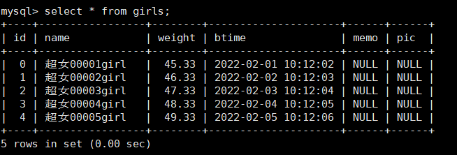

# MySql数据库开发基础

掌握MySql数据库及其客户端软件的安装，配置和使用

```shell
root@inviubuntu:/# mysql -V
mysql  Ver 8.0.28-0ubuntu0.20.04.4 for Linux on x86_64 ((Ubuntu))
```

掌握SQL语音（增删改查）和MySql的常用函数

理解MySql高可用方案的原理

# 封装MySql数据库开发API

connection 和 sqlstatement类

## 注意

- connection这个类，在析构函数中会回滚事务，所以，如果有增删改建表这些会产生事务的操作，要在程序退出（connection对象析构之前）提交事务，不然程序执行之后，回过头去看数据库发现没有变化，有可能就是由于这个细节造成的。、
- 一个connection对象同一时间只能连一个数据库（断开后可以重连）
- 同一个程序中，创建多个connection对象可以同时连接多个数据库
- 每个connection对象的事务是独立的。
- 多个sqlstadement对象可以绑定同一个connection对象’
- 如果执行了select语句，在结果集没有获取完之前，同一connection对象中的全部sqlstatement对象都不能执行任何sql语句
- c语音不能表示空的整数和浮点数，实战中可以使用字符串存放整数和浮点数，可以表示空值

```c++
/**************************************************************************************/
/*   程序名：_mysql.h，此程序是开发框架的C/C++操作MySQL数据库的声明文件。             */
/*   author：invi                                                                   */
/**************************************************************************************/

#ifndef __MYSQL_H
#define __MYSQL_H

// C/C++库常用头文件
#include <stdio.h>
#include <string.h>
#include <stdlib.h>
#include <stdarg.h>
#include <ctype.h>

#include <mysql.h>   // MySQL数据库接口函数的头文件

// 把文件filename加载到buffer中，必须确保buffer足够大。
// 成功返回文件的大小，文件不存在或为空返回0。
unsigned long filetobuf(const char *filename,char *buffer);

// 把buffer中的内容写入文件filename，size为buffer中有效内容的大小。
// 成功返回true，失败返回false。
bool buftofile(const char *filename,char *buffer,unsigned long size);

// MySQL登录环境
struct LOGINENV
{
  char ip[32];       // MySQL数据库的ip地址。
  int  port;         // MySQL数据库的通信端口。
  char user[32];     // 登录MySQL数据库的用户名。
  char pass[32];     // 登录MySQL数据库的密码。
  char dbname[51];   // 登录后，缺省打开的数据库。
};

struct CDA_DEF         // 每次调用MySQL接口函数返回的结果。
{
  int      rc;         // 返回值：0-成功；其它是失败，存放了MySQL的错误代码。
  unsigned long rpc;   // 如果是insert、update和delete，存放影响记录的行数，如果是select，存放结果集的行数。
  char     message[2048]; // 如果返回失败，存放错误描述信息。
};

// MySQL数据库连接类。
class connection
{
private:
  // 从connstr中解析ip,username,password,dbname,port。
  void setdbopt(char *connstr);

  // 设置字符集，要与数据库的一致，否则中文会出现乱码。
  void character(char *charset);

  LOGINENV m_env;      // 服务器环境句柄。

  char m_dbtype[21];   // 数据库种类，固定取值为"mysql"。
public:
  int m_state;         // 与数据库的连接状态，0-未连接，1-已连接。

  CDA_DEF m_cda;       // 数据库操作的结果或最后一次执行SQL语句的结果。

  char m_sql[10241];   // SQL语句的文本，最长不能超过10240字节。

  connection();        // 构造函数。
 ~connection();        // 析构函数。

  // 登录数据库。
  // connstr：数据库的登录参数，格式："ip,username,password,dbname,port"，
  // 例如："172.16.0.15,qxidc,qxidcpwd,qxidcdb,3306"。
  // charset：数据库的字符集，如"utf8"、"gbk"，必须与数据库保持一致，否则会出现中文乱码的情况。
  // autocommitopt：是否启用自动提交，0-不启用，1-启用，缺省是不启用。
  // 返回值：0-成功，其它失败，失败的代码在m_cda.rc中，失败的描述在m_cda.message中。
  int connecttodb(char *connstr,char *charset,unsigned int autocommitopt=0);

  // 提交事务。
  // 返回值：0-成功，其它失败，程序中一般不必关心返回值。
  int commit();

  // 回滚事务。
  // 返回值：0-成功，其它失败，程序中一般不必关心返回值。
  int  rollback();

  // 断开与数据库的连接。
  // 注意，断开与数据库的连接时，全部未提交的事务自动回滚。
  // 返回值：0-成功，其它失败，程序中一般不必关心返回值。
  int disconnect();

  // 执行SQL语句。
  // 如果SQL语句不需要绑定输入和输出变量（无绑定变量、非查询语句），可以直接用此方法执行。
  // 参数说明：这是一个可变参数，用法与printf函数相同。
  // 返回值：0-成功，其它失败，失败的代码在m_cda.rc中，失败的描述在m_cda.message中，
  // 如果成功的执行了非查询语句，在m_cda.rpc中保存了本次执行SQL影响记录的行数。
  // 程序中必须检查execute方法的返回值。
  // 在connection类中提供了execute方法，是为了方便程序员，在该方法中，也是用sqlstatement类来完成功能。
  int execute(const char *fmt,...);

  ////////////////////////////////////////////////////////////////////
  // 以下成员变量和函数，除了sqlstatement类，在类的外部不需要调用它。
  MYSQL     *m_conn;   // MySQL数据库连接句柄。
  int m_autocommitopt; // 自动提交标志，0-关闭自动提交；1-开启自动提交。
  void err_report();   // 获取错误信息。
  ////////////////////////////////////////////////////////////////////
};

// 执行SQL语句前绑定输入或输出变量个数的最大值，256是很大的了，可以根据实际情况调整。
#define MAXPARAMS  256

// 操作SQL语句类。
class sqlstatement
{
private:
  MYSQL_STMT *m_handle; // SQL语句句柄。
  
  MYSQL_BIND params_in[MAXPARAMS];            // 输入参数。
  unsigned long params_in_length[MAXPARAMS];  // 输入参数的实际长度。
  my_bool params_in_is_null[MAXPARAMS];       // 输入参数是否为空。
  unsigned maxbindin;                         // 输入参数最大的编号。

  MYSQL_BIND params_out[MAXPARAMS]; // 输出参数。

  CDA_DEF m_cda1;      // prepare() SQL语句的结果。
  
  connection *m_conn;  // 数据库连接指针。
  int m_sqltype;       // SQL语句的类型，0-查询语句；1-非查询语句。
  int m_autocommitopt; // 自动提交标志，0-关闭；1-开启。
  void err_report();   // 错误报告。
  void initial();      // 初始化成员变量。
public:
  int m_state;         // 与数据库连接的绑定状态，0-未绑定，1-已绑定。

  char m_sql[10241];   // SQL语句的文本，最长不能超过10240字节。

  CDA_DEF m_cda;       // 执行SQL语句的结果。

  sqlstatement();      // 构造函数。
  sqlstatement(connection *conn);    // 构造函数，同时绑定数据库连接。

 ~sqlstatement();      // 析构函数。

  // 绑定数据库连接。
  // conn：数据库连接connection对象的地址。
  // 返回值：0-成功，其它失败，只要conn参数是有效的，并且数据库的游标资源足够，connect方法不会返回失败。
  // 程序中一般不必关心connect方法的返回值。
  // 注意，每个sqlstatement只需要绑定一次，在绑定新的connection前，必须先调用disconnect方法。
  int connect(connection *conn);

  // 取消与数据库连接的绑定。
  // 返回值：0-成功，其它失败，程序中一般不必关心返回值。
  int disconnect();

  // 准备SQL语句。
  // 参数说明：这是一个可变参数，用法与printf函数相同。
  // 返回值：0-成功，其它失败，程序中一般不必关心返回值。
  // 注意：如果SQL语句没有改变，只需要prepare一次就可以了。
  int prepare(const char *fmt,...);

  // 绑定输入变量的地址。
  // position：字段的顺序，从1开始，必须与prepare方法中的SQL的序号一一对应。
  // value：输入变量的地址，如果是字符串，内存大小应该是表对应的字段长度加1。
  // len：如果输入变量的数据类型是字符串，用len指定它的最大长度，建议采用表对应的字段长度。
  // 返回值：0-成功，其它失败，程序中一般不必关心返回值。
  // 注意：1）如果SQL语句没有改变，只需要bindin一次就可以了，2）绑定输入变量的总数不能超过MAXPARAMS个。
  int bindin(unsigned int position,int    *value);
  int bindin(unsigned int position,long   *value);
  int bindin(unsigned int position,unsigned int  *value);
  int bindin(unsigned int position,unsigned long *value);
  int bindin(unsigned int position,float *value);
  int bindin(unsigned int position,double *value);
  int bindin(unsigned int position,char   *value,unsigned int len);
  // 绑定BLOB字段，buffer为BLOB字段的内容，size为BLOB字段的大小。
  int bindinlob(unsigned int position,void *buffer,unsigned long *size);

  // 把结果集的字段与变量的地址绑定。
  // position：字段的顺序，从1开始，与SQL的结果集字段一一对应。
  // value：输出变量的地址，如果是字符串，内存大小应该是表对应的字段长度加1。
  // len：如果输出变量的数据类型是字符串，用len指定它的最大长度，建议采用表对应的字段长度。
  // 返回值：0-成功，其它失败，程序中一般不必关心返回值。
  // 注意：1）如果SQL语句没有改变，只需要bindout一次就可以了，2）绑定输出变量的总数不能超过MAXPARAMS个。
  int bindout(unsigned int position,int    *value);
  int bindout(unsigned int position,long   *value);
  int bindout(unsigned int position,unsigned int  *value);
  int bindout(unsigned int position,unsigned long *value);
  int bindout(unsigned int position,float *value);
  int bindout(unsigned int position,double *value);
  int bindout(unsigned int position,char   *value,unsigned int len);
  // 绑定BLOB字段，buffer用于存放BLOB字段的内容，buffersize为buffer占用内存的大小，
  // size为结果集中BLOB字段实际的大小，注意，一定要保证buffer足够大，防止内存溢出。
  int bindoutlob(unsigned int position,void *buffer,unsigned long buffersize,unsigned long *size);

  // 执行SQL语句。
  // 返回值：0-成功，其它失败，失败的代码在m_cda.rc中，失败的描述在m_cda.message中。
  // 如果成功的执行了insert、update和delete语句，在m_cda.rpc中保存了本次执行SQL影响记录的行数。
  // 程序中必须检查execute方法的返回值。
  int execute();

  // 执行SQL语句。
  // 如果SQL语句不需要绑定输入和输出变量（无绑定变量、非查询语句），可以直接用此方法执行。
  // 参数说明：这是一个可变参数，用法与printf函数相同。
  // 返回值：0-成功，其它失败，失败的代码在m_cda.rc中，失败的描述在m_cda.message中，
  // 如果成功的执行了非查询语句，在m_cda.rpc中保存了本次执行SQL影响记录的行数。
  // 程序中必须检查execute方法的返回值。
  int execute(const char *fmt,...);

  // 从结果集中获取一条记录。
  // 如果执行的SQL语句是查询语句，调用execute方法后，会产生一个结果集（存放在数据库的缓冲区中）。
  // next方法从结果集中获取一条记录，把字段的值放入已绑定的输出变量中。
  // 返回值：0-成功，1403-结果集已无记录，其它-失败，失败的代码在m_cda.rc中，失败的描述在m_cda.message中。
  // 返回失败的原因主要有两种：1）与数据库的连接已断开；2）绑定输出变量的内存太小。
  // 每执行一次next方法，m_cda.rpc的值加1。
  // 程序中必须检查next方法的返回值。
  int next();
};

#endif


```

## create 使用封装好的connection类来登陆数据库并建表

```c++
/*
 *  程序名：createtable.cpp，此程序演示开发框架操作MySQL数据库（创建表）
 *  author：invi
*/

#include "_mysql.h"       // 开发框架操作MySQL的头文件。

int main(int argc, char* argv[])
{
  connection conn;      // 数据库连接类

  // 登陆数据库
  if(conn.connecttodb("192.168.31.133,root,passworld,mysql,3306", "utf8") != 0)
  {
    // 登陆数据库，肯定要判断返回值，如果失败了，需要将错误信息做一个提示（如果是正式服务，需要记录日志）
    printf("connect database failed\n %s\n", conn.m_cda.message);
    return -1;
  }

  // 操作sql语句的对象（创建该对象有两种方式创建）
  sqlstatement stmt(&conn);
  // 或者
  // sqlstatement stmt;
  // stmt.connect(&conn);

  // 准备创建超级女生信息表
  // 超女编号id，超女姓名name，体重weight，报名时间time，说明memo，图片pic
  stmt.prepare("create table girls(id      bigint(10),\
                   name    varchar(30),\
                   weight  decimal(8,2),\
                   btime   datetime,\
                   memo    longtext,\
                   pic     longblob,\
                   primary key (id))");
  // int prepare(const char* fmt, ...),sql语句可以多行书写
  // sql 语句最后的分号可有可无，建议不要写（兼容性考虑）
  // sql 语句中不能有说明文字
  // 可以不用判断stmt.prepare()的返回值，stmt.execute()时再-判断
  // 因为prepare只是给sql语句，并没有执行，所以可以等后面执行的时候再判断 execute


  // 执行sql语句，一定要判断其返回值，0 - 成功，其他失败
  // 失败代码在stmt.m_cda.rc中。失败描述在stmt.m_cda.message中
  if(stmt.execute() != 0)
  {
    // 记录错误信息，把sql语句，错误原因给打印出来。(因为在错误原因里包含了错误代码，所以这里错误代码可以不显示)
    // printf("stmt.execute() failed,\n%s\n%d\n%s\n", stmt.m_sql, stmt.m_cda.rc, stmt.m_cda.message);
    printf("stmt.execute() failed,\n%s\n%s\n", stmt.m_sql, stmt.m_cda.message);
    return -1;
  }

  printf("create table girls ok.\n");

  return 0;
}

/*
-- 超女基本信息表。
create table girls(id      bigint(10),    -- 超女编号。
                   name    varchar(30),   -- 超女姓名。
                   weight  decimal(8,2),  -- 超女体重。
                   btime   datetime,      -- 报名时间。
                   memo    longtext,      -- 备注。
                   pic     longblob,      -- 照片。
                   primary key (id));
*/
```

然后我们编译运行该程序。可以看到，第一次运行成功创建了表girls。第二次创建失败，并将错误信息进行了打印提示。


然后我们可以在数据库中查看该表，并打印该表的描述（desc 表名）


**mysql str_to_date 字符串转换为日期**

1.mysql日期和字符相互转换方法

> date_format(date,’%Y-%m-%d’) ————–>oracle中的to_char();
> str_to_date(date,’%Y-%m-%d’) ————–>oracle中的to_date();

> %Y：代表4位的年份
> %y：代表2为的年份

> %m：代表月, 格式为(01……12)
> %c：代表月, 格式为(1……12)

> %d：代表月份中的天数,格式为(00……31)
> %e：代表月份中的天数, 格式为(0……31)

> %H：代表小时,格式为(00……23)
> %k：代表 小时,格式为(0……23)
> %h： 代表小时,格式为(01……12)
> %I： 代表小时,格式为(01……12)
> %l ：代表小时,格式为(1……12)

> %i： 代表分钟, 格式为(00……59) 【只有这一个代表分钟，大写的I 不代表分钟代表小时】

> %r：代表 时间,格式为12 小时(hh:mm:ss [AP]M)
> %T：代表 时间,格式为24 小时(hh:mm:ss)

> %S：代表 秒,格式为(00……59)
> %s：代表 秒,格式为(00……59)

2.例子：

> select str_to_date(‘09/01/2009’,’%m/%d/%Y’)

> select str_to_date(‘20140422154706’,’%Y%m%d%H%i%s’)

> select str_to_date(‘2014-04-22 15:47:06’,’%Y-%m-%d %H:%i:%s’)

## insert 往表中插入测试数据

```c++
/*
 *  程序名：inserttable.cpp，此程序演示开发框架操作MySQL数据库（向表中插入5条记录）。
 *  author: invi
*/

#include "_mysql.h"

int main(int argc, char * argv[])
{
    connection conn;   // 数据库连接类。

    // 登录数据库，返回值：0-成功；其它是失败，存放了MySQL的错误代码。
    // 失败代码在conn.m_cda.rc中，失败描述在conn.m_cda.message中。
    if(conn.connecttodb("192.168.31.133,root,passworld,mysql,3306", "utf8") != 0)
  {
    // 登陆数据库，肯定要判断返回值，如果失败了，需要将错误信息做一个提示（如果是正式服务，需要记录日志）
    printf("connect database failed\n %s\n", conn.m_cda.message);
    return -1;
  }

    // 定义用于超女信息的结构，与表中的字段对应。
    struct st_girls
    {
        long   id;        // 超女编号
        char   name[31];  // 超女姓名
        double weight;    // 超女体重
        char   btime[20]; // 报名时间
    } stgirls;

    sqlstatement stmt(&conn);  // 操作SQL语句的对象。

    // 准备插入表的sql语句(因为这里我们插入的时间是字符串，所以这里需要做一个字符串转时间，同时注意，因为%在c语音中是有特殊含义的，
    // 所以在str_to_date里的格式化字符串占位符%需要做转义，故这里会有%%)
    /*
        注意事项：
        1、参数的序号从1开始，连续、递增，参数也可以用问号表示，但是，问号的兼容性不好，不建议；
        2、SQL语句中的右值才能作为参数，表名、字段名、关键字、函数名等都不能作为参数；
        3、参数可以参与运算或用于函数的参数；
        4、如果SQL语句的主体没有改变，只需要prepare()一次就可以了；
        5、SQL语句中的每个参数，必须调用bindin()绑定变量的地址；
        6、如果SQL语句的主体已改变，prepare()后，需重新用bindin()绑定变量；
        7、prepare()方法有返回值，一般不检查，如果SQL语句有问题，调用execute()方法时能发现；
        8、bindin()方法的返回值固定为0，不用判断返回值；
        9、prepare()和bindin()之后，每调用一次execute()，就执行一次SQL语句，SQL语句的数据来自被绑定变量的值。
    */
    stmt.prepare("\
        insert into girls (id, name, weight, btime) values(:1, :2, :3, str_to_date(:4, '%%Y-%%m-%%d %%H:%%i:%%s'))\
    ");

    // 也可以使用 ? 来代替 :1...这些占位符
    // stmt.prepare("\
    //     insert into girls (id, name, weight, btime) values(?, ?, ?, str_to_date(?, '%%Y-%%m-%%d %%H:%%i:%%s'))\
    // ");

    // 参数可以参与运算或用于函数的参数；
    // stmt.prepare("\
    //     insert into girls (id, name, weight, btime) values(:1+5, :2, :3 + 2.11, str_to_date(:4, '%%Y-%%m-%%d %%H:%%i:%%s'))\
    // ");

    // 绑定输入变量的地址。
    // position：字段的顺序，从1开始，必须与prepare方法中的SQL的序号一一对应。
    // value：输入变量的地址，如果是字符串，内存大小应该是表对应的字段长度加1。
    // len：如果输入变量的数据类型是字符串，用len指定它的最大长度，建议采用表对应的字段长度。
    // 返回值：0-成功，其它失败，程序中一般不必关心返回值。
    // 注意：1）如果SQL语句没有改变，只需要bindin一次就可以了，2）绑定输入变量的总数不能超过MAXPARAMS个。
    stmt.bindin(1, &stgirls.id);
    stmt.bindin(2, stgirls.name, 30);
    stmt.bindin(3, &stgirls.weight);
    stmt.bindin(4, stgirls.btime, 19);

    // 模拟超女数据，向表中插入5条记录
    for(int i = 0; i < 5; i++)
    {
        memset(&stgirls, 0, sizeof(struct st_girls));       // 结构体变量初始化

        // 为结构体变量的成员赋值
        stgirls.id = i;                                 // 超女编号
        sprintf(stgirls.name, "超女%05dgirl", i + 1);      // 超女姓名
        stgirls.weight = 45.33 + i;                         // 超女体重
        sprintf(stgirls.btime, "2022-02-%02d 10:12:%02d", i+1, i+2);    // 报名时间

        if(stmt.execute()!=0)
        {
            // 如果执行失败，记录日志并打印
            printf("stmt.execute() failed\n=sql= %s\n=message= %s\n", stmt.m_sql, stmt.m_cda.message);
            return -1;
        }

        // 然后注意，如果是增删改，那么执行成功后，会将影响的行数记录在rpc这个成员变量中
        // 这里如果插入成功，记录一下数据库收影响的函数
        printf("成功插入了%ld行记录\n", stmt.m_cda.rpc);    // stmt.m_cda.rpc是本次执行sql影响的记录数
    }

    printf("insert table girls ok\n");

    // 事务提交
    conn.commit();

    return 0;
}
```

​    **注意事项：**

​    1、参数的序号从1开始，连续、递增，参数也可以用问号表示，但是，问号的兼容性不好，不建议；

​    2、SQL语句中的右值才能作为参数，表名、字段名、关键字、函数名等都不能作为参数；

​    3、参数可以参与运算或用于函数的参数；

​    4、如果SQL语句的主体没有改变，只需要prepare()一次就可以了；

​    5、SQL语句中的每个参数，必须调用bindin()绑定变量的地址；

​    6、如果SQL语句的主体已改变，prepare()后，需重新用bindin()绑定变量；

​    7、prepare()方法有返回值，一般不检查，如果SQL语句有问题，调用execute()方法时能发现；

​    8、bindin()方法的返回值固定为0，不用判断返回值；

​    9、prepare()和bindin()之后，每调用一次execute()，就执行一次SQL语句，SQL语句的数据来自被绑定变量的值。

编译运行


然后查看表中是否有这些数据



## update 更新表

```c++
/*
 *  程序名：updatetable.cpp，此程序演示开发框架操作MySQL数据库（修改表中的记录）。
 *  author: invi
*/

#include "_mysql.h"

int main(int argc, char * argv[])
{
    connection conn;   // 数据库连接类。

    // 登录数据库，返回值：0-成功；其它是失败，存放了MySQL的错误代码。
    // 失败代码在conn.m_cda.rc中，失败描述在conn.m_cda.message中。
    if(conn.connecttodb("192.168.31.133,root,passworld,mysql,3306", "utf8") != 0)
    {
        // 登陆数据库，肯定要判断返回值，如果失败了，需要将错误信息做一个提示（如果是正式服务，需要记录日志）
        printf("connect database failed\n %s\n", conn.m_cda.message);
        return -1;
    }

    // 定义用于超女信息的结构，与表中的字段对应。
    struct st_girls
    {
        long   id;        // 超女编号
        char   name[31];  // 超女姓名
        double weight;    // 超女体重
        char   btime[20]; // 报名时间
    } stgirls;

    sqlstatement stmt(&conn);

    // 准备更新表的sql语句
    /*
        注意事项：
        1、参数的序号从1开始，连续、递增，参数也可以用问号表示，但是，问号的兼容性不好，不建议；
        2、SQL语句中的右值才能作为参数，表名、字段名、关键字、函数名等都不能作为参数；
        3、参数可以参与运算或用于函数的参数；
        4、如果SQL语句的主体没有改变，只需要prepare()一次就可以了；
        5、SQL语句中的每个参数，必须调用bindin()绑定变量的地址；
        6、如果SQL语句的主体已改变，prepare()后，需重新用bindin()绑定变量；
        7、prepare()方法有返回值，一般不检查，如果SQL语句有问题，调用execute()方法时能发现；
        8、bindin()方法的返回值固定为0，不用判断返回值；
        9、prepare()和bindin()之后，每调用一次execute()，就执行一次SQL语句，SQL语句的数据来自被绑定变量的值。
    */
    stmt.prepare("\
        update girls set name=:1,weight=:2,btime=str_to_date(:3,'%%Y-%%m-%%d %%H:%%i:%%s') where id = :4\
    ");

    // 使用bindin绑定参数
    stmt.bindin(1, stgirls.name, 30);
    stmt.bindin(2, &stgirls.weight);
    stmt.bindin(3, stgirls.btime, 19);
    stmt.bindin(4, &stgirls.id);

    // 将girls表中前5条记录进行更新
    for(int i = 0; i < 5; i++)
    {
        memset(&stgirls, 0, sizeof(struct st_girls));

        // 为结构体成员赋值
        stgirls.id = i;
        sprintf(stgirls.name, "貂蝉%05dchina", i + 1);
        stgirls.weight = 41.23 + i;
        sprintf(stgirls.btime, "2022-01-%02d %02d:%02d:%02d", (i+1)*2, i+2, i+1, i*3);


        // 执行sql语句，一定要判断返回值 0 =成功 ，其他 = 失败
        // 失败的代码在 stmt.m_cda.rc中。失败的描述在stmt.m_cda.message中
        if(stmt.execute() != 0)
        {
            printf("stmt.execute() failed\n=sql=        %s\n=message=       %s\n", stmt.m_sql, stmt.m_cda.message);
            return -1;
        }

        printf("成功修改了%ld条记录\n", stmt.m_cda.rpc);        // stmt.m_cda.rpc中是本次执行sql影响的记录数
    }

    printf("update table girls ok.\n");

    conn.commit();      // 事务提交

    return 0;

}
```

编译运行


查看修改前后表的记录


## select 查询表示例查询

**bindout**

> 把结果集的字段与变量的地址绑定。
>
> position：字段的顺序，从1开始，与SQL的结果集字段一一对应。
>
> value：输出变量的地址，如果是字符串，内存大小应该是表对应的字段长度加1。
>
> len：如果输出变量的数据类型是字符串，用len指定它的最大长度，建议采用表对应的字段长度。
>
> 返回值：0-成功，其它失败，程序中一般不必关心返回值。
>
> 注意：1）如果SQL语句没有改变，只需要bindout一次就可以了，2）绑定输出变量的总数不能超过MAXPARAMS个。

关于 **如果SQL语句的主体没有改变，只需要prepare()一次就可以了**。这句话，如果说有疑问，说我如果为了确保绑定的绝对正确和程序的运行无误，我每次执行sql的时候，都重新去绑定一次参数变量，调用prepare，是否可以？答案是可以。但是如果这样做了，需要明白这样做产生的后果。首先，如果sql语句的主体没有发生变化，那么你吃饭执行prepare这个操作其实是没有意义的，浪费cpu和系统资源，这是其一。其次每次执行prepare的时候，客户端会提交sql语句给mysql服务端进行校验，也就是说prepare这个函数会产生网络通讯，这个开销如果你频繁执行不必要的prepare是完全没有必要的。

```c++
/*
 *  程序名：selecttable.cpp，此程序演示开发框架操作MySQL数据库（查询表中的记录）。
 *  author: invi
*/

#include "_mysql.h"

int main(int argc, char * argv[])
{
    connection conn;   // 数据库连接类。

    // 登录数据库，返回值：0-成功；其它是失败，存放了MySQL的错误代码。
    // 失败代码在conn.m_cda.rc中，失败描述在conn.m_cda.message中。
    if(conn.connecttodb("192.168.31.133,root,passworld,mysql,3306", "utf8") != 0)
    {
        // 登陆数据库，肯定要判断返回值，如果失败了，需要将错误信息做一个提示（如果是正式服务，需要记录日志）
        printf("connect database failed\n %s\n", conn.m_cda.message);
        return -1;
    }

    // 定义用于超女信息的结构，与表中的字段对应。
    struct st_girls
    {
        long   id;        // 超女编号
        char   name[31];  // 超女姓名
        double weight;    // 超女体重
        char   btime[20]; // 报名时间
    } stgirls;

    sqlstatement stmt(&conn);

    // 准备查询表的sql语句
    /*
        注意事项：
        1、如果SQL语句的主体没有改变，只需要prepare()一次就可以了；
        2、结果集中的字段，调用bindout()绑定变量的地址；
        3、bindout()方法的返回值固定为0，不用判断返回值；
        4、如果SQL语句的主体已改变，prepare()后，需重新用bindout()绑定变量；
        5、调用execute()方法执行SQL语句，然后再循环调用next()方法获取结果集中的记录；
        6、每调用一次next()方法，从结果集中获取一条记录，字段内容保存在已绑定的变量中。
    */

   int iminid, imaxid;      // 查询条件的最小值id和最大id

    // 注意，因为btime是日期型数据，所以在select语句中需要将其转换为字符串
    stmt.prepare("\
        select id, name, weight, date_format(btime, '%%Y-%%m-%%d %%H:%%i:%%s') from girls where id >= :1 && id <= :2\
    ");

    // 把结果集的字段与变量的地址绑定。
    // position：字段的顺序，从1开始，与SQL的结果集字段一一对应。
    // value：输出变量的地址，如果是字符串，内存大小应该是表对应的字段长度加1。
    // len：如果输出变量的数据类型是字符串，用len指定它的最大长度，建议采用表对应的字段长度。
    // 返回值：0-成功，其它失败，程序中一般不必关心返回值。
    // 注意：1）如果SQL语句没有改变，只需要bindout一次就可以了，2）绑定输出变量的总数不能超过MAXPARAMS个。

    // 绑定输入(为sql语句绑定输入变量的地址，bindin不需要判断返回值)
    stmt.bindin(1, &iminid);
    stmt.bindin(2, &imaxid);

    // 绑定输出（为sql语句绑定输出变量的地址，bindout不需要判断返回值）
    stmt.bindout(1, &stgirls.id);
    stmt.bindout(2, stgirls.name, 31);
    stmt.bindout(3, &stgirls.weight);
    stmt.bindout(4, stgirls.btime, 20);

    for(int j = 0; j<5; j++)
    {
        iminid = j;
        imaxid = j + 3;

        // 执行sql语句，一定要判断返回值，0成功，其他是失败
        if(stmt.execute() != 0)
        {
            printf("stmt.execute() failed\n=sql=        %s\n=message=       %s\n", stmt.m_sql, stmt.m_cda.message);
            return -1;
        }

        // 读取girls表中的数据
        // 本程序执行的是查询语句，执行stmt.execute()之后，将会在数据库的缓冲区中产生一个结果集
        while (true)
        {
            // next() 从结果集中获取一条记录。
            // 如果执行的SQL语句是查询语句，调用execute方法后，会产生一个结果集（存放在数据库的缓冲区中）。
            // next方法从结果集中获取一条记录，把字段的值放入已绑定的输出变量中。
            // 返回值：0-成功，1403-结果集已无记录，其它-失败，失败的代码在m_cda.rc中，失败的描述在m_cda.message中。
            // 返回失败的原因主要有两种：1）与数据库的连接已断开；2）绑定输出变量的内存太小。
            // 每执行一次next方法，m_cda.rpc的值加1。
            // 程序中必须检查next方法的返回值。

            memset(&stgirls, 0, sizeof(struct st_girls));       // 结构体初始化

            // 从结果集中获取一条记录，一定要判断其返回值，0 - 成功，1403 - 无记录，其他 失败
            // 在实际开发中，除了 0 和 1403，其他情况极少出现
            if(stmt.next() != 0)
            {
                break;
            }

            // 把获取到的记录，每个字段都打印出来
            printf("id = %ld, name = %s, weight = %0.2f, btime = %s \n", stgirls.id, stgirls.name, stgirls.weight, stgirls.btime);

        }

        // 查询语句没有事务
        // 把影响条数rpc的值显示出来
        printf("本次查询影响条数： %ld \n", stmt.m_cda.rpc);
    }

   return 0;

}
```

编译运行


## delete 删除表中的数据

删除表中的数据会产生事务，所以这里需要提交事务

```c++
/*
 *  程序名：deletetable.cpp，此程序演示开发框架操作MySQL数据库（删除表中的记录）。
 *  author: invi
*/

#include "_mysql.h"

int main(int argc, char * argv[])
{
    connection conn;   // 数据库连接类。

    // 登录数据库，返回值：0-成功；其它是失败，存放了MySQL的错误代码。
    // 失败代码在conn.m_cda.rc中，失败描述在conn.m_cda.message中。
    if(conn.connecttodb("192.168.31.133,root,passworld,mysql,3306", "utf8") != 0)
    {
        // 登陆数据库，肯定要判断返回值，如果失败了，需要将错误信息做一个提示（如果是正式服务，需要记录日志）
        printf("connect database failed\n %s\n", conn.m_cda.message);
        return -1;
    }

    // 定义用于超女信息的结构，与表中的字段对应。
    struct st_girls
    {
        long   id;        // 超女编号
        char   name[31];  // 超女姓名
        double weight;    // 超女体重
        char   btime[20]; // 报名时间
    } stgirls;

    sqlstatement stmt(&conn);

    int iminid, imaxid;      // 删除条件的最小值id和最大id

    // 准备输出sql语句
    stmt.prepare("\
        delete from girls where id >= :1 && id <= :2\
    ");

    // 绑定输入(为sql语句绑定输入变量的地址，bindin不需要判断返回值)
    stmt.bindin(1, &iminid);
    stmt.bindin(2, &imaxid);

    imaxid = 2;
    iminid = 0;

    // 执行sql语句，一定要判断返回值，0成功，其他是失败
    if(stmt.execute() != 0)
    {
        printf("stmt.execute() failed\n=sql=        %s\n=message=       %s\n", stmt.m_sql, stmt.m_cda.message);
        return -1;
    }

    printf("删除成功，删除了girls表中%ld条记录\n", stmt.m_cda.rpc);

    // 删除表中的数据会产生事务，所以这里需要提交事务
    conn.commit();

    return 0;

}
```

编译运行


查看数据库中girls表的变化


