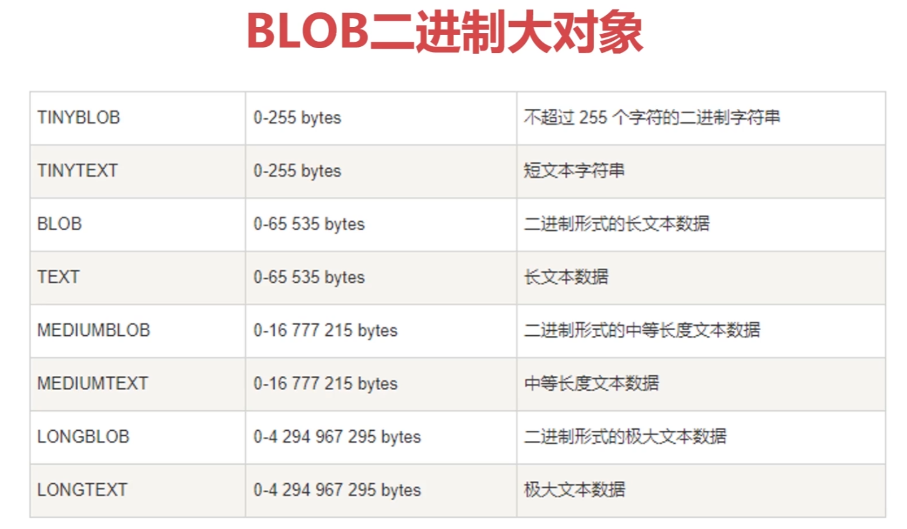
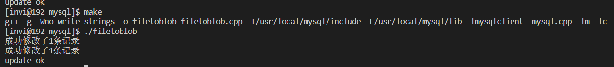
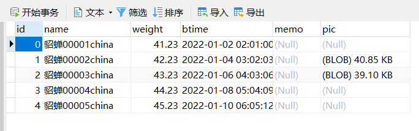
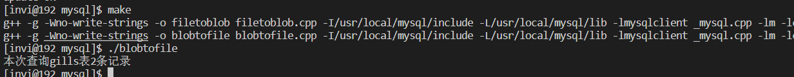
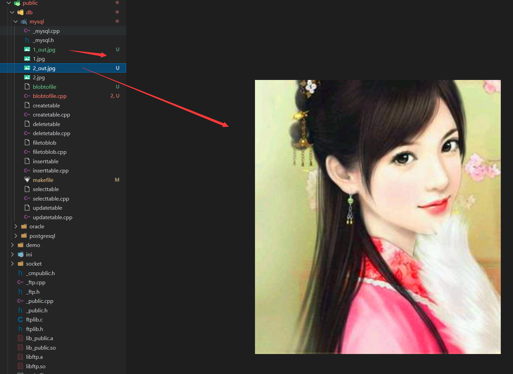

# 二进制大对象的存取



mysql的大对象分为两种，一种是文本对象，后缀是TXT，一种是二进制对象，后缀是BLOB。

文本对象只能存文本数据，二进制对象什么都可以存（照片，音频，视频，Excel...）

大对象按照内存大小有分为 短的，长的，中等长的，加大长度的这4种类型。MySQL的四种BLOB类型

MySQL中，BLOB是个类型系列，包括：
TinyBlob、Blob、MediumBlob、LongBlob，这几个类型之间的唯一区别是在存储文件的最大大小上不同

　　类型 大小(单位：字节)
　　TinyBlob 最大 255
　　Blob 最大 65K
　　MediumBlob 最大 16M
　　LongBlob 最大 4G

MySQL的四种TEXT类型：
TINYTEXT, TEXT, MEDIUMTEXT 和LONGTEXT。

## 上传blob对象到数据库中

```c++
/*
 *  程序名：filetoblob.cpp，此程序演示开发框架操作MySQL数据库（把图片文件存入BLOB字段）。
 *  author: invi
*/

#include "_mysql.h"

int main(int argc,char *argv[])
{
    connection conn;   // 数据库连接类。

    // 登录数据库，返回值：0-成功；其它是失败，存放了MySQL的错误代码。
    // 失败代码在conn.m_cda.rc中，失败描述在conn.m_cda.message中。
    if(conn.connecttodb("192.168.31.133,root,passworld,mysql,3306", "utf8") != 0)
    {
        // 登陆数据库，肯定要判断返回值，如果失败了，需要将错误信息做一个提示（如果是正式服务，需要记录日志）
        printf("connect database failed\n %s\n", conn.m_cda.message);
        return -1;
    }

    // 定义用于超女信息的结构，与表中的字段对应。
    struct st_girls
    {
        long   id;             // 超女编号
        char   pic[100000];    // 超女图片的内容。(不到100k)
        unsigned long picsize; // 图片内容占用的字节数。
    } stgirls;

    sqlstatement stmt(&conn);  // 操作SQL语句的对象。

    // 准备sql语句
    stmt.prepare("update girls set pic = :1 where id = :2");

    // 绑定BLOB字段，buffer为BLOB字段的内容，size为BLOB字段的大小。(注意，第三个参数blob对象的大小，填的是size的地址)
    stmt.bindinlob(1, stgirls.pic, &stgirls.picsize);
    stmt.bindin(2, &stgirls.id);

    // 修改girls表中id = 1,2的记录，并把图片存进去
    for(int i = 0; i < 2; i++)
    {
        memset(&stgirls, 0, sizeof(struct st_girls));
        stgirls.id = i +1;

        // 把图片内容加载到pic成员中
        // _mysql.h中提供了filetobuffer这个函数
        // 把文件filename加载到buffer中，必须确保buffer足够大。
        // 成功返回文件的大小，文件不存在或为空返回0。
        if(i == 0)
        {
            stgirls.picsize = filetobuf("1.jpg", stgirls.pic);
        }

        if(i == 1)
        {
            stgirls.picsize = filetobuf("2.jpg", stgirls.pic);
        }

        // 执行sql语句，一定要判断其返回值，0成功，其他是失败
        if(stmt.execute() != 0)
        {
            printf("stmt.execute() failed\n=sql=        %s\n=message=       %s\n", stmt.m_sql, stmt.m_cda.message);
            return -1;
        }

        printf("成功修改了%ld条记录\n", stmt.m_cda.rpc);
    }

    printf("update ok\n");

    // 数据更新会产生事务，所以需要提交事务
    conn.commit();

  return 0;

}
```

编译运行



使用图形化客户端工具查看数据库中表的情况



## 将数据库中的大文件查询获取并下载到本地

```c++
/*
 *  程序名：blobtofile.cpp，此程序演示开发框架操作MySQL数据库（提取BLOB字段内容到图片文件中）。
 *  author: invi
*/

#include "_mysql.h"

int main(int argc,char *argv[])
{
    connection conn;   // 数据库连接类。

    // 登录数据库，返回值：0-成功；其它是失败，存放了MySQL的错误代码。
    // 失败代码在conn.m_cda.rc中，失败描述在conn.m_cda.message中。
    if(conn.connecttodb("192.168.31.133,root,passworld,mysql,3306", "utf8") != 0)
    {
        // 登陆数据库，肯定要判断返回值，如果失败了，需要将错误信息做一个提示（如果是正式服务，需要记录日志）
        printf("connect database failed\n %s\n", conn.m_cda.message);
        return -1;
    }

    // 定义用于超女信息的结构，与表中的字段对应。
    struct st_girls
    {
        long   id;             // 超女编号
        char   pic[100000];    // 超女图片的内容。(不到100k)
        unsigned long picsize; // 图片内容占用的字节数。
    } stgirls;

    sqlstatement stmt(&conn);  // 操作SQL语句的对象。

    // 准备sql语句
    stmt.prepare("select id, pic from girls where id in (1,2)");

    stmt.bindout(1, &stgirls.id);

    // 绑定BLOB字段，buffer用于存放BLOB字段的内容，buffersize为buffer占用内存的大小，
    // size为结果集中BLOB字段实际的大小，注意，一定要保证buffer足够大，防止内存溢出。
    stmt.bindoutlob(2, stgirls.pic, 100000, &stgirls.picsize);

     // 执行sql语句，一定要判断其返回值，0成功，其他是失败
    if(stmt.execute() != 0)
    {
        printf("stmt.execute() failed\n=sql=        %s\n=message=       %s\n", stmt.m_sql, stmt.m_cda.message);
        return -1;
    }

    // 获取结果集
    while (true)
    {
        memset(&stgirls, 0, sizeof(struct st_girls));

        if(stmt.next() !=0 )
        {
            break;
        }

        // 生成文件名
        char filename[10];
        memset(filename, 0, sizeof(filename));

        sprintf(filename, "%d_out.jpg", stgirls.id);

        // 把buffer中的内容写入文件filename，size为buffer中有效内容的大小。
        // 成功返回true，失败返回false。
        buftofile(filename, stgirls.pic, stgirls.picsize);
    }
    
    printf("本次查询gills表%ld条记录\n", stmt.m_cda.rpc);

  return 0;

}
```

编译运行



然后看下载目录，可以看到在当前文件夹下载了这两张图片


