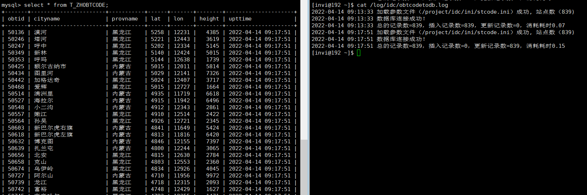
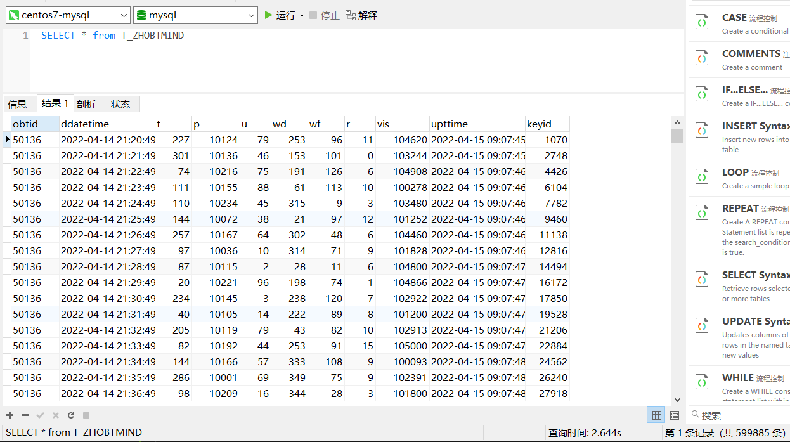
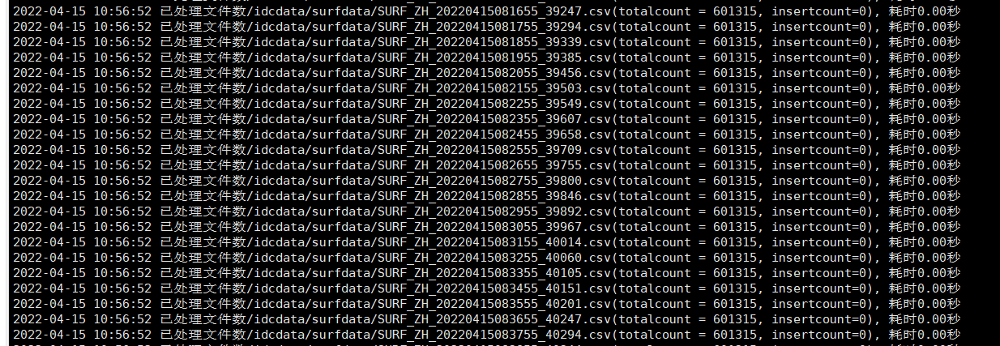

# 测试数据文件入库

- 站点参数入库
- 观测数据入库

# 站点参数文件入库

## 建表

```sql
/*==============================================================*/
/* Table: T_ZHOBTCODE                                           */
/*==============================================================*/
create table T_ZHOBTCODE
(
   obtid                varchar(10) not null comment '站点代码',
   cityname             varchar(30) not null comment '城市名称',
   provname             varchar(30) not null comment '省名称',
   lat                  int not null comment '纬度，单位：0.01度。',
   lon                  int not null comment '经度，单位：0.01度。',
   height               int comment '海拔高度，单位：0.1米。',
   upttime              timestamp not null comment '更新时间，数据被插入或更新的时间。',
   keyid                int not null auto_increment comment '记录编号，自动增长列。',
   primary key (obtid),
   unique key ZHOBTCODE_KEYID (keyid)
);

alter table T_ZHOBTCODE comment '这是一个参数表，存放了全国的站点参数，约800条记录，本表的数据极少变更。
应用程序对本表有inser和up';

```

## 程序大致流程

> 帮助文档
>
> 处理程序退出信号
>
> 打开日志文件
>
> 把全国站点参数文件加载到vstcode容器中
>
> 连接数据库
>
> 准备插入表的sql语句
>
> 准备更新表的sql语句
>
> 遍历vstcode容器
>
> for(auto iter = vstcode,begin(); iter != vstcode.end(); ++iter)
>
> {
>
> ​    从容器中取出一条记录到结构体stcode中
>
> ​    执行插入的sql语句
>
> ​    如果记录已经存在，就执行更新的sql语句(这里如何判断记录是否已经存在，如果记录存在，sql执行的返回结果是1062)
>
> }
>
> 提交事务

```c++
// obtcodetodb.cpp 本程序用于将全国站点参数数据保存到数据库 T_ZHOBTCODE 表中

#include "_public.h"
#include "_mysql.h"

// 全国气象站点参数结构体。
struct st_stcode
{
  char provname[31]; // 省
  char obtid[11];    // 站号
  char cityname[31];  // 站名
  char lat[11];      // 纬度
  char lon[11];      // 经度
  char height[11];   // 海拔高度
};

vector<struct st_stcode> vstcode; // 存放全国气象站点参数的容器。

// 把站点参数文件中加载到vstcode容器中。
bool LoadSTCode(const char *inifile);

CLogFile logfile;

connection conn;            // 数据库连接对象

CPActive PActive;         // 进程心跳

void EXIT(int sig);

int main(int argc, char * argv[])
{
    // 帮助文档
    if (argc!=5)
    {
        printf("\n");
        printf("Using:./obtcodetodb inifile connstr charset logfile\n");

        printf("Example:/project/tools/bin/procctl 120 /project/idc/bin/obtcodetodb /project/idc/ini/stcode.ini \"192.168.31.133,root,passworld,mysql,3306\" utf8 /log/idc/obtcodetodb.log\n\n");

        printf("本程序用于把全国站点参数数据保存到数据库表中，如果站点不存在则插入，站点已存在则更新。\n");
        printf("inifile 站点参数文件名（全路径）。\n");
        printf("connstr 数据库连接参数：ip,username,password,dbname,port\n");
        printf("charset 数据库的字符集。\n");
        printf("logfile 本程序运行的日志文件名。\n");
        printf("程序每120秒运行一次，由procctl调度。\n\n\n");

        return -1;
    }

    // 处理程序退出信号
    // 关闭全部的信号和输入输出。
    // 设置信号,在shell状态下可用 "kill + 进程号" 正常终止些进程。
    // 但请不要用 "kill -9 +进程号" 强行终止。
    CloseIOAndSignal(); signal(SIGINT,EXIT); signal(SIGTERM,EXIT);

    // 打开日志文件。
    if (logfile.Open(argv[4],"a+")==false)
    {
        printf("打开日志文件失败（%s）。\n",argv[4]);
        return -1;
    }

    PActive.AddPInfo(10, "obtcodetodb");        // 进程的心跳时间10s

    // 把全国站点参数文件加载到vstcode容器中
    if(LoadSTCode(argv[1]) == false)
    {
        printf("打开日志文件失败（%s）。\n",argv[4]);
        return -1;
    }

    logfile.Write("加载参数文件（%s）成功, 站点数（%d)\n", argv[1], vstcode.size());

    // 连接数据库
    if(conn.connecttodb(argv[2], argv[3]) != 0)
    {
        logfile.Write("数据库【%s】连接失败\n失败原因：%s\n", argv[2], conn.m_cda.message);
        return -1;
    }

    logfile.Write("数据库连接成功！\n");

    // 表结构如下
    // +----------+-------------+------+-----+-------------------+-----------------------------+
    // | Field    | Type        | Null | Key | Default           | Extra                       |
    // +----------+-------------+------+-----+-------------------+-----------------------------+
    // | obtid    | varchar(10) | NO   | PRI | NULL              |                             |
    // | cityname | varchar(30) | NO   |     | NULL              |                             |
    // | provname | varchar(30) | NO   |     | NULL              |                             |
    // | lat      | int(11)     | NO   |     | NULL              |                             |
    // | lon      | int(11)     | NO   |     | NULL              |                             |
    // | height   | int(11)     | YES  |     | NULL              |                             |
    // | upttime  | timestamp   | NO   |     | CURRENT_TIMESTAMP | on update CURRENT_TIMESTAMP |
    // | keyid    | int(11)     | NO   | UNI | NULL              | auto_increment              |
    // +----------+-------------+------+-----+-------------------+-----------------------------+

    struct st_stcode stcode;

    // 准备插入表的sql语句
    sqlstatement stmtins(&conn);
    // 注意：这里因为我们是使用整数来表示浮点数，所以要注意单位转换（经度纬度 这两个字段都需要*100，海拔高度需要*10）
    stmtins.prepare("insert into T_ZHOBTCODE(obtid, cityname, provname, lat, lon, height, upttime) values(:1, :2, :3, :4*100, :5*100, :6*10, now())");
    // 绑定输入变量地址
    stmtins.bindin(1, stcode.obtid, 10);
    stmtins.bindin(2, stcode.cityname, 30);
    stmtins.bindin(3, stcode.provname, 30);
    stmtins.bindin(4, stcode.lat, 10);
    stmtins.bindin(5, stcode.lon, 10);
    stmtins.bindin(6, stcode.height, 10);

    // 准备更新表的sql语句
    sqlstatement stmtupt(&conn);
    // 注意：这里因为我们是使用整数来表示浮点数，所以要注意单位转换（经度纬度 这两个字段都需要*100，海拔高度需要*10）
    stmtupt.prepare("update T_ZHOBTCODE set cityname=:1, provname=:2, lat=:3*100, lon=:4*100, height=:5*10, upttime=now() where obtid=:6");
    // 遍历vstcode容器
    // 绑定输入变量地址
    stmtupt.bindin(1, stcode.cityname, 30);
    stmtupt.bindin(2, stcode.provname, 30);
    stmtupt.bindin(3, stcode.lat, 10);
    stmtupt.bindin(4, stcode.lon, 10);
    stmtupt.bindin(5, stcode.height, 10);
    stmtupt.bindin(6, stcode.obtid, 10);

    // 插入记录数、更新记录数（初始化为0）
    int inscount = 0, uptcount = 0;
    CTimer Timer;

    for(auto iter = vstcode.begin(); iter != vstcode.end(); ++iter)
    {
        // 从容器中取出一条记录到结构体stcode中
        memcpy(&stcode, &(*iter), sizeof(struct st_stcode));

        // 执行插入的sql语句
        if(stmtins.execute() != 0)
        {
            // 如果记录已经存在，就执行更新的sql语句(这里如何判断记录是否已经存在，如果记录存在，sql执行的返回结果是1062)
            if(stmtins.m_cda.rc == 1062)
            {
                // 执行更新操作
                if(stmtupt.execute() != 0)
                {
                    logfile.Write("stmtupt.execute() failed \n%s\n", stmtupt.m_cda.message);
                    return -1;
                }
                else
                {
                    // 如果更新成功，把更新的记录数+1
                    uptcount++;
                }
            }
            else
            {
                logfile.Write("stmtins.execute() failed \n%s\n", stmtins.m_cda.message);
                return -1;
            }
        }
        else
        {
            // 如果插入成功，把插入的记录数+1
            inscount++;
        }
    }

    // 把总的记录数，插入记录数，更新记录数，消耗耗时 记录日志
    logfile.Write("总的记录数=%d，插入记录数=%d，更新记录数=%d，消耗耗时%.2f \n", vstcode.size(), inscount, uptcount, Timer.Elapsed());

    // 提交事务
    conn.commit();

    return 0;
}

// 把站点参数文件中加载到vstcode容器中。
bool LoadSTCode(const char *inifile)
{
    CFile File;

    // 打开站点参数文件。
    if (File.Open(inifile,"r")==false)
    {
        logfile.Write("File.Open(%s) failed.\n",inifile); return false;
    }

    char strBuffer[301];

    CCmdStr CmdStr;

    struct st_stcode stcode;

    while (true)
    {
        // 从站点参数文件中读取一行，如果已读取完，跳出循环。
        if (File.Fgets(strBuffer,300,true)==false) break;

        // 把读取到的一行拆分。
        CmdStr.SplitToCmd(strBuffer,",",true);

        if (CmdStr.CmdCount()!=6) continue;     // 扔掉无效的行。

        // 把站点参数的每个数据项保存到站点参数结构体中。
        memset(&stcode,0,sizeof(struct st_stcode));
        CmdStr.GetValue(0, stcode.provname,30); // 省
        CmdStr.GetValue(1, stcode.obtid,10);    // 站号
        CmdStr.GetValue(2, stcode.cityname,30);  // 站名
        CmdStr.GetValue(3, stcode.lat,10);      // 纬度
        CmdStr.GetValue(4, stcode.lon,10);      // 经度
        CmdStr.GetValue(5, stcode.height,10);   // 海拔高度

        // 把站点参数结构体放入站点参数容器。
        vstcode.push_back(stcode);
    }

    /*
    for (int ii=0;ii<vstcode.size();ii++)
        logfile.Write("provname=%s,obtid=%s,cityname=%s,lat=%.2f,lon=%.2f,height=%.2f\n",\
                    vstcode[ii].provname,vstcode[ii].obtid,vstcode[ii].cityname,vstcode[ii].lat,\
                    vstcode[ii].lon,vstcode[ii].height);
    */

    return true;
}

void EXIT(int sig)
{
    logfile.Write("程序退出，sig=%d\n\n",sig);

    // 断开数据库连接
    conn.disconnect();

    exit(0);
}

```

编译运行，然后查看日志文件和数据库（这里之所以是更新，是因为之前一次测试，代码有bug，将错误数据入库了，所以再次执行就变成了更新之前的错误记录了）



## 站点数据文件入库

建表

```sql


/*==============================================================*/
/* Table: T_ZHOBTMIND                                           */
/*==============================================================*/
create table T_ZHOBTMIND
(
   obtid                varchar(10) not null comment '站点代码。',
   ddatetime            datetime not null comment '数据时间，精确到分钟。',
   t                    int comment '湿度，单位：0.1摄氏度。',
   p                    int comment '气压，单位：0.1百帕。',
   u                    int comment '相对湿度，0-100之间的值。',
   wd                   int comment '风向，0-360之间的值。',
   wf                   int comment '风速：单位0.1m/s。',
   r                    int comment '降雨量：0.1mm。',
   vis                  int comment '能见度：0.1米。',
   upttime              timestamp not null comment '更新时间。',
   keyid                bigint not null auto_increment comment '记录编号，自动增长列。',
   primary key (obtid, ddatetime),
   unique key ZHOBTMIND_KEYID (keyid)
);

alter table T_ZHOBTMIND comment '本表存放了全国站点分钟数据，站点数约840个，数据周期为1分钟。
应用程序对本表只有insert操作，没有u';

/*==============================================================*/
/* Index: IDX_ZHOBTMIND_1                                       */
/*==============================================================*/
create unique index IDX_ZHOBTMIND_1 on T_ZHOBTMIND
(
   ddatetime,
   obtid
);

/*==============================================================*/
/* Index: IDX_ZHOBTMIND_2                                       */
/*==============================================================*/
create index IDX_ZHOBTMIND_2 on T_ZHOBTMIND
(
   ddatetime
);

/*==============================================================*/
/* Index: IDX_ZHOBTMIND_3                                       */
/*==============================================================*/
create index IDX_ZHOBTMIND_3 on T_ZHOBTMIND
(
   obtid
);

alter table T_ZHOBTMIND add constraint FK_ZHOBTCODE_ZHOBTMIND foreign key (obtid)
      references T_ZHOBTCODE (obtid) on delete cascade on update cascade;

```

建表之后的表结构

```c++
+-----------+-------------+------+-----+-------------------+-----------------------------+
| Field     | Type        | Null | Key | Default           | Extra                       |
+-----------+-------------+------+-----+-------------------+-----------------------------+
| obtid     | varchar(10) | NO   | PRI | NULL              |                             |
| ddatetime | datetime    | NO   | PRI | NULL              |                             |
| t         | int(11)     | YES  |     | NULL              |                             |
| p         | int(11)     | YES  |     | NULL              |                             |
| u         | int(11)     | YES  |     | NULL              |                             |
| wd        | int(11)     | YES  |     | NULL              |                             |
| wf        | int(11)     | YES  |     | NULL              |                             |
| r         | int(11)     | YES  |     | NULL              |                             |
| vis       | int(11)     | YES  |     | NULL              |                             |
| upttime   | timestamp   | NO   |     | CURRENT_TIMESTAMP | on update CURRENT_TIMESTAMP |
| keyid     | bigint(20)  | NO   | UNI | NULL              | auto_increment              |
+-----------+-------------+------+-----+-------------------+-----------------------------+

```

**obtmindtodb.cpp**

```c++
// obtmindtodb.cpp，本程序用于把全国站点分钟观测数据入库到T_ZHOBTMIND表中，支持xml和csv两种文件格式。

#include "idcapp.h"

CLogFile logfile;

connection conn;

CPActive PActive;

void EXIT(int sig);

// 业务处理主函数
bool _obtmindtodb(const char* pathname, char* connstr, char* charset);

int main(int argc, char* argv[])
{

    // 帮助文档。
    if (argc!=5)
    {
        printf("\n");
        printf("Using:./obtmindtodb pathname connstr charset logfile\n");

        printf("Example:/project/tools/bin/procctl 10 /project/idc/bin/obtmindtodb /idcdata/surfdata \"192.168.31.133,root,sh269jgl105,mysql,3306\" utf8 /log/idc/obtmindtodb.log\n\n");

        printf("本程序用于把全国站点分钟观测数据保存到数据库的T_ZHOBTMIND表中，数据只插入，不更新。\n");
        printf("pathname 全国站点分钟观测数据文件存放的目录。\n");
        printf("connstr  数据库连接参数：ip,username,password,dbname,port\n");
        printf("charset  数据库的字符集。\n");
        printf("logfile  本程序运行的日志文件名。\n");
        printf("程序每10秒运行一次，由procctl调度。\n\n\n");

        return -1;
    }

    // 处理程序退出信号
    // 关闭全部的信号和输入输出。
    // 设置信号,在shell状态下可用 "kill + 进程号" 正常终止些进程。
    // 但请不要用 "kill -9 +进程号" 强行终止。
    CloseIOAndSignal(); signal(SIGINT,EXIT); signal(SIGTERM,EXIT);

    // 打开日志文件。
    if (logfile.Open(argv[4],"a+")==false)
    {
        printf("打开日志文件失败（%s）。\n",argv[4]);
        return -1;
    }

    PActive.AddPInfo(30, "obtmindtodb");        // 进程的心跳时间10s

    // 业务处理主函数
    _obtmindtodb(argv[1], argv[2], argv[3]);

    return 0;
}

void EXIT(int sig)
{
  logfile.Write("程序退出，sig=%d\n\n",sig);

  conn.disconnect();

  exit(0);
}

// 业务处理主函数
bool _obtmindtodb(const char* pathname, char* connstr, char* charset)
{
    CDir Dir;
    // 打开目录
    if(Dir.OpenDir(pathname, "*.xml,*csv") == false)
    {
        logfile.Write("Dir.OpenDir(%s, \"*.xml\") failed\n", pathname);
        return false;
    }

    CFile File;

    CZHOBTMIND zhobtmindObj(&conn, &logfile);

    int totalcount = 0;         // 文件的总记录数
    int insertcount = 0;        // 成功插入的记录数
    CTimer Timer;               // 计时器，记录每个数据文件的处理耗时
    int fileType = -1;              // 文件类型， 0 - xml; 1 - csv

    while (true)
    {
        // 读取目录，得到一个数据文件名
        if(Dir.ReadDir() == false)
        {
            break;
        }

        if(MatchStr(Dir.m_FileName, "*.xml") == true)
        {
            fileType = 0;
        }
        else if(MatchStr(Dir.m_FileName, "*.csv") == true)
        {
            fileType = 1;
        }
        
        // 判断数据库是否已经连接，如果已经连接，就不用再连数据库了(m_state与数据库的连接状态，0-未连接，1-已连接)
        if(conn.m_state == 0)
        {
            // 连接数据库
            if(conn.connecttodb(connstr, charset) != 0)
            {
                logfile.Write("connect database(%s) failed\n%s\n", connstr, conn.m_cda.message);
                return false;
            }
            logfile.Write("connect database(%s) ok\n", connstr);

        }

        totalcount, insertcount = 0;

        // 打开文件

        if(File.Open(Dir.m_FullFileName, "r") == false)
        {
            logfile.Write("File.Open(%s, \"r\")", Dir.m_FullFileName);
            return false;
        }

        // 存放从文件中读取的一行
        char strbuffer[1001];

        /*  表结构
        +-----------+-------------+------+-----+-------------------+-----------------------------+
        | Field     | Type        | Null | Key | Default           | Extra                       |
        +-----------+-------------+------+-----+-------------------+-----------------------------+
        | obtid     | varchar(10) | NO   | PRI | NULL              |                             |
        | ddatetime | datetime    | NO   | PRI | NULL              |                             |
        | t         | int(11)     | YES  |     | NULL              |                             |
        | p         | int(11)     | YES  |     | NULL              |                             |
        | u         | int(11)     | YES  |     | NULL              |                             |
        | wd        | int(11)     | YES  |     | NULL              |                             |
        | wf        | int(11)     | YES  |     | NULL              |                             |
        | r         | int(11)     | YES  |     | NULL              |                             |
        | vis       | int(11)     | YES  |     | NULL              |                             |
        | upttime   | timestamp   | NO   |     | CURRENT_TIMESTAMP | on update CURRENT_TIMESTAMP |
        | keyid     | bigint(20)  | NO   | UNI | NULL              | auto_increment              |
        +-----------+-------------+------+-----+-------------------+-----------------------------+
        */

        while (1)
        {
            // 处理文件中的每一行
            if(fileType == 0)
            {
                // 读取文件的一行到strbuffer中，其中以 “</endl>”为字符串结束标志（为行读取结束标志）
                if(File.FFGETS(strbuffer, 1000, "<endl/>") == false) break;
            }
            else if (fileType == 1)
            {
                // 读取文件的一行到strbuffer中，其中以 “</endl>”为字符串结束标志（为行读取结束标志）
                if(File.Fgets(strbuffer, 1000, true) == false) break;
                if (strstr(strbuffer, "站点") != 0) continue;       // 扔掉文件中的第一行
            }
            

            totalcount++;

            zhobtmindObj.SplitBuffer(strbuffer, fileType);

            if(zhobtmindObj.InsertTable() == true) insertcount++;

        }

        // 删除文件，提交事务
        File.CloseAndRemove();
        conn.commit();

        logfile.Write("已处理文件数%s(totalcount = %d, insertcount=%d), 耗时%.2f秒\n", Dir.m_FullFileName, totalcount, insertcount, Timer.Elapsed());

    }
    
    return true;
}
```

**idcapp.cpp**

```c++
// 程序名：idcapp.cpp，此程序是数据中心项目公用函数和类的实现文件。
#include "idcapp.h"

CZHOBTMIND::CZHOBTMIND()
{
    m_conn = nullptr;
    m_logfile = nullptr;
}

CZHOBTMIND::CZHOBTMIND(connection *conn, CLogFile *logfile)
{
    m_conn = conn;
    m_logfile = logfile;
}

CZHOBTMIND::~CZHOBTMIND()
{
}

void CZHOBTMIND::BindConnLog(connection *conn, CLogFile *logfile)
{
    m_conn = conn;
    m_logfile = logfile;
}

// 把从哪文件中读取到的一行数据拆分到m_zhobtmind结构体中
bool CZHOBTMIND::SplitBuffer(char *strline, int fileType)
{
    // 初始化结构体
    memset(&m_zhobtmind, 0, sizeof(struct st_zhobtmind));

    if(fileType == 0)       // 处理xml文件格式
    {
        GetXMLBuffer(strline, "obtid", m_zhobtmind.obtid, 10);
        GetXMLBuffer(strline, "ddatetime", m_zhobtmind.ddatetime, 14);
        char tmp[11];       // 定义一个临时变量
        GetXMLBuffer(strline, "t", tmp, 10);      // xml解析出来的内容放到临时变量tmp中
        if(strlen(tmp) > 0)     // 如果取出来的临时变量不为空（表示有数据）
        {
            // 然后把它转换一下，存入结构体中去
            snprintf(m_zhobtmind.t, 10, "%d", (int)(atof(tmp)*10));
        }
        GetXMLBuffer(strline, "p", tmp, 10);      // xml解析出来的内容放到临时变量tmp中
        if(strlen(tmp) > 0)     // 如果取出来的临时变量不为空（表示有数据）
        {
            // 然后把它转换一下，存入结构体中去
            snprintf(m_zhobtmind.p, 10, "%d", (int)(atof(tmp)*10));
        }
        GetXMLBuffer(strline, "u", m_zhobtmind.u, 10);
        GetXMLBuffer(strline, "wd", m_zhobtmind.wd, 10);
        GetXMLBuffer(strline, "wf", tmp, 10); if(strlen(tmp) > 0) snprintf(m_zhobtmind.wf, 10, "%d", (int)(atof(tmp)*10));
        GetXMLBuffer(strline, "r", tmp, 10); if(strlen(tmp) > 0) snprintf(m_zhobtmind.r, 10, "%d", (int)(atof(tmp)*10));
        GetXMLBuffer(strline, "vis", tmp, 10); if(strlen(tmp) > 0) snprintf(m_zhobtmind.vis, 10, "%d", (int)(atof(tmp)*10));
    }
    else if(fileType == 1)      // 处理csv格式
    {
        CCmdStr Cmdstr;
        Cmdstr.SplitToCmd(strline, ",");

        Cmdstr.GetValue(0, m_zhobtmind.obtid, 10);
        Cmdstr.GetValue(1, m_zhobtmind.ddatetime, 14);
        char tmp[11];       // 定义一个临时变量
        Cmdstr.GetValue(2, tmp, 10);      // xml解析出来的内容放到临时变量tmp中
        if(strlen(tmp) > 0)     // 如果取出来的临时变量不为空（表示有数据）
        {
            // 然后把它转换一下，存入结构体中去
            snprintf(m_zhobtmind.t, 10, "%d", (int)(atof(tmp)*10));
        }
        Cmdstr.GetValue(3, tmp, 10);      // xml解析出来的内容放到临时变量tmp中
        if(strlen(tmp) > 0)     // 如果取出来的临时变量不为空（表示有数据）
        {
            // 然后把它转换一下，存入结构体中去
            snprintf(m_zhobtmind.p, 10, "%d", (int)(atof(tmp)*10));
        }
        Cmdstr.GetValue(4, m_zhobtmind.u, 10);
        Cmdstr.GetValue(5, m_zhobtmind.wd, 10);
        Cmdstr.GetValue(6, tmp, 10); if(strlen(tmp) > 0) snprintf(m_zhobtmind.wf, 10, "%d", (int)(atof(tmp)*10));
        Cmdstr.GetValue(7, tmp, 10); if(strlen(tmp) > 0) snprintf(m_zhobtmind.r, 10, "%d", (int)(atof(tmp)*10));
        Cmdstr.GetValue(8, tmp, 10); if(strlen(tmp) > 0) snprintf(m_zhobtmind.vis, 10, "%d", (int)(atof(tmp)*10));
    }


    STRCPY(m_buffer, sizeof(m_buffer), strline);

    return true;
}

// 把m_zhobtmind结构体中的数据插入到T_ZHOBTMIND表中
bool CZHOBTMIND::InsertTable()
{
    // 只有当stmt对象没有绑定数据库对象的时候，才进行绑定(与数据库连接的绑定状态，0-未绑定，1-已绑定)
    if(m_stmt.m_state == 0)
    {
        m_stmt.connect(m_conn);
        m_stmt.prepare("insert into T_ZHOBTMIND(obtid, ddatetime, t, p, u, wd, wf, r, vis)\
        values(:1, str_to_date(:2, '%%Y%%m%%d%%H%%i%%s'), :3, :4, :5, :6, :7, :8, :9)");
        
        // 绑定参数
        m_stmt.bindin(1, m_zhobtmind.obtid, 10);
        m_stmt.bindin(2, m_zhobtmind.ddatetime, 14);
        m_stmt.bindin(3, m_zhobtmind.t,10);
        m_stmt.bindin(4, m_zhobtmind.p,10);
        m_stmt.bindin(5, m_zhobtmind.u,10);
        m_stmt.bindin(6, m_zhobtmind.wd,10);
        m_stmt.bindin(7, m_zhobtmind.wf,10);
        m_stmt.bindin(8, m_zhobtmind.r,10);
        m_stmt.bindin(9, m_zhobtmind.vis,10);
    }

    // 把结构体中的数据插入表中
    if(m_stmt.execute() != 0)
    {
        // 失败的情况有哪些？是否全部的失败都需要写日志？
        // 失败的原因主要有二，1是记录重复，2是数据内容非法
        // 如果失败了怎么办？程序是否需要继续？是否rollback？是否返回false?
        // 如果失败的原因是内容非法，记录非法内容日志后继续，如果记录重复，不必记录日志，并且程序继续往下走
        if(m_stmt.m_cda.rc != 1062)
        {
            // 不是记录重复导致的错误
            m_logfile->Write("Buffer = %s\n", m_buffer);
            m_logfile->Write("m_stmt.execute() failed.\n%s\n%s\n", m_stmt.m_sql, m_stmt.m_cda.message);
        }
        return false;
    }
    return true;
}

```

编译运行。首先先看xml格式的文件解析以及数据入库情况



然后，将数据删除，再重新修改参数，改为csv文件，这里看一下日志打印（这里因为csv格式的文件内容存储的数据其实和xml的是一样的，所以这里才会显示插入为0）


