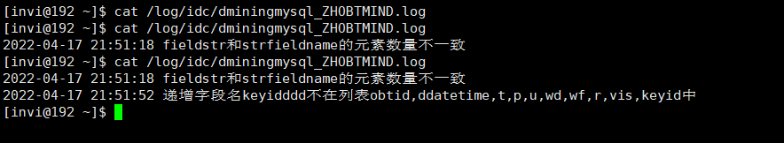
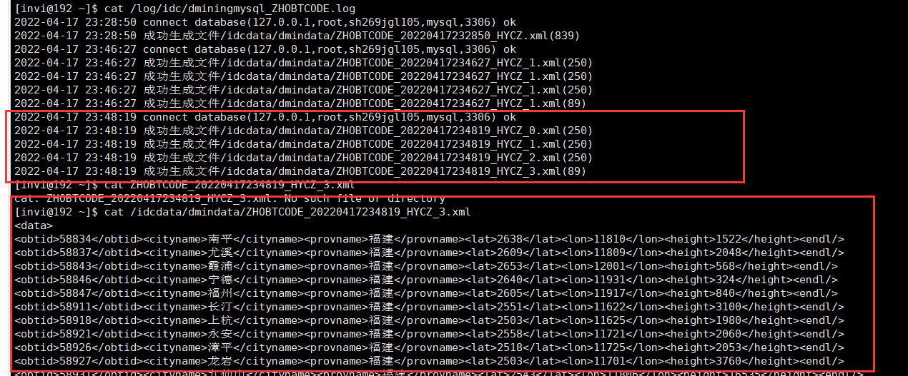
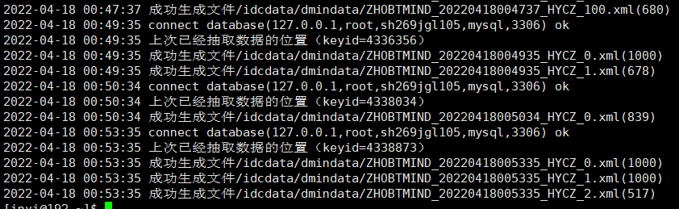

# 数据抽取子系统

数据抽取是从数据源中抽取数据的[过程]。

实际应用中，数据源较多采用的是关系数据库。从数据库中抽取数据一般有以下几种方式

### 全量抽取

全量抽取类似于数据迁移或数据复制，它将数据源中的表或视图的数据原封不动的从数据库中抽取出来，并转换成自己的ETL工具可以识别的格式。全量抽取比较简单。

### 增量抽取

增量抽取指抽取自上次抽取以来数据库中要抽取的表中新增、修改、删除的数据。在ETL使用过程中。增量抽取较全量抽取应用更广。如何捕获变化的数据是增量抽取的关键。对捕获方法一般有两点要求：准确性，能够将业务系统中的变化数据准确地捕获到;性能，尽量减少对业务系统造成太大的压力，影响现有业务。增量数据抽取中常用的捕获变化数据的方法有：

a.触发器：在要抽取的表上建立需要的触发器，一般要建立插入、修改、删除三个触发器，每当源表中的数据发生变化，就被相应的触发器将变化的数据写入一个临时表，抽取线程从临时表中抽取数据。触发器方式的优点是数据抽取的性能较高，缺点是要求在业务数据库中建立触发器，对业务系统有一定的性能影响。

b.时间戳：它是一种基于递增数据比较的增量数据捕获方式，在源表上增加一个时间戳字段，系统中更新修改表数据的时候，同时修改时间戳字段的值。当进行数据抽取时，通过比较系统时间与时间戳字段的值来决定抽取哪些数据。有的数据库的时间戳支持自动更新，即表的其它字段的数据发生改变时，自动更新时间戳字段的值。有的数据库不支持时间戳的自动更新，这就要求业务系统在更新业务数据时，手工更新时间戳字段。同触发器方式一样，时间戳方式的性能也比较好，数据抽取相对清楚简单，但对业务系统也有很大的倾入性(加入额外的时间戳字段)，特别是对不支持时间戳的自动更新的数据库，还要求业务系统进行额外的更新时间戳操作。另外，无法捕获对[时间戳](https://baike.baidu.com/item/时间戳)以前数据的delete和update操作,在数据准确性上受到了一定的限制。

c.全表比对：典型的全表比对的方式是采用MD5校验码。ETL工具事先为要抽取的表建立一个结构类似的MD5[临时表](https://baike.baidu.com/item/临时表)，该临时表记录源表主键以及根据所有字段的数据计算出来的MD5校验码。每次进行数据抽取时，对源表和MD5临时表进行MD5校验码的比对，从而决定源表中的数据是新增、修改还是删除，同时更新MD5校验码。MD5方式的优点是对源系统的倾入性较小(仅需要建立一个MD5临时表)，但缺点也是显而易见的，与触发器和时间戳方式中的主动通知不同，MD5方式是被动的进行全表数据的比对，性能较差。当表中没有主键或唯一列且含有重复记录时，MD5方式的准确性较差。

d.日志对比：通过[分析数据库](https://baike.baidu.com/item/分析数据库)自身的日志来判断变化的数据。Oracle的改变数据捕获(CDC，Changed Data Capture)技术是这方面的代表。CDC 特性是在Oracle9i数据库中引入的。CDC能够帮助你识别从上次抽取之后发生变化的数据。利用CDC，在对源表进行insert、update或 delete等操作的同时就可以提取数据，并且变化的数据被保存在数据库的变化表中。这样就可以捕获发生变化的数据，然后利用[数据库视图](https://baike.baidu.com/item/数据库视图)以一种可控的方式提供给目标系统。CDC体系结构基于发布者/订阅者模型。发布者捕捉变化数据并提供给订阅者。订阅者使用从发布者那里获得的变化数据。通常，CDC系统拥有一个发布者和多个订阅者。发布者首先需要识别捕获变化数据所需的源表。然后，它捕捉变化的数据并将其保存在特别创建的变化表中。它还使订阅者能够控制对变化数据的访问。订阅者需要清楚自己感兴趣的是哪些变化数据。一个订阅者可能不会对发布者发布的所有数据都感兴趣。订阅者需要创建一个订阅者视图来访问经发布者授权可以访问的变化数据。CDC分为同步模式和异步模式，同步模式实时的捕获变化数据并存储到变化表中，发布者与订阅都位于同一数据库中。异步模式则是基于Oracle的流复制技术。


# 开发介绍

这章打算开发的这个数据抽取子系统，

- 是一个通用的功能模块，只需要配置脚本就可以实现对不同数据源的抽取。
- 支持全量和增量数据抽取两种方式
- 支持多种数据库（主要支持 MySQL， oracle）

## 搭建程序的框架，解析参数

```c++
struct st_arg
{
  char connstr[101];     // 数据库的连接参数。
  char charset[51];      // 数据库的字符集。
  char selectsql[1024];  // 从数据源数据库抽取数据的SQL语句。
  char fieldstr[501];    // 抽取数据的SQL语句输出结果集字段名，字段名之间用逗号分隔。
  char fieldlen[501];    // 抽取数据的SQL语句输出结果集字段的长度，用逗号分隔。
  char bfilename[31];    // 输出xml文件的前缀。
  char efilename[31];    // 输出xml文件的后缀。
  char outpath[301];     // 输出xml文件存放的目录。
  int  maxcount;         // 输出xml文件最大记录数，0表示无限制。
  char starttime[52];    // 程序运行的时间区间
  char incfield[31];     // 递增字段名。
  char incfilename[301]; // 已抽取数据的递增字段最大值存放的文件。
  char connstr1[101];    // 已抽取数据的递增字段最大值存放的数据库的连接参数。
  int  timeout;          // 进程心跳的超时时间。
  char pname[51];        // 进程名，建议用"dminingmysql_后缀"的方式。
} starg;
```

如上是这个程序的运行所需参数。

`char selectsql[1024];  // 从数据源数据库抽取数据的SQL语句`，因为sql语句的灵活性，所以这采用sql语句作为参数传递给程序执行。然后看第四个参数，抽取数据的SQL语句输出结果集字段名，字段名之间用逗号分隔。这个主要是为了做字段重命名。比如一个数据集，在a表中，叫aaa, bbb, ccc，然后我希望将这个数据集抽取出来后，这些字段对应的名字改为xxx,zzz,yyy这样，那我就一一对应的把我希望的字段给传入，然后数据抽取完毕，生成的xml文件的字段名就是我传入的这些。

然后关于 `程序运行的时间区间` 这个参数，因为我们希望该数据抽取程序在系统空闲的时候再去运行，系统繁忙的时候就休息。所以有这个参数。

> char incfield[31];     // 递增字段名。
> char incfilename[301]; // 已抽取数据的递增字段最大值存放的文件。
> char connstr1[101];    // 已抽取数据的递增字段最大值存放的数据库的连接参数。

然后关于这3个参数，是实现增量数据抽取的关键参数。这里后面再详细说。

```c++
char strfieldname[MAXFIELDCOUNT][31];       // 结果集字段名数组，从starg.fieldstr中解析得到
int ifieldlen[MAXFIELDCOUNT];               // 结果集字段值的最大长度, 从starg.fieldlen中解析得到
int ifieldcount;                            // strfieldname和ifieldlen数组中有效字段的个数
int incfieldpos = -1;                       // 递增字段在结果集数组中的位置

// 把xml解析到参数starg结构中。
bool _xmltoarg(char *strxmlbuffer)
{
    memset(&starg,0,sizeof(struct st_arg));

    GetXMLBuffer(strxmlbuffer,"connstr",starg.connstr,100);
    if (strlen(starg.connstr)==0) { logfile.Write("connstr is null.\n"); return false; }

    GetXMLBuffer(strxmlbuffer,"charset",starg.charset,50);
    if (strlen(starg.charset)==0) { logfile.Write("charset is null.\n"); return false; }

    GetXMLBuffer(strxmlbuffer,"selectsql",starg.selectsql,1000);
    if (strlen(starg.selectsql)==0) { logfile.Write("selectsql is null.\n"); return false; }

    GetXMLBuffer(strxmlbuffer,"fieldstr",starg.fieldstr,500);
    if (strlen(starg.fieldstr)==0) { logfile.Write("fieldstr is null.\n"); return false; }

    GetXMLBuffer(strxmlbuffer,"fieldlen",starg.fieldlen,500);
    if (strlen(starg.fieldlen)==0) { logfile.Write("fieldlen is null.\n"); return false; }

    GetXMLBuffer(strxmlbuffer,"bfilename",starg.bfilename,30);
    if (strlen(starg.bfilename)==0) { logfile.Write("bfilename is null.\n"); return false; }

    GetXMLBuffer(strxmlbuffer,"efilename",starg.efilename,30);
    if (strlen(starg.efilename)==0) { logfile.Write("efilename is null.\n"); return false; }

    GetXMLBuffer(strxmlbuffer,"outpath",starg.outpath,300);
    if (strlen(starg.outpath)==0) { logfile.Write("outpath is null.\n"); return false; }

    GetXMLBuffer(strxmlbuffer,"starttime",starg.starttime,50);  // 可选参数。

    GetXMLBuffer(strxmlbuffer,"incfield",starg.incfield,30);  // 可选参数。

    GetXMLBuffer(strxmlbuffer,"incfilename",starg.incfilename,300);  // 可选参数。

    GetXMLBuffer(strxmlbuffer,"maxcount",&starg.maxcount);  // 可选参数。

    GetXMLBuffer(strxmlbuffer,"connstr1",starg.connstr1,100);  // 可选参数。

    GetXMLBuffer(strxmlbuffer,"timeout",&starg.timeout);   // 进程心跳的超时时间。
    if (starg.timeout==0) { logfile.Write("timeout is null.\n");  return false; }

    GetXMLBuffer(strxmlbuffer,"pname",starg.pname,50);     // 进程名。
    if (strlen(starg.pname)==0) { logfile.Write("pname is null.\n");  return false; }

    // 创建字符串拆分的对象
    CCmdStr Cmdstr;

    // 1、把starg.fieldlen解析到ifieldlen数组中；
    Cmdstr.SplitToCmd(starg.fieldlen, ",");

    // 判断字段数是否超出MAXFIELDCOUNT的限制
    if(Cmdstr.CmdCount() > MAXFIELDCOUNT)
    {
        logfile.Write("filedlen的字段数太多，超出了最大限制%d\n", MAXFIELDCOUNT);
        return false;
    }

    for(int i = 0; i < Cmdstr.CmdCount(); i++)
    {
        Cmdstr.GetValue(i, &ifieldlen[i]);
    }

    ifieldcount = Cmdstr.CmdCount();

    // 2、把starg.fieldstr解析到strfieldname数组中；
    Cmdstr.SplitToCmd(starg.fieldstr, ",");

    // 判断字段数是否超出 MAXFIELDCOUNT 限制
    if(Cmdstr.CmdCount() > MAXFIELDCOUNT)
    {
        logfile.Write("filedlen的字段数太多，超出了最大限制%d\n", MAXFIELDCOUNT);
        return false;
    }

    for(int i = 0; i < Cmdstr.CmdCount(); i++)
    {
        Cmdstr.GetValue(i, strfieldname[i], 30);
    }

    // 判断 ifieldlen 和 strfieldname 这两个数组的大小是否相同
    if(ifieldcount != Cmdstr.CmdCount())
    {
        logfile.Write("fieldstr和strfieldname的元素数量不一致\n");
        return false;
    }

    // 3、获取自增字段在结果集中的位置。
    if(strlen(starg.incfield) != 0)
    {
        for(int  i = 0; i <  ifieldcount; i++)
        {
            if(strcmp(starg.incfield, strfieldname[i]) == 0)
            {
                incfieldpos = i;
                break;
            }
        }
        if(incfieldpos == -1)
        {
            logfile.Write("递增字段名%s不在列表%s中\n", starg.incfield, starg.fieldstr);
            return false;
        }
    }

    return true;
}

```

编译运行，进行阶段性测试，可以看到，我们如果提供了错误的参数，是能够正确识别并输出到日志进行记录的



## 全量抽取数据，生成xml文件

```c++
// 数据抽取的主函数。
bool _dminingmysql()
{
    // 创建sql执行对象
    sqlstatement stmt(&conn);
    // 准备sql语句
    stmt.prepare(starg.selectsql);
    // 绑定sql语句中的变量地址
    // 先定义一个字符串数组，把结果集绑定到这个字符串数组上(数组的大小用抽取字段的个数，然后字符串的大小用之前定义的宏+1)
    char strfieldbvalue[ifieldcount][MAXFIELDLEN + 1];    // 抽取数据的sql执行之后，存放结果集字段的数组
    // 采用一个循环，将sql的输出结果集绑定到对应的数组变量中
    for(int i = 0; i < ifieldcount; i++)
    {
        stmt.bindout(i+1, strfieldbvalue[i], ifieldlen[i]);
    }

    if(stmt.execute() != 0)
    {
        logfile.Write("stmt.execute() failed\n%s\n%s\n", stmt.m_sql, stmt.m_cda.message);
        return false;
    }

    CFile File;     // 用于操作xml文件


    // 循环获取结果集
    while (true)
    {
        memset(strfieldbvalue, 0, sizeof(strfieldbvalue));

        if(stmt.next() != 0) break;

        // 只有单结果集不为空的时候，才生成这个xml文件
        // 先判断文件是否打开
        if(File.IsOpened() == false)
        {
            // 打开文件之间，先把文件名拼接出来
            crtxmlfilename();           // 生成xml文件名
        
            if(File.OpenForRename(strxmlfilename, "w+") == false)
            {
                logfile.Write("File.OpenForRename(\"%s\", \"w+\") failed \n", strxmlfilename);
                return false;
            }

            // 成功打开文件之后，把xml的data标签写进去
            File.Fprintf("<data>\n");
        }

        // 拿到结果集后，将结果集的字段拼接成xml然后写入到对应的输出文件中
        for(int i = 0; i < ifieldcount; i++)
        {
            File.Fprintf("<%s>%s</%s>", strfieldname[i], strfieldbvalue[i], strfieldname[i]);
        }
        File.Fprintf("<endl/>\n");
    }

    if(File.IsOpened() == true)
    {
        // 关闭文件之前，先写入数据结束标签
        File.Fprintf("</data>\n");

        if(File.CloseAndRename() == false)
        {
            logfile.Write("File.CloseAndRename() failed\n");
            return false;
        }

        // 成功：把xml文件名和记录总数写日志
        logfile.Write("成功生成文件%s(%d)\n", strxmlfilename, stmt.m_cda.rpc);
    }
    

    return true;
}

```

现在写的这个函数，基本上实现了将查询到的数据保存到xml文件中。测试如下。先编译运行程序，然后查看日志和生成的xml文件。


现在实现的这个数据抽取，是很简单的把抽取到的数据完全保存到一个文件中，这样其实是不合理的，无论对于日后的数据入库或者其他数据操作，这种如果将大量的数据全都放入一个文件中是不可取的。

- 一个xml文件存放的记录数卜曹国1000条
- 在Mysql数据库中，插入数据的速度大概在1000条/秒左右
- 一次产生1000条数据，不会产生大事务和长事务，不会对数据库产生冲击

这种实现思路就是在数据抽取过程中，做一个判断，如果结果集的数量超过了1000,就关闭当前文件，这样在处理后续的结果集的时候，就会重新产生新的文件，从而实现了每个xml文件最多只记录1000条数据

```c++
 // 这做一个判断，如果结果集的数量超过了1000,就关闭当前文件，
        // 这样在处理后续的结果集的时候，就会重新产生新的文件，从而实现了每个xml文件最多只记录1000条数据
        if(stmt.m_cda.rpc%1000 == 0)
        {
            // 关闭文件之前，先写入数据结束标签
            File.Fprintf("</data>\n");

            if(File.CloseAndRename() == false)
            {
                logfile.Write("File.CloseAndRename() failed\n");
                return false;
            }

            // 成功：把xml文件名和记录总数写日志
            logfile.Write("成功生成文件%s(1000)\n", strxmlfilename);
        }
```

然后编译运行，（这里因为测试文件只有800多条记录，筹不够1000，所以每个文件写入250条做测试）。



## 增量抽取

从程序角度来说，全量抽取就是执行一个不带参数的sql语句，不一定要抽取全部的数据，可以加条件。适用于数据源表数据量不大的业务参数表。

而增量抽取要求数据源表有自增字段，执行一个带输入参数的sql语句，（输入参数只有一个，就是已抽取数据的最大id，以保证我们增量抽取从这个id开始进行数据抽取）。然后每次抽取数据之后，把已经抽取的数据的最大id记录下来。

编译运行，多运行几次，看是否能正确拿到我们要的增量抽取以及id。可以看到，就第一次抽取的数据最多，后面紧跟着的数据抽取，都只抽取新增的记录。


