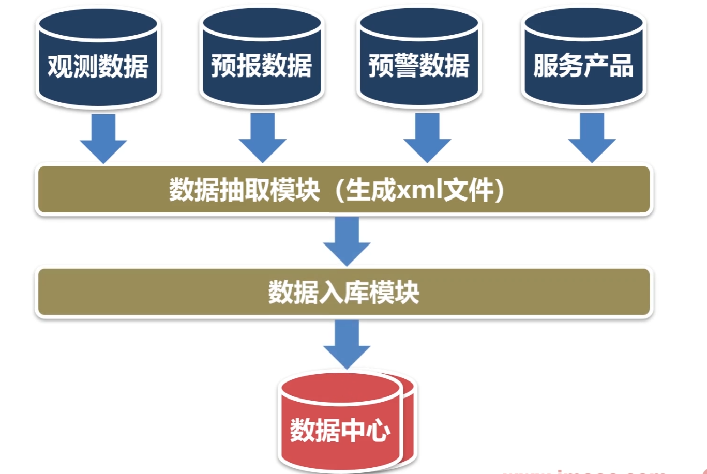

# 数据抽取子系统

数据抽取是从数据源中抽取数据的[过程]。

实际应用中，数据源较多采用的是关系数据库。从数据库中抽取数据一般有以下几种方式

### 全量抽取

全量抽取类似于数据迁移或数据复制，它将数据源中的表或视图的数据原封不动的从数据库中抽取出来，并转换成自己的ETL工具可以识别的格式。全量抽取比较简单。

### 增量抽取

增量抽取指抽取自上次抽取以来数据库中要抽取的表中新增、修改、删除的数据。在ETL使用过程中。增量抽取较全量抽取应用更广。如何捕获变化的数据是增量抽取的关键。对捕获方法一般有两点要求：准确性，能够将业务系统中的变化数据准确地捕获到;性能，尽量减少对业务系统造成太大的压力，影响现有业务。增量数据抽取中常用的捕获变化数据的方法有：

a.触发器：在要抽取的表上建立需要的触发器，一般要建立插入、修改、删除三个触发器，每当源表中的数据发生变化，就被相应的触发器将变化的数据写入一个临时表，抽取线程从临时表中抽取数据。触发器方式的优点是数据抽取的性能较高，缺点是要求在业务数据库中建立触发器，对业务系统有一定的性能影响。

b.时间戳：它是一种基于递增数据比较的增量数据捕获方式，在源表上增加一个时间戳字段，系统中更新修改表数据的时候，同时修改时间戳字段的值。当进行数据抽取时，通过比较系统时间与时间戳字段的值来决定抽取哪些数据。有的数据库的时间戳支持自动更新，即表的其它字段的数据发生改变时，自动更新时间戳字段的值。有的数据库不支持时间戳的自动更新，这就要求业务系统在更新业务数据时，手工更新时间戳字段。同触发器方式一样，时间戳方式的性能也比较好，数据抽取相对清楚简单，但对业务系统也有很大的倾入性(加入额外的时间戳字段)，特别是对不支持时间戳的自动更新的数据库，还要求业务系统进行额外的更新时间戳操作。另外，无法捕获对[时间戳](https://baike.baidu.com/item/时间戳)以前数据的delete和update操作,在数据准确性上受到了一定的限制。

c.全表比对：典型的全表比对的方式是采用MD5校验码。ETL工具事先为要抽取的表建立一个结构类似的MD5[临时表](https://baike.baidu.com/item/临时表)，该临时表记录源表主键以及根据所有字段的数据计算出来的MD5校验码。每次进行数据抽取时，对源表和MD5临时表进行MD5校验码的比对，从而决定源表中的数据是新增、修改还是删除，同时更新MD5校验码。MD5方式的优点是对源系统的倾入性较小(仅需要建立一个MD5临时表)，但缺点也是显而易见的，与触发器和时间戳方式中的主动通知不同，MD5方式是被动的进行全表数据的比对，性能较差。当表中没有主键或唯一列且含有重复记录时，MD5方式的准确性较差。

d.日志对比：通过[分析数据库](https://baike.baidu.com/item/分析数据库)自身的日志来判断变化的数据。Oracle的改变数据捕获(CDC，Changed Data Capture)技术是这方面的代表。CDC 特性是在Oracle9i数据库中引入的。CDC能够帮助你识别从上次抽取之后发生变化的数据。利用CDC，在对源表进行insert、update或 delete等操作的同时就可以提取数据，并且变化的数据被保存在数据库的变化表中。这样就可以捕获发生变化的数据，然后利用[数据库视图](https://baike.baidu.com/item/数据库视图)以一种可控的方式提供给目标系统。CDC体系结构基于发布者/订阅者模型。发布者捕捉变化数据并提供给订阅者。订阅者使用从发布者那里获得的变化数据。通常，CDC系统拥有一个发布者和多个订阅者。发布者首先需要识别捕获变化数据所需的源表。然后，它捕捉变化的数据并将其保存在特别创建的变化表中。它还使订阅者能够控制对变化数据的访问。订阅者需要清楚自己感兴趣的是哪些变化数据。一个订阅者可能不会对发布者发布的所有数据都感兴趣。订阅者需要创建一个订阅者视图来访问经发布者授权可以访问的变化数据。CDC分为同步模式和异步模式，同步模式实时的捕获变化数据并存储到变化表中，发布者与订阅都位于同一数据库中。异步模式则是基于Oracle的流复制技术。

# 本章介绍

这章打算开发的这个数据抽取子系统，

- 是一个通用的功能模块，只需要配置脚本就可以实现对不同数据源的抽取。
- 支持全量和增量数据抽取两种方式
- 支持多种数据库（主要支持 MySQL， oracle）
