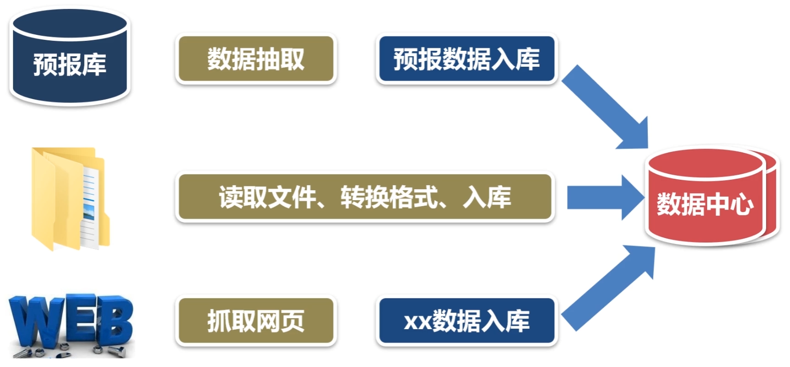
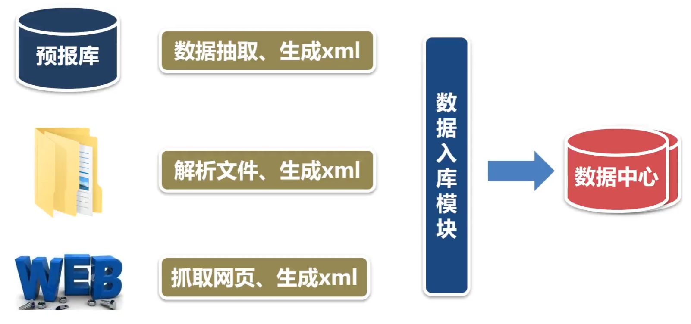

# 数据入库子系统

数据入库是数据中心最重要的工作，之前开发的数据采集，数据抽取，数据传输都是为了解决数据源的问题。

如图所示，数据源在实际业务中主要有3中存在方式，第一种，数据库，第二种，文件存储，第三种，数据存在网页中，需要我们自己爬取。

本章需要开发的数据入库子系统是一个通用的功能模块。只需要配置参数就可以把xml文件入库。

支持对表的插入和修改两种操作

支持多种数据库（MySQL，Oracle）

## mysql数据字典

- INFORMATION_SCHEMA 信息数据库
- COLUMNS 视图给出了表的列信息
- STATISTICS 视图给出了表的索引信息

## 数据入库的设计

- 生成xml文件的时候，数据的标签与表的字段名相同
- 在参数配置文件中描述清楚xml文件与表的对应关系
- 读取目录中的xml文件，查找xml文件与表的对应关系
- 从数据字典中，查询表的字段信息，有了字段信息，就知道该如何解析xml文件
- 解析xml文件，生成插入和修改表的sql语句，把数据插入表中，如果记录已经存在，就以主键字段为条件，更新表中的记录。
