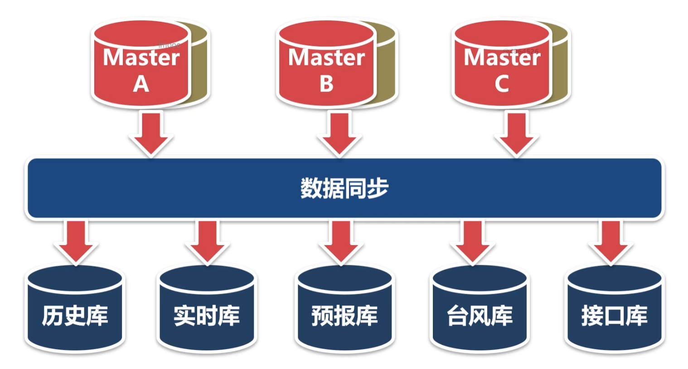

# 数据同步子系统

MySQL的高可用方案的不足

- master和salve的表结构和数据量必须保持一致
- 非主从关系的数据库之间不能进行数据复制
- 不够灵活，效率不高

最上面这层是数据中心的核心数据库，采用一主一备的方式，防止单点故障。然后最下面这个是各个业务数据库，本章开发的数据同步子系统就是为了从核心数据库中同步数据到各个业务数据库中

## 任务

- 熟悉MySQL的federated存储引擎
- 开发基于federated存储引擎的刷新同步模块
- 开发基于federated存储引擎的增量同步模块
- 开发不采用federated存储引擎的增量同步模块
