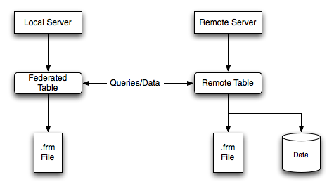

# Federated存储引擎

federated引擎提供了操作远程MySQL数据库表的方法。

FEDERATED存储引擎能让你访问远程的MySQL数据库而不使用replication或cluster技术(类似于Oracle的dblink),使用FEDERATED存储引擎的表,本地只存储表的结构信息,数据都存放在远程数据库上,查询时通过建表时指定的连接符去获取远程库的数据返回到本地。

FEDERATED存储引擎默认不启用
    如果是使用的源码，需要使用CMake 加上DWITH_FEDERATED_STORAGE_ENGINE选项。
    如果是二进制包,则在启动MySQL时指定 [--federated] 选项开启或在my.cnf文件中的[mysqld]部分加上federated参数

## FEDERATED 存储引擎架构

1 本地服务器 FEDERATED 存储引擎的表只存放表的.frm结构文件
2 远程服务器 存放了.frm和数据文件
3 增删改查操作都是通过建立的连接来访问远程数据库进行操作,把结果返回给本地。4 远程数据表的存储引擎为MySQL支持的存储引擎,如MyISAM,InnoDB等

图16.2联合表结构

当客户端发出引用`FEDERATED`表的SQL语句时，本地服务器（执行SQL语句的地方）和远程服务器（实际存储数据的地方）之间的信息流如下：

1. 存储引擎将遍历`FEDERATED`表具有的每一列，并构造一个引用远程表的适当SQL语句。
2. 该语句使用MySQL客户端API发送到远程服务器。
3. 远程服务器处理该语句，而本地服务器检索该语句产生的任何结果（受影响的行数或结果集）。
4. 如果该语句产生结果集，则每一列都将转换为该`FEDERATED`引擎期望的内部存储引擎格式，并可用于将结果显示给发出原始语句的客户端。

本地服务器使用MySQL客户端C API函数与远程服务器通信。它调用`mysql_real_query()`发送语句。要读取结果集，它使用`mysql_store_result()`并一次读取一行`mysql_fetch_row()`。

## FEDERATED 存储引擎操作步骤

操作步骤：
    远程库:
        开启 FEDERATED 存储引擎
        建立远程访问用户
        授予访问对象的权限
    本地库：
        测试登陆远程库是否能成
        创建 FEDERATED 表
        查询是否成功

####

## FEDERATED 引擎使用注意事项

1、FEDERATED 表可能会被复制到其他的slave数据库,你需要确保slave服务器也能够使用定义在connection中或mysql.servers表中的link的用户名/密码 连接上远程服务器。
2、远程服务器必须是MySQL数据库
3、在访问FEDERATED表中定义的远程数据库的表前,远程数据库中必须存在这张表。
4、FEDERATED 表不支持通常意义的索引,服务器从远程库获取所有的行然后在本地进行过滤,不管是否加了where条件或limit限制。
　　--查询可能造成性能下降和网络负载,因为查询返回的数据必须存放在内存中,所以容易造成使用系统的swap分区或挂起。（除了主键和唯一键，federated引擎不支持普通索引）创建federated表时，必须指定主键和唯一键
5、FEDERATED表不支持字段的前缀索引
6、FEDERATED表不支持ALTER TABLE语句或者任何DDL语句
7、FEDERATED表不支持事务
8、本地FEDERATED表无法知道远程库中表结构的改变
9、任何drop语句都只是对本地库的操作,不对远程库有影响
