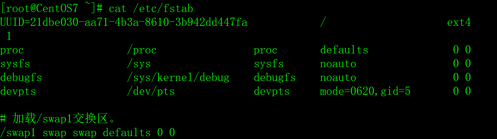
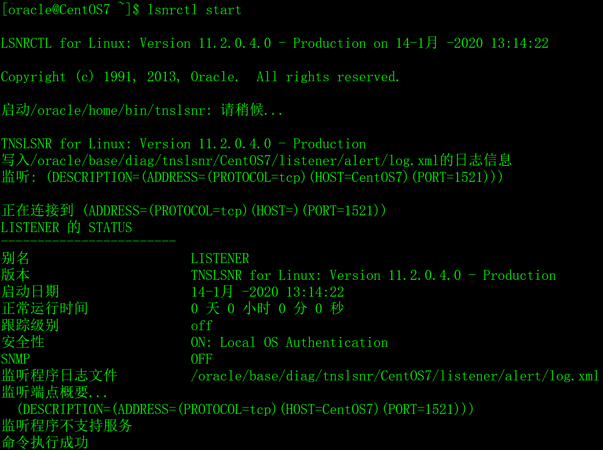
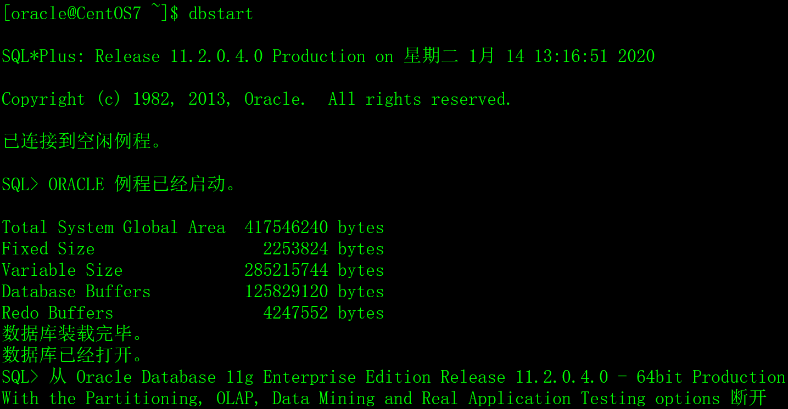
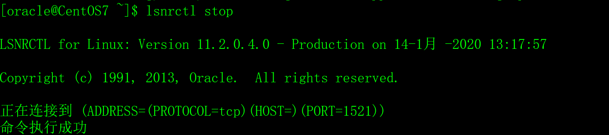
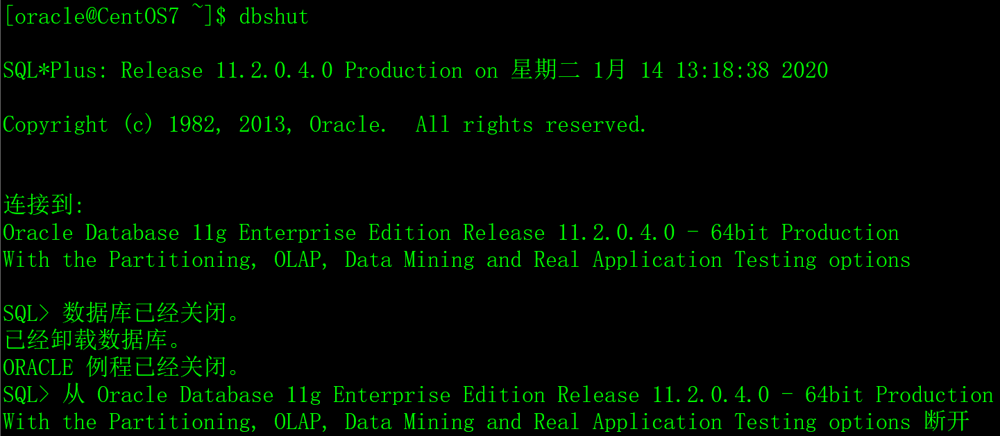
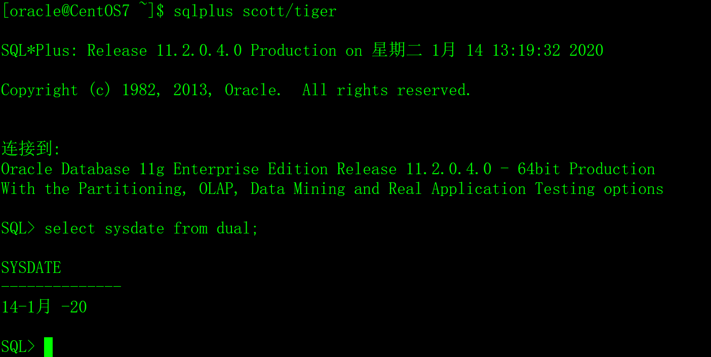
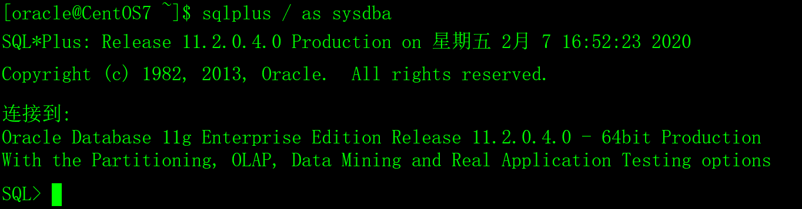
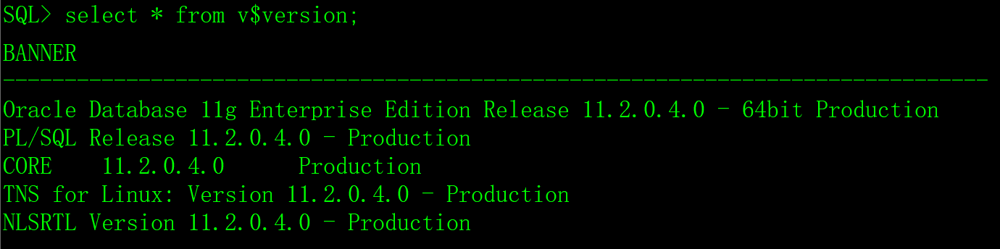

关于Oracle数据库安装的文章网上到处都是，百度一下就能找到很多，例如：

​                               

能百度到的Oracle安装是常规的方法，我就不讲了，本文向大家介绍一种更简单的非常规的安装方法，这种方法适用于初学者。

# 一、Oracle安装存在的问题

Oracle数据库系统对服务器的硬件和软件要求比较严格，一般来说，用于Oracle生产环境的服务器配置非常好，内存在16GB以上，在图形界面中安装Oracle非常容易，极少失败。

但是，对初学者来说，学习资源有限，一般是在VMWare虚拟机上安装CentOS操作系统，或租用最低配置的云服务器（1核1G/2G内存），不可能有那么好的服务器来安装Oracle，也可能没有图形界面。在虚拟机或低配置的云服务器上安装Oracle问题很多，莫名其妙，根本找不到问题的原因和解决方法，困难重重，让人欲哭无泪。

# 二、如何解决Oracle安装的问题

解决在虚拟机或低配置的云服务器上安装Oracle的方法有两种：

1）不用图形界面，采用静默方式安装，这种方法的技术难度比较大，Oracle的DBA（数据库管理员）经常采用这种方法，而普通程序员很难掌握。

2）把已经安装好的Oracle软件、数据库实例和环境参数打包压缩，然后在目标系统中解压恢复，对初学者来说，这是搭建Oracle数据库学习环境的最佳方案，也是本文采用的方案。

# 三、软件需求

操作系统采用CentOS7系列版本，不支持CentOS8。

字符集设置为zh_CN.UTF-8。

# 四、硬件需求

## 1、查看内存和交换区的大小

采用free -m命令查看系统的内存和交换区，如下：

 

Mem:行显示的是物理内存的大小和使用情况，Swap:行显示的是交换区的大小和使用情况，单位是MB。

安装Oracle的物理内存要求在1024MB以上，交换区的要求如下：

| 可用内存             | 交换区大小         |
| -------------------- | ------------------ |
| 1024MB到2048MB之间。 | 1.5倍于物理内存。  |
| 2049MB到8192MB之间。 | 1倍于物理内存。    |
| 大于8192MB。         | 0.75倍于物理内存。 |

## 2、创建交换区

如果没有交换区或交换区太小，先创建交换区，交换区的大小见上表的对应关系，以下步骤将创建一个2048M的交换区。

1）用root用户执行dd命令创建/swap1文件。

```shell
dd if=/dev/zero of=/swap1 bs=1024 count=2048000
```

如下：

 

2）把/swap1文件设置成交换区。

```shell
/sbin/mkswap /swap1
```

如下：

 

3）把/swap1交换区设置为有效状态。

```shell
/sbin/swapon /swap1
```

如下：

 

4）用free -m命令查看交换区，确认已生效。

如下：

 

5）修改/etc/fstab文件，让CentOS操作系统在每次重启时自动加载/swap1交换区。

在/etc/fstab文件中增加以下内容。

```shell
/swap1 swap swap defaults 0 0
```

如下：

 

6）重启操作系统，重启后再确认一下交换区/swap1是否已加载。

## 3、删除交换区

如果创建的交换区不符合要求，可以用以下步骤删除它。

1）停止正在使用的swap分区。

```shell
swapoff /swap1
```

2）删除swap分区文件。

```shell
rm /swap1
```

3）修改/etc/fstab文件，删除开机自动挂载/swap1的命令。

# 五、安装对应的依赖包

安装Oracle之前，还需要安装一些CentOS的软件包，用以下命令执行安装（用root用户执行）。

```shell
yum install -y binutils* compat-libstdc* elfutils-libelf* gcc* glibc* ksh* libaio* libgcc* libstdc* make* sysstat* libXp* glibc-kernheaders ksh binutils compat-libstdc++-33 elfutils-libelf elfutils-libelf-devel gcc gcc-c++ glibc glibc-common glibc-devel libaio libaio-devel libgcc libstdc++ libstdc++-devel make numactl sysstat libXp unixODBC unixODBC-devel
```

这些软件包依赖关系比较复杂，不管它，多执行几次以上命令，直到全部的软件包都是最新版本。

# 六、修改系统核心参数

## 1、修改/etc/sysctl.conf文件

/etc/sysctl.conf是操作系统的核心参数配置文件，在文件最后增加以下行。

```shell
fs.file-max = 6815744

fs.aio-max-nr = 1048576

kernel.shmall = 2097152

kernel.shmmax= 2147483648

kernel.shmmni= 4096

kernel.sem = 250 32000100 128

net.ipv4.ip_local_port_range= 9000 65500

net.core.rmem_default= 262144

net.core.rmem_max= 4194304

net.core.wmem_default = 262144

net.core.wmem_max= 1048576
```

注意，kernel.shmmax参数的值为操作系统内存的一半，单位是字节。例如，操作系统总内存如果是2048MB，那么kernel.shmmax的值应该是1*1024*1024*1024=1073741824，即kernel.shmmax = 1073741824

其它的参数照抄。

## 2、 修改/etc/security/limits.conf文件

/etc/security/limits.conf是操作系统对用户使用资源的配置文件，在文件最后增加以下行。

```shell
oracle      soft  nproc   2047

oracle      hard  nproc  16384

oracle      soft  nofile  1024

oracle      hard  nofile  65536

oracle      hard  stack  10240
```

## 3、 修改/etc/pam.d/login文件

/etc/pam.d/login是用户认证文件，在文件最后增加以下行。

```shell
session  required   /lib64/security/pam_limits.so
```

## 4、 修改/etc/profile文件

/etc/profile是系统环境参数配置文件，在文件最后增加以下行。

```shell
if [ $USER = "oracle" ]; then

​    if [ $SHELL = "/bin/ksh" ]; then

​       ulimit -p 16384

​       ulimit -n 65536

​    else

​       ulimit -u 16384 -n 65536

​    fi

fi
```

## 5、 修改/etc/selinux/config文件

/etc/selinux/config是SELinux配置文件，修改SELINUX的值，禁用它。

```shell
SELINUX=disabled
```

## 6、重启服务器

```shell
init 6 或 reboot
```

# 七、创建Oracle用户和组

Oracle的安装用户是oracle，组是dba，oracle用户的根目录是/oracle，不能采用其它目录（注意是小写的字母），如果/oracle目录的空间不够，可以采用软链接的方式，把有/oracle链接到其它有足够空间的目录。

1）创建dba组。

```shell
groupadd dba
```

2）创建oracle用户，组名是dba，**用户根目录是/oracle，其它目录不行。**

```shell
useradd -n oracle -g dba -d /oracle
```

3）修改oracle用户的密码。

```shell
passwd oracle
```

# 八、获得Oracle压缩包

从课件中下载软件安装包，文件名是oracle11gR2.tgz。

# 九、解开压缩包

把Oracle的压缩包文件oracle11gR2.tgz上传到服务器的/tmp目录。

采用su - oracle切换到oracle用户，**在根目录下执行解开压缩包，其它目录不行。**

```shell
su - oracle

cd /

tar zxvf /tmp/oracle11gR2.tgz

exit;
```


**注意，解压缩包后，一定要退出oracle用户，否则oracle用户的环境变量不会生效。**

# 十、数据库的参数

oracle11gR2.tgz解压后，会生成/oracle/.bash_profile文件，包括了Oracle数据库的安装参数，内容如下：

> export ORACLE_BASE=/oracle/base
>
> export ORACLE_HOME=/oracle/home
>
> export ORACLE_SID=snorcl11g
>
> export NLS_LANG='Simplified Chinese_China. AL32UTF8'
>
> export LD_LIBRARY_PATH=$ORACLE_HOME/lib:/usr/lib
>
> export PATH=$PATH:$HOME/bin:$ORACLE_HOME/bin:.

# 十一、数据库的启动

**注意，解压缩包后，一定要退出oracle用户，否则oracle用户的环境变量不会生效，无法启动数据库。**

用oracle用户登录，执行`lsnrctl start`启动网络监听服务，执行`dbstart`启动数据库系统。

 

 

# 十二、数据库的关闭

用oracle用户登录，执行lsnrctl stop关闭网络监听服务，执行dbshut关闭数据库系统。

**在重启或关闭服务器操作系统之前，一定要关闭数据库，否则数据库损坏的概率非常大。**

 

 

# 十三、采用sqlplus登录数据库

用oracle用户登录CentOS系统。

**在Shell中，执行`sqlplus scott/tiger`，以scott普通用户的身份登录数据库。**

 

在sqlplus中，输入exit;退出sqlplus。

**在Shell中，执行`sqlplus / as sysdba`以系统管理员身份登录数据库。**

 

# 十四、查询数据库的版本

```shell
select * from v$version;
```

 

# 十五、服务器防火墙配置

Oracle数据库缺省的通信端口是1521，如果想从远程连接Oracle数据库，需要开通服务器防火墙的1521端口。

CentOS7采用以下命令开通1521端口：

```shell
firewall-cmd --zone=public --add-port=1521/tcp --permanent
```

以下是CentOS7防火墙的相关操作命令。

## 1、查看防火墙的命令

1）查看防火墙的版本。

```shell
firewall-cmd --version
```

2）查看firewall的状态。

```shell
firewall-cmd --state
```

3）查看firewall服务状态（普通用户可执行）。

```shell
systemctl status firewalld
```

4）查看防火墙全部的信息。

```shell
firewall-cmd --list-all
```

5）查看防火墙已开通的端口。

```shell
firewall-cmd --list-port
```

6）查看防火墙已开通的服务。

```shell
firewall-cmd --list-service
```

7）查看全部的服务列表（普通用户可执行）。

```shell
firewall-cmd --get-services
```

8）查看防火墙服务是否开机启动。

```shell
systemctl is-enabled firewalld
```

## 2、配置防火墙的命令

 1）启动、重启、关闭防火墙服务。

```shell
# 启动

systemctl start firewalld

# 重启

systemctl restart firewalld

# 关闭

systemctl stop firewalld
```

2）开放、移去端口。

```shell
# 开放1521端口

firewall-cmd --zone=public --add-port=1521/tcp --permanent

# 移去1521端口

firewall-cmd --zone=public --remove-port=1521/tcp --permanent
```

3）设置开机时启用、禁用防火墙服务。

```shell
# 启用服务

systemctl enable firewalld

# 禁用服务

systemctl disable firewalld
```

# 十六、云平台访问策略配置

如果Oracle数据库安装在云服务器上，需要登录云服务器提供商的管理平台开通访问策略（或安全组），开通1521端口的访问策略。

不同云服务器提供商的管理平台操作方法不同，具体操作方法阅读操作手册、或者百度，或者咨询云服务器提供商的客服。

# 十七、Oracle数据库开机自启动

请阅读《36.Oracle数据库开机自启动.doc》。