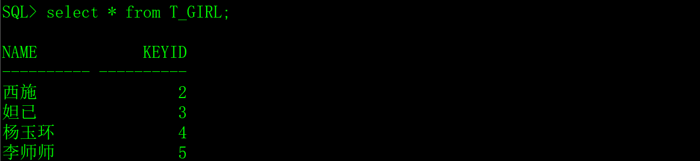
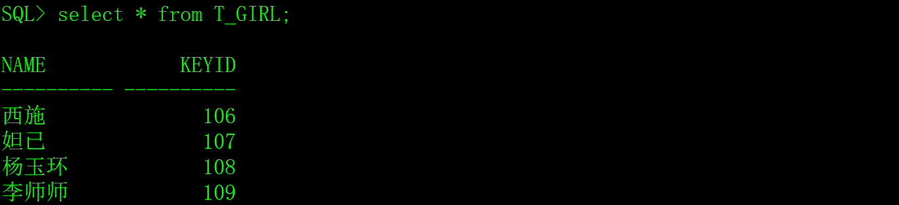
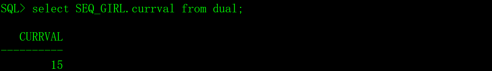
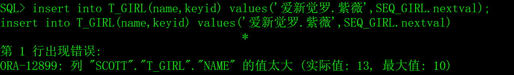
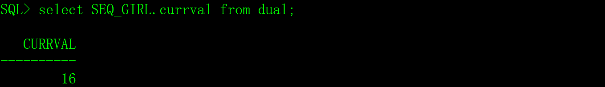

在实际开发中，设计数据表的时候会把某些字段定义成一个自动增长的、唯一的流水号，例如记录编号、日志编号等，MySQL和SQL Server采用的是自增字段，Oracle和PostgreSQL采用了更灵活的序列生成器。在本文中，把序列生成器简称为序列。

# 一、创建序列        

创建序列的语法如下：

```sql
create sequence 序列名

​    [minvalue n]

​    [maxvalue n]

​    [increment by n]

​    [start with n]

​    [cache n|nocache]

​    [order|noorder]

​    [cycle|nocycle];
```

参数说明：

Oracle的序列分为递增序列和递减序列，递减序列极少使用（二十年我从未用过），为了方便介绍，本文假设序列是递增序列。

序列名：序列名是标志符，建议以SEQ_打头，例如为T_OPERLOG表的logid字段创建一个序列，可以把它命名为SEQ_OPERLOG（或SEQ_OPERLOG_LOGID），增加数据结构的可读性，这是我的个人经验，并不是Oracle数据库的要求。

`[minvalue n]`：序列的最小值，缺省值是1。

`[maxvalue n]`：序列的最大值，缺省值是9999999999999999999999999999。

`[increment by n]`：序列递增的步长，缺省值是1。

`[start with n]`：序列的起始值，缺省值是`minvalue`，如果n小于`minvalue`，创建序列会报语法错误。

 `[cache n|nocache]`：是否采用缓存机制，`nocache`不采用缓存，缺省cache 20，数据库每次会生成20个值放在缓存中，如果缓存中有数据，就不需要再查数据库了，采用缓存机制可以提升效率。

 `[order|noorder]`：获取序列的时候是否按顺序给值，如果多用户一起获取序列的值，使用order可以保证序列值的顺序按访问序列的事件排序，缺省是`noorder`。

`[cycle|nocycle]`：是否循环，缺省不循环，如果不循环，序列值到了`maxvalue`后将不可用。

# 二、序列的使用

## 1、创建最简单的序列

```sql
create sequence SEQ_GIRL;
```

执行以上SQL语句会在数据库中生成一个名字为SEQ_GIRL的序列，除了序列名，其它的参数都采用缺省值，相当于以下SQL：

```sql
create sequence SEQ_GIRL 

​    minvalue 1 

​    maxvalue 9999999999999999999999999999 

​    increment by 1 

​    start with 1 

​    cache 20 

​    noorder 

​    nocycle ;
```

## 2、在dual虚表使用序列

序列创建后，用序列名.nextval获取序列的下一个值，用序列名.currval来查看当前值。

在新的会话中，必须先使用nextval来产生一个值后才可以使用currval进行查看。

```sql
select SEQ_GIRL.nextval from dual;   -- 获取序列SEQ_GIRL的下一个值。

select SEQ_GIRL.currval from dual;   -- 获取序列SEQ_GIRL的当前值。
```

## 3、在SQL语句中使用序列

我们先创建一个简单的表。

```sql
create table T_GIRL

(

 name  varchar2(10),   -- 姓名

 keyid  number(10)    -- 记录编号

);
```

1）在insert语句中使用序列。

```sql
insert into T_GIRL(name,keyid) values('西施' ,SEQ_GIRL.nextval);

insert into T_GIRL(name,keyid) values('妲已' ,SEQ_GIRL.nextval);

insert into T_GIRL(name,keyid) values('杨玉环',SEQ_GIRL.nextval);

insert into T_GIRL(name,keyid) values('李师师',SEQ_GIRL.nextval);
```

执行结果：

​                               

2）在update语句中使用序列。

```sql
update T_GIRL set keyid=SEQ_GIRL.nextval+100;
```

执行结果：

 

# 三、序列裂缝

## 1、序列不产生事务


序列的nextval方法不会产生事务，事务回滚命令rollback不会恢复序列的值，我们来做一个测试。

1）先获取序列的当前值。

 

2）执行一条不会成功的SQL语句。

 

3）再获取序列的当前值。

 

## 2、序列裂缝

如果用序列的值作为表中某个字段的值，这个字段的值可能会出现不连续的情况。因为序列的值不连续，有裂缝。

序列在下列情况下出现裂缝：

1）执行SQL语句失败；

2）事务回滚；

3）序列缓存；

4）多个表同时使用同一序列；

5）其它异常。

# 四、修改序列

修改序列的语法如下：

```sql
alter sequence 序列名

   [minvalue n]

   [maxvalue n]

   [increment by n]

   [start with n]

   [cache n|nocache]

   [order|noorder]

   [cycle|nocycle];
```

修改序列的参数与创建序列的参数相同，不同的是，修改序列时没有缺省值。

```sql
alter sequence SEQ_GIRL increment by 10 cycle;
```

# 五、删除序列

删除序列的语法如下：

```sql
drop sequence 序列名;
```