Oracle采用date类型表示日期时间，这是一个7字节的固定宽度的数据类型，有7个属性，包括：世纪、世纪中哪一年、月份、月中的哪一天、小时、分钟和秒。本文中把date类型称为日期时间类型，简称时间型。

对编程语言来说，时间是用字符串来显示和书写的，如果设置了NLS_DATE_FORMAT环境变量，Oracle可以自动的对时间和字符串进行转换，但是，程序员更多的是采用to_char和to_date两个函数对时间和字符串进行转换。

# 一、把时间转换为字符串

to_char函数把时间转换成字符串，一般用于select 和from之间的字段列表中的时间输出，语法如下：

```sql
to_char(时间,格式)
```

时间格式用字符串来表达，格式控制标识如下，加粗显示的是常用的格式：

`d`：一周中的星期几。

`day`：天的名字，使用空格填充到9个字符。

**`dd`**：月中的第几天。

`ddd`：年中的第几天。

`dy`：天的简写名。

`iw`：ISO标准的年中的第几周。

`iyyy`：ISO标准的四位年份。

**`yyyy`**：四位年份。

`yyy,yy,y`：年份的最后三位，两位，一位。

`hh`：小时，按12小时计。

**`hh24`**：小时，按24小时计。

**`mi`**：分。

**`ss`**：秒。

**`mm`**：月。

`mon`：月份的简写。

`month`：月份的全名。

`w`：该月的第几个星期。     

`ww`：年中的第几个星期。

举例：

​           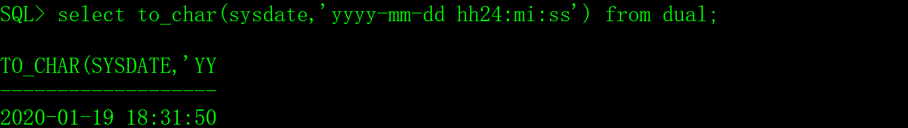                    

 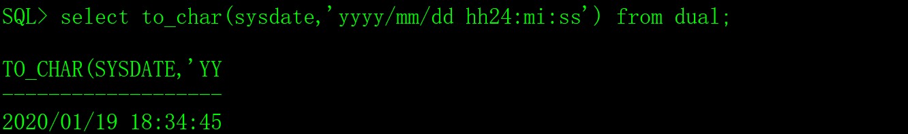

 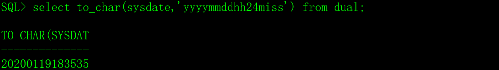

 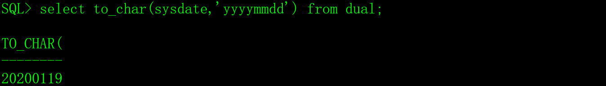

 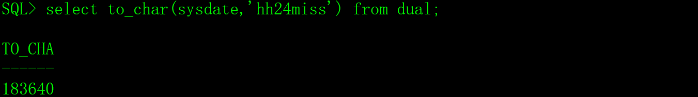

# 二、把字符串转换时间

to_date函数把字符串转换成时间，一般用于insert、update和where之后的条件中的时间输入，语法如下：

```sql
to_date(字符串表示的时间,格式)
```

时间格式用字符串来表达，与to_char函数相同。

先创建一个用于测试的表tt。

```sql
create table tt ( c1 date);
```

举列：

 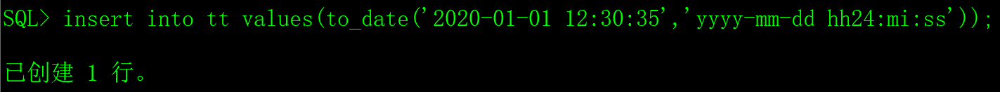

 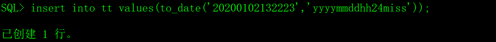

 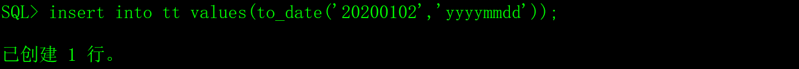

 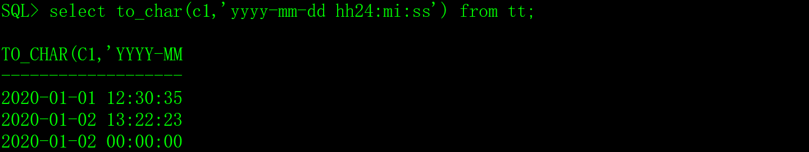

在update语句中把字符串转换为时间。

 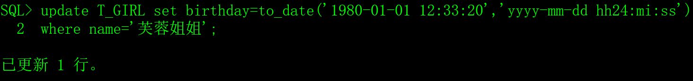

在where条件中把字符串转换为时间。

 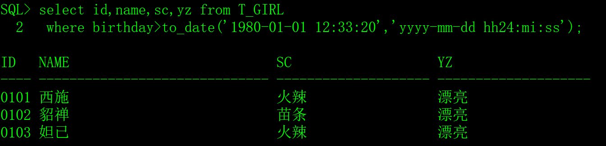

# 三、时间运算

Oracle数据库提供了多种对时间加减的计算方法。

为了方便时间的显示，先设置好NLS_DATE_FORMAT环境变量，这个环境变量的用法在本文的“四、时间环境变量”章节中介绍。

```sql
export NLS_DATE_FORMAT="yyyy-mm-dd hh24:mi:ss"
```

## 1、直接加减

可以在时间上进行加减一个小数（单位是天）得到一个新的时间。

1）取当前时间和一天后的时间。

 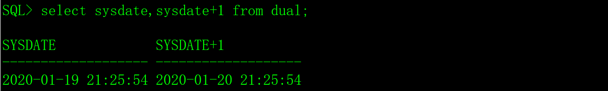

2）取当前时间和一小时后的时间。

 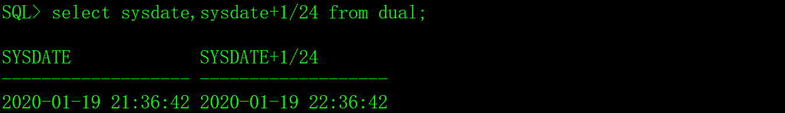

3）获取当前时间和一秒后的时间。

 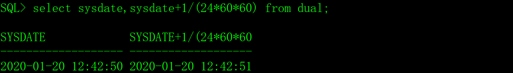

## 2、add_months函数

对时间直接加减的方式不用于月的加减，因为每月的天数不一样，例如2020-01-01，加上30天之后是2020-01-31，不是2020-02-01。如果希望把时间加上一个完整的月（不论月的大小），可以用add_months函数。

 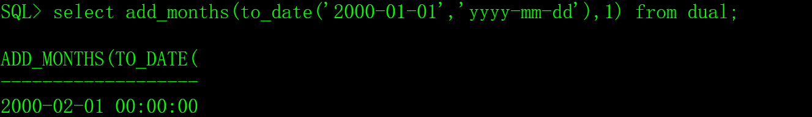

 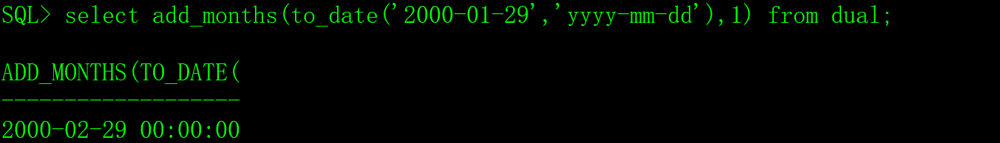

 

 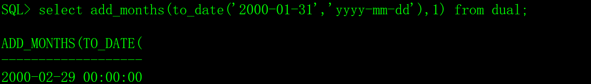

 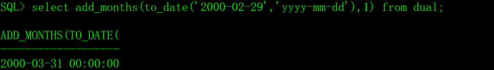

从上面的例子可以看出，月有大有小：1）如果下月的天小于本月的天，add_months后取下月的最后一天；2）本月的最后一天加上一个月，就是下个月的最后一天。

## 3、last_day函数

last_day函数得到时间所属月份最后一天的时间。

 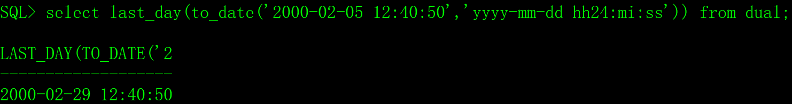

## 4、其它的时间函数

Oracle还提供了其它的时间计算的函数，如`months_between`、`next_day`、`numtodsinterval`和`numtoyminterval`等，在我看来，这些函数很烦人，实在没有意义，就不介绍了。

# 四、时间环境变量

NLS_DATE_FORMAT环境变量指定时间的输入和输入格式，如果字符串的格式与NLS_DATE_FORMAT指定的格式相同，Oracle可以自动转换，不需要to_char和to_date函数。

```sql
export NLS_DATE_FORMAT="yyyy-mm-dd hh24:mi:ss"
```

 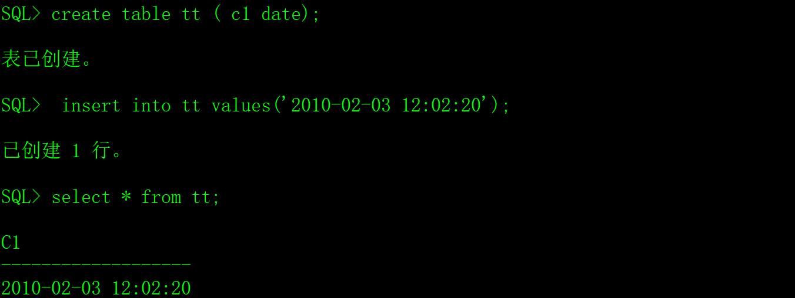

```sql
export NLS_DATE_FORMAT="yyyymmddhh24miss"
```

 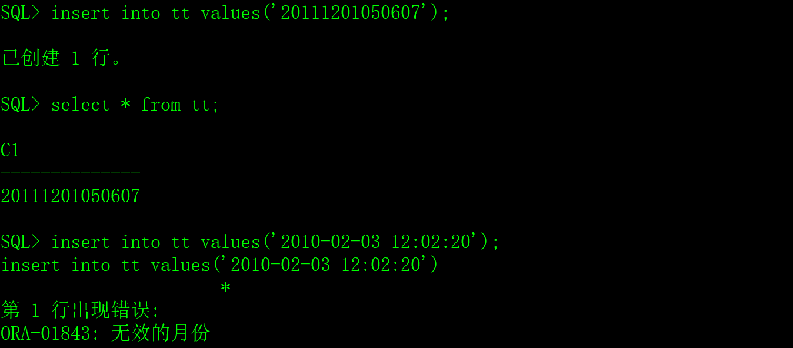

从上图的运行结果看出，修改NLS_DATE_FORMAT环境变量后，如果输入的时间格式不符，Oracle无法识别。

