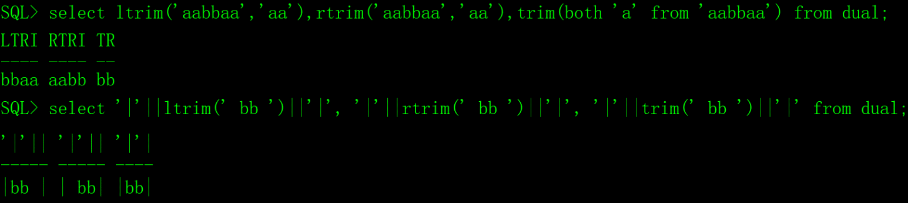

# 一、Oracle的函数

Oracle提供了很多函数用于数据的处理、统计和转换，这些函数增强了SQL语言的功能。

Oracle的函数分为单行函数、聚合函数和分析函数三大类。

## 1、单行函数

单行函数应用于SQL语句中时，只能输入一个数据，返回一个结果，常用的单行函数包括字符串函数、数字函数、时间函数、转换函数。

## 2、聚合函数

聚合函数应用于SQL语句中时，同时对多行数据进行操作，返回一个结果，例如求结果集的记录数、最小值、最大值、平均值、统计值等。

## 3、分析函数

分析函数用于计算基于分组的某种聚合值，它和聚合函数的不同之处是对于每个组返回多行，而聚合函数对于每个组只返回一行。

分析函数的应用场景比较少，概念难以理解，本文就不介绍了。

# 二、字符串函数

字符串函数接受字符串参数，参数可以是表中的列名，也可以是字符串表达式或字符串常量。

## 1、ASCII码转换ascii和chr

**ascii(str)**：返回字符串str第一个字符的ASCII码值。

**chr(ii)**：返回ASCII码为数字ii的字符。

​                    

## 2、字符串拼接concat

**concat(str1,str2)**：把字符串str1和str2拼接成一个字符串，在实际应用中，我们更愿意用||拼接字符串，因为||可以拼接多个字符串。

 

## 3、字符串查找instr

**instr(str1,str2,start,n)**：在字符串str1中查找str2。

start：从str1的哪个位置开始查找，可选参数，缺省为1。如果start为正数，从左到右查找，如果start为负数，从右到左查找。

n表示要查找第几次出现的str2，可选参数，缺省为1，如果为负数系统会报错。

 

## 4、字符串的长度length

**length** **(str)**：返回字符串str的长度。

 

## 5、字符串大小写转换lower和upper

**lower (str)**：把字符串str转换为小写，忽略不是字母的字符。

**upper (str)**：把字符串str转换为大写，忽略不是字母的字符。

 

## 6、截去字符串ltrim、rtrim和trim

**ltrim(str1,str2)**：从字符串str1的左边截去字符串str2，str2是可选参数，缺省为空格。

**rtrim(str1,str2)**：从字符串str1的右边截去字符串str2，str2是可选参数，缺省为空格。

**trim(leading|trailing|both chr from str)**：从str中截去**左侧|右侧|两侧**的chr字符，缺省是both（两侧），注意，chr是单个字符，不是字符串，缺省是空格。

 

## 7、字符串替换replace

**replace(str,old,new)**：把字符串str中的old字符串替换成new字符串。

 

## 8、字符串截取substr

**substr(str,start,len)**：从字符串str的start位置开始，截取len个字符，如果len不填就截取start之后全部的字符。

 

## 9、字符串补齐lpad的rpad

lpad(str,len,[chr])，从左边补齐。

rpad(str,len,[chr])，从右边补齐。

str：待补齐的原字符串。

len：最终返回的字符串的长度，如果最终返回的字符串的长度比源字符串的小，那么此函数将对源串进行截断处理。

chr：用于填充的字符，缺省为空字符。

 

# 三、数字函数

数字函数接受数字参数，参数可以是表中的列名，也可以是数字表达式或数字常量。

| **函数**   | **说明**                                         | **示例**                              |
| ---------- | ------------------------------------------------ | ------------------------------------- |
| abs(x)     | x绝对值。                                        | abs(-10)=10                           |
| cos(x)     | 余弦。                                           | cos(1)= 0.540302306                   |
| acos(x)    | x的反余弦。                                      | acos(1)=0                             |
| ceil(x)    | 大于或等于x的最小整数。                          | ceil(3.14)=4                          |
| floor(x)   | 小于或等于x的最大整数。                          | floor(3.14)=3                         |
| log(x,y)   | x为底y的对数。                                   | log(2,4)=2                            |
| mod(x,y)   | x除以y的余数。                                   | mod(7,3)=1                            |
| power(x,y) | x的y次幂。                                       | power(2,4)=16                         |
| round(x,y) | x在第y小数位四舍五入。                           | round(3.1415,3)=3.142                 |
| sign(x)    | 判断x的值，大于0返回1，等于0返回0，小于0返回-1。 | sign(100)=1、sign(0)=0、sign(-100)=-1 |
| sqrt(x)    | x的平方根。                                      | sqrt(9)=3                             |
| trunc(x,y) | x在第y位截断。                                   | trunc(3.14159,3)=3.141                |

补充说明：

1）round函数

- round(x[,y])，四舍五入函数。
- y的缺省值0，例如：round(3.14)=3、round(3.56)=4。
- y是正整数，四舍五入到小数点后y位，例如：round(3.14159,3)=3.142。
- y是负整数，四舍五入到小数点左边y位，round(314.159,-2)=300。

 2）trunc函数

- trunc(x[,y])，直接截断，不四舍五入。
- y的缺省值0，例如：trunc(3.14)=3。
- y是正整数，小数点y位后截断，trunc(3.141592,3)=3.141。
- y是负整数，小数点y位前截断。trunc(314.159,-2)=300。

# 四、时间函数

Oracle的时间函数极其重要，在《Oracle时间函数》文章中有详细的说明。

# 五、转换函数

Oracle的数据类型转换主要有三种：1）时间与字符串；2）rowid与字符串；3）数字与字符串。

## 1、时间和字符串之间的转换

时间与字符串的转换用to_date和to_char函数完成，在《Oracle时间函数》文章中有详细的说明。

## 2、rowid和字符串之间的转换

Oracle数据库能隐式的在rowid和字符串之间的转换。

## 3、数字和字符串之间的转换

Oracle数据库能隐式的在数字和字符串之间的转换，但是要注意几个问题：

1）任意数字都可以转换成字符串。

 

2）只有包含了合法数字的字符串才能转换为数字，否则提示错误。

 

 

3）空字符串转换为数字后是null，不是0，这个特点太棒了。

 

还有，Oracle提供了to_number函数把字符串转换为数字，to_number支持多种格式，用法比较复杂，不建议使用。

# 六、其它的单行函数

## 1、nvl函数

```sql
NVL2(x,value)

如果x为空，返回value，否则返回x。

示例，运行以下脚本生成测试数据：

create table tt(name varchar2(20),age number(3));

insert into tt values('西施',20);

insert into tt values('杨玉环',null);

insert into tt values(null,18);

select nvl(name,'匿名美女'),nvl(age,0) from tt;

 
```


## 2、decode函数

```sql
decode(条件,值1,返回值1,值2,返回值2,......,值n,返回值n,缺省值)
```

该函数的含义如下：

```sql
if (条件==值1) return 返回值1;

else if (条件==值2) return 返回值2;

else if (条件==值3) return 返回值3;

 ......

else return 缺省值;

示例，运行以下脚本生成测试数据：

create table tt(name varchar2(20),yz number(1),sc number(1));

insert into tt values('西施',1,2);

insert into tt values('杨玉环',2,1);

insert into tt values('夏姬',3,3);

insert into tt values('芙蓉姐姐',4,4);

select name,decode(yz,1,'漂亮',2,'可爱',3,'狐媚','不合格'),decode(sc,1,'丰满',2,'火辣',3,'苗条','不及格') from tt;
```

 

## 3、userenv函数

userenv(string)，获取当前用户会话的信息。

string的取值如下： 

isdba，如果用户已经被认证为DBA或者是通过操作系统或口令文件具有DBA特权的，返回TRUE，否则返回FALSE。

language，返回数据库当前会话的语言、地域和字符集。

lang，返回ISO缩写语言名称，一个比现有的“语言”参数较短的形式。

sid ，返回数据库会话ID。

terminal，返回当前会话的终端操作系统的标识符。在分布式SQL语句，此参数返回了标识符为本地会话。在分布式环境中，此参数只支持远程SELECT语句，不用于远程INSERT，UPDATE或DELETE操作。

sessionid，返回审计会话标识符，在分布式SQL语句不能指定此参数。

client_info，返回最高可达64个字节存储的用户会话信息，可由应用程序使用DBMS_APPLICATION_INFO包。

entryid，返回当前审计条目编号，审计的EntryID序列细粒度的审计记录和定期审计记录之间共享，在分布式SQL语句不能使用这个属性。

测试一下比较常用的几个参数：

 

## 4、user函数

查看当前会话的用户名。

 

# 七、聚合函数

聚合函数也叫分组函数或集合函数，它对多行记录中的某个列执行计算并返回一个值。

聚合函数经常与 select 语句的 group by 子句一同使用，所以有的时候也把它称之为分组函数。

## 1、分组函数


| **函数**    | **说明**   | **示例**                       |
| ----------- | ---------- | ------------------------------ |
| min(x)      | 求最小值。 | select min(sal) from EMP;      |
| max(x)      | 求最大值。 | select max(sal) from EMP;      |
| avg(x)      | 求平均值。 | select avg(sal) from EMP;      |
| sum(x)      | 求合计值。 | select sum(sal) from EMP;      |
| count(*)    | 求记录数。 | select count(*) from EMP;      |
| stddev(x)   | 求标准差。 | select stddev(sal) from EMP;   |
| variance(x) | 求协方差。 | select variance(sal) from EMP; |
| median(x)   | 求中位数。 | select median(sal) from EMP;   |

stddev(x)、variance(x)、median(x)这三个函数极少使用。

## 2、空值处理

有一点需要注意的是，除了count函数，其它的分组函数均会忽略值为null的列，这个特点极其重要，一定要记住它。

我们来测试一下，先生成测试数据：

```sql
create table tt(cc number(3));

insert into tt values(10);

insert into tt values(20);

insert into tt values(null);

select min(cc),max(cc),avg(cc),sum(cc),count(*) from tt;
```

 

注意，表中一共有三条数据，两条非空记录，一条空记录，avg函数得到的结果是(10+20)/2=15，忽略了空值记录，min、max、sum函数表面看不出来，但我们知道它们会忽略空值。

count函数不会忽略空值记录，除非指定列名，例如：

 

## 3、group by子句

group by子句的意思就是按一定的规则进行分组，把数据集划分成若干个子集，然后针对若干个子集进行数据统计，group by子句要与分组函数结合使用，否则没有意义。

1）对全部的员工进行统计

```sql
select min(sal),max(sal),avg(sal),sum(sal),count(*) from EMP;
```

 

2）按部门分类（组）统计

```sql
select deptno,min(sal),max(sal),avg(sal),sum(sal),count(*) from EMP group by deptno;
```

 

在上面的示例中，select的字段列表中有deptno，那么在group by后面一定也要有deptno，否则会出现语法错误。

```sql
select deptno,min(sal),max(sal),avg(sal),count(*) from EMP;
```

 

但是，在group by中有deptno，select的字段列表中可以没有deptno，不会出现语法错误，但这种用法很少。

```sql
select min(sal),max(sal),avg(sal),sum(sal),count(*) from EMP group by deptno;
```

 

3）按部门和职位分类（组）统计

```sql
select deptno,job,avg(sal),count(*) from EMP group by deptno,job;
```

 

4）where子句一定要在group by子句之前，where子句中不能使用分组函数。

```sql
select deptno,avg(sal),count(*) from EMP where deptno in (20,30) group by deptno;
```

 

```sql
select deptno,avg(sal),count(*) from EMP group by deptno where deptno in (20,30);
```

 

```sql
select deptno,avg(sal),count(*) from EMP where avg(sal)>1000;
```

 

## 4、having子句

having 子句对 group by统计出来的结果进行筛选，语法与 where 类似，但 having可以包含分组函数。

1）先按部门分组统计

```sql
select deptno,avg(sal),count(*) from EMP group by deptno;
```

 

2）从统计结果中筛选人数>=5的记录。

```sql
select deptno,avg(sal),count(*) from EMP group by deptno having count(*)>=5;
```

 

3）从统计结果中筛选平均公司超过两千并且部门代码等于20的记录。

```sql
select deptno,avg(sal),count(*) from EMP group by deptno having avg(sal)>2000 and deptno=20;
```

 

# 八、应用经验

本文介绍了Oracle常用的函数和用法，还有少部分的函数没有介绍，并不是我偷懒，而是没有必要。

数据库提供函数的目的是为了增强SQL语言的功能，但是我的看法有些不同，从一个程序员的视角，说说我的看法：

1）手工处理数据的时候，在SQL中使用函数确实可以扩展SQL的功能，我也经常这么做；

2）不同数据库提供的函数名、参数和功能有差异，从软件项目的兼容性方面考虑，应用程序中能不用函数就不用函数。

3）在实际开发中，时间转换函数（to_date和to_char）不得不用，但是，我在freecplus框架中已做了兼容性处理。

4）分组函数也不得不用，包括min、max、avg、sum、count，幸运的是不同的数据库基本上兼容，只是细节上也有点差别，不兼容功能的不建议使用。

了解一些常用的、不同数据库能通用的函数即可。