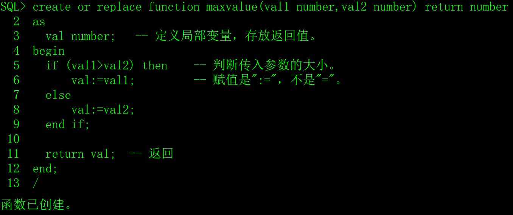
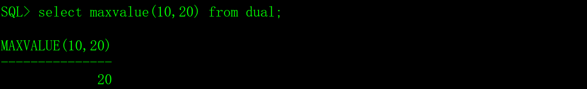

在Oracle数据库中，为了实现特定的功能，可以自定义函数，就像C/C++语言，除了系统的库函数，程序员还会编写很多自定义的函数。

# 一、函数的创建、调用和权限

## 1、创建函数

```sql
create or replace function 函数名(参数1 模式 数据类型,......) return 数据类型

as

 -- 定义局部变量。

 变量1 数据类型;

 ......

begin

 -- 实现函数功能的PL/SQL代码。

 ......

 exception

 -- 异常处理的PL/SQL代码。

 ......

end;

/
```

1）参数的模式有三种：

**in**：只读模式，在函数中，参数只能被引用/读取，不能改变它的值。

**out**：只写模式，参数只能被赋值，不能被引用/读取。

**in out**：可读可写。

参数的模式可以不写，缺省为in，out和in out两种模式极少使用。

2）as/is二选一，在这里没有区别。

3）可以不定义局部变量。

4）可以没有异常（exception）处理代码段。

示例，创建自定义函数maxvalue，用于比较两个数字的大小，返回较大值：

```sql
create or replace function maxvalue(val1 number,val2 number) return number

as

 val number;  -- 定义局部变量，存放返回值。

begin

 if (val1>val2) then  -- 判断传入参数的大小。

   val:=val1;     -- 赋值是":="，不是"="。

 else

   val:=val2;

 end if;

 

 return val; -- 返回

end;

/
```

​                               

## 2、函数的调用

自定义函数的调用与Oracle数据库自带的函数调用的方法相同。

 

## 3、函数的权限

自定义函数是数据库对象，Oracle对它权限管理方式与其它数据库对象相同。

如果maxvalue函数是用scott用户创建的，其它用户调用时需要加scott用户名前缀，并且具备相应的权限，否则会出现“ORA-00904: "MAXVALUE": 标识符无效”的错误。

# 二、删除自定义函数

```sql
drop function 函数名;
```

例如：

```sql
drop function maxvalue;
```

# 三、应用经验

数据库的自定义函数不会像编程语言的函数那样广泛的应用，和编程语言相比，数据库的自定义函数实在太麻烦，很啰嗦，难以调试，数据库自定义函数能做到的功能编程语言都能做到。

我使用自定义函数的目的只有一个，就是解决不同数据库的兼容性问题，例如序列生成器，Oracle、MySQL和PostgreSQL的调用方法各不同，那么我们可以编写自定义函数，在不同的数据库中，函数名和参数完全相同，函数体代码不同，这样就可以解决软件的兼容性问题。