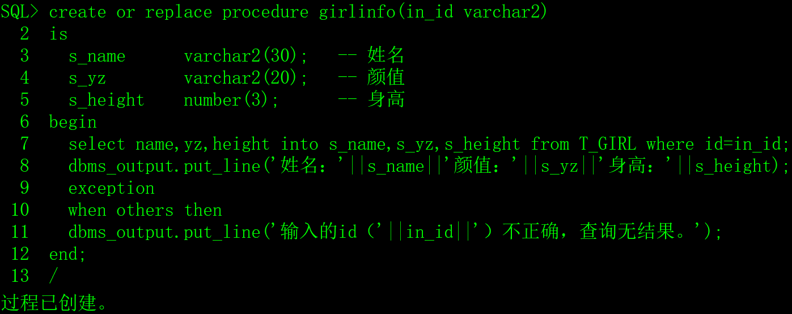
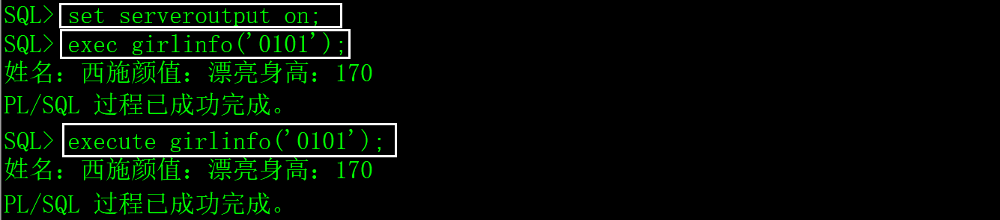
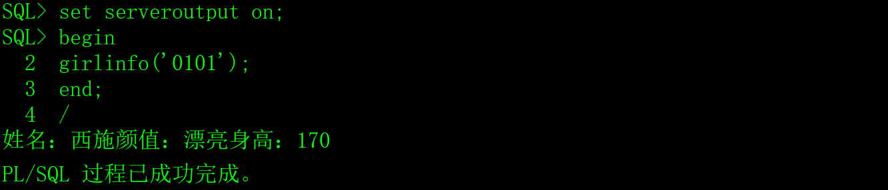

# 一、存储过程的概念

存储过程（stored procedure）是Oracle数据库中为了完成某功能的PL/SQL代码集，就像没有返回值的自定义函数。

# 二、存储过程的创建、调用和权限

## 1、创建存储过程

```sql
create or replace procedure 存储过程名(参数1 模式 数据类型,......)

as/is

 -- 定义局部变量

 变量1 数据类型;

 ......

begin

 -- 实现存储过程功能的PL/SQL代码。

 ......

 exception

 -- 异常处理的PL/SQL代码。

 ......

end;

/
```


1）参数的模式有三种：

**in**：只读模式，在函数中，参数只能被引用/读取，不能改变它的值。

**out**：只写模式，参数只能被赋值，不能被引用/读取。

**in out**：可读可写。

参数的模式可以不写，缺省为in，out和in out两种模式极少使用。

2）as/is二选一，在这里没有区别。

3）可以不定义局部变量。

4）可以没有异常（exception）处理代码段。


示例：

1）生成测试数据，脚本如下：

```sql
create table T_GIRL

(

 id    char(4)     not null,  -- 编号

 name   varchar2(30)  not null,  -- 姓名

 yz    varchar2(20)    null,  -- 颜值

 sc    varchar2(20)    null,  -- 身材

 weight  number(4,1)   not null,  -- 体重

 height  number(3)    not null,  -- 身高

 birthday date      not null,  -- 出生时间

 memo   varchar2(1000)   null  -- 备注

);

insert into T_GIRL(id,name,yz,birthday,sc,weight,height,memo)

 values('0101','西施','漂亮',to_date('2000-01-01 01:12:35','yyyy-mm-dd hh24:mi:ss'),

​     '火辣',48.5,170,'这是一个非常漂亮姑娘，老公是夫差，男朋友是范蠡。');

insert into T_GIRL(id,name,yz,birthday,sc,weight,height,memo)

 values('0102','貂禅','漂亮',to_date('1997-08-02 12:20:38','yyyy-mm-dd hh24:mi:ss'),

​     '苗条',45.2,168,'王允真不是男人，干不过董卓就把美人往火坑里推，千古罪人啊。');

insert into T_GIRL(id,name,yz,birthday,sc,weight,height,memo)

 values('0103','妲已','漂亮',to_date('1998-03-03 10:50:33','yyyy-mm-dd hh24:mi:ss'),

​     '火辣',53.6,172,'如果商真的因我而亡，您们男人做什么去了？');
```


2）创建存储过程girlinfo，传入超女id参数，显示超女的基本信息。

```sql
create or replace procedure girlinfo(in_id varchar2)

is

 s_name   varchar2(30);  -- 姓名

 s_yz    varchar2(20);  -- 颜值

 s_height  number(3);   -- 身高

begin

 select name,yz,height into s_name,s_yz,s_height from T_GIRL where id=in_id;

 dbms_output.put_line('姓名：'||s_name||'颜值：'||s_yz||'身高：'||s_height);

 exception              

 when others then

 dbms_output.put_line('输入的id（'||in_id||'）不正确，查询无结果。');

end;              

/
```

​                               

## 2、存储过程的调用

1）直接执行

```sql
exec 存储过程名(参数,……);

execute 存储过程名(参数,……);
```

例如：

在上面创建的存储过程中用到了dbms_output，在sqlplus中要先执行set serveroutput on;才能输出内容。

 

2）在PL/SQL过程中调用

 

## 3、存储过程的权限

存储过程是数据库对象，Oracle对它权限管理方式与其它数据库对象相同。

如果getinfo函数是用scott用户创建的，其它用户调用时需要加scott用户名前缀，并且具备相应的权限，否则会出现“PLS-00201: 必须声明标识符 'GIRLINFO'”的错误。

# 三、删除存储过程

drop procedure 存储过程名;

例如：

drop procedure girlinfo;

# 四、PL/SQL语言

[PL/SQL](https://baike.baidu.com/item/PL%2FSQL)是一种程序语言，叫做过程化SQL语言（Procedural Language/SQL）包括一整套的数据类型、条件结构、循环结构和异常处理结构，PL/SQL可以执行SQL语句，SQL语句中也可以使用PL/SQL函数。

PL/SQL是[Oracle数据库](https://baike.baidu.com/item/Oracle数据库)对SQL语句的扩展，在普通SQL语句的使用上增加了编程语言的特点，所以PL/SQL把数据操作和查询语句组织在PL/SQL代码的过程性单元中，通过逻辑判断、循环等操作实现复杂的功能或者计算。

# 五、应用经验

关于存储过程的优缺点，本人查找了一些资料，以下文字来源于百度百科。

## 1、存储过程的优点

1）重复使用：存储过程可以重复使用，从而可以减少数据库开发人员的工作量。

2）存储过程位于服务器上，调用的时候只需要传递存储过程的名称以及参数就可以了，因此降低了网络传输的数据量。

3）参数化的存储过程可以防止SQL注入式攻击，而且可以将Grant、Deny以及Revoke权限应用于存储过程，提高了安全性。

4）存储过程只在创造时进行编译，以后每次执行存储过程都不需再重新编译，而一般SQL语句每执行一次就编译一次,所以使用存储过程可提高数据库执行速度。

## 2、存储过程的缺点

1）调试麻烦，但是用 PL/SQL Developer 调试很方便！弥补这个缺点。

2）移植问题，数据库端代码当然是与数据库相关的。但是如果是做工程型项目，基本不存在移植问题。

3）重新编译问题，因为后端代码是运行前编译的，如果带有引用关系的对象发生改变时，受影响的存储过程、包将需要重新编译（不过也可以设置成运行时刻自动编译）。

4）如果在一个程序系统中大量的使用存储过程，到程序交付使用的时候随着用户需求的增加会导致数据结构的变化，接着就是系统的相关问题了，最后如果用户想维护该系统可以说是很难很难、而且代价是空前的，维护起来更麻烦。

## 3、我的看法

1）存储过程不会有任何性能的优势。

2）调用远程存储过程减少网络流量的说活太牵强，并且，调用远程存储过程的风险很大。

3）存储过程不能减少开发的工作量，PL/SQL也是一种开发语言，对开发者来说，要付出学习成本。

4）存储过程的调试、重新编译、兼容、维护等问题，任何一项都是很麻烦。

存储过程没有任何优点，作为一个程序员，我从来不用存储过程，大家对于这方面的知识了解即可，不必深入学习。

# 六、Oracle的包

PL/SQL为了满足程序模块化的需要，引入了包的构造，把存储过程、函数组合起来就成了包，通过使用包就可以分类管理存储过程和函数。有点类似C++中的命名空间。存储过程的应用场景已经很少，包就更少了。