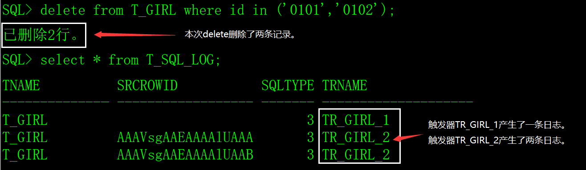
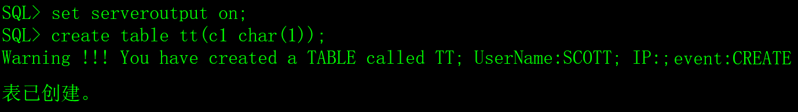
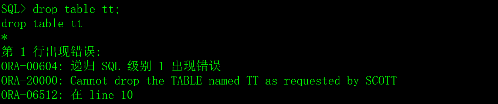
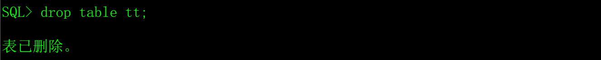

# 一、触发器的概念

触发器是Oracle数据库的对象，类似存储过程和函数。存储过程和函数需要用户显示调用才执行，而触发器是由一个事件来触发运行，当某个事件发生时会自动地隐式运行，不能被显示的调用。

触发器的本质是存储过程，发生特定事件时Oracle会执行触发器中的代码，它的组成可以分为三个部分：1）触发器执行的条件，即触发器被触发的事件；2）执行触发器的时间，发生事件之前（before）或发生事件之后（after）；3）触发器要做的事情，就是触发器被触发以后具体想执行的任务（PL/SQL语句块）。

Oracle的触发器分为DML触发器、DDL触发器、替代触发器和系统触发器。

# 二、DML触发器

基于DML操作的触发器，细分又可以分为行触发器和语句触发器。

## 1、语句触发器

DML操作（insert、delete、update），不管SQL语句影响的记录是多少行，触发器只触发一次。

## 2、行级触发器

DML操作（insert、delete、update），SQL语句影响了多少行记录，触发器就触发多少次。

行级触发器用for each row关键字。

## 3、DML触发器语法

```sql
create [or replace] trigger 用户名.触发器名

​    {before|after}    

​    {delete|insert|update|[of列名]}

​    on 表名

​    [for each row [when 条件]]

declare

 定义变量。

begin

 PL/SQL语句块。             

end;
```

参数说明：

{before|after}：指定触发器是在对表的操作发生之前触发还是之后触发。

{delete|insert|update|[of列名]}：触发在动作，可以指定多个动作，例如：insert or update。如果是update，update of 指定一个或多个字段，仅在这些字段被更新时才会触发。update of的应用场景极少。

[for each row]：表示是行级触发器。

[when 条件]：只有满足when指定的条件，才会执行触发体中的代码，应用场景极少。

## 4、触发器谓词

1）创建超女基本信息表T_GIRL，插入5条测试数据。

old谓词：执行前的字段的值的名称，比如update一个表时，使用:old.columnname是指执行update操作之前的列的值。

new谓词：执行后的字段的值的名称，比如update一个表时，使用:new.columnname是指执行 update操作之后的列的值。

可以在触发器体的语句块中使用 inserting、updating、deleting谓词，这些谓词会返回相应的DML操作的布尔值，如果为true，则表示执行了相应的insert、update、delete操作。

## 5、示例

1）准备测试数据，创建超女基本信息表T_GIRL，插入5条测试数据。

```sql
drop table T_GIRL;

create table T_GIRL

(

 id    char(4)     not null,  -- 编号

 name   varchar2(30)  not null,  -- 姓名

 primary key(id)            -- 指定id为表的主键

);

insert into T_GIRL(id,name) values('0101','西施');

insert into T_GIRL(id,name) values('0102','貂禅');

insert into T_GIRL(id,name) values('0103','妲已');

insert into T_GIRL(id,name) values('0104','芙蓉姐姐');

insert into T_GIRL(id,name) values('0105','神密猫女');
```


2）创建SQL日志表。

```sql
drop table T_SQL_LOG;

create table T_SQL_LOG

(

 tname  varchar2(10),    -- 原表的表名。

 srcrowid rowid,        -- 原表rowid。

 sqltype number(1),      -- SQL语句的类型：1-insert、2-update、3-delete。

 trname varchar2(10)     -- 触发器名。

);
```


3）创建语触发器TR_GIRL_1，如果对T_GIRL表做了insert、update和delete操作，把操作记录在T_SQL_LOG表中。

```sql
create or replace trigger TR_GIRL_1

 before update or delete or insert

 on T_GIRL

begin

 if inserting then

  insert into T_SQL_LOG(tname,srcrowid,sqltype,trname) values('T_GIRL',null,1,'TR_GIRL_1');

 end if;

 if updating then

  insert into T_SQL_LOG(tname,srcrowid,sqltype,trname) values('T_GIRL',null,2,'TR_GIRL_1');

 end if;

 if deleting then

  insert into T_SQL_LOG(tname,srcrowid,sqltype,trname) values('T_GIRL',null,3,'TR_GIRL_1');

 end if;

end;

/
```


4）创建行级语触发器TR_GIRL_2，如果对T_GIRL表做了insert、update和delete操作，把每一行的操作记录在T_SQL_LOG表中。

```sql
create or replace trigger TR_GIRL_2

 before update or delete or insert

 on T_GIRL for each row

begin

 if inserting then

  insert into T_SQL_LOG(tname,srcrowid,sqltype,trname) values('T_GIRL',:new.rowid,1,'TR_GIRL_2');

 end if;

 if updating then

  insert into T_SQL_LOG(tname,srcrowid,sqltype,trname) values('T_GIRL',:new.rowid,2,'TR_GIRL_2');

 end if;

 if deleting then

  insert into T_SQL_LOG(tname,srcrowid,sqltype,trname) values('T_GIRL',:old.rowid,3,'TR_GIRL_2');

 end if;

end;

/
```


5）执行一条delete语句，从T_GIRL表中删除两行记录。

```sql
delete from T_GIRL where id in ('0101','0102');
```

6）查看T_SQL_LOG表中的结果。

​                               

# 三、DDL触发器

当执行DDL语句时会被触发。按照作用范围，分为schema trigger,database trigger。schema trigger作用在一个用户上，database trigger作用在整个数据库所有用户上。

常用的DDL操作有：grant（授权），revoke（撤销授权），create（创建），drop（删除），alter（修改），comment（注释），audit（审核），rename（重命名）等。

## 1、DDL触发器语法

```sql
create [or replace] trigger 用户名.触发器名

​    {before|after} {DDL事件} on {database|schema}

​    [when 条件]

declare

 定义变量。

begin

 PL/SQL语句块。

end;
```

参数说明：

{before|after}：触发器是在DDL事件之前、之后触发。

{database|schema}：作用在一个用户上，还是全部的用户。

[when 条件]：只有满足when指定的条件，才会执行触发体中的代码，应用场景极少。

## 2、DDL事件

| DDL事件                  | 触发时机                                             |
| ------------------------ | ---------------------------------------------------- |
| DDL                      | 列表中所用的事件都会触发。                           |
| ALTER                    | 对数据库中的任何一个对象使用SQL的ALTER命令时触发。   |
| ANALYZE                  | 对数据库中的任何一个对象使用SQL的ANALYZE命令时触发。 |
| ASSOCIATE STATISTICS     | 统计数据关联到数据库对象时触发。                     |
| AUDIT                    | 通过SQL的AUDIT命令打开审计时触发。                   |
| COMMENT                  | 对数据库对象做注释时触发。                           |
| CREATE                   | 通过SQL的CREATE命令创建数据库对象时触发。            |
| DISASSOCIATE  STATISTICS | 去掉统计数据和数据库对象的关联时触发。               |
| DROP                     | 通过SQL的DROP命令删除数据库对象时触发。              |
| GRANT                    | 通过SQL的GRANT命令赋权时触发。                       |
| NOAUDIT                  | 通过SQL的NOAUDIT关闭审计时触发。                     |
| RENAME                   | 通过SQL的RENAME命令对对象重命名时触发。              |
| REVOKE                   | 通过SQL的REVOKE语句撤销授权时触发。                  |
| TRUNCATE                 | 通过SQL的TRUNCATE语句截断表时触发。                  |

## 3、可用属性

| 函数名                       | 返回值                                                  |
| ---------------------------- | ------------------------------------------------------- |
| ORA_CLIENT_IP_ADDRESS        | 客户端IP地址。                                          |
| ORA_DATABASE_NAME            | 数据库名称。                                            |
| ORA_DES_ENCRYPTED_PASSWORD   | 当前用户的DES算法加密后的密码。                         |
| ORA_DICT_OBJ_NAME            | 触发DDL的数据库对象名称。                               |
| ORA_DICT_OBJ_NAME_LIST       | 受影响的对象数量和名称列表。                            |
| ORA_DICT_OBJ_OWNER           | 触发DDL的数据库对象属主。                               |
| ORA_DICT_OBJ_OWNER_LIST      | 受影响的对象数量和名称列表。                            |
| ORA_DICT_OBJ_TYPE            | 触发DDL的数据库对象类型。                               |
| ORA_GRANTEE                  | 被授权人数量。                                          |
| ORA_INSTANCE_NUM             | 数据库实例数量。                                        |
| ORA_IS_ALTER_COLUMN          | 如果操作的参数column_name指定的列，返回true,否则false。 |
| ORA_IS_CREATING_NESTED_TABLE | 如果正在创建一个嵌套表则返回true,否则false。            |
| ORA_IS_DROP_COLUMN           | 如果删除的参数column_name指定的列，返回true,否则false。 |
| ORA_LOGIN_USER               | 触发器所在的用户名。                                    |
| ORA_PARTITION_POS            | SQL命令中可以正确添加分区子句位置。                     |
| ORA_PRIVILEGE_LIST           | 授予或者回收的权限的数量。                              |
| ORA_REVOKEE                  | 被回收者的数量。                                        |
| ORA_SQL_TXT                  | 触发了触发器的SQL语句的行数。                           |
| ORA_SYSEVENT                 | 导致DDL触发器被触发的时间。                             |
| ORA_WITH_GRANT_OPTION        | 如果授权带有grant选项，返回true。否则false。            |

## 4、示例

限制scott用户的DLL操作，创建数据库对象时发出警告，删除数据库对象时阻止。

1）创建触发器

```sql
create or replace trigger scott.no_drop

 before ddl on schema

begin

 if ora_sysevent='CREATE' then

  dbms_output.put_line('Warning !!! You have created a '||

​             ORA_DICT_OBJ_TYPE||' called '||

​             ORA_DICT_OBJ_NAME|| '; UserName:'||

​             ORA_DICT_OBJ_OWNER||'; IP:'||

​             ORA_CLIENT_IP_ADDRESS||'; event:'||

​             ORA_SYSEVENT);

 elsif ora_sysevent='DROP' then

  RAISE_APPLICATION_ERROR(-20000,'Cannot drop the '||

​              ORA_DICT_OBJ_TYPE||' named '||

​              ORA_DICT_OBJ_NAME ||' as requested by '||

​              ORA_DICT_OBJ_OWNER);

 end if;

end;

/
```


2）测试触器（创建表），用scott用户登录。

在上面创建的触发器中用到了dbms_output，在sqlplus中要先执行set serveroutput on;才能输出内容。

 

3）测试删除表，用scott用户登录。

 

4）测试删除表，用DBA用户登录，no_drop触发器只限scott用户，不限制其它用户。

 

# 四、替代触发器

DML触发器只能应用在表上。而替代触发器只能定义在视图上。当对一个不能修改的视图进行数据的修改时，或者要修改视图中的某个嵌套表时，可以使用替代触发器。

替代触发器，又称为instead of触发器，它会替代原来的数据操作语句的执行，更改为使用在触发器中定义的语句来执行数据操作。一些简单的单表视图，可以直接insert、update，但如果要对复杂的视图进行insert、update，可以通过替代触发器，将这些DML语句对视图的更改替换为对基表的 DML操作。

替代触发器的应用场景极少，我个人认为完全没有必要这么麻烦，所以就只介绍一下它的概念。

# 五、系统触发器

系统触发器是由Oracle数据库系统事件所触发的触发器，共有六个数据库事件触发器：startup、shutdown、logon、logoff、servererror和db_role_change。

如果我们需要记录用户登陆系统的信息，或在系统启动或用户登陆后对数据库进行一些设置，可以用系统触发器来实现。

创建系统触发器的语法：

```sql
create [or replace] trigger 用户名.触发器名

​    {before|after} {数据事件}

​    on {database|schema}

declare

 定义变量。

begin

 PL/SQL语句块。

end;
```


## 1、数据库启动（startup）

数据库打开时（alter database open）触发，没有before startup触发器。

## 2、数据库关闭（shutdown）

数据库正常关闭时触发，没有after shutdown 触发器。

只有在正常关闭情况下，shutdown nomal或者shutdown immediate时触发，非正常关闭shutdown abort不能触发。

## 3、新建会话（logon）

当开始一个数据库会话时触发，没有before logon触发器。

## 4、注销会话（logoff）

当一个数据库会话正常终止时触发，没有after logoff触发器。

## 5、servererror

当数据库发生错误时触发，没有before servererror触发器。

## 6、db_role_change

当主数据库和备用数据库切换时触发，用于dataguard。