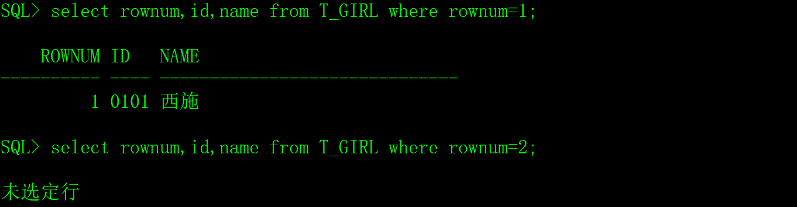

Oracle有两个常用的伪列rowid和rownum，对伪列的操作类似于表中的列，你可以对其进行查询操作，但是你却不能对其进行增加、修改或者是删除。

# 一、rowid伪列

## 1、rowid的原理

Oracle数据库表中的每一行在数据库中有一个存放的位置，即rowid（row identification），rowid的长度是10个字节，显示的结果是18字节的字符串，该值表明了行在Oracle数据库中存放的物理具体位置，是唯一的，Oracle内部通常使用它来访问数据。

我们从超女表中查询每行的rowid。


rowid虽然不是表的字段，但是，在Oracle数据库的内部，保存了每行数据的rowid。

rowid使用base64编码行的物理地址，编码字符包含A-Z, a-z, 0-9, +, 和/，由四部分组成：OOOOOOOFFFBBBBBBRRR，如下图：


1）对象编号：行所属数据库对象的编号，每个数据库对象在创建的时候都被分配一个唯一的编号，六位显示。

2）文件编号：行所在数据文件的编号，每一个文件标号也是唯一的，三位显示。

3）块编号：行所在数据文件的数据块的位置，六位显示。

4）行编号：行目录中的具体位置，三位显示。

Oracle正是根据rowid可以准确的定位存放行数据的物理位置。

## 2、rowid数据类型

在Oracle数据库中，用rowid数据类型存放rowid的值，长度是10个字节，为了方便查看和书写，Oracle可以把10字节的rowid类型和18字节的字符串自动转换。

对程序员来说，把rowid当成18字节的字符串就行了。

 

# 二、rowid的应用

我以一个程序员的视角来向大家介绍rowid的应用场景。

## 1、记录表数据的变化

例如我希望把超女基本信息表T_GIRL的操作日志（增加、修改和删除）记录下来。

1）创建一个SQL日志表

```sql
create table T_SQL_LOG

(

 tname  varchar2(30),    -- 原表的表名。

 srcrowid rowid,        -- 原表rowid。

 sqltype number(1),      -- SQL语句的类型：1-insert、2-update、3-delete。

 crttime date default sysdate -- 操作时间。

);
```


2）在原表中创建触发器

在超女基本信息表T_GIRL上创建触发器。

```sql
create or replace trigger TR_GIRL_LOG

​    after insert or update or delete

​    on T_GIRL for each row

begin

 if inserting then

  insert into T_SQL_LOG(tname,srcrowid,sqltype) values('T_GIRL',:new.rowid,1);

 end if;

 if updating then

  insert into T_SQL_LOG(tname,srcrowid,sqltype) values('T_GIRL',:new.rowid,2);

 end if;

 if deleting then

  insert into T_SQL_LOG(tname,srcrowid,sqltype) values('T_GIRL',:old.rowid,3);

 end if;

end;
```


3）测试效果

如果对T_GIRL表插入了四条记录，在T_SQL_LOG中记录的内容如下：

 

4）应用经验

T_SQL_LOG日志表中可以找到原表数据变化的情况，这种处理技巧在数据审计和数据同步中经常用到。

## 2、用于where的条件

rowid是记录了数据存放的物理位置，用rowid作为where的条件的效率永远是最高的，远远超过任何索引，利用这个特点可以提高数据操作的效率。

## 3、rowid的缺点

rowid的效率虽然很高，在实际开发中经常用到，但也有缺点，主要有两方面：

1）兼容性不好，rowid是Oracle数据库特有的，其它数据库没有，如果你的应用程序需要迁移到其它数据库，就不能用rowid了。

2）rowid记录的是数据存放的物理位置，这个值在数据整理、数据迁移和数据备份的时候会变化。

# 三、rownum伪列

首先，rowid和rownum都是oracle的伪列，但原理和用法完全不同，没有任何关联和可比性，不要用学习rowid的经验来学习rownum。

rownum（row number）是Oralce为查询结果集的行分配的顺序号，例如：

 

 

再说一次，rownum很简单，就是Oralce为查询结果集的行分配的顺序号。

rownum在数据库中没有存储空间，从以上的两个查询可以看出，在第一个查询结果中，妲已的rownum是3，在第二个查询结果集中，妲已的rownum是1。

如果你还不明白，我再解释一次，rownum是Oralce为查询结果集的行分配的顺序号。

# 四、rownum的应用

## 1、限制数据库大事务

用delete删除表中数据的时候，如果数据记录比较多，会产生大事务，为了避免对数据库的冲击，可以用rownum限制每次delete数据的记录数。

```sql
delete from 表名 where 待删除数据的条件 and rownum<=100000 ;
```

以上delete语句一次删除100000条记录，这种用法适用于update语句。

## 2、用于筛选查询结果集的记录

筛选查询结果集的记录的用法对C/C++程序员意义不大，但对java程序员来说非常重要，主要用于查询结果的分页，各位有兴趣可以看一下。

1）rownum 对于等于某值的查询条件

如果希望找到超女表中第一条超女的信息，可以使用rownum=1作为条件。但是想找到超女表中第二条超女的信息，使用rownum=2结果查不到数据。因为rownum都是从1开始，但是1以上的自然数在rownum做等于判断是时认为都是false条件，所以无法查到rownum = n（n>1的自然数）。

```sql
select rownum,id,name from T_GIRL where rownum=1; --有记录

select rownum,id,name from T_GIRL where rownum=2; --无记录
```

 

2）rownum对于大于某值的查询条件

如果想找到从第二行记录以后的记录，当使用rownum>2是查不出记录的，可以使用以下的子查询方法来解决。注意子查询中的rownum必须要有别名，否则还是不会查出记录来，这是因为rownum不是某个表的列，如果不起别名的话，无法知道rownum是子查询的列还是主查询的列。

```sql
select * from (select rownum no,id,name from T_GIRL) where no>2;   -- 有记录

select * from (select rownum  ,id,name from T_GIRL) where rownum>2; -- 无记录
```

 

3）rownum对于小于某值的查询条件

如果想找到第三条记录以前的记录，当使用rownum<3是能得到两条记录的。显然rownum对于rownum1的自然数）的条件认为是成立的，所以可以找到记录。

```sql
select rownum,id,name from T_GIRL where rownum<3; -- 有记录
```

 

4）rownum排序

[Oracle](https://www.2cto.com/database/Oracle/)中的rownum的是在从数据库中取数据的时候产生的序号，所以想对指定排序的数据去指定的rowmun行数据就必须注意了。

```sql
select rownum,id,name from T_GIRL order by name;
```

 

可以看出，rownum并不是按照name列来生成的序号。[系统](https://www.2cto.com/os/)是按照记录从数据库取出的顺序给记录排的号，为了解决这个问题，必须使用子查询。

```sql
select rownum,id,name from (select * from T_GIRL order by name);
```

 

# 五、小结

rownum和rowid都是伪列，但两者的原理是不同的，rownum是根据SQL查询出来的结果给每行分配一个临时编号，不同的SQL会导致rownum不同。rowid是物理存在的，在每条记录insert到[数据库](https://www.2cto.com/database/)时，就会有一个唯一的物理位置，记录了在数据库中的位置ID，只要记录没被搬动过，rowid是不变的。

rownum常用于分页查询，rowid常用于提高数据操作的效率，在某些场景中，还会把rowid当成主建来使用。