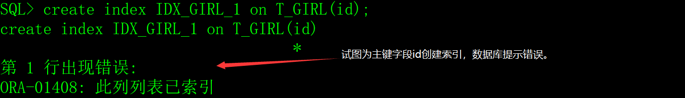
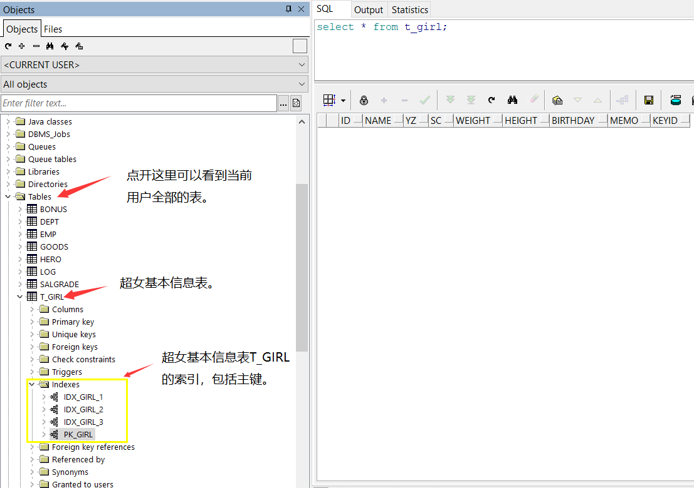
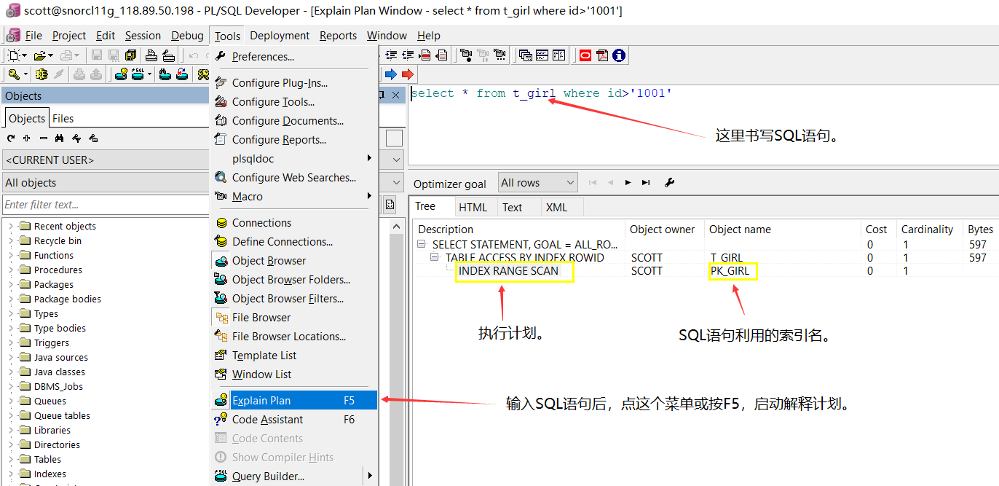
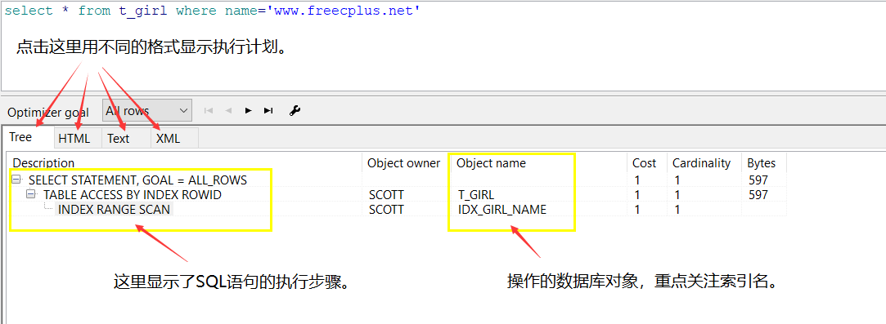
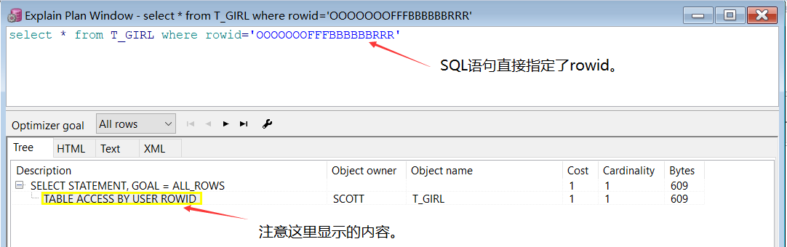
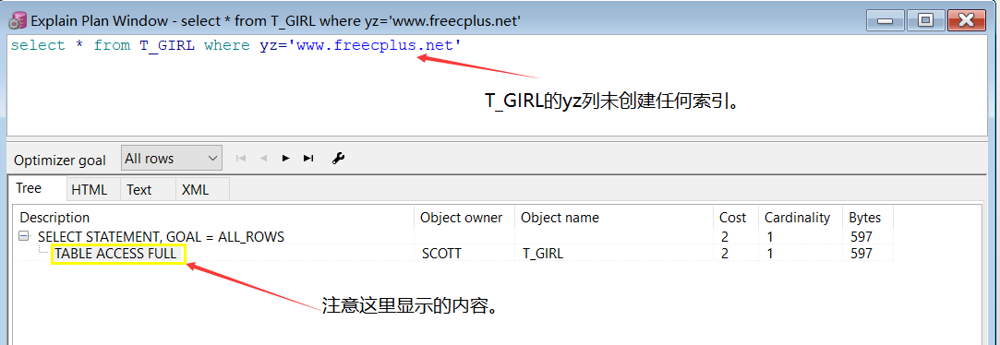
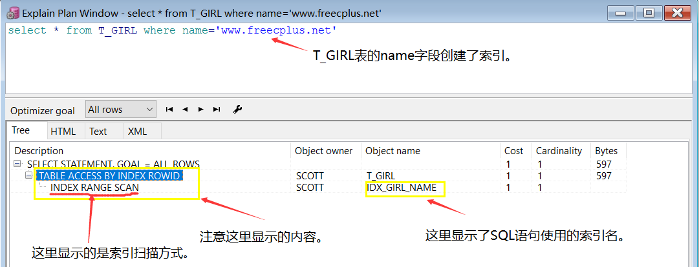

**对于初学者来说，在学习的过程中，创建表的数据量非常有限，感受不到索引的重要性，但是，我希望您把本章节的内容记在心里，等实际工作中遇到问题的时候能立即想到解决问题的方案。**

**总的来说，Oracle数据库非常强大，如果您的数据库性能较低或执行SQL语句的效率很低，最主要原因应该是索引设计不合理或使用索引不合理。**

**所谓的SQL优化，主要的内容就是如何设计索引和如何利用索引。**

# 一、索引的概念

如果一本书只有几页，读者随便翻翻就能很快的找到具体的内容，根本不需要目录，如果一本书有几百页、几千页，没有目录，查找内容的将需要更长的时间，书越厚，耗时越长。

索引，即表的索引，它对表的重要性就像目录对书一样重要，索引可以大幅提升数据查找的效率。

## 1、索引的特点

1）索引是表的一部分，是可选的，表可以没有索引，就像书可以没有目录一样，数据库不做强制要求。

2）合理的索引可以提高数据查找的效率，减少磁盘I/O。

3）唯一索引可以约束表数据的完整性。

4）索引也是数据，需要存储空间。

5）数据库自动维护索引的内容，当对表的记录进行了增、删、改的操作时，数据库会自动更新索引。

6）索引虽然可以提高数据查找的效率，但对表进行增、删、改操作时，数据库除了维护表中的数据，还要维护索引，所以，索引会让增、删、改操作的效率下降。

7）索引提升了数据查找的效率，降低了数据操作的效率，在设计表和索引的时候，要根据实际情况在两者之间权衡。

## 2、索引的分类

索引可分为普通索引、唯一索引、反向键索引、位图索引和基于函数的索引，常用的是普通索引和唯一索引，其它三种极少使用，我也不建议使用。

本文只介绍普通索引和唯一索引。

# 二、创建索引

我们先来创建超女基本信息表T_GIRL。

```sql
create table T_GIRL

(

 id    char(4)     not null,  -- 编号

 name   varchar2(30)  not null,  -- 姓名

 yz    varchar2(20)    null,  -- 颜值

 sc    varchar2(20)    null,  -- 身材

 weight  number(4,1)   not null,  -- 体重

 height  number(3)    not null,  -- 身高

 birthday date      not null,  -- 出生时间

 memo   varchar2(1000)   null,  -- 备注

 keyid   number(8)    not null  -- 记录编号,从序列SEQ_GIRL中获取。

);

alter table T_GIRL add constraint PK_GIRL primary key(id);
```


## 1、普通索引

创建普通索引的语法如下：

```sql
create index 索引名 on 表名(字段名1,字段名2,......,字段名n);
```

索引名是标识符，从语法上来说，索引名只要符合Oracle的规定就行了，但是，在实际开发中，我会以IDX_打头，加表名和索引编号，例如超女基本信息表T_GIRL的索引，命名将会是IDX_GIRL_1、IDX_GIRL_2、IDX_GIRL_3、IDX_GIRL_n。

例如为超女信息表T_GIRL的姓名字段创建索引：

```sql
create index IDX_GIRL_1 on T_GIRL(name);
```

例如为超女信息表T_GIRL的颜值和身材两个字段创建索引：

```sql
create index IDX_GIRL_2 on T_GIRL(yz,sc);
```

## 2、唯一索引

如果表中的列没有重复的值，是唯一的，就可以创建唯一索引，唯一索引的效率比普通索引要高很多。

创建唯一索引的语法如下：

```sql
create unique index 索引名 on 表名(字段名1,字段名2,......,字段名n);
```

例如超女基本信息表T_GIRL的keyid字段，其值是从序列SEQ_GIRL中获取的，肯定是个唯一的值，可以创建唯一索引。

```sql
create unique index IDX_GIRL_3 on T_GIRL(keyid);
```

## 3、主建是唯一索引

不要为表的主建创建索引，因为Oracle自动为表的主建字段创建唯一索引。



# 三、删除索引

当表被删除时，表的索引会被自动删除，也可以采用drop index命令删除索引。

语法：

```sql
drop index 索引名;
```

例如：

```sql
drop index IDX_GIRL_1;

drop index IDX_GIRL_2;

drop index IDX_GIRL_3;
```

注意，drop index无法删除用于强制唯一/主键的索引，删除主键要用以下语句：

```sql
alter table 表名 drop constraint 主键名;
```

例如：

```sql
alter table T_GIRL drop constraint PK_GIRL;
```

# 四、修改索引

修改索引的操作比较多，这些的工作一般由管理员（DBA）来执行。

## 1、重建索引

重建索引可以减少硬盘碎片和提高数据库系统的性能。

语法：

```sql
alter index 索引名 rebuild;
```

示例：

```sql
alter index IDX_GIRL_1 rebuild;
```

## 2、整理碎片

对索引的无用空间进行合并，减少硬盘碎片和提高数据库系统的性能。

语法：

```sql
alter index 索引名 coalesce;
```

示例：

```sql
alter index IDX_GIRL_1 coalesce;
```

## 3、修改索引名

语法：

```sql
alter index 索引名 rename to 新索引名;
```

示例：

```sql
alter index IDX_GIRL_1 rename to IDX_GIRL_NAME;
```

## 4、禁用索引

语法：

```sql
alter index 索引名 unusable;
```

示例：

```sql
alter index IDX_GIRL_1 unusable;
```

索引被禁用后，如果要启用，需要用rebuild重建。

# 五、索引的存储空间

每个数据库用户有一个缺省表空间，创建的表、主键和索引存放在缺省表空间中，也可以指定其它的表空间。

**在实际应用中，会把表和索引的存储空间分开到不同的表空间，减少磁盘的竞争，提升I/O的性能。**

## 1、查看当前用户的缺省表空间

从数据字典USER_USERS中可以查看当前用户的缺省表空间。

 

## 2、指定索引的表空间

指定索引的表空间的语法如下：

```sql
create index 索引名 ...... tablespace 表空间名; 
```

示例：

```sql
create unique index IDX_GIRL_3 on T_GIRL(keyid) tablespace INDEXS;
```

索引还有其它与存储相关的选项，但应用场景比较少，本文就不介绍了。

# 六、索引的优化

索引的优化体现在SQL语句的where条件中，如果where条件中的字段列表没有创建索引，SQL语句的性能将会很低。

在设计索引的时候，必须考虑在常用的where条件，在编写SQL语句的时候，也必须清楚表上创建了哪些索引。

## 1、索引的查看

在PL/SQL Developer软件中可以查看表的索引。

 

## 2、SQL语句的执行计划

利用PL/SQL Developer软件可以查看SQL语句详细的执行计划。

 

## 3、SQL语句的执行步骤

 

SQL语句的执行顺序是从未级节点往根级节点看的，上图中的SQL语句执行的顺序如下：

**INDEX RANGE SCAN->TABLE ACCESS BY INDEX ROWID->SELECT STATEMENT,GOAL=ALL_ROWS**

## 4、执行计划的含义

在执行计划中，我们重点关注访问表（TABLE ACCESS BY …… ）的方式，常见的有三种： 

1）TABLE ACCESS BY USER ROWID（通过ROWID的表存取） 

rowid的值是行的物理位置，通过rowid可以快速定位到目标数据上，这也是Oracle中存取单行数据最快的方法。

示例：

 

2） TABLE ACCESS FULL（全表扫描）

Oracle读取表中全部的行，并检查每一行是否满足SQL语句中where的条件。

示例：

 

数据量太大的表不能使用全表扫描，除非本身需要取出的数据较多，占到表数据总量的5%~10% 或以上。

**全表扫描会让数据库的性能大幅下降，程序员一定要避免这种情况的发生，除非您知道自己在做什么。**

3） TABLE ACCESS BY INDEX SCAN（索引扫描）

在索引中，存储了每个索引的键值和行的rowid，所以索引扫描其实是先扫描索引得到对应的rowid，然后再通过rowid定位到具体的行。

示例：

 

索引扫描又分五种：

a）INDEX UNIQUE SCAN，索引唯一扫描，效率最高。

b）INDEX RANGE SCAN，索引范围扫描，效率较高。

c）INDEX FULL SCAN，索引全扫描，效率较低。

d）INDEX FAST FULL SCAN，索引快速扫描，效率一般。

e）INDEX SKIP SCAN，索引跳跃扫描，效率还行。

**在Object name中显示了SQL语句使用的索引名，是索引优化的重要依据。**