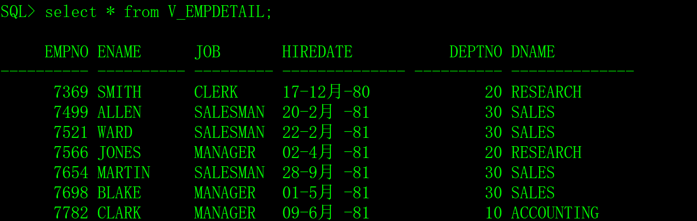

# 一、视图的概念

视图是基于一个或者多个表上的预定义查询，这些表称为基表，从视图中查询数据的方法与从基表中查询数据的方法相同。[视图](https://baike.baidu.com/item/视图/1302820)是一个查看数据的窗口，是查询语句模板，视图本身没有数据，在数据库中只保存了视图的定义。

视图具有以下优点：

1）可以向数据访问者只开放访问视图的权限，屏蔽基表信息。

2）可以将复杂的查询语句保存为视图，简化了SQL语句的编写。

3）创建视图的时候，可以限制只访问基表中的部分列或者部分行的数据，这样可以实现一定的安全性。

4）简化用户权限的管理，只授予用户使用视图的权限。

5）从基表中按一定的业务逻辑抽出用户关心的部分数据创建视图，简化了业务逻辑。

# 二、创建视图

语法：

```sql
create [or replace] [{force|noforce}] view 视图名

as

select查询语句

[with read only];
```

语法解析：

**or replace**：如果视图已经存在，则替换旧视图。

**force**：即使基表不存在，也可以创建该视图，但是该视图不能正常使用，当基表创建成功后，视图才能正常使用。

**noforce**：如果基表不存在，无法创建视图，该项是默认选项。

**with read only**：默认可以通过视图对基表执行增删改操作，with read only强调这是只读视图，不能通过该视图进行增删改操作。现实开发中，基本上不通过视图对表中的数据进行增删改操作。

示例一，在超女表中创建一个简单的视图V_GIRL，只提取编号、姓名、身材和颜值字段。

```sql
create or replace noforce view V_GIRL

as

select id,name,sc,yz from T_GIRL

with read only;
```

从V_GIRL视图中查询数据：


示例二，连接EMP表和DEPT表创建视图V_EMPDETAIL，隐藏了工资（sal）和备注（comm）字段。

```sql
create or replace view V_EMPDETAIL

as

select empno,ename,job,hiredate,EMP.deptno,dname

 from EMP join DEPT on EMP.deptno=DEPT.deptno

with read only;
```

从V_EMPDETAIL视图中查询数据：

 

# 三、视图的状态

当创建视图后，Oracle会验证视图的有效性，如修改了基本表，可能会导致视图的不可用，数据字典的USER_OBJECTS的status字段中记录了视图的状态（VALID-有效；INVALID-失效）。

 

我们来做一个测试。

1）删除T_GIRL表的name字段。

```sql
alter table T_GIRL drop column name;
```

2）执行一次查询视图，出现了错误。

 

3）查询视图的状态，成了INVALID。

 

4）在T_GIRL表中增加name字段。

```sql
alter table T_GIRL add name varchar2(30);
```

5）查询视图的状态，还是INVALID，数据结构已恢复，但视图的状态未恢复。

 

6）执行一次查询，视图已恢复正常。

 

7）再查询视图的状态，恢复成了VALID。

 

在上面的测试中，我们发现基表数据结构的改变导致了视图无效，数据结构恢复后，视图能自动恢复正常（中间有一点曲折）。

# 四、删除视图

语法：

```sql
drop view 视图名;
```

示例：

```sql
drop view V_GIRL;
```

# 五、视图的其它知识

视图还有两个方面的知识，大家可以了解一下：

1）本文只介绍了只读视图，对视图只会执行select操作，其实视图还可以进行增、删、改操作，但应用场景极少，二十年来，我从未见过。

2）本文介绍的视图是查询数据的窗口、是虚拟表、是SQL模板，视图本身没有数据，但是，有一种视图叫物化视图，是有数据的，但是，物化视图的应用也非常少。