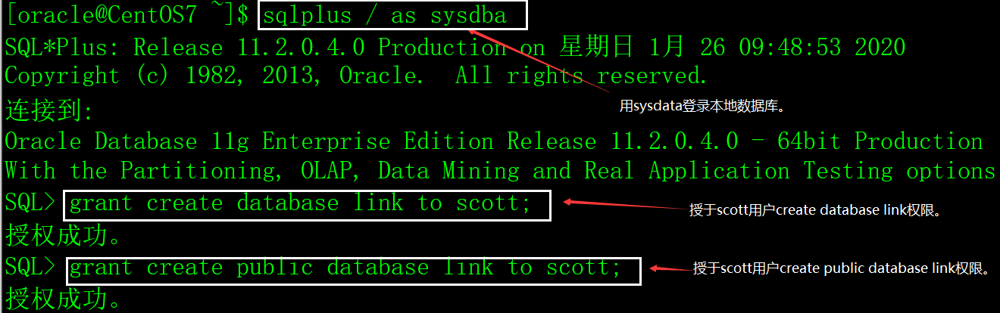
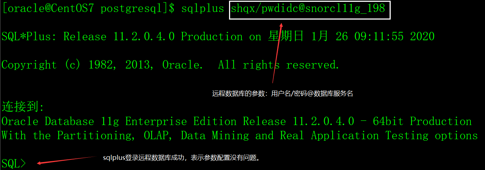

# 一、数据库链路的概念

数据库链路（database link），简称dblink，它是一个通道，是本地数据库与远程数据库之间的通道，通过dblink，在本地数据库中可以直接访问远程数据库的对象。

dblink不是应用程序与数据库之间的通道，而是数据库之间的通道。

# 二、创建dblink

## 1、创建dblink的权限

用dba权限登录数据库，授于用户create database link和create public database link权限。

语法：

```sql
grant create database link to 用户名;

grant create public database link to 用户名;
```

示例：



## 2、创建dblink的命令

语法：

```sql
create [public] database link 数据库链路名称

connect to 用户名

identified by 密码

using '远程数据库参数';
```

说明：

public：dblink的类型，缺省是当前用户私有的，只有当前用户可以使用该dblink，如果加上public选项，表示公用dblink，所有的数据库用户都可以使用。

数据库链路名称：给dblink起个名字。

用户名：远程数据库登录的用户名。

密码：远程数据库登录的用户的密码。

远程数据库参数：该参数的配置有两种方法：1）远程数据库的服务名，也就是本地数据库服务器上$ORACLE_HOME/network/admin/tnsnames.ora中配置的数据库服务名；2）不采用tnsnames.ora中的配置，直接指定远程数据库的参数。

## 3、用数据库服务名创建dblink

1）配置远程数据库服务名

远程数据库服务名在$ORACLE_HOME/network/admin/tnsnames.ora文件中配置，内容如下：

```sql
snorcl11g_198 =

 (DESCRIPTION =

  (ADDRESS_LIST =

   (ADDRESS = (PROTOCOL = TCP)(HOST = 118.89.50.198)(PORT = 1521))

  )

  (CONNECT_DATA =

   (SID = snorcl11g)

   (SERVER = DEDICATED)

  )

 )
```

2）测试远程数据库登录参数

 

3）创建dblink

用远程数据库服务名创建dblink，例如：

```sql
create database link dblink_01 connect to shqx identified by pwdidc using 'snorcl11g_198';
```

4）测试dblink

通过dblink获取远程数据库的时间。

 

## 4、不用数据库服务名创建dblink

如果不用数据库服务创建dblink，就不需要配置tnsnames.ora文件。

示例：

```sql
create database link dblink_02 connect to shqx identified by pwdidc using

'(DESCRIPTION =

  (ADDRESS_LIST =

   (ADDRESS = (PROTOCOL = TCP)(HOST = 118.89.50.198)(PORT = 1521))

  )

  (CONNECT_DATA =

   (SID = snorcl11g)

   (SERVER = DEDICATED)

  )

 )';
```

dblink_01和dblink_02完全一样。

# 三、dblink的使用

如果要访问远程数据库的表或视图，在表和视图名之后附加@dblinkname就可以了。

访问远程数据库的dual表：

```sql
select sysdate from dual@dblink_01;
```

访问远程数据库的scott.emp表：

```sql
select * from scott.emp@dblink_02;
```

# 四、删除dblink

删除当前用户私有的dblink：

```sql
drop database link 数据库链路名;
```

删除公用的dblink：

```sql
drop public database link 公用数据库链路名;
```

# 五、应用经验

dblink的知识很容易掌握，用dblink访问远程数据库的对象很方便，但是，如果在程序中采用dblink对远程数据库的表进行增、删、改、查操作时一定要遵守一个原则：**尽可能不要产生远程事务，因为数据库对远程的事务难以控制**，也就是说，尽可能不要对远程数据库的表进行增、删、改操作，查询是没有问题的。
