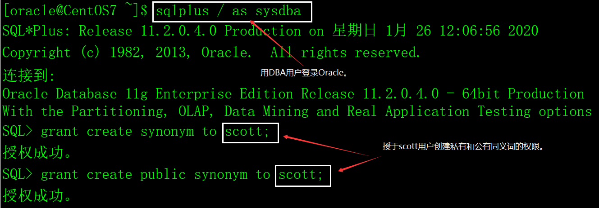
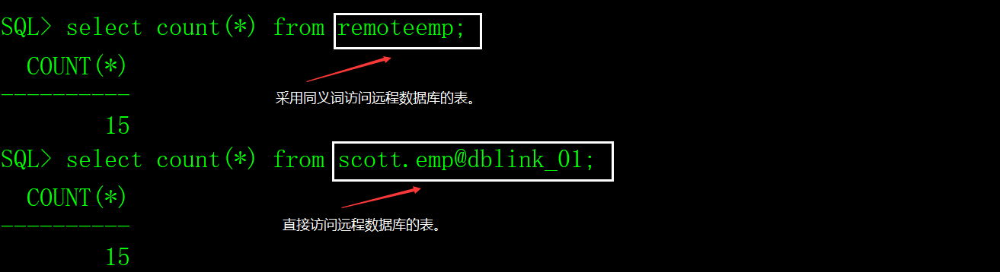

# 一、同义词的概念

同义词（synonym）就是数据库对象的别名，这里的数据库对象包括表、视图、序列、存储过程、包等。

同义词有两方面的意义：1）简化了数据库对象名称的书写；2）提高了数据库对象的安全性（因为只知道对象的别名，不知道它的真名）。

Oracle的dual虚表其实就是一个公用的同义词。

# 二、创建同义词

## 1、创建同义词的权限

用dba权限登录数据库，授于用户create synonym和create public synonym权限。

语法：

```sql
grant create synonym to 用户名;

grant create public synonym to 用户名;
```

示例：



## 2、创建synonym的命令

语法：

```sql
create [public] synonym 同义词名 for [用户名.]数据库对象名;
```

说明：

public：同义词的类型，缺省是当前用户私有的，只有当前用户可以使用该同义词，如果加上public选项，表示公用同义词，所有的数据库用户都可以使用。

用户名：数据库对象所属的用户，缺省是当前用户。

数据对象名：常用的是表、视图和序列，其它的不常用。

注意，如果对其它用户的对象创建同义词，当前用户必须具备对其它用户对象的权限，否则同义词无法使用。

示例：

1）为当前用户的dept表创建同义词mydept。

```sql
create synonym mydept for dept;
```

2）为scott用户的emp表创建同义词myemp。

```sql
create synonym myemp for scott.emp;
```

3）为远程数据库的scott用户的emp表创建同义词remoteemp。

```sql
create synonym remoteemp for scott.emp@dblink_01;
```

4）测试效果。

 

# 三、删除同义词

删除当前用户私有的同义词：

```sql
drop synonym 同义词名;
```

删除公用的同义词：

```sql
drop public synonym 公用同义词名;
```

