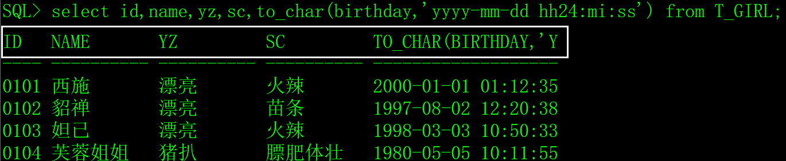
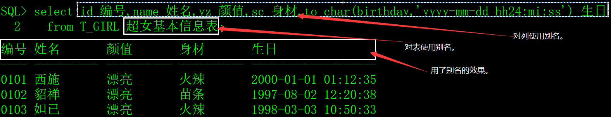

在SQL语句中，可以给表和列起别名，这是临时的别名，与同义词不一样，同义词是永久的别名。

别名是多表查询和嵌套查询语句的基础知识，本文只介绍别名的语法，不涉及别名的应用技巧，大家在学习的时候可能觉得别名没什么意义，其实不然。

# 一、生成测试数据

用以下SQL创建超女基本信息表（T_GIRL），插入一些测试数据。

```sql
create table T_GIRL

(

 id    char(4)     not null,  -- 编号

 name   varchar2(30)  not null,  -- 姓名

 yz    varchar2(20)    null,  -- 颜值

 sc    varchar2(20)    null,  -- 身材

 weight  number(4,1)   not null,  -- 体重

 height  number(3)    not null,  -- 身高

 birthday date      not null,  -- 出生时间

 memo   varchar2(1000)   null  -- 备注

);

insert into T_GIRL(id,name,yz,birthday,sc,weight,height,memo)

 values('0101','西施','漂亮',to_date('2000-01-01 01:12:35','yyyy-mm-dd hh24:mi:ss'),

​     '火辣',48.5,170,'这是一个非常漂亮姑娘，老公是夫差，男朋友是范蠡。');

insert into T_GIRL(id,name,yz,birthday,sc,weight,height,memo)

 values('0102','貂禅','漂亮',to_date('1997-08-02 12:20:38','yyyy-mm-dd hh24:mi:ss'),

​     '苗条',45.2,168,'王允真不是男人，干不过董卓就把美人往火坑里推，千古罪人啊。');

insert into T_GIRL(id,name,yz,birthday,sc,weight,height,memo)

 values('0103','妲已','漂亮',to_date('1998-03-03 10:50:33','yyyy-mm-dd hh24:mi:ss'),

​     '火辣',53.6,172,'如果商真的因我而亡，您们男人做什么去了？');

insert into T_GIRL(id,name,yz,birthday,sc,weight,height,memo)

 values('0104','芙蓉姐姐','猪扒',to_date('1980-05-05 10:11:55','yyyy-mm-dd hh24:mi:ss'),

​     '膘肥体壮',85.8,166,'如果不努力学习技术，将来就会娶个芙蓉姐姐，哼哼。');
```

# 二、表和列的别名

我们先来看一个SQL语句。

```sql
select id,name,yz,sc,to_char(birthday,'yyyy-mm-dd hh24:mi:ss') from T_GIRL;
```



select语句返回结果集的列标题是列名，如果对列用了函数就是函数的文本。

试试别名：

```sql
select id 编号,name 姓名,yz 颜值,sc 身材,to_char(birthday,'yyyy-mm-dd hh24:mi:ss') 生日
```

 from T_GIRL 超女基本信息表;

 

## 1、列的别名

列的别名有两种写法：

1）直接在列后面加空格写别名，例如：name 姓名。

2）使用as在列后面再写别名，例如：name as 姓名。

别名可以直接书写，如果别名中有特殊字符，如数字、单引号和空格，就用双引号将别名括起来。

## 2、表的别名

表的别名与列的别名不同的地方就是表的别名不能用as。

# 三、注意事项

## 1、列的别名

列的别名这种说法不准确，准确的说法是结果集的列的别名，以下用示例来证明。

1）列的别名不能用在where子句中。

```sql
select id 编号,name 姓名 from T_GIRL where id='0101';

select id 编号,name 姓名 from T_GIRL where 编号='0101';
```

以上两条SQL语句，第一条是正确的，第二条会报错。

2）列的别名可以用于order by关键字中。

```sql
select id 编号,name 姓名 from T_GIRL order by id;

select id 编号,name 姓名 from T_GIRL order by 编号;
```

以上两条SQL语句都是正确的。