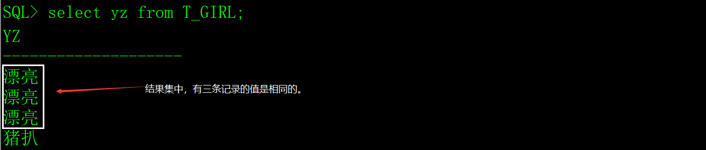

distinct关键字用于从查询的结果集中筛选出唯一值的记录。

我们通过示例来介绍distinct关键字的用法。

# 一、生成测试数据

用以下SQL创建超女基本信息表（T_GIRL），插入一些测试数据。

```sql
create table T_GIRL

(

 id    char(4)     not null,  -- 编号

 name   varchar2(30)  not null,  -- 姓名

 yz    varchar2(20)    null,  -- 颜值

 sc    varchar2(20)    null,  -- 身材

 weight  number(4,1)   not null,  -- 体重

 height  number(3)    not null,  -- 身高

 birthday date      not null,  -- 出生时间

 memo   varchar2(1000)   null  -- 备注

);

insert into T_GIRL(id,name,yz,birthday,sc,weight,height,memo)

 values('0101','西施','漂亮',to_date('2000-01-01 01:12:35','yyyy-mm-dd hh24:mi:ss'),

​     '火辣',48.5,170,'这是一个非常漂亮姑娘，老公是夫差，男朋友是范蠡。');

insert into T_GIRL(id,name,yz,birthday,sc,weight,height,memo)

 values('0102','貂禅','漂亮',to_date('1997-08-02 12:20:38','yyyy-mm-dd hh24:mi:ss'),

​     '苗条',45.2,168,'王允真不是男人，干不过董卓就把美人往火坑里推，千古罪人啊。');

insert into T_GIRL(id,name,yz,birthday,sc,weight,height,memo)

 values('0103','妲已','漂亮',to_date('1998-03-03 10:50:33','yyyy-mm-dd hh24:mi:ss'),

​     '火辣',53.6,172,'如果商真的因我而亡，您们男人做什么去了？');

insert into T_GIRL(id,name,yz,birthday,sc,weight,height,memo)

 values('0104','芙蓉姐姐','猪扒',to_date('1980-05-05 10:11:55','yyyy-mm-dd hh24:mi:ss'),

​     '膘肥体壮',85.8,166,'如果不努力学习技术，将来就会娶个芙蓉姐姐，哼哼。');
```

# 二、distinct示例

从T_GIRL表中查出全部的颜值信息：

```sql
select yz from T_GIRL;
```



如果我想知道颜值有哪些取值，所以希望从结果集中去掉重复的记录，加上distinct关键字，位置在select和字段列表之间。

 

distinct是从结果集中筛选出唯一值的记录，上面示例的结果集只有一个字段，也可以多个字段，多个字段组合的值唯一。

未加distinct关键字。

```sql
select yz,sc from T_GIRL; 
```

 

加了distinct关键字。

```sql
select distinct yz,sc from T_GIRL; 
```

 