如果SQL语句中包含了另一个select语句的时候，就称为子查询，子查询在select、insert、update或delete命令中都可以包含子查询，子查询还可以包含在另外一个子查询中，以便完成更为复杂的查询。

我通过一些示例来向大家介绍子查询的常用方法。

# 一、生成测试数据

## 1、颜值参数表

| 编号（主键） | 颜值描述 | 显示顺序 | 备注         |
| ------------ | -------- | -------- | ------------ |
| 1            | 倾国倾城 | 1        | 第一等美女。 |
| 2            | 风华绝代 | 2        | 第二等美女。 |
| 3            | 迷倒众生 | 3        | 第三等美女。 |
| 4            | 漂亮     | 4        | 普通美女。   |
| 5            | 一般     | 5        |              |
| 6            | 猪扒     | 6        |              |

## 2、身材参数表

| 编号（主键） | 身材描述 | 显示顺序 | 备注       |
| ------------ | -------- | -------- | ---------- |
| 1            | 火辣     | 1        | 前凸后翘。 |
| 2            | 丰满     | 2        | 体态丰腴。 |
| 3            | 苗条     | 3        | 风姿绰约。 |
| 4            | 一般     | 4        |            |
| 5            | 膘肥体壮 | 5        | 强悍无比。 |

 

## 3、超女基本信息表

| 编号  （主键） | 姓名     | 颜值代码  （外键） | 身材代码  （外键） | 身高 | 备注                                                 |
| -------------- | -------- | ------------------ | ------------------ | ---- | ---------------------------------------------------- |
| 0101           | 西施     | 2                  | 4                  | 170  | 这是一个非常漂亮姑娘，老公是夫差，男朋友是范蠡。     |
| 0102           | 貂禅     | 1                  | 2                  | 168  | 王允真不是男人，干不过董卓就把美人往火坑里推，无能。 |
| 0103           | 妲已     | 1                  |                    | 172  | 如果商真的因我而亡，您们男人做什么去了？             |
| 0104           | 芙蓉姐姐 | 6                  | 5                  | 166  | 如果不努力学习技术，将来就会娶个芙蓉姐姐，哼哼。     |
| 0105           | 神密猫女 |                    | 2                  | 171  | 不知道是什么人，她脸上有一个%符号，很神密。          |

## 4、表之间的关系图

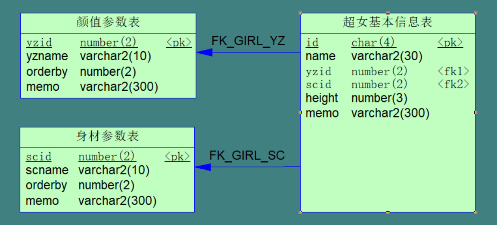

## 5、生成测试数据

运行以下脚本，生成测试数据；

```sql
/* Table: 颜值参数表  */

create table T_YZCODE (

  yzid        number(2)            not null,

  yzname       varchar2(10)          not null,

  orderby      number(2)            not null,

  memo        varchar2(300)

);

alter table T_YZCODE add constraint PK_YZCODE primary key(yzid);

insert into T_YZCODE values(1,'倾国倾城',1,'第一等美女。');

insert into T_YZCODE values(2,'风华绝代',2,'第二等美女。');

insert into T_YZCODE values(3,'迷倒众生',3,'第三等美女。');

insert into T_YZCODE values(4,'漂亮',4,'普通美女。');

insert into T_YZCODE values(5,'一般',5,null);

insert into T_YZCODE values(6,'猪扒',6,null);
```


```sql
/* Table: 身材参数表  */

create table T_SCCODE (

  scid        number(2)            not null,

  scname       varchar2(10)          not null,

  orderby      number(2)            not null,

  memo        varchar2(300)

);

alter table T_SCCODE add constraint PK_SCCODE primary key(scid);

insert into T_SCCODE values(1,'火辣',1,'前凸后翘。');

insert into T_SCCODE values(2,'丰满',2,'体态丰腴。');

insert into T_SCCODE values(3,'苗条',3,'风姿绰约。');

insert into T_SCCODE values(4,'一般',4,null);

insert into T_SCCODE values(5,'膘肥体壮',5,'强悍无比。');
```

 

```sql
/* Table: 超女基本信息表  */

create table T_GIRL (

  id         char(4)            not null,

  name        varchar2(10),

  scid        number(2),

  yzid        number(2),

  height       number(3),

  memo        varchar2(300)

);

alter table T_GIRL add constraint PK_GIRL primary key(id);

alter table T_GIRL add constraint FK_GIRL_SC foreign key(scid) references T_SCCODE(scid);

alter table T_GIRL add constraint FK_GIRL_YZ foreign key(yzid) references T_YZCODE(yzid);

insert into T_GIRL(id,name,yzid,scid,height,memo)

 values('0101','西施',2,4,170,'这是一个非常漂亮姑娘，老公是夫差，男朋友是范蠡。');

insert into T_GIRL(id,name,yzid,scid,height,memo)

 values('0102','貂禅',1,2,168,'王允真不是男人，干不过董卓就把美人往火坑里推，无能。');

insert into T_GIRL(id,name,yzid,scid,height,memo)

 values('0103','妲已',1,null,172,'如果商真的因我而亡，您们男人做什么去了？');

insert into T_GIRL(id,name,yzid,scid,height,memo)

 values('0104','芙蓉姐姐',6,5,166,'如果不努力学习技术，将来就会娶个芙蓉姐姐，哼哼。');

insert into T_GIRL(id,name,yzid,scid,height,memo)

 values('0105','神密猫女',null,2,171,'不知道是什么人，她脸上有一个%符号，很神密。');
```


各表中的数据如下：

 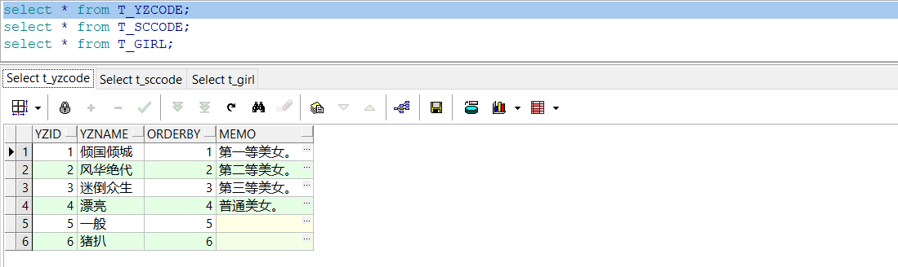

 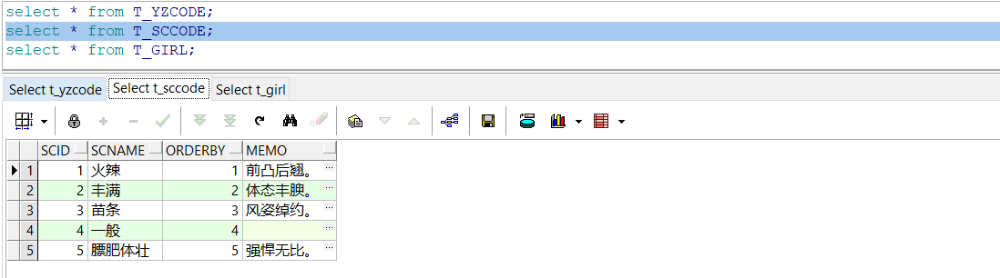

 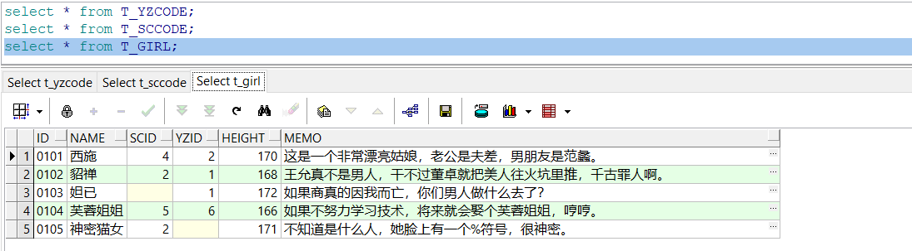

# 二、表名限定

在SQL语句中，列是指表（视图、结果集）的列，可以在列名前加表名限定，也可以用表的别名限定，例如：

1）不加表名限定

```sql
select id,name,scid,yzid,height,memo from T_GIRL;
```

2）用表名限定

```sql
select T_GIRL.id,T_GIRL.name,T_GIRL.scid,T_GIRL.yzid,T_GIRL.height,T_GIRL.memo from T_GIRL;
```

3）用表的别名限定

```sql
select aa.id,aa.name,aa.scid,aa.yzid,aa.height,aa.memo from T_GIRL aa;
```

**以上三条SQL语句只操作了一个表，列名可以不用表名限定，但是，在子查询中，如果这多个表中有相同的列名，则必须在列名前面加表名限定，以避免歧义。**


# 三、子查询示例

## 1、在字段列表中使用子查询

查询T_GIRL表，并从T_SCCODE表中获取身材的中文，从T_YZCODE表中获取颜值的中文。

```sql
select id,name,height,memo,

​    (select scname from T_SCCODE where scid=T_GIRL.scid) scname,

​    (select yzname from T_YZCODE where yzid=T_GIRL.yzid) yzname

 from T_GIRL;
```

 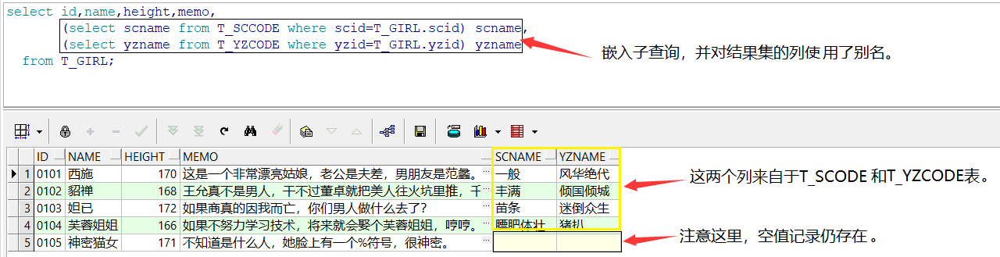

在上面的SQL语句中，T_GIRL和T_SCCODE表都有相同的列名scid，在子查询(select scname from T_SCCODE where scid=T_GIRL.scid)中，第一个scid不需要加T_SCCODE表名的限定，第二个scid要加T_GIRL表名的限定。

## 2、在where子句中使用子查询

子查询可以作为where子句条件的值，如果用的是in比较运算符，子查询可以是多行的结果集，其它比较运算符是单行的结果集。

1）条件的值是单行的结果集

```sql
select id,name,height,memo,

   (select scname from T_SCCODE where scid=T_GIRL.scid) scname,

   (select yzname from T_YZCODE where yzid=T_GIRL.yzid) yzname

 from T_GIRL

where yzid=(select yzid from T_YZCODE where yzname='风华绝代');
```

 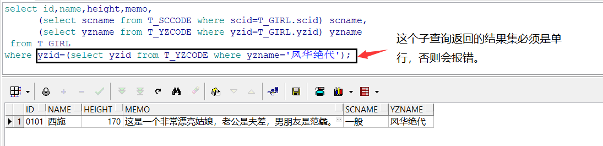

2）条件的值是多行的结果集

```sql
select id,name,height,memo,

   (select scname from T_SCCODE where scid=T_GIRL.scid) scname,

   (select yzname from T_YZCODE where yzid=T_GIRL.yzid) yzname

 from T_GIRL

where yzid in (select yzid from T_YZCODE where yzname in ('风华绝代','倾国倾城'));
```

 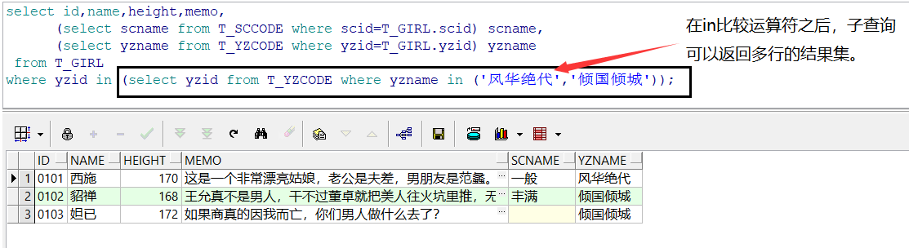

## 3、从结果集中查询

从结果集中查询也称之为select的嵌套，注意，里层的select的列该用别名的地方要用别名。

```sql
select id,name,yzname,scname,memo from

​    (

​    select id,name,height,memo,

​        (select scname from T_SCCODE where scid=T_GIRL.scid) scname,

​        (select yzname from T_YZCODE where yzid=T_GIRL.yzid) yzname

​     from T_GIRL

​    ) T_MYGIRL

 where yzname='倾国倾城' or scname='丰满';
```

 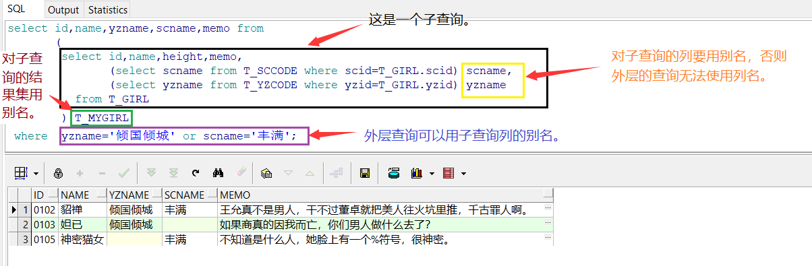

## 4、在insert中使用子查询

1）创建一个临时表TT

```sql
create table TT(id char(4),name varchar2(10));
```

2）在TT中插入多条记录。

```sql
insert into TT select id,name from T_GIRL;
```

3）在TT中插入一条记录。

```sql
insert into TT values('1088',(select name from T_GIRL where id='0102'));
```

 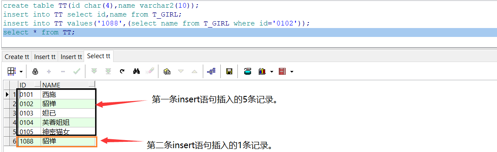

## 5、在delete中使用子查询

```sql
delete from TT where id in (select id from T_GIRL);
```

## 6、在update中使用子查询

1）在T_GIRL增加一个列（yzname颜值中文），用于测试。

```sql
alter table T_GIRL add yzname varchar2(20);
```

2）用T_YZCODE表中的yzname更新T_GIRL表的yzname。

```sql
 update T_GIRL
 set yzname=(select yzname from T_YZCODE where T_YZCODE.yzid= T_GIRL.yzid);
```

 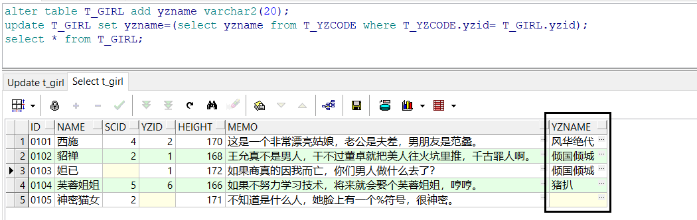

## 7、在create table中使用子查询

语法：

```sql
create table 新表名 as 子查询
```

例如用T_GIRL的结构创建T_MYGIRL表。

```sql
create table T_MYGIRL as select * from T_GIRL where yzid in (1,2);
```

 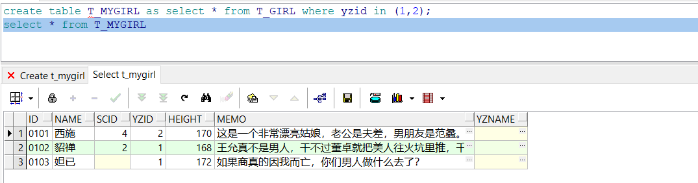

如果想创建一张空的表，可以用where 1=2

```sql
create table T_MYGIRL as select * from T_GIRL where 1=2;
```

注意一个问题，用以上方法创建的表只有基本的结构，没有主键、没有索引、没有表约束，没有列约束。

# 四、应用经验

在SQL语句中，可以把子查询当成表达式或结果集（单行和多行），只要逻辑正确，子查询可用于SQL语句的任何地方。

SQL非常强大，您能想到的需求它都能支持，本文只介绍了常用子查询的用法，有些我也没有想到。

所以，大家要放开思路，大胆的想，大胆的尝试。