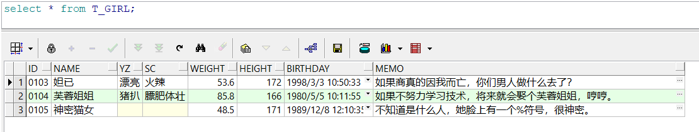

join（连接）是一个查询，它将来自两个或多个表、视图的数据组合在一起。

我通过一些示例来向大家介绍join的常用方法。

# 一、生成测试数据

## 1、创建超女基本信息历史表（T_GIRL_HIS）

```sql
create table T_GIRL_HIS

(

 id    char(4)     not null,  -- 编号

 name   varchar2(10)  not null,  -- 姓名

 yz    varchar2(10)    null,  -- 颜值

 sc    varchar2(10)    null,  -- 身材

 weight  number(4,1)   not null,  -- 体重

 height  number(3)    not null,  -- 身高

 birthday date      not null,  -- 出生时间

 memo   varchar2(1000)   null,  -- 备注

 primary key(id)

);

insert into T_GIRL_HIS(id,name,yz,birthday,sc,weight,height,memo)

 values('0101','西施_H','漂亮',to_date('2000-01-01 01:12:35','yyyy-mm-dd hh24:mi:ss'),

​     '火辣',48.5,170,'这是一个非常漂亮姑娘，老公是夫差，男朋友是范蠡。');

insert into T_GIRL_HIS(id,name,yz,birthday,sc,weight,height,memo)

 values('0102','貂禅_H','漂亮',to_date('1997-08-02 12:20:38','yyyy-mm-dd hh24:mi:ss'),

​     '苗条',45.2,168,'王允真不是男人，干不过董卓就把美人往火坑里推，千古罪人啊。');

insert into T_GIRL_HIS(id,name,yz,birthday,sc,weight,height,memo)

 values('0103','妲已_H','漂亮',to_date('1998-03-03 10:50:33','yyyy-mm-dd hh24:mi:ss'),

​     '火辣',53.6,172,'如果商真的因我而亡，您们男人做什么去了？');

insert into T_GIRL_HIS(id,name,yz,birthday,sc,weight,height,memo)

 values('0104','芙蓉姐姐_H','猪扒',to_date('1980-05-05 10:11:55','yyyy-mm-dd hh24:mi:ss'),

​     '膘肥体壮',85.8,166,'如果不努力学习技术，将来就会娶个芙蓉姐姐，哼哼。');
```


## 2、创建超女基本信息表（T_GIRL）

```sql
create table T_GIRL

(

 id    char(4)     not null,  -- 编号

 name   varchar2(10)  not null,  -- 姓名

 yz    varchar2(10)    null,  -- 颜值

 sc    varchar2(10)    null,  -- 身材

 weight  number(4,1)   not null,  -- 体重

 height  number(3)    not null,  -- 身高

 birthday date      not null,  -- 出生时间

 memo   varchar2(1000)   null,  -- 备注

 primary key(id)

);

insert into T_GIRL(id,name,yz,birthday,sc,weight,height,memo)

 values('0103','妲已','漂亮',to_date('1998-03-03 10:50:33','yyyy-mm-dd hh24:mi:ss'),

​     '火辣',53.6,172,'如果商真的因我而亡，您们男人做什么去了？');

insert into T_GIRL(id,name,yz,birthday,sc,weight,height,memo)

 values('0104','芙蓉姐姐','猪扒',to_date('1980-05-05 10:11:55','yyyy-mm-dd hh24:mi:ss'),

​     '膘肥体壮',85.8,166,'如果不努力学习技术，将来就会娶个芙蓉姐姐，哼哼。');

insert into T_GIRL(id,name,yz,birthday,sc,weight,height,memo)

 values('0105','神密猫女',null,to_date('1989-12-08 12:10:35','yyyy-mm-dd hh24:mi:ss'),

​     null,48.5,171,'不知道是什么人，她脸上有一个%符号，很神密。');
```


## 3、测试数据说明


 

超女基本信息历史表（T_GIRL_HIS）中有4条记录，为了方便测试，每条记录的姓名后面加了_H的标志，超女基本信息表（T_GIRL）中有3条记录，姓名后没有加_H。

```sql
T_GIRL_HIS和T_GIRL通过id列关联起来，两个表中有相交的记录（'0103'、'0104'）。
```

# 二、join示例

连接（join）分为五种，内连接（inner join），左连接（left join），右连接（right join）、全连接（full join）和笛卡儿乘积（cross join），常用的是内连接和左连接，其它的极少使用。

## 1、内连接（inner join）

​          

列出多个表或记录连接字段的匹配记录，即A表和B表的交集。

内连接有三种写法，这三种写法的效果相同。

1）标准的写法。

```sql
select T_GIRL.id,T_GIRL.name,T_GIRL.sc,T_GIRL.yz,T_GIRL_HIS.id,T_GIRL_HIS.name

 from T_GIRL inner join T_GIRL_HIS on T_GIRL.id=T_GIRL_HIS.id;
```

2）省略inner，和第1）种写法相比，只是省略了一个单词而已，没什么特别。

```sql
select T_GIRL.id,T_GIRL.name,T_GIRL.sc,T_GIRL.yz,T_GIRL_HIS.id,T_GIRL_HIS.name

 from T_GIRL join T_GIRL_HIS on T_GIRL.id=T_GIRL_HIS.id;
```

3）还有一种写法。

```sql
select T_GIRL.id,T_GIRL.name,T_GIRL.sc,T_GIRL.yz,T_GIRL_HIS.id,T_GIRL_HIS.name

 from T_GIRL,T_GIRL_HIS where T_GIRL.id=T_GIRL_HIS.id;
```

 

## 2、左连接（left join）

​          

列出左边（A）表全部的，及右边（B）表符合条件的，不符合条件的以空值代替，记录总数为A表的记录数。

左连接有两种写法，这两种写法的效果相同。

1）标准的写法。

```sql
select T_GIRL.id,T_GIRL.name,T_GIRL.sc,T_GIRL.yz,T_GIRL_HIS.id,T_GIRL_HIS.name

 from T_GIRL left join T_GIRL_HIS on T_GIRL.id=T_GIRL_HIS.id;
```

2）采用(+)，Oracle特有的写法，其它数据库不支持，注意(+)的位置，在右边字段后面。

```sql
select T_GIRL.id,T_GIRL.name,T_GIRL.sc,T_GIRL.yz,T_GIRL_HIS.id,T_GIRL_HIS.name

 from T_GIRL,T_GIRL_HIS where T_GIRL.id=T_GIRL_HIS.id(+);
```


## 3、右连接（right join）

​          

列出右边（B）表全部的，及左边（A）表符合条件的，不符合条件的以空值代替，记录总数为B表的记录数。

右连接有两种写法，这两种写法的效果相同。

1）标准的写法。

```sql
select T_GIRL.id,T_GIRL.name,T_GIRL.sc,T_GIRL.yz,T_GIRL_HIS.id,T_GIRL_HIS.name

 from T_GIRL right join T_GIRL_HIS on T_GIRL.id=T_GIRL_HIS.id;
```

2）采用(+)，Oracle特有的写法，其它数据库不支持，注意(+)的位置，在左边字段后面。

```sql
select T_GIRL.id,T_GIRL.name,T_GIRL.sc,T_GIRL.yz,T_GIRL_HIS.id,T_GIRL_HIS.name

 from T_GIRL,T_GIRL_HIS where T_GIRL.id(+)=T_GIRL_HIS.id;
```

 

右连接其实就是把左连接换个顺序书写，和左连接没有任何本质的区别。

## 4、全连接（full join）

​          

列出右边（B）表全部的，及左边（A）表全部的，不符合条件的以空值代替，记录总数为A表与B表的记录数之和再减相交的记录数。

```sql
select T_GIRL.id,T_GIRL.name,T_GIRL.sc,T_GIRL.yz,T_GIRL_HIS.id,T_GIRL_HIS.name

 from T_GIRL full join T_GIRL_HIS on T_GIRL.id=T_GIRL_HIS.id;
```

 

## 5、笛卡儿乘积（cross join）

笛卡儿乘积连接，不加任何条件，记录总数为两个表相乘。

笛卡儿乘积连接有两种写法，这两种写法的效果相同。

```sql
select T_GIRL.id,T_GIRL.name,T_GIRL.sc,T_GIRL.yz,T_GIRL_HIS.id,T_GIRL_HIS.name

 from T_GIRL cross join T_GIRL_HIS;

select T_GIRL.id,T_GIRL.name,T_GIRL.sc,T_GIRL.yz,T_GIRL_HIS.id,T_GIRL_HIS.name

 from T_GIRL,T_GIRL_HIS;
```

 

# 三、应用经验

在实际开发中，内连接（inner join）和左连接（left join）经常使用，右连接（right join）和左连接本质上是同一回事，全连接（full join）和笛卡儿乘积（cross join）极少使用。

## 1、尽可能简单化SQL语句

SQL语句非常强大，强大到很容易把人搞晕，例如多表操作，有经验的程序员也很难应用自如。我极力反对过于复杂的SQL语句，复杂的SQL语句并不见得能体现程序员的水平，更像给自己和别人挖坑，合理的表结构设计不会让查询的SQL太复杂。

## 2、子查询与join

1）join和子查询都可以操作多个表，join和子查询的区别是：join可以合并多个表的数据，而子查询的数据只能来自一个表，子查询的结果集用于嵌入SQL中。

2）有的查询语句既可以使用子查询，也可以使用join。如果使用子查询，可以将一个复杂的查询分解为一系列的步骤，条理清晰；但使用join有执行速度快的优点。

3）用join能实现的功能用子查询都可以实现，但不是所有子查询都能用join替换，子查询比较灵活，方便，形式多样，而join更适合查询多表的数据。

4）如果表的数据量比较小，建议采用子查询，如果数据量比较大，建议采用join，但是具体情况具体分析，多尝试用PL/SQL Developer软件提供的explain plan分析SQL语句的性能。