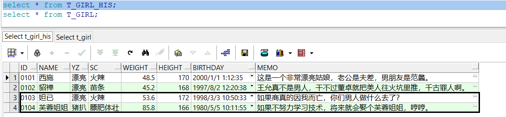
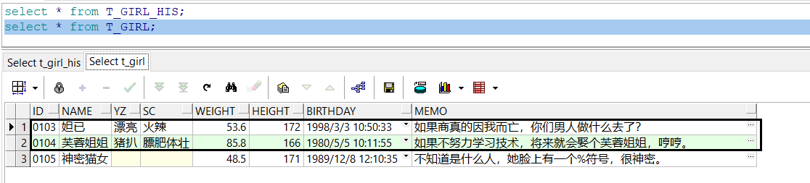
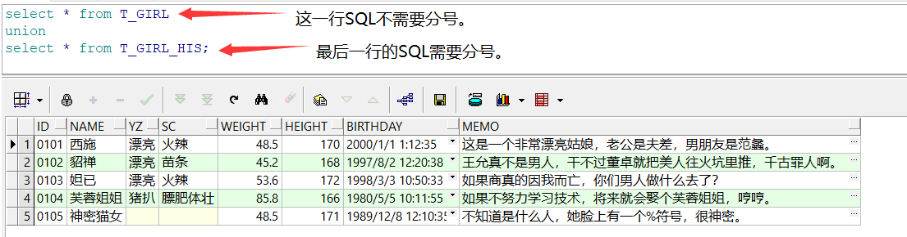
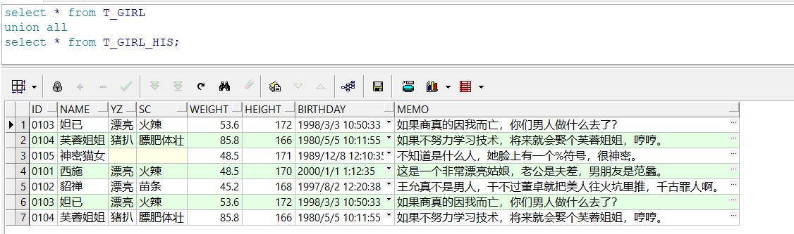
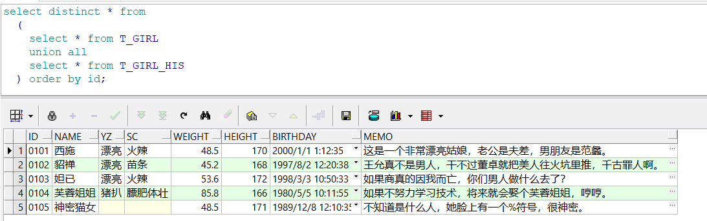

union就是把两个结果集合并起来，被合并的两个结果集的字段数量要相同，数据类型要相似（兼容）。

union在合并两个结果集的时候，会自动去除重复的数据。

 union all在合并两个结果集的时候，只是简单的将两个结果集中的数据进行连接，不会去除重复的数据。

我通过一些示例来向大家介绍子查询的常用方法。

# 一、生成测试数据

## 1、创建超女基本信息历史表（T_GIRL_HIS）

```sql
create table T_GIRL_HIS

(

 id    char(4)     not null,  -- 编号

 name   varchar2(10)  not null,  -- 姓名

 yz    varchar2(10)    null,  -- 颜值

 sc    varchar2(10)    null,  -- 身材

 weight  number(4,1)   not null,  -- 体重

 height  number(3)    not null,  -- 身高

 birthday date      not null,  -- 出生时间

 memo   varchar2(1000)   null,  -- 备注

 primary key (id)

);

insert into T_GIRL_HIS(id,name,yz,birthday,sc,weight,height,memo)

 values('0101','西施','漂亮',to_date('2000-01-01 01:12:35','yyyy-mm-dd hh24:mi:ss'),

​     '火辣',48.5,170,'这是一个非常漂亮姑娘，老公是夫差，男朋友是范蠡。');

insert into T_GIRL_HIS(id,name,yz,birthday,sc,weight,height,memo)

 values('0102','貂禅','漂亮',to_date('1997-08-02 12:20:38','yyyy-mm-dd hh24:mi:ss'),

​     '苗条',45.2,168,'王允真不是男人，干不过董卓就把美人往火坑里推，千古罪人啊。');

insert into T_GIRL_HIS(id,name,yz,birthday,sc,weight,height,memo)

 values('0103','妲已','漂亮',to_date('1998-03-03 10:50:33','yyyy-mm-dd hh24:mi:ss'),

​     '火辣',53.6,172,'如果商真的因我而亡，您们男人做什么去了？');

insert into T_GIRL_HIS(id,name,yz,birthday,sc,weight,height,memo)

 values('0104','芙蓉姐姐','猪扒',to_date('1980-05-05 10:11:55','yyyy-mm-dd hh24:mi:ss'),

​     '膘肥体壮',85.8,166,'如果不努力学习技术，将来就会娶个芙蓉姐姐，哼哼。');
```


## 2、创建超女基本信息表（T_GIRL）

```sql
create table T_GIRL

(

 id    char(4)     not null,  -- 编号

 name   varchar2(10)  not null,  -- 姓名

 yz    varchar2(10)    null,  -- 颜值

 sc    varchar2(10)    null,  -- 身材

 weight  number(4,1)   not null,  -- 体重

 height  number(3)    not null,  -- 身高

 birthday date      not null,  -- 出生时间

 memo   varchar2(1000)   null,  -- 备注

 primary key(id)

);

insert into T_GIRL(id,name,yz,birthday,sc,weight,height,memo)

 values('0103','妲已','漂亮',to_date('1998-03-03 10:50:33','yyyy-mm-dd hh24:mi:ss'),

​     '火辣',53.6,172,'如果商真的因我而亡，您们男人做什么去了？');

insert into T_GIRL(id,name,yz,birthday,sc,weight,height,memo)

 values('0104','芙蓉姐姐','猪扒',to_date('1980-05-05 10:11:55','yyyy-mm-dd hh24:mi:ss'),

​     '膘肥体壮',85.8,166,'如果不努力学习技术，将来就会娶个芙蓉姐姐，哼哼。');

insert into T_GIRL(id,name,yz,birthday,sc,weight,height,memo)

 values('0105','神密猫女',null,to_date('1989-12-08 12:10:35','yyyy-mm-dd hh24:mi:ss'),

​     null,48.5,171,'不知道是什么人，她脸上有一个%符号，很神密。');
```


## 3、测试数据说明



 

超女基本信息历史表（T_GIRL_HIS）中有4条记录，超女基本信息表（T_GIRL）中有3条记录，两个表中有相交的记录（'0103'、'0104'），在图中已用方框圈了出来。

# 二、union示例

## 1、union（去重复记录的联合）

union在合并两个结果集的时候，会自动去除重复的数据。T_GIRL和T_GIRL_HIS用union联合后的结果集有5条记录。

```sql
select id,name,yz,sc,weight,height,birthday,memo from T_GIRL

union 

select id,name,yz,sc,weight,height,birthday,memo from T_GIRL_HIS;
```

 

## 2、union all（不去复记录的重联合）

 union all在合并两个结果集的时候，只是简单的将两个结果集中的数据进行连接，不会去除重复的数据。T_GIRL和T_GIRL_HIS用union all联合后的结果集有7条记录。

```sql
select id,name,yz,sc,weight,height,birthday,memo from T_GIRL

union all 

select id,name,yz,sc,weight,height,birthday,memo from T_GIRL_HIS;
```

 

## 3、从联合后的结果集中查询

```sql
select distinct id,name,yz,sc,weight,height,birthday,memo from 

 (

  select id,name,yz,sc,weight,height,birthday,memo from T_GIRL

  union all

  select id,name,yz,sc,weight,height,birthday,memo from T_GIRL_HIS

 ) order by id;
```

 

以上SQL的功能相当于union去重复记录的联合查询。

# 三、应用经验

union在进行结果集联合后会筛选掉重复的记录，所以在表联合后会对所产生的结果集进行排序，删除重复的记录后再返回结果。

而union all只是简单的将两个结果集合并后就返回，如果返回的两个结果集中有重复的数据，那么返回的结果集就会包含重复的数据。 

从效率上讲，union all要比union快很多，所以，如果可以确定合并的两个结果集中不会包含重复的数据，就应该使用union all。