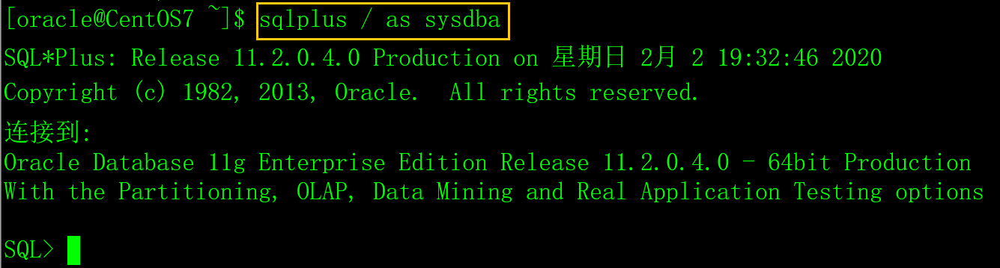

当创建一个新数据库实例时，Oracle会创建sys、system和scott数据库用户。sys和system是管理员用户，它们的密码在创建数据库时指定。scott是示范用户（用于学习），里面包括了一些测试数据（DEPT、EMP、BONUS和SALGRADE表）。

# 一、数据库管理员

数据库管理员（Database Administrator，简称DBA），是从事管理和维护[数据库管理系统](https://baike.baidu.com/item/数据库管理系统)(DBMS)的相关工作人员的统称，属于[运维工程师](https://baike.baidu.com/item/运维工程师/5895086)的一个分支，主要负责数据库的设计、部署、运维和管理，侧重于运维管理。

DBA的核心目标是保证数据库系统的稳定性、安全性、完整性和高性能，保证数据库服务7*24小时的稳定高效运转。

数据库实例创建后，**在数据库服务器上**，用sqlplus / as sysdba可以以DBA身份登录数据库，如下：



# 二、用户管理

## 1、创建用户

创建用户的命令是create user，它的选项非常多，在这里我介绍一些常用的选项。

语法：

```sql
create user 用户名 identified by 密码

​    [default tablespace 表空间名]

​    [temporary tablespace 表空间名]

​    [quota 大小 on 表空间名]

​    [profile 用户配置文件];
```


参数说明：

create user 用户名 identified by 密码：指定登录数据库的用户名和密码。

[default tablespace 表空间名]：指定用户的永久表空间，该用户全部的数据库对象（表、索引）将存放在该表空间中。

[temporary tablespace 表空间名]：指定用户的临时表空间，临时表空间主要用于排序、运算、管理索引、存放临时数据等，当任务完成之后系统会自动清理。

 [quota 大小 on 表空间名]：表空间配额，用户使用表空间的大小，单位有[K|M|G|T|P|E]，缺省是unlimited，无限制。

[profile 用户配置文件]：用户的配置文件，它是密码限制，资源限制的命名集合，利用profile 可以对数据库用户进行基本的资源管理，密码管理，缺省是default profile，无限制。

示例：

```sql
create user girl

 identified by girlpwd

 default tablespace users

 temporary tablespace temp

 quota 20M on users;
```

创建一个用户名为girl的新用户，密码是pwdgirl，缺省表空间是users（可使用20M的空间），临时表空间是temp。

注意，创建用户时，如果不指定default tablespace/ temporary tablespace选项，则使用系统缺省的永久/临时表空间， 用以下SQL可以查看系统缺省的永久/临时表空间。

```sql
select property_value from DATABASE_PROPERTIES where 

property_name in ('DEFAULT_PERMANENT_TABLESPACE','DEFAULT_TEMP_TABLESPACE');
```

 

## 2、修改用户的密码

```sql
alter user 用户名 identified by 新密码;
```

普通用户只能修改自已的密码，DBA可以修改其它用户的密码。

## 3、锁定/解锁用户

```sql
alter user 用户名 account lock;

alter user 用户名 account unlock;
```

锁定/解锁用户需要DBA权限。

## 4、修改用户表空间配额

```sql
alter user 用户名 quota 大小 on 表空间;
```

修改用户表空间配额需要DBA权限。

## 5、删除用户

```sql
drop user 用户名 [cascade];
```

drop user 只有在用户下没有任何数据库对象的时候才能删除用户，否则会提示错误。

采用cascade选项删除用户以及用户下全部的数据库对象，包括表、视图、函数、同义词、过程等。

删除用户需要DBA权限。

# 三、权限管理

权限是指用户执行特定命令或操作数据库对象的权利。Oracle的用户权限分系统权限和对象权限。

## 1、系统权限

系统权限针对的是系统安全性，执行数据库操作，如登录、创建表、创建函数等，通过查询SYSTEM_PRIVILEGE_MAP数据字典可以看到Oracle的两百多种系统权限。

```sql
select * from SYSTEM_PRIVILEGE_MAP;
```

以下是几种常用的系统权限：

> create session    创建会话。
>
> create/drop user   创建/删除用户。
>
> create/drop sequence 创建/删除序列。
>
> create/drop synonym 创建/删除同名对象。
>
> create/drop table  创建/删除表。
>
> create/drop view   创建/删除视图。

## 2、对象权限

对象权限针对的是数据安全性，对某一特定对象（如表，视图、序列、存储过程等）执行的特定操作，对象的权限分类如下：。

1）select权限

对表而言，允许对表执行select语句；对序列而言，允许对序列获取下一个值（nextval）和当前值（currnvl）。

2）insert权限

允许向表和视图中插入记录。

3）update权限

允许在表或视图中执行update语句，update权限必须随同select权限授予，否则被授权用户不能够选择行。

4）delete权限

允许在表或视图中执行delete语句，delete权限必须随同select权限授予，否则被授权用户不能够选择行。

5）alter权限

对表而言，允许对表执行alter table语句；对序列而言，允许对序列alter sequence语句。

6）execute权限

执行存储过程、函数和包的权限。

7）index权限

允许在表上创建索引。

8）reference权限

允许在表上创建完整性约束，如外键。

9）all

对象的全部权限（上面列出的全部权限）。

以下是Oracle数据库对象与权限的对照表。

| 对象权限   | 表   | 视图 | 序列 | 过程（函数和包） | 备注     |
| ---------- | ---- | ---- | ---- | ---------------- | -------- |
| select     | 是   | 是   | 是   |                  | 常用。   |
| insert     | 是   | 是   |      |                  | 常用。   |
| update     | 是   | 是   |      |                  | 常用。   |
| delete     | 是   | 是   |      |                  | 常用。   |
| alter      | 是   |      | 是   |                  | 不常用。 |
| execute    |      |      |      | 是               | 不常用。 |
| index      | 是   |      |      |                  | 不常用。 |
| references | 是   |      |      |                  | 不常用。 |

## 3、角色

由于Oracle提供的权限非常之多，日常操作时我们不可能将所需权限一一赋予用户，此时引进角色概念。角色是一组相关权限的命名集合，使用角色最主要的目的是简化权限管理。将一组权限打包到角色中，将角色赋予用户就是把角色下得全部权限都赋给了用户，简化了赋权操作。

Oracle提供三种标准的三种角色：

1）connect角色

connect是最基本的用户权限，拥有connect权限的用户只可以登录Oracle（仅具有创建SESSION的权限），不可以创建实体，不可以创建[数据库](https://www.2cto.com/database/)结构。

2）resource角色

拥有resource权限的用户可以创建数据库对象，和对本用户的数据库对象拥有全部的操作权限。

3）DBA角色

DBA角色，拥有全部特权，是系统最高权限。

## 4、授于/收回权限

Oracle采用grant命令授于权限，revoke命令收回权限。

grant命令非常复杂，在实际应用中远远没有那么复杂，所以本文只介绍grant的常用方法。

**1）将对象权限授于用户和角色，revoke收回。**

```sql
grant 对象权限列表 on 对象名 to { public | 角色名 | 用户名 },……;

revoke对象权限列表 on 对象名 from { public | 角色名 | 用户名 },……;
```

将scott.T_GIRL表的select和insert权限授于girl和scott用户。

```sql
grant select,insert on scott.T_GIRL to girl,scott;

revoke select,insert on scott.T_GIRL from girl,scott;
```

将scott.T_GIRL表的全部权限授于girl和scott用户。

```sql
grant all on scott.T_GIRL to girl,scott;

revoke all on scott.T_GIRL from girl,scott;
```

将scott.T_GIRL表的全部权限授于全部用户。

```sql
grant all on scott.T_GIRL to public;
```

将scott.T_GIRL表的全部权限授于resource角色。

```sql
grant all on scott.T_GIRL to resource;
```

**2）将系统权限和角色权限授于用户，revoke收回。**

```sql
grant { 系统权限 | 角色 }, …… to { public | 角色名 | 用户名 },……;

revoke { 系统权限 | 角色 }, …… from { public | 角色名 | 用户名 },……;
```

一般情况下，在新建数据库用户后，都会习惯性的给用户授权connect角色和resource角色。

```sql
grant connect,resource to 用户名;
```

将select any table权限授于全部用户。

```sql
grant select any table to public;

revoke select any table from public;
```

将select any table权限授于connect角色。

```sql
grant select any table to connect;
```

将select any table和insert any table权限授于girl和scott用户。

```sql
grant select any table,insert any table to girl,scott;

revoke select any table,insert any table from girl,scott;
```

将connect、resource权限授于girl用户。

```sql
grant connect,resource to girl;
```

## 5、查询权限

从数据字典中可以查询当前用户拥有的权限和角色。

1）查询当前用户拥有的角色：

```sql
select * from USER_ROLE_PRIVS;
```

2）查询当前用户拥有的系统权限：

```sql
select * from USER_SYS_PRIVS;
```

3）查询当前用户拥有的对象权限：

```sql
select * from USER_TAB_PRIVS;
```


## 6、注意事项

在Oracle中没有其他数据库系统中的数据库的概念，对象都是创建在用户下。当前用户具有当前用户下全部对象的全部权限无论该对象是否是当前用户所创建。举个简单例子，创建了girl用户并授予connect和resource权限，然后管理员在girl用户下创建一张表，girl用户可以删除管理员在girl用户下创建的表。