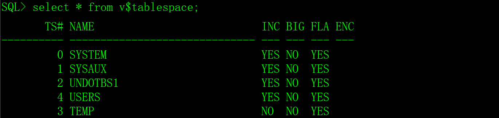
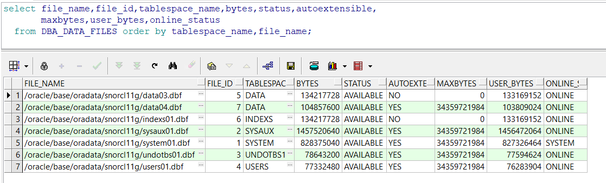
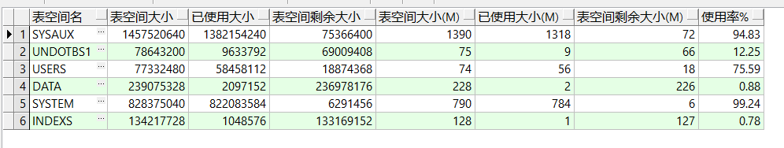

# 一、表空间的概念

Oracle数据库的数据存放在表空间中，表空间是一个逻辑的概念，它是由数据文件组成，表空间大小由数据文件的数量和大小决定。

表空间有三种：Permanent Tablespaces（永久表空间）、Temporary Tablespaces（临时表空间）、Undo Tablespaces（回滚表空间），Oracle在创建数据库实例的时候，默认会创建三个永久表空间（SYSTEM、SYSAUX、USERS），一个临时表空间（TEMP），一个回滚表空间（UNDOTBS1）。

## 1、SYSTEM表空间

SYSTEM表空间主要用于存放Oracle数据库内部的数据字典，它是Oracle数据库最重要的表空间，在创建数据库实例时被最先创建，包含了数据库的元数据，对于数据库来说生死攸关。

## 2、SYSAUX表空间

SYSAUX表空间是SYSTEM表空间的辅助表空间，主要用于存储数据字典以外的其他数据对象，它在一定程度上降低了SYSTEM表空间的负荷。

## 3、UNDOTBS1表空间

UNDO是回滚表空间，主要有四方面的用途，分别是：事物回滚、数据库恢复、读一致性、闪回查询。

1）事物回滚：当事物执行失败或用户执行回滚操作（rollback）时，Oracle会利用保存在回退段中的信息将数据恢复到原来的值。

2）数据库恢复：当数据库实例出现了意外，在重启恢复时，Oracle先利用重做日志文件的信息对数据库进行恢复，再利用回滚段中的信息回滚未提交的事务。

3）读一致性：当一个用户对数据进行修改时，会预先将其原始值保存到回退段中，这时，如果有其它用户访问该数据，则访问回退段中的信息，使当前用户未提交的修改其他用户无法看到，保证了数据的一致性。

4）闪回查询：通过保留在回退段中的信息，用户可以查询某个数据在过去某个时刻的状态。

## 4、TEMP表空间

临时表空间用来管理数据库排序以及用于存储临时表和索引、中间结果等临时对象。当Oracle的内存不够时，会把数据放在临时表空间中，当操作完成后，系统会自动清理临时表空间中的临时对象，自动释放空间。这里的释放只是标记为空闲、可以重用，占用的磁盘空间并没有真正释放。这也是临时表空间有时会不断增大却不见减少的原因。

## 5、USERS表空间

USERS表空间用于存放普通用户的表和索引，一般情况下，它是用户的缺省表空间。

## 6、查看表空间

用DBA登录数据库，执行以下SQL可以查看数据库全部的表空间。

```sql
select * from v$tablespace;
```



# 二、管理表空间

企业级的Oracle数据系统的存储一般是采用ASM（自动存储管理），ASM是Oracle 10g R2中为了简化Oracle数据库的管理而推出来的一项新功能，这是Oracle自己提供的卷管理器，替代了操作系统所提供的LVM，它不仅支持单实例，同时对RAC的支持也是非常好。

管理表空间的任务一般是由DBA来执行，涉及的知识比较多，本文介绍用文件系统作为Oracle的存储空间，合适程序员学习。不管是ASM还是文件系统，逻辑上是一样的，作为一个程序员，并不一定要掌握Oralce存储系统的管理和配置，理解它的原理和使用就可以了。

## 1、创建表空间

创建表空间是使用create tablespace命令完成的，建立表空间是特权用户或是DBA来执行的，如果用其它用户来创建表空间，则用户必须要具有create tablespace的系统权限。create tablespace命令的选项比较多，本文只介绍常用的方法。

```sql
create tablespace 表空间名 datafile '数据文件名' size 大小;
```

**在创建数据库实列后，为了方便管理，最好再创建一个专用于存放数据表空间和一个专用于存放索引表空间。**

示例：

1）创建数据表空间DATA，同时创建数据文件/oracle/base/oradata/snorcl11g/data01.dbf，数据文件的大小是128M。

```sql
create tablespace DATA datafile '/oracle/base/oradata/snorcl11g/data01.dbf' size 128M;
```

2）创建索引表空间INDEXS，同时创建数据文件/oracle/base/oradata/snorcl11g/indexs01.dbf，数据文件的大小是128M。

```sql
create tablespace INDEXS datafile '/oracle/base/oradata/snorcl11g/indexs01.dbf' size 128M;
```

创建表空间时，可以指定多个数据文件，但致少要指定一个数据文件，数据文件由Oracle自动创建，不需要事先在磁盘上手工的创建文件。

 

## 2、使用表空间

1）创建数据库用户时，指定用户的对象缺省使用的表空间。

```sql
create user girl identified by pwdgirl default tablespace DATA;
```

2）创建表时，指定表使用的表空间。

```sql
create table T_GIRL

(

 id    char(4)     not null,  -- 编号

 name   varchar2(30)  not null,  -- 姓名

 yz    varchar2(20)    null,  -- 颜值

 sc    varchar2(20)    null  -- 身材

) tablespace DATA;
```

3）创建主键时，指定主键使用的表空间。

```sql
alter table T_GIRL add constraint PK_GIRL primary key(id) using index tablespace INDEXS;
```

4）创建索引时，指定索引使用的表空间。

```sql
create index IDX_GIRL_1 on T_GIRL(name) tablespace INDEXS;
```

## 3、删除表空间

一般情况下，由特权用户或是DBA来操作，如果是其它用户操作，那么要求用户具有drop tablespace系统权限。

```sql
drop tablespace 表空间名 including contents and datafiles;
```

Including contents 表示删除表空间，同时删除该表空间全部的数据库对象，而datafiles表示将数据库文件也删除。

示例：

删除DATA和INDEXS表空间，和该表空间全部的数据库对象以及数据文件。

```sql
drop tablespace DATA including contents and datafiles;

drop tablespace INDEXS including contents and datafiles;
```

## 4、向表空间中添加数据文件

表空间的大小是由数据文件的数据和大小决定的，向表空间中添加数据文件，扩展表空间的容量。

```sql
alter tablesapce 表空间名 add datafile '数据文件名' size 大小

   [reuse]

   [autoextend [on/off] next 大小]

   [maxsize [unlimited|大小]];
```

参数说明：

size 大小：数据文件的初始大小，单位：K|M|G|T|P|E。

[reuse]：如果操作系统上已经存在数据文件，加reuse参数表示覆盖它，否则会提示错误，建议一般不要启用reuse选项，容易产生误操作，如果磁盘上已存在同名的数据文件，可以先手工的删除它。

[autoextend [on/off] next 大小]：数据文件是否自动扩展，如果为on，next参数指定每次扩展的大小。

[maxsize [unlimited|大小]]：如果数据文件可以自动扩展，maxsize参数可以限制文件的最大值，unlimited表示无限制。

示例：

1）向DATA表空间添加数据文件，大小100M，可重用，可自动扩展，每次扩展10M，最大200M。

```sql
alter tablespace DATA add datafile '/oracle/base/oradata/snorcl11g/data02.dbf' 

   size 100M reuse autoextend on next 10M maxsize 200M;
```

2）向DATA表空间添加数据文件，大小100M，可重用，可自动扩展，每次扩展10M，无最大限制。

```sql
alter tablespace DATA add datafile '/oracle/base/oradata/snorcl11g/data03.dbf' 

   size 100M reuse autoextend on next 10M maxsize unlimited;
```

3）向DATA表空间添加数据文件，大小200M，不可重用，不能自动扩展。

```sql
alter tablespace DATA add datafile '/oracle/base/oradata/snorcl11g/data04.dbf' 

   size 100M autoextend off;
```

## 5、修改表空间的状态

```sql
alter tablespace 表空间名 [online] [offline] [read only|write];
```

示例：

1）把DATA表空间的状态改为offline（离线）。

```sql
alter tablespace DATA offline;
```

2）把DATA表空间的状态改为read onley（只读）。

```sql
alter tablespace DATA read only;
```

3）把DATA表空间的状态改为read write（可读写）。

```sql
alter tablespace DATA read write;
```

4）把DATA表空间的状态改为offline（在线）。

```sql
alter tablespace DATA online;
```

## 6、修改数据文件状态

修改数据文件的命令是alter database datafile。

示例：

1）先把表空间offline。

```sql
alter tablespace DATA offline;
```

2）把数据文件的状态改为offline（离线），必须先把表空间offline。

```sql
alter database datafile '/oracle/base/oradata/snorcl11g/data02.dbf' offline;
```

3）把数据文件的状态改为online（在线）。

```sql
alter database datafile '/oracle/base/oradata/snorcl11g/data02.dbf' online;
```

4）删除数据文件

```sql
alter database datafile '/oracle/base/oradata/snorcl11g/data02.dbf' offline drop;
```

5）再把表空间online。

```sql
alter tablespace DATA online;
```

## 7、修改数据文件大小

修改数据文件的大小可以在线操作，关联的表空间无需offline，对业务运行也没有影响。

示例：

```sql
alter database datafile '数据文件名'

   [ [resize 大小| [autoextend [on/off] next 大小] [maxsize [unlimited|大小]] ];
```

1）把数据文件改为200M，前提是该数据文件已使用空间小于200M，否则提示错误。

```sql
alter database datafile '/oracle/base/oradata/snorcl11g/data02.dbf' resize 200M;
```

2）禁用数据文件自动扩展的属性。

```sql
alter database datafile '/oracle/base/oradata/snorcl11g/data02.dbf' autoextend off;
```

3）启用数据文件自动扩展的属性，无最大限制。

```sql
alter database datafile '/oracle/base/oradata/snorcl11g/data02.dbf' 

   autoextend on next 10M maxsize unlimited;
```

## 8、移动数据文件

移动数据文件非常重要，例如存放数据文件的磁盘空间不足，增加了新的磁盘空间后，需要把数据文件迁移到新的磁盘。

移动数据文件有两种方法：alter tablespace和alter database。

示例：

1）把表空间offline。

```sql
alter tablespace DATA offline;
```

2）执行操作系统命令，迁移数据文件，cp和mv都可以，注意，cp和mv是操作系统的命令，不是sqlplus中Oracle的命令。

```sql
mv data01.dbf data03.dbf

mv data02.dbf data04.dbf
```

3）执行alter tablespace或alter database修改数据库文件名。

```sql
alter tablespace DATA rename datafile '/oracle/base/oradata/snorcl11g/data01.dbf' to '/oracle/base/oradata/snorcl11g/data03.dbf';

alter database rename file '/oracle/base/oradata/snorcl11g/data02.dbf' to '/oracle/base/oradata/snorcl11g/data04.dbf';
```

4）把表空间online。

```sql
alter tablespace DATA online;
```

# 三、查看表空间和数据文件

## 1、查看当前用户的缺省表空间

```sql
select username,default_tablespace from user_users;
```

 

## 2、查看数据文件

数据文件存放在数据字典DBA_DATA_FILES中，用DBA权限执行以下SQL查询。

```sql
select file_name,file_id,tablespace_name,bytes,status,autoextensible,

​    maxbytes,user_bytes,online_status

 from DBA_DATA_FILES order by tablespace_name,file_name;
```

 

## 3、查看表空间使用情况

从数据字典DBA_FREE_SPACE和DBA_DATA_FILES中可以查询表空间使用情况。

```sql
select a.tablespace_name "表空间名",total "表空间大小",

​    (total - free) "已使用大小",free "表空间剩余大小",

​    round(total/(1024*1024)) "表空间大小(M)",

​    round((total-free)/(1024*1024)) "已使用大小(M)",

​    round(free/(1024*1024)) "表空间剩余大小(M)",

​    round((total-free)/total,4)*100 "使用率%"

 from

(select tablespace_name,sum(bytes) free from DBA_FREE_SPACE group by tablespace_name) a,

(select tablespace_name,sum(bytes) total from DBA_DATA_FILES group by tablespace_name) b

 where a.tablespace_name = b.tablespace_name;
```

 

# 四、应用经验

表空间和数据文件的管理，看上去就是几个命令，但是在实际应用中并不会这么简单。

如果让您在一片空地上设计规划一座新的城市，想怎么设计就怎么设计，想怎么修改就怎么修改，但是，如果城市一旦建好，想改就没那么容易了，要考虑拆迁问题，补偿问题，还有对交通影响，对人们日常生活的影响等等。

表空间和数据文件的管理也是一样的道理，如果您新建的表空间和数据文件还没有被使用，您想怎么改就怎么改，一旦投入了业务运行，需要考虑的问题就多了。

所以，表空间和数据文件最好是一开始就规划和设计好。如果要修改业务运行中的表空间和数据文件（扩展数据文件除外），风险非常大，建议让专业的DBA来操作，或者在操作之前做好业务数据的备份。如果操作不慎造成了数据的丢失或影响业务系统的运行，您会懊悔不已。